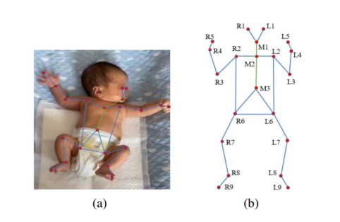
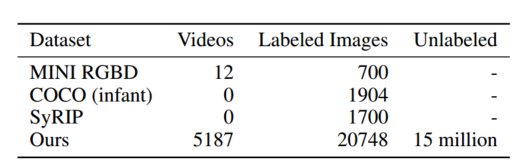
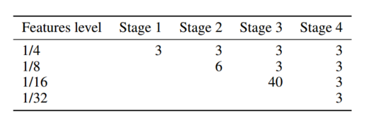
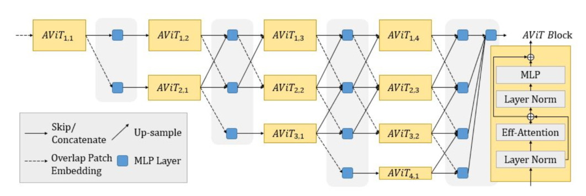
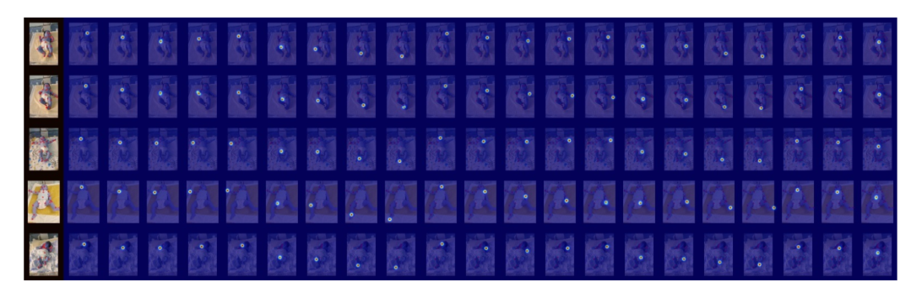
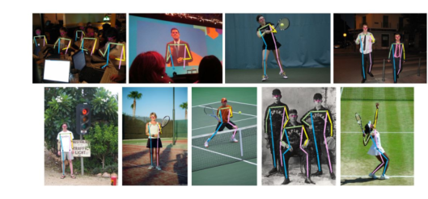
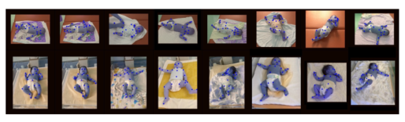

# Aggpose

## 摘要（Abstract）

对新生儿的运动与姿态进行评估能够帮助经验丰富的儿科医生预测神经发育障碍，从而及早对相关疾病进行干预。然而，当前最新的人体姿态估计的人工智能方法大多聚焦于成人，欠缺关于婴儿姿态估计的公开基准。为弥补这一空白，本文==提出了婴儿姿态数据集==以及用于人体姿态估计的**深度聚合视觉Transformer**（Deep Aggregation Vision Transformer），它引入了一种可快速训练的、在早期阶段不使用卷积操作提取特征的纯Transformer框架。该方法将 Transformer + MLP 推广到特征图中的高分辨率深层聚合，从而实现不同视觉层级之间的信息融合。我们先在 COCO 姿态数据集上对 AggPose 进行预训练，并将其应用到我们新发布的大规模婴儿姿态估计数据集上。结果表明，AggPose 能够有效学习跨不同分辨率的多尺度特征，并显著提升婴儿姿态估计的性能。我们展示了 AggPose 在婴儿姿态估计数据集上优于混合模型 HRFormer 和 TokenPose。此外，在 COCO 验证集的人体姿态估计上，AggPose 相比 HRFormer 的平均 AP 提升了 0.8。代码地址：github.com/SZAR-LAB/AggPose。 

## 1 引言（Introduction）

每年，全球约有 500 万名新生儿受到神经发育障碍的影响。由于缺乏早期诊断与干预，许多婴儿会出现严重残疾并被父母遗弃，尤其是在神经发育障碍经验丰富的儿科医生数量有限的国家。这已成为困扰世界上众多家庭的难题。 

∗ 项目负责人（project lead）
 † 与第一作者同等贡献（contributed equally to the first-author）
 ‡ 通讯作者（corresponding author） 

近年来，基于深度学习的方法的发展为构建用于神经发育障碍早期干预的计算机辅助运动评估工具带来了可能性。早期脑瘫诊断中预测性最强的工具之一是==**一般运动评估**（GMA）==，其需要在大量小幅度动作中区分“扭动期（fidgety）”与“非扭动期”动作 [Silva et al., 2021]，而计算机在检测此类动作方面更为敏感。研究者使用 OpenPose [Cao et al., 2019] 等人体姿态估计方法捕捉婴儿姿态，进而生成婴儿运动序列以检测脑瘫。与人工 GMA 检测相比，基于计算机的方法更快且成本更低。然而，考虑到婴儿姿态的复杂场景，该任务在实际应用中具有挑战性，且==全球范围内缺乏大规模公开的婴儿姿态数据集==。此外，COCO 数据集定义的 17 个成人关键点由于缺乏临床意义与可操作性，无法很好地支持婴儿运动检测。 

另一个问题在于姿态估计方法的性能。尽管基于 CNN 的方法凭借强大的表征学习与语义理解能力将人体姿态估计推向了新高度，但在理解人体各部位之间的全局约束关系方面表现仍不理想 [Li et al., 2021]。研究者将视觉 Transformer 与 CNN 结合为混合模型，以扩大 ViT 的感受野并增强其捕捉部位间约束关系的能力。在近期进展中，来自 Swin Transformer [Liu et al., 2021] 的局部窗口自注意力结构，以及来自 SegFormer [Xie et al., 2021] 的混合前馈网络（Mix-FNN），在多尺度特征表征学习方向显示出巨大的潜力 [Gu et al., 2021]。然而，仍有一些问题使得将 Transformer 应用于人体姿态估计具有挑战性：（1）混合模型的前几阶段高度依赖于预训练的 HRNet 卷积层，这无法利用最新的==自监督**掩码自编码器**（MAE）==[He et al., 2021] 在大规模无标注数据上的能力；（2）训练过程难以收敛；（3）模型从一个领域迁移到另一个领域存在困难。 

为此，本文提出 **AggPose**，将多尺度 Transformer 架构推广到**深度聚合网络**。不同于 HRFormer，AggPose 不使用卷积层作为初始特征提取器与融合模块；相反，它采用逐层的 Mix Transformer，以及跨分辨率的 MLP 融合模块。 

**MLP 融合模块**整合来自不同分辨率层级的更丰富空间信息，并将结果传递到下一阶段。我们==在 COCO 人体姿态估计数据集上开展实验，随后在我们提出的大规模标注婴儿姿态估计数据集上对模型进行微调==。AggPose 在这两个基准上都取得了具有竞争力的性能。例如，在 COCO 验证集上，AggPose-L 相比 HRFormer 与 TokenPose 分别提升 0.8 AP 与 0.6 AP。AggPose-L 具备的鲁棒性与快速收敛特性，使其可从 COCO 数据集顺利迁移到我们的婴儿姿态数据集上，并取得最高 95.0 的 AP。 

本文的贡献如下：
 • 我们提出了一种基于 Transformer + MLP 的新型聚合架构，**不依赖** HRNet 的 CNN 主干与基于 CNN 的多尺度融合模块。
 • 为提升深层聚合效率，我们设计了一种**深度聚合 MLP** 结构，用于融合跨分辨率的信息。
 • 为促进神经发育障碍早期干预研究，我们==提出了一个包含 **20,748** 张姿态标注图像的大规模、具有挑战性的婴儿数据集==。实验结果表明，我们的框架在 COCO 与该新数据集上都具有鲁棒性。据我们所知，这是==面向临床应用构建的**最大规模**婴儿姿态估计数据集==。 

## 2 相关工作（Related Works） 

### 2.1 婴儿姿态估计（Infant Pose Estimation）

婴儿姿态估计已被证实在临床研究中具有较高的应用价值。最常用的脑瘫评估工具（如 GMA 和 CPVC [Abbruzzese et al., 2020]）已经在使用自动姿态估计方法来辅助诊断。然而，现有的大多数自动婴儿姿态估计算法依赖于传统的机器学习方法，这限制了它们处理复杂情况的能力 [Silva et al., 2021]。

与此同时，来自人工智能社区针对婴儿图像开展处理的尝试非常有限。只有 [McCay et al., 2019; Reich et al., 2021] 做出了率先尝试，采用 OpenPose [Cao et al., 2019] 来提取婴儿的关键点，但缺乏一个规模大且具普适性的数据集。==MINI-RGBD [Hesse et al., 2018] 是该领域最知名的开源数据集，但其中仅包含 700 张真实婴儿图像以及一小部分合成婴儿图像==。上述种种都使得自动婴儿姿态评估方法在真实世界的临床系统中可靠性不足。

### 2.2 用于姿态估计的视觉 Transformer（Vision Transformers for Pose Estimation）

多年来，深度卷积神经网络（CNN）一直应用于人体姿态估计。在所有基于 CNN 的姿态估计算法中，那些在整个网络中保持高分辨率表征的方案取得了巨大的成功。最具代表性的模型包括 HRNet [Wang et al., 2020]、HigherHRNet [Cheng et al., 2020]、UDP [Huang et al., 2020]、DARK [Zhang et al., 2020]。然而，==CNN 仍然难以捕获人体关键点之间的约束关系，因为 CNN 的感受野限制了其对全局空间关系的理解能力==。

近来的若干工作将 Transformer 引入人体姿态估计 [Yuan et al., 2021; Yang et al., 2021; Li et al., 2021]。TokenPose [Li et al., 2021] 将“关键点”表示为 token 嵌入并引入 Transformer 进行人体姿态估计。HRFormer [Yuan et al., 2021] 将 HRNet 与 Swin Transformer [Liu et al., 2021] 相结合，充分利用了跨不同非重叠图像窗口的多分辨率并行信息。然而，HRFormer 与 TokenPose 均未舍弃卷积操作以获取初始特征，因为这两者的第一阶段都是在 HRNet 的 CNN 主干上微调完成的。在本工作中，我们提出了聚合视觉 Transformer（AViT），为解决 ViT 的低分辨率问题提供了一种不同途径，并在早期阶段以**重叠补丁嵌入（overlapping patch embedding）**替代卷积操作来提取特征。

（插图说明）图 1：（a）我们提出的 InfantPose 数据集示例。（b）21 个婴儿身体关键点。

## 3 所提方法（Proposed Method） 

我们的目标是提出一个新的婴儿姿态数据集，并建立一个能够通过视觉 Transformer 快速提取婴儿姿态的新基准。图 2 展示了模型的整体流程。我们的==婴儿姿态估计研究已通过深圳市宝安区妇幼保健院的伦理审查==。 

### 3.1 婴儿姿态检测数据集（Infant Pose Detection Dataset）

==本文提出了一个用于新生儿姿态提取与检测的大规模且具有挑战性的数据集==。该数据集可用于预测婴儿运动序列，并用于设计自动化的临床工具，如自动 GMA。尽管婴儿姿态检测的重要性与难度并存，现有数据集要么规模过小，要么任务过于简单，因此需要一个大型的、带标注的公共基准来比较不同方法。此外，现有这些数据集均未针对婴儿图像提出合适的关键点标注：它们采用 COCO 的 17 个关键点格式，但这一格式会丢失许多对婴儿而言重要的更精细的姿态与运动特征。 

**表 1：各婴儿姿态数据集对比。**

受 [Silva et al., 2021; Huang et al., 2021] 的启发，我们发布新的开源婴儿姿态数据集与新的婴儿关键点格式。为采集数据，我们==使用 GMA 设备自 2013 年起持续记录婴儿运动视频。共采集超过 216 小时视频，并提取了 1,500 万帧图像==。与 MINI-RGBD 数据集 [Hesse et al., 2018] 相比，我们的数据集在==规模与可扩展性上均显著更优==。我们从视频中随机采样 20,748 帧，并由专业临床医师进行婴儿关键点标注。随后，我们将数据集划分为训练集与验证集共 11,756 张，以及测试集 8,992 张。该 21 个婴儿姿态关键点的格式由从事神经发育障碍研究逾 30 年的资深临床医师提出。图 1 展示了部分示例。出于临床应用需求与患者隐私保护的考虑，我们的数据集==减少了婴儿头部的关键点，并包含更多精细的身体关键点，如手指、脚趾与肚脐==。对于公开版本，我们将==对数据集进行再处理以满足伦理要求：在最终发布的关键点数据集中，所有婴儿的头部均会打马赛克以保护患者隐私。禁止对婴儿姿态数据集进行商业用途。== 

### 3.2 深度聚合视觉 Transformer（Deep Aggregation Vision Transformers）

#### 重叠补丁嵌入（Overlapped Patch Embedding）

早期的卷积常被视为用于混合式 Transformer 架构提取低层特征的实用工具。这是因为 Transformer 在早期阶段将输入当作一维向量处理，专注于建模全局上下文，从而丢失了细粒度的定位信息。HRNet 及其预训练的 CNN 参数几乎是当前大多数人体姿态估计最新模型的基石。受 SegFormer [Xie et al., 2021] 启发，我们采用**纯 Transformer**并使用**重叠补丁嵌入**（Overlapped Patch Embedding）来替代 HRNet 的 CNN 特征提取器以及各阶段的下采样起始结构。与 HRNet、HRFormer 和 TokenPose 中的早期卷积相比，重叠补丁嵌入能够获得更好的低层特征，增强高分辨率 Transformer 的特征表征，并降低计算复杂度。 

**聚合视觉 Transformer（AViT）架构**
 我们遵循 Mix Transformer [Xie et al., 2021] 的模块设计，并以重叠补丁嵌入（补丁大小 = 7、步幅 = 4、填充大小 = 3）生成的**高分辨率特征图**作为第一阶段的起点。随后，我们通过重叠补丁嵌入逐级增加从高到低的分辨率分支。对每一个分辨率分支，我们使用多个多头自注意力块来更新特征表征。为构建不同深度的模型，我们分别提出小型（AggPose-S）与大型（AggPose-L）两个版本。表 2 给出了 AggPose-L 各阶段的 Transformer 层数。 

**表 2：各阶段的 Transformer 层数。**

与 Swin Transformer 和 HRFormer 不同，鉴于我们已采用重叠补丁，我们**不**使用局部窗口自注意力来增强对局部信息的理解。相反，我们参考 [Xie et al., 2021] 与 [Wang et al., 2021] 的**序列降维**过程，这显著减少了 Transformer 内部的计算量，并在训练过程中加速了收敛。对每个 Transformer 块，自注意力按如下方式计算：
 $K = \mathrm{Linear}_{\gamma C,\,C}\big( K.\mathrm{Reshape}(N/\gamma,\ \gamma C)\big)$  (1)
 $\mathrm{Attention}(Q,K,V)=\mathrm{Softmax}\!\left(\dfrac{QK^{\top}}{\sqrt{d_{\text{head}}}}\right)V$  (2)
 其中，$K$ 为初始形状为 $N \times C$ 的 token 表示；$\gamma$ 为降维比率，将 $K$ 的维度由 $N \times C$ 降为 $N/\gamma \times C$。 

#### MLP 跨层聚合（MLP Cross-Layer Aggregation）

ViT 与 Swin Transformer 都通过位置嵌入在层间引入位置信息。然而，位置嵌入的分辨率是固定的；对于局部窗口 Transformer，窗口之间缺乏信息交换。因此，SegFormer 与 HRFormer 都在前馈网络（FFN）中引入了 $3\times3$ 深度可分卷积，以扩大感受野并减轻位置嵌入带来的不利影响。带有深度可分卷积的 FFN（HRFormer）与 Mix-FFN（SegFormer）的计算形式非常相似：
 $y=\mathrm{MLP}\big(\mathrm{Activation}(\mathrm{DWConv}(\mathrm{MLP}(x)))\big)+x $  (3) 

（**图 2：**所提出的 AggPose 架构。每个模块由多个连续的 Mix Transformer 块组成。不同分辨率间的特征通过 MLP 层（图中蓝色方块）相互连接。）其中，DWConv 指 $3\times3$ 的深度可分卷积操作。 

在 AggPose 中，我们将 Mix-FFN 的用法扩展到**跨不同分辨率层级的深度聚合**中。对于 CNN（如 CAggNet [Cao and Lin, 2021] 与 HRNet）中的深度聚合，聚合从最浅的高分辨率层开始，随后迭代地与更深的低分辨率层进行合并。以此方式，浅层特征在不同阶段的传播过程中得到逐步细化。相关研究表明，深度聚合结构会在**所有**分辨率之间传播聚合信息，而非仅限于前一块，从而更好地保留特征。这类结构被广泛用于语义分割任务，并能取得具有竞争力的性能。 

在我们的工作中，所提出的**跨层聚合模块**针对每个分辨率层级包含两步。第一步，来自不同分辨率的多层级特征先通过带 $3\times3$ 深度可分卷积的混合前馈网络，以**统一通道维度**，并将特征图**上采样或下采样**（重叠补丁嵌入）到相同的形状；第二步，将相邻层级的特征向量进行**级联**，并采用额外的 FFN 层来融合跨层信息。与 HRFormer 与 HRNet 中的卷积式多尺度融合模块相比，**MLP 融合模块**在提升模型性能的同时还能**加速收敛**。 

更具体地，定义：

$x_{i,j}=\begin{cases} \mathrm{OverlappedPE}_{i,j}\big(\mathrm{FFN}(x_i)\big), & ij \end{cases}\tag{4}$

其中，$x_{i,j}$ 是聚合 MLP 层的输入，$x_i$ 表示来自相邻分辨率的特征图。跨层聚合模块定义为：
 $x_j=\mathrm{MixFFN}\!\big(\mathrm{Concat}(x_{j-1},x_j,x_{j+1})\big)+x_j $  (5)
 其中，$\mathrm{MixFFN}$ 表示公式（3）中的混合前馈块。 

### 3.3 分析（Analysis）

与 HRFormer、TokenPose 等 CNN 或 CNN–Transformer 混合方法及其他小规模婴儿姿态数据集相比，AggPose 与我们的大规模婴儿姿态数据集主要具备以下两点优势。 

（1）**具备采用自监督学习的潜力。** 近期，使用自监督学习预训练的视觉 Transformer 备受关注。MAE [He et al., 2021] 构建了图像修复式的掩码自编码任务，以从无标注数据中学习表征，并将模型在任意有监督任务上进行微调。他们的结果表明，**纯 Transformer** 能够从大规模无标注数据集中学习到合理的语义。如表 1 所示，我们从 5,187 段视频中拥有大量的无标注婴儿运动帧。这些数据都可用于通过自监督学习预训练基于 Transformer 的自编码器。 

（2）**更快的收敛速度。** 在 HRFormer 中，特征传递依赖跨层卷积操作，训练不易收敛；而在我们的 AggPose 框架中，信息通过 **MLP** 在不同层间传播，这可视为对深层聚合模型的一种改良。正如实验将展示的，这种信息传递机制相较于 CNN–Transformer 混合方法能获得更好的结果。 

## 4 实验（Experiment） 

### 4.1 模型变体（Model Variants）

鉴于大多数基于 Transformer 的姿态估计模型训练过程较为复杂，本文给出了一种有效的训练策略。==首先，我们加载在 ImageNet 上预训练的 Mix Transformer [Xie et al., 2021]，并在 COCO 关键点训练集上继续训练该 Mix Transformer。==当 Mix Transformer 收敛后，将其参数加载到 AggPose 的各个层中。随后，我们按分辨率层级逐层**固定** AggPose 的参数，并==在 COCO 与婴儿姿态数据集上对模型进行微调==。 

**表 3：**在 COCO 验证集上的对比（均使用来自 HRNet 的相同检测框）。

| Method                            | Input size | Backbone | GFLOPs | AP       | AP50 | AP75 | APM  | APL  | AR   |
| --------------------------------- | ---------- | -------- | ------ | -------- | ---- | ---- | ---- | ---- | ---- |
| SimpleBaseline-Res152             | 256×192    | –        | 15.7   | 72.0     | 89.3 | 79.8 | 68.7 | 78.9 | 77.8 |
| HRNet-W32 [Wang et al., 2020]     | 256×192    | –        | 7.1    | 74.4     | 90.5 | 81.9 | 70.8 | 81.0 | 79.8 |
| HRNet-W48 [Wang et al., 2020]     | 256×192    | –        | 16.0   | 75.1     | 90.6 | 82.2 | 71.5 | 81.8 | 80.4 |
| TransPose [Yang et al., 2021]     | 256×192    | HRNet    | 21.8   | 75.8     | 90.1 | 82.1 | 71.9 | 82.8 | 80.8 |
| TokenPose-L/D24 [Li et al., 2021] | 256×192    | HRNet    | 11.0   | 75.8     | 90.3 | 82.5 | 72.3 | 82.7 | 80.9 |
| HRFormer-B [Yuan et al., 2021]    | 256×192    | HRNet    | 12.2   | 75.6     | 90.8 | 82.8 | 71.7 | 82.6 | 80.8 |
| **AggPose-S**                     | 256×192    | MiT-B2   | 9.0    | 75.2     | 89.9 | 82.0 | 71.4 | 82.4 | 80.3 |
| **AggPose-L**                     | 256×192    | MiT-B5   | 15.0   | **76.4** | 90.6 | 82.9 | 72.7 | 83.4 | 81.3 |

重叠补丁嵌入的尺寸与 Transformer 层数配置详见表 2。注意，表 2 仅给出了使用 MiT-B5 作为骨干网的 AggPose-L 的配置。对于 AggPose-S，我们使用 MiT-B2 作为骨干网，其各阶段 Transformer 层数为 `[[3,3,3,3], [4,3,3], [6,3], [3]]`。 

### 4.2 与最新方法的对比（Comparing with SOTA Methods）

**数据集（Dataset）。** 我们在 COCO 人体姿态估计数据集 [Lin et al., 2014]（包含超过 25 万个带 17 个关键点标注的人体实例）以及新的婴儿姿态估计数据集（包含 2 万个带 21 个关键点标注的婴儿实例）上评估 AggPose 的性能。由于 MPII 数据集规模（25K）显著小于 COCO，且关键点格式不同，故未纳入本实验。 

**训练设置（Training setting）。** 参考 HRNet 与 HRFormer 的默认训练与评估设置，我们使用 AdamW 优化器，初始学习率为 0.001。受限于 GPU 显存，训练批大小设为 32。实验在 4 × 48G-RTX8000 GPU 上进行。数据增强主要遵循 [Wang et al., 2020]。 

**评估指标（Evaluation metric）。** 在 COCO 数据集上，我们采用默认的平均精度（AP）作为评估指标。AP 基于**目标关键点相似度**（OKS）计算：

$\mathrm{OKS}=\frac{\sum_i \exp\!\left(-\frac{\hat d_i^{\,2}}{2s^2k_i^2}\right)\,\delta(v_i>0)}{\sum_i \delta(v_i>0)} \tag{6}$

其中，$\hat d_i$ 为第 $i$ 个关键点与真值之间的 $L_2$ 距离，$v_i$ 表示该关键点的可见性，$k_i$ 为关键点特定常数（不同关键点取值不同）。在婴儿姿态数据集上，我们采用与 COCO 相同的评估指标；鉴于新提出的婴儿姿态包含 21 个关键点，我们将各关键点的 $k_i$ 设为相同的数值。 

**COCO 上的关键点检测。** 表 3 展示了在 COCO 验证集上的对比结果。我们将 AggPose 与多种最新方法进行比较，包括 HRFormer [Yuan et al., 2021]、TokenPose [Li et al., 2021]、TransPose [Yang et al., 2021]、HRNet [Wang et al., 2020]。在 256×192 的输入尺寸下，**AggPose-L 达到 76.4 AP**，为所有方法中最佳。我们认为，在引入最新的 Distribution-aware 坐标表示 [Zhang et al., 2020] 或 UDP [Huang et al., 2020] 后，AggPose-L 还可进一步提升。以 256×192 输入在 COCO test-dev 上，AggPose-L 取得 75.7 AP。 

**婴儿姿态估计上的关键点检测。** 表 4 报告了在我们婴儿姿态测试集上的对比。我们将 AggPose 与最具代表性的**自底向上**方法 OpenPose 对比（其被几乎所有最新的婴儿姿态估计框架采用 [Silva et al., 2021]），同时也与若干近期的 CNN 与混合 Transformer 模型（如 HRNet、TokenPose、HRFormer）对比。**AggPose 以 256×192 输入获得最高的 95.0 AP**。训练中我们还发现，与 TokenPose、HRFormer 等混合模型相比，AggPose 与 HRNet 的收敛更快、表现更好。尽管这些模型都在 COCO 上进行了预训练，但当我们将其微调用于婴儿姿态等其他领域时，**纯 CNN 或纯 Transformer** 方法更为稳健。 

**表 4：**在婴儿姿态测试集上的对比（均使用相同的目标检测框；OpenPose 为自底向上方法不需要检测框。选择 OpenPose 进行对比的原因在于大多数最新的婴儿姿态估计框架都采用 OpenPose 作为骨干）。

| Method                | image size | AP       | AR       |
| --------------------- | ---------- | -------- | -------- |
| OpenPose              | 256×192    | 90.2     | 91.1     |
| SimpleBaseline-Res152 | 256×192    | 93.9     | 94.9     |
| HRNet-W48             | 256×192    | 94.5     | 95.6     |
| HRFormer-B            | 256×192    | 93.8     | 95.0     |
| TokenPose-L/D24       | 256×192    | 93.0     | 93.9     |
| **AggPose-L**         | 256×192    | **95.0** | **95.7** |

**表 5：\**与\**非聚合**框架（Swin Transformer、SegFormer）在 COCO 验证集上的对比。

| Method        | image size | GFLOPs | AP       |
| ------------- | ---------- | ------ | -------- |
| Swin-B        | 256×192    | 17.6   | 74.3     |
| SegFormer-B5  | 256×192    | 12.3   | 74.2     |
| **AggPose-L** | 256×192    | 15.0   | **76.4** |

**图 3：**基于 AggPose-L 在婴儿姿态测试集上的热力图结果可视化。

 **图 4：**基于 AggPose-L 在 COCO 验证集上的姿态估计结果可视化。

 **图 5：**基于 AggPose-L 在婴儿姿态测试集上的姿态估计结果可视化。 

### 4.3 消融实验（Ablation Experiments）

**全 Transformer 骨干的影响。** 鉴于其他新提出的混合方法均使用 HRNet 的 CNN 编码器作为骨干网，我们在表 3 中将**不在第一阶段使用卷积层**的本方法与 HRNet 的 CNN 方案进行比较。表中的 *Backbone* 列显示了模型第一阶段的差异。AggPose-S 与 AggPose-L 均在第一阶段采用基于 Transformer 的 SegFormer。尽管有文献声称，早期采用 Transformer 会导致细粒度定位信息的缺失，但我们观察到，AggPose 的**全 Transformer** 早期阶段仍能取得更好的性能。 

**深度聚合框架的影响。** 我们在表 5 中给出了两种知名的全 Transformer 模型（Swin Transformer 与 SegFormer）在 COCO 姿态估计上的结果。Swin-B 与 SegFormer-B5 均在 ImageNet-21K 上预训练，并在 COCO 上进行了 300 个 epoch 的微调。事实上，可将 AggPose-L 视作带有 **MLP 跳连** 的 SegFormer-B5 的**深层聚合结构**。如表 5 所示，所提出的**多分辨率聚合**框架（AggPose）优于 Swin Transformer 与 SegFormer。 

### 4.4 可视化分析（Visualization Analysis）

我们在 COCO 验证集与婴儿姿态测试集上提供了定性结果，可见图 3、图 4 与图 5。图 3 展示了婴儿姿态热力图的一组预测与依赖区域。尽管婴儿姿态数据格式所用关键点数量多于 COCO，AggPose 依然能够在捕捉人体关键点之间的约束关系方面学习到良好的表征。 

## 5 结论（Conclusion）

通过利用带有姿态标签和临床标签的新数据集，我们构建了一个基于 Transformer 的婴儿姿态估计框架，它可以==从视频中的运动帧中**准确检测婴儿仰卧位姿势**==。AggPose 模型的关键见解在于：采用带有跨层 MLP 连接的**深度聚合 Transformer**。由我们模型生成的姿态序列，已被用于**新生儿神经发育障碍的预测**以及**相关疾病的早期评估**。此外，我们的方法未来可以打包到**移动设备**上，有望解决**医疗资源不均衡**与**患者隐私保护**问题。尽管我们的结果令人鼓舞，但我们承认：在当前可用的硬件条件下，要将我们的模型**完全端到端地应用**，仍有很长的路要走。 

除在**实时婴儿姿态提取与评估**中测试 AggPose 的效用之外，一个明确的下一步，是通过**姿态序列理解模型**来**预测脑瘫**——甚至在这种迹象还**未被训练有素的儿科医生的目光察觉之前**。对于**儿科医生资源有限**的国家而言，这将大幅降低**儿童发生严重残疾**的风险。 