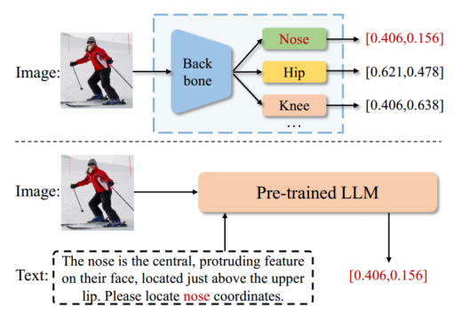
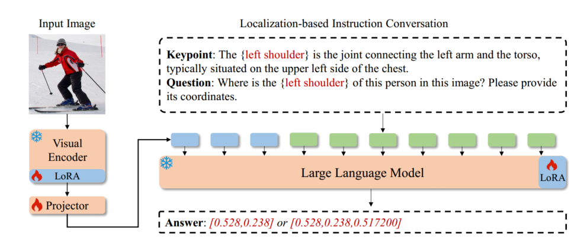

# LocLLM

## 摘要

现有的人体关键点定位模型的能力受限于训练数据所提供的关键点先验。为缓解这一限制并追求更通用的模型，本文从不同视角研究关键点定位：基于文本描述中的关键点线索来推理其位置。我们提出 LocLLM，这是首个基于大型语言模型（LLM）的关键点定位模型，它将图像与文本指令作为输入，并输出所需的关键点坐标。LocLLM 利用 LLM 强大的推理能力，以及文本描述中关于关键点**类型、位置与相互关系**的线索来完成关键点定位。为有效地调优 LocLLM，我们构建了**基于定位的指令式对话**，以将关键点描述与输入图像中的对应坐标建立起连接，并在**参数高效**的训练流程中对整个模型进行微调。LocLLM 在标准的 2D/3D 关键点定位基准上表现突出。进一步地，将语言线索纳入定位过程，使得 LocLLM 在跨数据集的关键点定位以及**检测训练中未见过的新类型关键点**方面展现出更强的灵活性与泛化能力。

## 1 引言

人体关键点定位旨在从输入的人体图像中定位目标关键点，是计算机视觉与图形学中的一项基础任务。其应用广泛，包括人体姿态估计与人脸关键点检测等。现有的关键点定位方法通常采用强大的神经网络（如 CNN 或 ViT）来**直接回归关键点坐标**或**估计关键点热图**以执行定位。这些方法会将训练集中蕴含的关键点先验编码进骨干网络之中（例如编码到最后一层的通道维度），这种设计会强化模型对骨干中被编码关键点的响应，但会==限制其在**来自不同数据集的未见姿态**上检测关键点的能力，或在**训练集合之外的新类型关键点**上的处理能力==。 

（图 1 之上）**传统的关键点定位方法**==将训练集提供的关键点先验==编码进模型结构，并在定位时依赖该先验。（图 1 之下）**本文提出的基于 LLM 的关键点定位方法**则==参考关于关键点类型、位置与相互关系的描述==，并利用预训练的强大 LLM 来预测关键点坐标。由于文本描述可以灵活提供，**我们的方法在跨数据集定位新关键点**方面更加通用。

为缓解训练集所带来的限制并追求更通用的模型，本文尝试从不同视角来进行关键点定位：即**参考可灵活获取的文本描述中的线索**。受大型语言模型（LLM）的启发，我们通过自然语言来描述关键点位置，并利用 LLM 强大的推理能力来执行关键点定位。以往的定位方法需要依赖网络结构中被编码的关键点先验，这些先验难以更新；而我们方法不同的是，**将关键点名称与位置描述连同输入图像一并发送给 LLM**。除了视觉线索之外，这一新流程还允许通过指出关键点的**类型、位置及其与其他关键点的关系**，灵活地输入**新关键点**的描述；同时它有效地利用了**预训练 LLM 的推理能力**，从而提升关键点定位的泛化能力。 

基于上述直觉，我们提出 LocLLM——**首个面向可泛化关键点定位的 LLM 型定位模型**。如图 1 所示，==LocLLM 将关键点定位表述为**问答式任务**：同时接收图像与文本描述作为输入，并输出关键点坐标==。==LocLLM 由**视觉编码器**、用于衔接图像与文本模态的**投影层**以及**预训练 LLM**构成：视觉编码器负责学习图像表征；随后投影器将图像表征转换为图像 token，并与文本 token 组合后输入 LLM。==为有效训练 LocLLM，我们在现有关键点定位基准上构建**基于定位的指令式对话**，以将关键点描述与输入图像中的对应坐标建立联系；同时提出一种**参数高效的调优方法**，通过这些指令对话来有效调优整个模型。

我们在多种关键点定位基准上进行了大量实验，包括 2D 基准（如 COCO Keypoint、MPII 与 Human-Art）以及 3D 基准 Human3.6M。在标准的 COCO Keypoint 基准上，LocLLM 取得了 77.4 的 AP，与现有基于 CNN 和 ViT 的最先进定位方法相当。LocLLM 还可以检测 3D 人体关键点，并在 Human3.6M 上获得了有前景的表现。此外，LocLLM 在多种设定下展现出卓越的**泛化能力**：在跨数据集设置下，LocLLM 在 MPII 上取得了 33.4 的 PCKh@0.1，比 ViTPose 高 7.8；在 Human-Art 上获得了 64.8 的 AP，显著优于先前的方法。LocLLM 还可以通过文本描述检测**诸如骨盆、颈部**等训练集中未包含的新类型关键点。上述实验共同表明，LocLLM 是一种**更具泛化性**的关键点定位方法。

据我们所知，LocLLM 是第一个**将关键点的自然语言描述显式引入定位过程**的 LLM 型关键点定位模型。这一设计使我们能够利用灵活文本描述中丰富的线索，并借助预训练 LLM 进行**位置推理**。LocLLM 在标准的 2D/3D 人体关键点定位基准、跨数据集泛化以及新关键点检测等方面都取得了令人满意的表现。LocLLM 也将关键点定位纳入多模态 LLM 的范畴，从而增强其在**更细粒度视觉内容分析**方面的能力。

† 项目页面：https://github.com/kennethwdk/LocLLM。 

## 2. Related Work（相关工作）

### 2.1. Human Keypoint Localization（人体关键点定位）

人体关键点定位旨在从输入的 RGB 图像中定位人体关键点，在计算机视觉与图形学中发挥着重要作用。现有的关键点定位方法可分为两类：基于热图的方法与基于回归的方法。

基于热图的关键点定位用概率图来编码关键点位置 [29]。这类方法先估计热图，再通过后处理操作得到关键点坐标。目前，基于热图的方法主导着关键点定位领域，因为热图易于用 CNN 或 Vision Transformer 来学习。早期工作 [20, 26, 38] 设计了强大的 CNN 模型，用于估计高分辨率热图，以解决人体姿态估计与人脸关键点检测等任务。由估计出的热图中，目标关键点可以通过一种后处理位移操作简单获得 [20, 42]。

基于回归的关键点定位则通过一个神经网络，从输入图像直接输出关键点坐标，这在一些经典方法中被采用 [2, 30]。大量工作被提出以提升直接回归的性能。第一类方法改变回归的方式。Soft-armgax [28] 与 Sampling-argmax [12] 通过整合潜在热图来回归关键点位置，已被证明优于直接回归。第二类方法通过提出新的损失函数来改进回归。RLE [11] 用可学习的分布（通过归一化流）替换了常用回归损失中预定义的高斯或拉普拉斯分布。最后，研究者还提出了更强大的骨干网络来提升直接回归的性能，例如 TokenPose [14] 与 PETR [25]。

上述所有方法都将“关键点类型”的线索直接编码进网络结构，并通过训练数据隐式学习关键点位置。因此，它们的泛化能力受限于模型结构与训练数据。相比之下，我们的方法显式地从语言描述与 LLM 中利用关键点的类型与位置，使其在检测新型关键点时具有更强的泛化能力。

### 2.2. Multi-modal Large Language Model（多模态大语言模型）

大型语言模型（LLM）在自然语言处理任务中展现出显著的推理能力，因此研究者尝试用额外的模态（如图像、音频、运动等）来增强它，从而发展出多模态 LLM（MLLM）。Flamingo [1] 提出了 Perceiver 来提取具有代表性的视觉 token，并通过交叉注意力将其加入到 LLM 中。BLIP-2 [13] 提出了 Q-Former，将视觉特征与 LLM 中的文本 token 对齐。

Instruction tuning（指令微调）[37] 是一种用于对齐视觉与语言模态、以提升 MLLM 能力的常用方式。Mini-GPT4 [44] 与 LLaVA [17] 构建了高质量的指令微调数据集，并仅微调一个全连接层来构建 MLLM。InstructBLIP [5] 引入了“面向指令的视觉特征提取”方法，并对整个 Q-Former 进行微调，在各类多模态任务上展示了有前景的零样本性能。mPlug-Owl [41] 引入了一个视觉抽象器来对齐两种模态，并在预训练阶段同时微调视觉编码器与视觉抽象器。AnyMAL [19] 不仅对齐图像，还将更多模态（如视频、音频与 IMU 运动传感器）与 LLM 对齐。

### 2.3. Large Language Model for Vision Tasks（用于视觉任务的 LLM）

尽管 MLLM 已有显著进展，但多数方法仍集中在视觉—语言任务上，例如 VQA 与图像描述。LLM 在经典视觉任务（如检测、分割与定位）上的有效性尚未被充分发掘。LISA [10] 定义了一种被称为“推理分割（reasoning segmentation）”的新型视觉任务，并提出了一个框架：从 MLLM 中提取指代表达的文本嵌入，然后将其送入类似 SAM [9] 的分割模型以执行分割。VisionLLM [36] 提出了一个框架，通过一种复杂的图像 tokenizer，利用 LLM 来处理诸如检测与分割等视觉任务。然而，上述工作均未探索 LLM 在关键点定位任务中的有效性，而该任务要求在**亚像素级精度**上定位目标，而非检测与分割中那种粗粒度的目标级别。就我们所知，这是首个在关键点定位上利用 LLM 的工作，并展示了 LLM 在通用化关键点定位方面能够取得更优的性能。

## 3. Method（方法）

### 3.1. Overview（总览）

人体关键点定位的目标是从输入图像中估计目标关键点的坐标，可概念性地表示为
 $\{K_i\}_{i=1}^n = locate(I)$ ，（1）
 其中 $K_i$ 表示第 $i$ 类关键点（例如人物的肩或膝）的坐标，$n$ 是各数据集中定义的关键点类型总数。沿用式（1），先前的方法 [11, 38] 将关键点线索编码入网络结构，并从训练集中学习位置先验，这限制了其泛化能力。

不同于上述表述，本文研究**关键点位置描述**并利用强大的大型语言模型来执行定位，将式（1）改写为
 $\{K_i\} = locate(I, T_i)$ ，（2）
 其中 $T_i$ 包含第 $i$ 个目标关键点的文本描述。通过这种方式，关键点类型不再只编码于模型之中，而是也通过文本描述输入，从而允许我们显式利用关键点的**类型、位置与关系**，甚至检测**新关键点**。

遵循式（2）以及大多数 MLLM 工作 [17, 40]，我们将关键点定位表述为**视觉问答（VQA）\**任务，并利用 LLM 的强大推理能力来实现目标。具体而言，我们提出 \*\*LocLLM\*\*，一个旨在补全多模态句子以输出关键点坐标的\**生成式**模型。如图 2 所示，LocLLM 由三大组件构成：视觉编码器 $\Phi_V(\cdot)$、线性投影器 $\Phi_P(\cdot)$ 与大型语言模型 $\Phi_L(\cdot)$。LocLLM 的输入包含两部分：图像 $I\in\mathbb{R}^{3\times H\times W}$ 与文本指令 $T$。输出是目标关键点坐标 $K$，该过程可表示为
 $K=\Phi_L(\Phi_P(\Phi_V(I)),T)$ 。（3）

视觉编码器 $\Phi_V(\cdot)$ 接收图像 $I\in\mathbb{R}^{3\times H\times W}$ 作为输入并输出一系列图像特征 $F=(f_1,f_2,\dots,f_m)$，其中 $m$ 是特征数。图像特征进一步通过单层线性投影器 $\Phi_P(\cdot)$ 投射为图像 token，即
 $\{v_1,v_2,\dots,v_m\}=\Phi_P(\Phi_V(I))$ 。（4）

文本 $T$ 也会经由 $\Phi_L(\cdot)$ 的分词器处理以生成文本 token $\{t_1,\dots,t_l\}$，与图像 token 结合后一并送入 $\Phi_L(\cdot)$。借助自注意力机制，LLM 能理解不同类型 token 之间的上下文关系，从而基于文本与图像输入生成响应。形式上，LLM $\Phi_L(\cdot)$ 的输出也是一个序列：
 $\{k_1,k_2,\dots,k_s\}=\Phi_L(\{v_1,\dots,v_m,t_1,\dots,t_l\})$ ，（5）
 其中 $s$ 表示输出 token 的长度，$k_i$ 按顺序基于此前所有 token $\{v_1,\dots,v_m,t_1,\dots,t_l,k_1,\dots,k_{i-1}\}$ 生成。随后，$k_i$ 将通过线性分类器 $C(\cdot)$ 映射到 LLM 词表。训练时，我们把关键点坐标 $K$ 编码为真值词表类别序列 $\{k_1^\*,k_2^\*,\dots,k_s^\*\}$，并在输出分类分数上添加标准交叉熵损失：
 $\displaystyle \mathcal{L}=\sum_i \mathrm{CE}(C(k_i),k_i^\*)$ 。（6）
 推理时，我们通过在 $C(k_i)$ 中选择**概率最高**的词，将输出 token 解码为词表单词以得到估计的关键点坐标。

先前工作 [17, 40, 44] 表明，文本指令 $T$ 在释放 LLM 的能力以完成相应任务方面起着关键作用。此外，如何**有效地调优 LocLLM** 以生成**准确的关键点坐标**也是一个挑战。因此，下述两部分分别介绍：用于指导 LLM 执行关键点定位的**基于定位的指令式对话**构造细节，以及用于训练 LocLLM 的**参数高效**调优流程。

**图 2.** 所提出的基于大型语言模型的关键点定位方法 LocLLM。LocLLM 接收图像与文本指令作为输入，包含三部分：视觉编码器、投影器与解码式 LLM。图像输入经视觉编码器与投影器处理以提取图像 token。LLM 接收图像 token 与文本 token 作为输入并输出对应的关键点坐标。训练期间，我们冻结视觉编码器与 LLM，只与投影器一起更新少量可学习参数，从而降低训练成本。

**表 1.** 所提出的**基于定位的指令式对话**模板示意。
 Image: {image tokens}
 Keypoint: {keypoint location description}
 Question: {question to perform localization}
 Answer: {keypoint coordinates} 

------

### 3.2. Localization-based Instruction Conversation（基于定位的指令式对话）

构造合适的指令是将 LLM 调向特定任务的关键步骤，这一点已在许多视觉指令微调方法 [17, 44] 中得到验证。为使 LLM 能**准确**执行关键点定位，我们创建如下**基于定位的指令式对话**作为 LocLLM 的输入。指令模板见表 1，示例见图 2。

**Keypoint Description（关键点描述）。** 不同于只提供问题的既有工作，我们**额外提供一条描述人体上该关键点位置的句子**，以帮助 LLM 定位目标关键点。对于每一种关键点，我们请 ChatGPT 生成相应的描述，并用 Wikipedia 进行人工核验。人工干预旨在确保描述可靠。一旦描述被核验通过，生成与人工干预均为**离线**操作，不再需要。各关键点的详细描述见补充材料，其有效性在第 4 节中得到验证。

**Keypoint Coordinates Format（关键点坐标格式）。** 在基于定位的指令式对话中，一个挑战是：如何组织关键点坐标的格式，以便 LLM 能精确预测它们。依据此前工作 OFA [35]、Shikra [3] 与 Pink [40]，我们在指令式对话中研究两种关键点坐标格式。

第一种是采用**位置 token** 来表示关键点坐标，许多方法（如 OFA [35]）使用了这种做法。例如，坐标为（95, 123）的关键点可转换为两个 ⟨095⟩ ⟨123⟩ token。考虑到图像尺寸固定（如 224×224），我们可以在分词器中加入一组**固定的位置 token** 来表示关键点坐标。然而，位置 token 的缺点在于其**嵌入需要额外学习**，并且很难表示诸如 3D 关键点表示中的**深度**等小数坐标。

第二种是**直接采用十进制字符串**表示关键点坐标。具体而言，我们将关键点坐标在空间维度上**相对于图像尺寸**，或在深度维度上相对于**相机 3D 边界框尺寸**归一化到区间 $[0,1]$，并对每个数保留 3/6 位小数，即
 $[0.abc,\,0.def,\,0.ghijkl]$。（7）
 其中小写字母表示 0–9 之间的任意数字。对于十进制字符串，分词器会将其拆分为一组词，例如“0.abc”会被拆分为 {“0”, “.”, “a”, “b”, “c”}，这些均已包含在 LLM 的词表中。因此，第二种格式的优势在于：**无需**向 LLM 词表中添加新 token 并训练对应的嵌入层。而且，十进制字符串格式允许我们以**最小的改动**将框架**轻松扩展到 3D 关键点定位**，即只需在字符串中**扩展深度维度**。

**Multi-Round Conversation（多轮对话）。** 一幅图像可能包含多个目标关键点，例如膝与肩。因此，在一次对话中只询问一个关键点的位置**并不高效**。为提升训练效率，我们参照 VQA 方法，构建**多轮对话**，在**一次前向**中对一幅输入图像询问多个关键点的位置。

------

### 3.3. Parameter-Efficient Tuning（参数高效调优）

由于 LLM 的参数量巨大，在有限 GPU 资源下对整个模型**全量微调**并不可行。此外，完全微调 LLM 与视觉编码器需要**数百万**图文对以避免模型坍塌，而这在关键点定位任务中并不现实。

为进行高效训练并使**整个模型**都能从**多模态、基于定位的指令式对话**中获益，我们**冻结**视觉编码器与 LLM，并在其中引入一小组**可学习参数**。这种做法可防止视觉编码器与 LLM 因指令文本数据有限而遭受**语义损失**，并提供一种**参数高效**的方式来执行关键点定位。具体而言，我们采用 **LoRA** [6] 来训练 LocLLM。给定预训练模型中的权重矩阵 $W\in\mathbb{R}^{d\times k}$，LoRA 定义如下：
 $\hat W = W+\Delta W = W+W_B W_A$。（8）
 其中 $W_A\in\mathbb{R}^{r\times k}$、$W_B\in\mathbb{R}^{d\times r}$ 是 LoRA 模块的权重矩阵，$r$ 是**远小于** $d$ 与 $k$ 的隐空间维度。为确保在训练初期 LoRA 不改变原始输出，$W_B$ 初始化为**零**。

我们在**视觉编码器与 LLM** 中都加入 LoRA 模块，并与线性投影器一起进行微调。在我们的方法中，**可训练参数总量仅为 8.7M**，远小于整个模型及常见的 CNN/ViT 模型。遵循先前方法 [17]，LocLLM 采用**两阶段**训练：**第一阶段**，仅在 CC3M [24] 图文对上微调投影层以**对齐图像与文本**；**第二阶段**，冻结视觉编码器与 LLM，在**基于定位的指令式对话**上微调新加入的 LoRA 模块与投影器。由此，LocLLM 能从多模态对话中获益并**准确**执行关键点定位。

------

### 3.4. Baseline: CLIP-based Keypoint Localization（基线：基于 CLIP 的关键点定位）

利用关键点描述来引导定位的另一种潜在方式，是采用诸如 **CLIP** [22] 之类的**视觉—语言模型**。不同于 LLM，CLIP 通过数百万图文对对齐图像与文本特征空间，因此我们可以提取**文本特征**并用其在常规定位方法中**引导**图像特征的提取。因此，我们还提出一个**简单的 CLIP 基线**以与 LocLLM 比较，旨在表明 LLM 在利用关键点描述进行定位方面的重要性。

如图 3 所示，我们采用 CLIP 的图像与文本编码器，从输入图像与文本中提取相应特征，分别记为 $F_v$ 与 $f_t$。通过对上述两种特征进行**逐元素乘**，即可得到**文本条件化**特征图：
 $F_v^{\,t} = F_v \odot f_t$，
 其被送入一个**与关键点类型无关的（keypoint-agnostic）\**头部以估计相应的热图。需要注意的是，所提出的基线\**不同于 CLAMP** [43]，后者也采用 CLIP 来定位关键点。CLAMP 仅用文本来增强特征，仍使用 **n 通道**热图头来估计由训练数据定义的 **n 个**热图，因此它**无法**用于定位**训练集之外的新类型关键点**。相比之下，所提出的 CLIP 基线通过**文本条件化**特征与**关键点无关**的头部来定位关键点，因此**不受**训练集中固定关键点集合的限制。该基线的性能在第 4 节中进行测试。

## 4. 实验

### 4.1. 数据集与评测指标

我们在不同数据集上开展实验，包括图文对数据集 CC3M [24]，2D 人体关键点定位数据集 COCO Keypoint [16]、MPII [30] 与 HumanArt [8]，以及 3D 人体关键点定位数据集 Human3.6M [7]。

Filtered CC3M [24] 由 LLaVA [24] 构建，是广泛采用的视觉指令微调数据集。它包含 59.5 万对图文对。我们采用该数据集进行 LocLLM 的第一阶段训练。

COCO Keypoint [16] 包含 6.4 万张图像、27 万个人体实例，标注了 17 个关键点。其训练集包含 5.7 万张图像、15 万个人体实例。验证集包含 5000 张图像、6300 个人体实例，用于评测。我们采用该数据集来构建用于第二阶段训练 LocLLM 的 2D 基于定位的指令式对话。

Human3.6M [7] 是一个大规模室内 3D 人体关键点定位基准，由来自 4 个摄像机视角的 360 万张图像组成。遵循标准协议，我们采用被试 1、5、6、7、8 来构建第二阶段训练 LocLLM 的 3D 基于定位的指令式对话，并在被试 9、11 上测试模型。除上述数据集之外，我们进一步在其它人体关键点定位数据集（例如 MPII [30] 与 HumanArt [8]）上评估 LocLLM 的泛化能力。

我们遵循每个数据集的标准评测指标来报告性能。在 MPII 上报告 PCKh@0.5/0.1，在其它 2D 数据集上报告 mAP。对于 3D 人体关键点定位，我们报告平均关节位置误差（MPJPE）来评估各方法的误差。

### 4.2. 实现细节

**模型架构。** 我们采用 ViT-L/14 作为视觉编码器，其使用 DINOv2 [21] 权重进行预训练。对于预训练的 LLM，我们采用经指令微调的 vicuna-7B 模型 [4]。投影层为单层全连接层。LoRA 模块插入到视觉编码器与 LLM 的每个自注意力层的 q 与 v 中，隐空间维度 r = 8。

**训练细节。** 我们采用 AdamW 作为优化器。在第一阶段，模型以 batch size 为 128、weight decay 为 0.0 训练 1 个 epoch。经过 200 步预热后，学习率从 0.03 开始，并用余弦调度衰减至 0。在第二阶段，模型在 COCO Keypoint 上训练 3 个 epoch 用于消融研究，在 2D 人体关键点定位的最终对比中训练 12 个 epoch。对于 3D 关键点定位，我们遵循 RLE [11]，在 Human3.6M 与 MPII 的混合数据上训练模型。模型通过梯度累积以 batch size 为 64 训练，weight decay 为 0.05。预热阶段包含 1 万步，学习率从 5e-4 开始。输入图像被缩放至 224×224。注意，我们的模型只有 870 万可训练参数，使得在消费级 GPU（例如 4 张 24G NVIDIA 3090）上训练成为可能。

### 4.3. 消融研究

**基于定位的指令式对话。** 我们首先分析构建基于定位的指令式对话的每个组成部分。结果见表 2。关键点描述有助于 LocLLM 定位关键点。如第 3.2 节所述，存在两种表示关键点坐标的方式，即离散的位置 token 与十进制字符串。如表 2 所示，我们观察到十进制字符串优于位置 token。

**表 2.** 在 COCO 验证集上对基于定位的指令式对话进行组件分析。
 *Component / AP / AP50 / AP75 / APM / APL*
 **关键点描述**：
 — 无描述：70.8 / 91.4 / 78.0 / 68.0 / 75.8
 — 有描述：72.4 / 92.4 / 80.1 / 69.2 / 77.4
 **关键点格式**：
 — 位置 token：67.2 / 91.4 / 75.9 / 64.2 / 71.9
 — 十进制字符串：72.4 / 92.4 / 80.1 / 69.2 / 77.4
 **对话轮次**：
 — 单轮：68.9 / 92.4 / 76.6 / 66.2 / 73.1
 — 多轮：72.4 / 92.4 / 80.1 / 69.2 / 77.4 

**参数高效调优。** LLM 的调优方式对最终性能也很重要。由于受限于 GPU 资源与标注，我们无法对整个模型进行全量微调。因此，我们在模型中插入一些可学习参数模块来进行参数高效调优。本实验研究在不同位置插入可学习参数模块对 LocLLM 性能的影响。如表 3 所示，仅训练投影层无法从数据中学到足够信息，并在 COCO 验证集上表现很差。将可学习模块插入到视觉编码器或 LLM 中都能显著提升定位性能。其中，我们发现同时调优视觉编码器与 LLM 可获得最佳性能。

**表 3.** 在 COCO 验证集上对 LocLLM 的各组件进行参数高效调优的消融研究。
 *ΦV(·) / ΦP(·) / ΦL(·) / AP / AP50 / AP75 / APM / APL*
 — ✓ / – / – ：39.5 / 77.1 / 36.2 / 38.5 / 40.9
 — ✓ / ✓ / – ：70.3 / 92.3 / 78.0 / 67.6 / 74.4
 — – / ✓ / ✓ ：55.1 / 87.0 / 60.2 / 52.9 / 58.3
 — ✓ / ✓ / ✓ ：72.4 / 92.4 / 80.1 / 69.2 / 77.4
 — 仅第二阶段：70.6 / 92.0 / 78.9 / 67.8 / 75.3 

结合损失可得出结论：在 LLM 中引入位置 token 需要重新训练嵌入层，而这很难从小规模数据集中学习到。我们也研究了对话轮次的有效性：用单轮对话训练 LocLLM 在 COCO 验证集上达到 68.9 AP；采用多轮对话的训练范式时可提升至 72.4 AP。这表明提供更多示例有助于模型在人体关键点定位任务上表现更好。

### 4.4. 2D/3D 人体关键点定位

本节展示 LLM 在常规关键点定位任务（包括 2D 人体姿态估计与 3D 人体姿态估计）上的良好表现。我们在 COCO Keypoint 上将 LocLLM 与近期方法进行 2D 关键点定位对比，并在 Human3.6M 上进行 3D 关键点定位对比。结果如表 4 与表 5 所示。

我们首先在 2D 人体姿态估计任务中，将 LocLLM 与其它方法进行比较，并报告 COCO Keypoint 验证集上的性能。如表 4 所示，现有 2D 人体姿态估计方法可分为基于热图的方法：SimplePose [38]、HRNet [26]、SimCC [15] 与 ViTPose [39]，以及基于回归的方法：DeepPose [30] 与 RLE [11]。我们的方法可视作一种基于语言的方法，利用文本关键点描述来定位关键点位置，因此我们也报告了图 3 所示的 CLIP 基线的性能。如表 4 所示，我们的方法在 COCO 验证集上取得了优异性能，与近期的 SoTA 方法（如 ViTPose 与 RLE）相当。借助少量可学习参数（870 万），LocLLM 就能获得与近期 SoTA 方法相当的性能。

**表 4.** 在 COCO Keypoint 验证集上的 2D 关键点定位与其它方法的比较。所有结果均使用作者提供的官方模型权重，在使用 GT bbox 且不使用翻转测试的设定下评测。
 *Method / AP / AP50 / AP75 / APM / APL / AR*
 **基于热图**：
 — SimplePose [38]：74.4 / 92.6 / 82.5 / 71.5 / 79.2 / 77.6
 — HRNet [26]：76.8 / 93.6 / 83.6 / 74.0 / 81.5 / 79.6
 — SimCC [15]：76.5 / 93.2 / 83.1 / 73.6 / 81.5 / 79.7
 — ViTPose [39]：77.4 / 93.6 / 84.8 / 74.7 / 81.9 / 80.2
 **基于回归**：
 — DeepPose [30]：53.8 / 82.6 / 59.2 / 52.2 / 57.3 / 66.8
 — RLE [11]：74.0 / 91.5 / 81.6 / 70.9 / 78.5 / 76.8
 **基于语言**：
 — CLIP baseline：73.1 / 92.5 / 81.3 / 70.3 / 77.4 / 76.5
 — Ours (LocLLM)：**77.4 / 94.4 / 85.2 / 74.5 / 81.8 / 80.6** 

在表 5 中，我们进一步展示 LocLLM 能够在单目 RGB 图像中进行 3D 关键点定位，这在以往的 MLLM 方法中鲜有探索。得益于关键点坐标的十进制字符串表示，LocLLM 只需在输出中简单加入深度维度，便可轻松扩展到 3D 关键点定位。我们遵循 RLE [11] 进行实验并与以往方法比较。如表 5 所示，LocLLM 获得了优异的 3D 关键点定位性能，表明其具备深度理解能力。

**表 5.** 在 Human3.6M 基准上的单目 3D 关键点定位与其它方法比较。
 *Method / Eat / Pose / Sit / Wait / Walk / Avg*
 — Sun et al. [27]：54.2 / 53.1 / 71.7 / 53.4 / 47.1 / 59.1
 — PoseNet [18]：50.1 / 46.8 / 61.9 / 49.9 / 41.8 / 53.3
 — Sun et al. [28]：49.5 / 43.8 / 58.9 / 47.8 / 38.9 / 49.6
 — RLE [11]：44.5 / 43.1 / 59.2 / 44.1 / 37.5 / 48.6
 — **Ours (LocLLM)**：**41.2 / 40.0 / 53.6 / 41.8 / 37.8 / 46.6** 

### 4.5. 跨数据集泛化

本节旨在评估 LocLLM 在来自其他数据集的未见人体姿态上的关键点定位泛化能力。我们进行跨数据集验证：在 COCO 上训练 LocLLM，并在多种不同的人体姿态估计基准（如 Human-Art [8] 与 MPII [30]）上进行测试。结果如表 6 所示。

Human-Art 是一个同时包含自然场景（如体育或户外）与人工场景（包括卡通、数字艺术、水墨画等）的人体姿态基准，适合评估关键点定位方法的泛化能力。如表 6 所示，我们与表 4 中的以往常规关键点定位方法进行比较。常规定位方法在 COCO 上取得了可观的性能，但在 Human-Art 上出现了较大性能下降。例如，ViTPose 在 COCO 上达到 77.4 AP，但在 Human-Art 上仅获得 53.8 AP。相比之下，我们的方法在 Human-Art 上达到 64.8 AP，显著优于对比方法。这表明我们的方法在跨数据集验证中具有卓越的泛化能力。

**表 6.** 在 Human-Art 与 MPII 上的跨数据集泛化与其它方法比较。所有模型均在 COCO Keypoint 训练集上训练。我们仅评估出现在 COCO Keypoint 中的关键点的准确率。
 *Method / Human-Art: AP / AP50 / AP75 / APM / APL / AR / MPII: Shou. / Elbo. / Hip / Knee / Mean / Mean0.1*
 — SimplePose [38]：48.4 / 73.0 / 50.7 / 27.2 / 50.7 / 52.8 / 93.7 / 85.6 / 85.4 / 81.6 / 84.7 / 22.2
 — SimCC [15]：51.7 / 75.2 / 54.8 / 26.2 / 54.3 / 57.0 / 92.2 / 84.1 / 82.8 / 80.5 / 83.2 / 28.5
 — HRNet [26]：53.4 / 76.3 / 56.5 / 30.4 / 55.9 / 57.5 / 93.4 / 86.1 / 85.0 / 81.9 / 85.8 / 26.9
 — ViTPose [39]：53.8 / 77.9 / 57.4 / 31.4 / 56.6 / 58.7 / 94.5 / 88.2 / 87.3 / 85.0 / 86.9 / 25.8
 — CLIP baseline：49.3 / 75.7 / 51.8 / 27.7 / 52.0 / 54.5 / 95.5 / 88.8 / 87.5 / 84.7 / 87.1 / 25.0
 — **Ours**：**64.8 / 87.4 / 70.4 / 40.9 / 67.4 / 69.3** / **96.1 / 90.3 / 89.8 / 88.0 / 89.3 / 33.4** 

### 4.6. 新关键点定位

最后我们展示：LocLLM 甚至可以定位训练中从未见过的新类型关键点，以此证明其卓越的泛化能力。现有方法将关键点先验编码进网络结构，使其难以泛化到未见关键点。我们的 LocLLM 不受此限制，可通过参考文本描述来定位新类型关键点。

为验证这一主张，我们在 COCO Keypoint 与 MPII 上进行了两个实验。对于第一个实验，我们在训练时从全部 17 个关键点中移除 4 个关键点（右肘、左腕、左膝、右踝），且不使用任何数据增广。换言之，训练时使用 13 种关键点，而模型在测试时需要检测 17 个关键点。结果如表 7 所示，其中“Full keypoint”使用所有关键点进行训练，因而被视为上界。通过从训练中移除 4 种关键点，CLIP 基线的性能大幅下降，例如从 73.1 降至 43.1。相比之下，我们的 LocLLM 仍能取得相当不错的性能。

**表 7.** 从训练中移除 4 个关键点并在 COCO Keypoint 验证集上测试的结果。
 *Method / AP / AP50 / AP75 / APM / APL*
 — Full keypoint：72.4 / 92.4 / 80.1 / 69.2 / 77.4
 — CLIP baseline：43.0 / 89.2 / 28.7 / 42.0 / 44.9
 — **Ours**：**67.1 / 91.2 / 76.3 / 64.9 / 71.1** 

对于第二个实验，我们使用 COCO Keypoint 的全部 17 个关键点进行训练，然后在另一具有不同关键点定义的数据集（即 MPII 数据集）上测试模型。注意，MPII 中的 Pelvis 与 Neck 关键点对在 COCO Keypoint 上训练的模型而言是未见过的。因此我们也报告它们的性能。如表 8 所示，我们的 LocLLM 在 Pelvis 上达到 43.6 的准确率，远高于仅有 1.7 准确率的 CLIP 基线。在图 4 中我们展示了一些新关键点定位的示例。可以观察到，我们的方法在文本描述的帮助下能够准确定位新关键点。以往方法未能定位它们，并与训练中出现过的相似关键点混淆。

**表 8.** 在 MPII 上新关键点定位与其它方法比较。
 *Method / Seen（可见） / Unseen（未见）*
 *Shoulder / Elbow / Hip / Knee / Pelvis / Neck*
 — CLIP baseline：95.5 / 88.8 / 87.5 / 84.7 / 1.7 / 5.6
 — **Ours**：**96.1 / 90.3 / 89.8 / 88.0 / 43.6 / 36.9** 

# 5. 结论与讨论

在本文中，我们提出了首个基于 LLM 的关键点定位模型 **LocLLM**。不同于以往把关键点先验编码进模型架构并从训练数据中**隐式**学习关键点关系的工作，LocLLM 通过**语言描述**对关键点的**类型与关系**进行**显式**编码，并利用 LLM 强大的推理能力来定位关键点。

我们在不同的定位任务上开展实验，以展示 LocLLM 的卓越泛化能力。实验表明，LocLLM 在来自**未见人体姿态**的关键点检测以及**训练中未见的新类型关键点**的定位上都有良好表现。我们希望本工作能够激发关于**可泛化关键点定位**的后续研究。

我们的方法仍可在若干方面改进。**首先**，LocLLM 的有效性依赖于**准确的文本描述**。对于那些**难以用语言描述**的关键点（例如**人脸关键点检测**），LocLLM 的有效性仍有待探索。**其次**，LLM 的**巨量参数**使得在处理**大批量图像**时需要相当可观的 GPU 资源，从而**降低了其效率**。