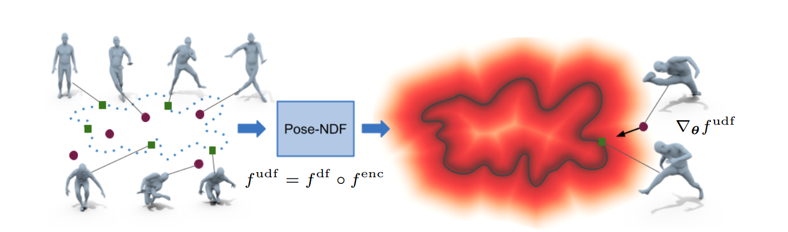

# Pose-NDF

## Abstract（摘要）

我们提出 **Pose-NDF**，一种基于**神经距离场**（Neural Distance Fields, NDF）的**可行人体姿态**连续模型。姿态或运动先验对于生成逼真的新姿态以及从**噪声**或**部分观测**中重建**精确姿态**至关重要。Pose-NDF 将可行姿态的**流形**学习为一个**神经隐式函数**的**零水平集**，将在三维中建模隐式表面的思想扩展到高维域 **SO(3)^K**，其中一个人体姿态由一个数据点定义，并以 **K 个四元数**表示。所得的高维隐式函数可对**输入姿态**求**梯度**，因此可以在**三维超球面**的集合上使用**梯度下降**把任意姿态**投影**到该流形上。与将姿态空间**变换为高斯分布**的以往**VAE 基**的人体姿态先验不同，我们直接**建模真实的姿态流形**，从而**保留姿态之间的距离**。我们证明，作为先验时，Pose-NDF 在多个下游任务中**优于**现有的**最新方法**，任务范围从**真实世界人体动作捕捉去噪**、**遮挡条件下的姿态恢复**到**基于图像的 3D 姿态重建**。此外，我们展示了，相比 VAE 基方法，利用**随机采样并投影**，它能够**生成更加多样**的姿态。我们将发布代码与预训练模型以促进进一步研究：[https://virtualhumans.mpi-inf.mpg.de/posendf/。](https://virtualhumans.mpi-inf.mpg.de/posendf/。)

## 1 Introduction（引言）

逼真而准确的人体动作捕捉与生成对于理解场景中的**人类行为**与**人际互动**至关重要 \[23,41,68,67,9]。人体动作捕捉系统（如**标记点系统** \[37,34]、**IMU-基方法** \[23,41]，或从 **RGB / RGB-D** 数据进行重建 \[55,22,29,70]）往往会遭受**滑移（skating）**、**自相交**和**抖动**等伪影的影响，并产生**不逼真的人体姿态**，尤其在存在噪声数据与遮挡时更为明显。为了使结果可用于诸如**三维场景理解**、**人体运动生成**或 **AR/VR** 应用，通常需要进行**大量的手动或自动清理**流程。

**图 1.** 我们提出 Pose-NDF：一个定义在 **SO(3)^K** 上的**神经无符号距离场**，它将**可行姿态流形**学习为**零水平集**。我们从**可行（■）**与**不合理（•）**姿态样本（左）学习距离场表示。我们使用**结构化 MLP** $f_enc$ 对输入姿态（以一组四元数给出）进行编码，并用 **MLP** $f_df$ 从关节表示预测**距离**。**梯度** $\nabla_\theta f_{udf}$ 与**距离值** $f_{udf}(\theta)$ 被用于将**不合理姿态**投影到流形上（右）。

近年来，用**学习到的数据先验**对这类不逼真的人体姿态进行**后处理**越来越流行。先前的人体姿态模型主要致力于在**姿态空间**中学习**各个关节的联合分布** \[10]，或近来使用 **VAE** 在**潜空间**中建模 \[49,52,66]。事实证明，它们在模型拟合之后能**显著提升姿态的可行性**。然而，诸如 **VPoser** \[49] 或 **HuMoR** \[52] 等 VAE-基方法对**可能姿态的空间**做出了**高斯假设**，这带来了若干局限：1）它们倾向于生成**靠近高斯均值**的更“可能”的姿态，但这些姿态未必是**正确**的；2）在 VAE 的潜空间中，**不同人体姿态之间的距离并不被保留**，因此朝高斯均值迈出的小步，可能对应于**姿态空间中的大步**；3）已有研究表明 VAE 会把一个**流形折叠**到高斯分布中 \[39]，在分布的外部区域暴露出**无数据点的死区**。因此，当在外部区域遍历时，它们会产生**远离输入**的**不合理样本**——我们在实验中对此有所展示。

为缓解上述问题，我们提出 **Pose-NDF**，一种在**高维姿态空间**中建模**可行姿态完整流形**的人体姿态先验。我们将该流形表示为一个**表面**：可行姿态位于流形上（因此距离为零），不合理姿态位于流形外（它们到该表面的距离为正）。我们提出使用**高维神经场**来学习该流形，这与使用**神经距离场**表示三维形状 \[48,13] 的方式**类比**。该表述能**保留姿态之间的距离**，并允许沿着**距离函数的负梯度**在姿态空间中前进，负梯度对应**距离下降最快的方向**。从一个可能不合理的姿态出发，使用姿态空间中的**梯度下降**，我们总能在**可行姿态流形**上找到**最近点**。

我们的方法概览见图 1。我们把**学习姿态流形**的问题表述为**n 维空间中的表面补全任务**。为了学习一个姿态流形，存在两个关键挑战：a）**输入空间是高维的**；b）与三维隐式表面 \[48,13] 不同，**输入空间并非欧氏空间**。相反，姿态空间由 **SO(3)^K** 给出，其中一个单独的姿态可由 **K 个 SO(3) 元素**表示，描述人体模型中**各关节的朝向**。为表示这些群元素，我们选择**四元数表示**，因为它们是**连续**的，具有**易于计算的距离**，并且可用于**高效的梯度下降算法**。我们通过**分层隐式神经函数**将给定的姿态映射为一个距离：该函数按人体的**运动学结构**对姿态进行编码。我们使用 **AMASS** 数据集 \[38] 进行训练，将数据集中的每个样本视为流形上的一个点。学得的**神经场表示**可以像 \[13] 那样将任意姿态**投影**到流形上。我们利用这一性质，将 Pose-NDF 用于**多样姿态生成**、**姿态插值**、作为**基于图像的 3D 姿态估计**的**姿态先验** \[49,10]，以及**运动去噪** \[23,52]，并在所有方面**优于**最先进的方法。**总之，我们的贡献如下：**

* **一种新颖的高维神经场表示**（定义在 **SO(3)^K** 上）——**Pose-NDF**，用于表示**可行人体姿态流形**。
* 作为姿态先验，**Pose-NDF** 在**基于图像的人体拟合**中**提升了最新水平**；在**运动去噪**方面**优于**其他人体姿态先验，如 **VPoser** \[49] 与人体运动先验 **HuMoR** \[52]。
* 我们的方法**速度与当下最新方法相当或更快**，**完全可微**，且可利用**到流形的距离**来在优化过程中寻找**最优步长**。
* 与偏向生成“更可能”姿态的**高斯假设方法**相比，Pose-NDF 能**生成更加多样**的样本。

## 2 Related Work（相关工作）

我们的方法是在高维空间中构建为**神经场**的人体**姿态先验**。因此，我们回顾这两个方向上的相关工作。

**Pose and Motion Priors（姿态与运动先验）。** 人体姿态与运动先验对于维护从捕获数据中估计得到的模型的**逼真度**至关重要 \[40,23,38]，并用于**从图像** \[10,49,65,14,33] 和**视频** \[32,59] 中估计人的姿态。此外，它们也可以成为**数据生成**的有力工具。该方向的早期工作主要聚焦于**欧拉角**中的**关节极限**约束学习 \[17]，或**摆动/扭转（swing/twist）** 表示 \[6,56,1]，以避免超过某些极限的扭转与弯折。随后的方法迭代将**高斯混合模型（GMM）** 拟合到一个姿态数据集上，并将该 **GMM 先验** 用于下游任务，如**基于图像的 3D 姿态估计** \[10,54] 或 **3D 扫描注册** \[4,8,60]。此外，也提出了诸如 **PCA** 之类的简单统计模型 \[47,62,57]。随着**深度学习**与 **GAN** \[20] 的兴起，对抗式训练被用于将**预测的姿态**拉近到**真实姿态** \[31,19]，以及用于**运动预测** \[7]。然而，这些都是**任务特定**的模型：HMR \[31] 建模 $p(\theta\mid I)$，并需要图像 $I$；HP-GAN \[7] 建模 $p(\theta_t\mid \theta_{t-1})$，并需要前一帧/时刻的姿态参数 $\theta_{t-1}$。因此，它们**不能**作为其他任务的**通用先验**使用。

更近期的工作使用 **VAE** 来学习姿态先验 \[49]，可用于**生成姿态样本**、作为**姿态估计的先验**，或**从图像或稀疏/被遮挡数据进行 3D 人体重建**。一些工作 \[52,66,50] 提出了**基于 VAE 的人体运动模型**。**HuMoR** \[52] 提出使用**条件 VAE** 来学习**运动序列**中可能的**姿态转移分布**；**ACTOR** \[50] 学习一个**由动作（action）条件化**的 **VAE-Transformer** 先验。进一步的工作沿着**人体骨架的层级**设计姿态表示 \[2]，并将其用于**角色动画** \[5]。**并行（同期）**工作 \[16] 使用 **GAN** 学习人体姿态先验，并强调了**基于高斯假设**的模型（如 **VPoser** \[49]）的不足：其方法使用 **VPoser 解码器** 作为生成器（将 $z \to \theta$），并用一个类似 **HMR** \[31] 的判别器来训练模型。正如第 1 节所述，我们的方法与基于 VAE 和 GAN 的方法**范式不同**：我们**直接**在高维空间中建模**可行姿态流形**，从而得到一种**保持距离**的表示。

在**深度学习兴起之前**，将**部分姿态空间**建模为**隐式函数**是常见做法，例如：把**单个肩关节的四元数**建模为一个场 \[26]，或者在以**肩关节为条件**的情况下，把**肘关节的四元数**建模为一个场 \[25]。然而，这些方法**忽略了四元数的实部**，导致表示中的**歧义**；它们**不可微**，并且在人体模型中**仅限于 2 个关节**。与此相反，我们的方法使用一个**完全可微**的**神经网络**，在**更高维**上学习**隐式曲面**，并且将**所有人体关节**以及每个四元数的**全部四个分量**都纳入考虑。

**Neural Fields（神经场）。** 用于**表面建模**的神经场 \[13,48,42] 在近年来受到了越来越多的关注。它们被用于在 **2D 或 3D** 中建模场：表示图像或**偏微分方程** \[58,21]，**静态 3D 形状**的**有符号或无符号距离场** \[13,48,27,24]，**由姿态调制**的距离场 \[53,61,43]，**辐射场** \[44,51]，以及更近期的人-物体 \[63,9] 与手-物体 \[69] 交互。关于神经场的更详细综述，请参考 \[64]。神经场最近也被用于**更高维度**，以在**欧氏空间**中建模曲面 \[45]。在本工作中，我们将这一概念应用到**高维、非欧**的 $SO(3)^K$ 空间，在姿态空间中建模**到可行人体姿态流形的无符号距离**。

## 3 Method（方法）

在本节中，我们描述我们的方法 **Pose-NDF**，一个基于**高维神经场**的**可行人体姿态流形**模型。我们假设真实且可行的人体姿态位于姿态空间 **SO(3)^K** 内嵌的一个流形上，其中 K 为人体关节的数量。给定一个神经网络 $f: \mathrm{SO}(3)^K \to \mathbb{R}^+$，它将一个姿态 $\theta \in \mathrm{SO}(3)^K$ 映射到一个非负标量，我们把可行姿态的流形表示为零水平集：

$$
S=\{\theta \in \mathrm{SO}(3)^K \mid f(\theta)=0\},\tag{1}
$$

使得 $f$ 的取值表示到该流形的**无符号距离**，这与基于神经场的三维形状学习类似 \[12,13,21,48]。不失一般性，我们使用 **SMPL** 人体模型 \[36,49]，从而得到具有 $K=21$ 个关节的姿态 $\theta$。

### 3.1 Quaternions as Representation of SO(3)（用四元数表示 SO(3)）

一个人体姿态由人体骨架各个关节的三维旋转表示。三维旋转群 $\mathrm{SO}(3)$ 在实践中有若干常见的向量空间表示。常用的例子包括旋转矩阵、轴角表示或**单位四元数** \[28]。Pose-NDF 要求该表示具备如下特性：a）我们旨在建模一个**连续**嵌入于姿态空间的流形，因此所选表示在参数空间中应是**连续**的，这排除了**轴角**表示；b）该表示应当支持**高效**计算两个元素间的**测地距离**；c）我们的算法需要在姿态空间中进行**高效**的**梯度下降**。如 3.4 节所述，四元数适用于这样的梯度下降算法，并可通过**向量归一化**实现对 $\mathrm{SO}(3)$ 的高效重投影。相比之下，旋转矩阵会需要更为昂贵的正交化。因此，我们选择**单位四元数**作为关节的 $\mathrm{SO}(3)$ 表示，因为它们满足上述三点。我们用 $\theta=\{\theta_1,\ldots,\theta_K\}$ 表示一个姿态中所有 $K$ 个关节的四元数。

每个四元数表示相对于其父节点的关节旋转。由于四元数位于 $S^3$（嵌入在四维空间中），完整的姿态 $\theta$ 可以方便地作为神经网络 $f:\mathbb{R}^{4K}\to\mathbb{R}^+$ 的输入。我们将两个人体姿态 $\theta=\{\theta_1,\ldots,\theta_K\}$ 与 $\hat\theta=\{\hat\theta_1,\ldots,\hat\theta_K\}$ 之间的距离 $d:(S^3)^K\times (S^3)^K\to \mathbb{R}^+$ 定义为：

$$
d(\theta,\hat\theta)=\sqrt{\sum_{i=1}^{K} w_i^2\bigl(\arccos|\theta_i^\top \cdot \hat\theta_i|\bigr)^2},\tag{2}
$$

其中求和项的各个元素在 $\mathrm{SO}(3)$ 上构成度量 \[28]，而 $w_i$ 是依据 SMPL 人体模型的运动学结构为各个关节分配的权重（即运动链中越靠前的关节权重越高）。应当注意，单位四元数的**双覆盖性质**（即四元数 $q$ 与 $-q$ 表示同一个 $\mathrm{SO}(3)$ 元素）并不会造成额外挑战。我们仅通过对输入四元数进行**符号翻转增广**来训练网络，使其在点上具有对称性。

### 3.2 Hierarchical Implicit Neural Function（分层隐式神经函数）

我们在 SMPL 人体模型的运动学结构下，使用**父关节的局部坐标系**中的四元数表示人体姿态。我们在局部坐标系中处理各关节，以便对单个关节进行连续操控可对应于逼真的运动。然而，这可能导致关节旋转的组合**不逼真**。单个关节的可行性依赖其**祖先关节**的旋转，因而需要对它们进行**条件化**。为纳入这种依赖关系，我们使用一个**分层网络** $f_{\mathrm{enc}}$，它基于模型结构对人体姿态进行编码 \[2,19,43]，然后才在关节表示的基础上预测**距离**。

形式化地，给定一个姿态 $\theta=\{\theta_1,\ldots,\theta_K$)，其中 $\theta_k$ 是第 $k$ 个关节的姿态，以及一个函数 $\tau(k)$ 将每个关节的索引映射为其父关节的索引，我们用一个 MLP 对每个关节进行如下编码：

$$
f^{\mathrm{enc}}_1:(\theta_1)\mapsto v_1,\qquad
f^{\mathrm{enc}}_k:(\theta_k, v_{\tau(k)})\mapsto v_k,\; k\in\{2,\ldots,K\},\tag{3}
$$

其中输入为该关节的四元数姿态与其父关节的编码特征 $v_{\tau(k)}\in\mathbb{R}^\ell$，输出为 $v_k\in\mathbb{R}^\ell$，$\ell$ 为特征维度。随后我们将每个关节的编码特征拼接得到联合的姿态嵌入 $p=[v_1\| \cdots \| v_K]$。该嵌入由一个 MLP $f_{\mathrm{df}}:\mathbb{R}^{\ell\cdot K}\to\mathbb{R}^+$ 处理，从给定的姿态表示 $p$ 预测**无符号距离**。整体上，完整模型

$$
f_{\mathrm{udf}}(\theta)=(f_{\mathrm{df}}\circ f_{\mathrm{enc}})(\theta)
$$

被称为 **Pose-NDF**，其中 $f_{\mathrm{udf}}:\mathrm{SO}(3)^K\to\mathbb{R}^+$。

### 3.3 Loss functions（损失函数）

我们训练该**分层结构**的神经场 $f_{\mathrm{udf}}$，使其对给定姿态预测到可行姿态流形的**测地距离**。训练数据给为一个集合 $D=\{(\theta_i,d_i)\}_{1\le i\le N}$，其中包含姿态 $\theta_i$ 与距离 $d_i$（见式 (2)）的配对。我们使用标准的**距离损失** $L_{\mathrm{UDF}}$ 与 **Eikonal 正则项** $L_{\mathrm{eikonal}}$ 来训练网络，后者鼓励在流形之外距离场的**单位范数梯度** \[15,21]：

$$
\begin{aligned}
L_{\mathrm{UDF}}&=\sum_{(\theta,d)\in D}\|f_{\mathrm{udf}}(\theta)-d_\theta\|^2,\\
L_{\mathrm{eikonal}}&=\sum_{(\theta,d)\in D,\; d\neq 0}\bigl(\|\nabla_\theta f_{\mathrm{udf}}(\theta)\|-1\bigr)^2.\tag{4}
\end{aligned}
$$

关于训练数据与网络结构的更多细节，请见补充材料。

### 3.4 Projection Algorithm（投影算法）

给定一个已训练的模型 $f_{\mathrm{udf}}$，它可以被用于将任意姿态 $\theta$ **投影**到可行姿态流形上。我们利用预测的距离 $f_{\mathrm{udf}}(\theta)$ 与梯度信息 $\nabla_\theta f_{\mathrm{udf}}(\theta)$ 将查询姿态投影到流形表面 $S$，这与先前在三维形状的**无符号距离函数**上的做法类似 \[13]。在我们的场景（$\mathrm{SO}(3)$ 姿态）中，这相当于求解：

$$
\hat\theta=\arg\min_{\theta\in \mathrm{SO}(3)^K} d(\theta,S),\tag{5}
$$

其中 $d(\theta,S)$ 是 $\theta$ 到 $S$ 上最近点的距离（式 (2)）。我们通过在**三维球面**上进行**梯度下降**来求得 $\hat\theta$，使用从隐式神经函数 $f$ 得到的梯度信息 $\nabla_\theta f(\theta)$ 与距离 $f(\theta)$。其一步更新为：

$$
\theta_i=\theta_{i-1}-\alpha\, f(\theta_{i-1})\, \nabla_\theta f(\theta_{i-1}),\tag{6}
$$

并在若干次迭代后执行一次**重投影**到球面（即向量归一化）。该算法被保证在球面上**收敛到局部极小值**，在我们的情形下，若距离函数学习正确，则该点为**姿态流形上的最近点**。

## 4 实验与结果

在本节中，我们对 Pose-NDF 进行评估，并展示我们的姿态模型的不同用例，包括：作为先验用于运动序列去噪或从部分观测中恢复（第 4.2 节）、作为先验配合**基于优化**的方法从图像中恢复合理姿态（第 4.3 节）、姿态生成（第 4.4 节）以及姿态插值（第 4.5 节）。我们证明了 Pose-NDF 在作为先验时优于当前最先进的 VAE 类人体姿态先验方法。我们还展示了我们的距离场表述相较于 VAE 或高斯假设模型的优势（第 4.6 节）。在给出结果之前，我们先在第 4.1 节说明 Pose-NDF 的训练与实现细节。

### 4.1 实验设置

我们使用 AMASS 数据集 \[38] 进行训练。如第 3.3 节所述，我们以对**预测距离值**的监督训练网络，因此我们构建了由姿态与距离对 $(\theta, d_\theta)$ 组成的数据集。由于 AMASS 中的训练样本位于期望的流形上，我们对数据集中所有姿态赋予 $d_\theta=0$。随后，我们通过在 AMASS 姿态上添加噪声，随机生成距离 $d_\theta>0$ 的负样本。数据准备的细节见补充材料。我们采用多阶段训练策略，随训练样本类型的变化而变化。我们首先用流形上的姿态 $\theta_m$ 与到目标流形**距离较大**的非流形姿态 $\theta_{nm}$ 开始训练；然后在每个训练 batch 中逐步增加**距离较小**的非流形姿态 $\theta_{nm}$ 的数量。该训练方案有助于在初期学习到平滑的表面，并在训练过程中逐步引入细节。我们的网络结构由一个两层的 MLP $f^{enc}$ 组成，每个关节的输出特征维度为 $l=6$，与 \[43] 类似。因此，姿态编码网络产生的特征向量 $p\in\mathbb{R}^{126}$。我们将距离场网络 $f^{df}$ 实现为一个五层的 MLP。训练时，我们在隐藏层使用 softplus 激活，并使用式 (4) 中描述的损失函数进行端到端训练。

### 4.2 动作捕捉数据去噪

人体动作捕捉可通过多种方案实现，涵盖 RGB、RGB-D 到 IMU 等系统。这些来源捕获到的数据往往会产生诸如抖动、关节不自然地僵硬或某些关节出现奇怪弯折等伪影，或者仅获得**部分观测**的位置。先前工作 \[52] 通过一种**基于优化**的方法来提升捕捉到的运动序列质量，目标是在保留人体姿态**真实感**的同时，恢复被捕捉的数据。一个**鲁棒且具有表达力**的人体姿态先验，是在保留原始数据同时保持优化后姿态真实感的关键。沿用 HuMoR \[52] 的设定，我们展示我们的姿态流形在以下任务中的有效性：1）运动去噪；2）拟合部分数据。

\*\*表 1. 运动去噪：\*\*我们在 HPS（左）和 AMASS（中）的动捕数据，以及在人工构造的 Noisy AMASS 数据（右）上比较每顶点误差（单位：cm）。在所有情况下，基于 Pose-NDF 的运动去噪得到的误差最小。我们还观察到，在动捕数据（HPS、AMASS）的情形下，使用 Pose-NDF 进行运动去噪会产生非常小的误差（对输入的改动很小），这是理想行为，因为这些动捕姿态本就真实，因而接近我们学习到的流形。另一方面，HuMoR 会显著改变输入姿态。
**数据** HPS \[23] / AMASS \[38] / Noisy AMASS；**帧数** 60 / 120 / 240。
**方法**：
VPoser \[49]：4.91 / 4.16 / 3.81；1.52 / 1.55 / 1.47；8.96 / 9.13 / 9.15
HuMoR \[52]：9.69 / 8.73 / 10.86；3.21 / 3.62 / 3.67；11.04 / 17.14 / 30.31
Pose-NDF：2.32 / 2.14 / 2.11；0.59 / 0.55 / 0.54；7.96 / 8.31 / 8.46

\*\*图 2. 运动去噪：\*\*我们观察到，基于 Pose-NDF 的运动去噪能让姿态变得真实，并解决小的相交问题，而 VPoser 和 HuMoR 仍会产生不合理的姿态。

我们遵循与 \[52] 相同的实验设置，但只处理**人体姿态**，因此移除了与**人-场景接触**和**根节点平移**相关的项。总体上，我们在第 $t$ 帧求解姿态参数 $\hat{\theta}_t$：

$$
\hat{\theta}_t=\arg\min_{\theta}\ \lambda_v L_v+\lambda_\theta L_\theta+\lambda_t L_t,
\tag{7}
$$

其中 $L_v$ 确保优化后的姿态接近观测，时间平滑项 $L_t$ 施加时间一致性约束：

$$
L_v=\|J(\beta_0,\hat{\theta}_t)-J_{obs}\|_2^2,\qquad
L_t=\|M(\beta_0,\hat{\theta}_t)-M(\beta_0,\theta_{t-1})\|_2^2.
\tag{8}
$$

这里，$J(\beta,\theta)$ 表示顶点（动捕标记点），$M(\beta,\theta)$ 表示给定姿态 $\theta$ 与形状 $\beta$ 的 SMPL 网格顶点 \[36]。最后，我们将 Pose-NDF 作为优化中的**姿态先验项**，通过最小化当前姿态到我们学习流形的距离来实现，$L_\theta=f_{udf}(\theta)$。我们还利用距离 $f_{udf}(\theta)$ 来在优化过程中获得**最优步长**。

我们在两种不同设置下进行评估：1）**干净**的动捕数据集；2）**带噪**的动捕数据集。对于干净数据集，我们使用 HPS \[23] 与 AMASS 的测试划分 \[38,49]。对于带噪数据集，我们通过向 AMASS 测试序列添加高斯噪声，随机创建噪声序列，并称之为 “Noisy AMASS”。

\*\*图 3. 运动去噪：\*\*我们将使用 Pose-NDF 与 HuMoR \[52] 作为先验进行运动去噪的结果与 GT 数据进行比较，并可视化一个序列中每第 10 帧。我们观察到，对于 HuMoR（上），输入姿态的修正会随着时间累积，使输出姿态与 GT（中）显著不同；而 Pose-NDF 在纠正不合理姿态的同时，始终保持接近观测（下）。

在 “Noisy AMASS” 中注入的平均噪声为 9.3 cm。优化期间，我们使用一组 SMPL 网格顶点 $J$ 作为观测。我们在创建数据时固定形状，并不优化形状参数 $\beta$。与其向关节位置添加噪声，我们**直接**向每个关节的旋转添加噪声。为确保公平比较，所有方法均如此处理。对于 HuMoR \[52]，我们使用其原文中的 TestOpt 优化。VPoser 并未包含运动实验，因此我们将其原文中的**潜空间优化**与式 (7) 的优化相结合，以确保我们比较的是尽可能强的基线。具体而言，我们首先用 VPoser 的编码器将**含噪输入姿态** $\theta_t$ 的旋转矩阵表示编码为 $z_t=f^{v}_{enc}(\theta_t)$，然后在**潜空间**中加入随机噪声 $\hat{\epsilon}$，并通过 $ \tilde{\theta}_t=f^{v}_{dec}(z_t+\hat{\epsilon})$ 重建姿态。遵循 \[66]，我们观察到在潜空间中的时间项比在输入姿态/顶点空间中的时间项效果更好，这也是我们在 VPoser 实验中采用的做法。VPoser-based 去噪的先验与时间项为：

$$
L^{\text{VPoser}}_{\theta}=\|\hat{\epsilon}\|^2,\qquad
L^{\text{VPoser}}_{t}=\|z_{t-1}-\hat{z}_t\|^2.
\tag{9}
$$

**结果。**我们在表 1 中比较了 HuMoR \[52]（TestOpt）、将式 (7) 与 VPoser 先验 \[49] 结合，以及将式 (7) 与 Pose-NDF 先验结合的**运动去噪**。在所有设置中，Pose-NDF 的误差最低。对于 AMASS 与 HPS 等动捕数据，运动是**真实的**，但可能存在小伪影与抖动。因此，理想的运动/姿态先验不应显著改变这些样本的整体姿态，而只应修复这些局部伪影。我们观察到，从数值上看，基于 VPoser 与 Pose-NDF 的优化不会显著改变输入姿态；然而 HuMoR 会改变姿态，且这种改变会随着帧数的增加而增大。这是因为 HuMoR 是一个**基于运动**的先验（以前一帧姿态为条件），因此随着时间推移，姿态修正会**累积**，使输出姿态与输入显著不同。

对于 “Noisy AMASS”，基于 Pose-NDF 的优化优于以往工作。我们在图 2 中可视化去噪结果，观察到基于 Pose-NDF 的方法产生了**真实**且**接近 GT** 的结果。我们进一步在图 3 中将一个序列的结果与 HuMoR 比较。由于随时间累积的修正，HuMoR 会导致与输入/GT 的**大偏差**。
**拟合部分数据。**我们使用 AMASS 的测试集，并随机创建**被遮挡**的姿态（例如，缺失手臂或腿或肩关节），并在表 2 中与 HuMoR \[52] 和 VPoser \[49] 进行定量比较。对于 VPoser 与 Pose-NDF-based 优化，我们使用式 (7)，且**只优化被遮挡的关节**；对我们的模型，我们将被遮挡关节的初始化随机设置（接近 0）。对 HuMoR，我们使用其论文中提供的 TestOpt。我们评估三种不同的遮挡类型：1）遮挡左腿；2）遮挡左臂；3）遮挡右肩与上臂。对于遮挡腿的情形，VPoser 与我们的先验方法表现更好。我们认为这是因为 AMASS 的训练与测试中大多数姿态都为**直立**且**双腿近乎笔直**，因此 VPoser 对这类姿态存在偏置。对我们的方法，结果**高度依赖**初始化。由于我们使用了接近**静止姿态**的初始化，我们的优化在遮挡腿时产生更小误差，但在遮挡手臂与肩部时误差更大，因为这些部位通常离静止姿态更远。对于 HuMoR，生成的运动**真实且合理**，但在某些情况下与 GT 存在较大偏差，因为对输入姿态的修正会**随时间累积**。

**表 2. 从部分 3D 观测进行运动估计：**我们比较每顶点误差（单位：cm）。可以看到，对于腿与臂/手的遮挡，Pose-NDF 比 VPoser 与 HuMoR 重建的姿态更好。对遮挡肩部的情况，HuMoR 略占优势。我们观察到，Pose-NDF 的结果取决于**被遮挡关节的初始化**，这也是从流形投影所预期的。
**数据**：Occ. Leg / Occ. Arm+hand / Occ. Shoulder + Upper Arm；**帧数** 60 / 120 / 240。
**方法**：
VPoser \[49]：2.53 / 2.57 / 2.54；8.51 / 8.52 / 8.59；9.98 / 9.49 / 9.48
HuMoR \[52]：5.60 / 6.19 / 9.09；7.83 / 8.44 / 10.25；4.75 / 5.11 / 4.95
Pose-NDF：2.49 / 2.51 / 2.47；7.81 / 8.13 / 7.98；7.63 / 7.89 / 6.76

### 4.3 从图像估计 3D 姿态

我们现在展示 Pose-NDF 也可作为先验用于**基于优化**的**从图像估计 3D 姿态** \[49]。我们使用 SMPLify-X \[49] 中提出的目标函数（见式 (10)）。由于我们仅处理**SMPL 身体**（不含手与面部），我们移除了相应的损失与先验项。因此，我们求解期望的姿态 $\hat{\theta}$ 与形状 $\hat{\beta}$：

**图 4. 使用基于 Pose-NDF 的优化方法在野外图像上进行 3D 姿态与形状估计。**（示例来自 LSP 数据集 \[30]、高分辨率 LSP 数据集 \[30]、COCO 数据集 \[35]、3DPW 数据集 \[40]。）

**表 3.** 使用 Pose-NDF、GAN-S \[16] 与 VPoser \[49] 作为**基于优化**方法中的**姿态先验项**（左）进行从图像估计 3D 姿态与形状。我们还将所提出的先验与优化流程用于进一步改进最先进的 3D 姿态与形状估计网络 ExPose \[14] 的结果（右）。**每顶点误差（mm）**：
*Optimization*：VPoser \[49] 60.34；GAN-S \[16] 59.18；Pose-NDF 57.39；Pose-NDF（带优化）54.76。
*ExPose*：无先验 99.78；+ VPoser \[49] 67.23；+ GAN-S \[16] 54.09；+ Pose-NDF 53.81。

$$
\hat{\beta},\hat{\theta}=\arg\min_{\beta,\theta}\ L_J+\lambda_\theta L_\theta+\lambda_\beta L_\beta+\lambda_\alpha L_\alpha,
\tag{10}
$$

其中包含数据项 $L_J$、弯曲项 $L_\alpha$、形状正则 $L_\beta$ 与先验项 $L_\theta$。数据项与弯曲项为：

$$
L_J=\sum_{i\in \text{joints}}\gamma_i w_i\,\rho\!\big(\Pi_K(R_\theta(J(\beta)))-J^{est}_i\big),\qquad
L_\alpha=\sum_{i\in (\text{elbow},\text{knees})}\exp(\theta_i),
\tag{11}
$$

其中 $J^{est}_i$ 为最先进的 2D 姿态估计方法 \[11] 估计的 2D 关键点，$R_\theta$ 按照运动链根据姿态 $\theta$ 变换关节，$\Pi_K$ 表示带有内参的 3D 到 2D 投影，$\rho$ 为鲁棒的 Geman-McClure 误差 \[18]。此外，弯曲项 $L_\alpha$ 惩罚肘部与膝部的大弯曲，形状正则为 $L_\beta=\|\beta\|^2$ \[49]。对 VPoser，先验项为 $L_\theta=\|z\|_2^2$，其中 $z$ 为 32 维 VAE 潜向量。在我们的模型中，使用 $L_\theta=f_{udf}(\theta)$，并通过我们的投影算法最小化姿态到所学流形的距离。我们在优化中利用模型提供的距离信息，设置 $\lambda_\theta=w\,f_{udf}(\theta)$，其中 $w$ 为固定值。这确保了当姿态接近流形（即 $f_{udf}(\theta)$ 很小）时，先验项会被**下调**，从而带来更快的收敛。
**结果。**我们使用 EHF 数据集 \[49] 进行定量评估，并与最先进的先验 VPoser \[49] 与 GAN-S \[16] 比较。作为先验，Pose-NDF 相比基于 VPoser 与 GAN-S 的优化略有提升（见表 3）。我们观察到，基于神经网络的 ExPose 模型 \[14] 的性能优于所有**基于优化**的结果。不过，我们证明此类方法可以从**基于优化**的**后处理**步骤中获益。我们用式 (10) 配合 Pose-NDF 作为先验来**细化** ExPose 的输出，并将该细化与**无先验**及其它先验进行比较（表 3）。在**无先验**情况下，优化目标仅最小化关节投影损失，导致**不合理**的姿态；相反，GAN 与 Pose-NDF 会改进结果（定性与定量上），生成合理的姿态，同时 Pose-NDF 的表现优于 GAN 先验。最后，在图 4 中我们展示了在 3DPW \[40]、LSP \[30] 与 MS-COCO \[35] 数据集的野外图像上进行**基于优化**的 3D 姿态估计的定性结果。

### 4.4 姿态生成

我们在**姿态生成**任务上评估我们的模型。由于我们的**距离场**表述，我们可以通过从 $SO(3)^K$ 中**随机采样**一点并将其**投影**到流形上（第 3.4 节）来生成多样的姿态。我们将结果与从最先进的姿态先验 VPoser \[49]、GMM \[10,46] 与 GAN-S \[16] 采样进行比较（图 5）。我们使用**平均两两距离**（APD）\[3] 来量化生成姿态的多样性。APD 定义为所有样本对之间的平均关节距离。我们为 GMM、VPoser、GAN-S 与 Pose-NDF 各随机采样 500 个姿态，得到的 APD 值分别为 48.24、23.13、27.52、32.31（单位：cm）。我们看到，从数值上，GMM 产生了很大的方差，但也会导致**不合理**的姿态（见图 5 左上）。Pose-NDF 在仅产生**合理**姿态的同时，生成的多样性高于 VPoser。我们还计算生成姿态中**自相交**面的百分比，以评估姿态真实感的一个方面。Pose-NDF 生成的姿态自相交面占比为 0.89%，低于 GAN-S（1.43%）与 VPoser（2.10%）。

### 4.5 姿态插值

Pose-NDF 学习到**合理人体姿态的流形**，因此可以通过沿着该流形进行遍历，在两个不同姿态之间进行**插值**。具体而言，对任意给定姿态，我们首先将起始 $\theta_0$ 与结束姿态 $\theta_T$ 投影到我们的流形上（式 (6)），得到 $\theta'_0$ 与 $\theta'_T$。随后，我们以步长 $\tau$ 沿着从 $\theta'_0$ 指向 $\theta'_T$ 的方向移动，使用式 (12)。插值得到的姿态 $\theta_t$ 再次被投影到流形上，得到**合理**的姿态 $\theta'_t$。在随后的插值步骤中，我们从 $\theta'_t$ 移向 $\theta'_T$，其中 $\theta'_t$ 在每一步之后都会更新。

$$
\theta_t=\theta'_{t-1}+\tau\big(\theta'_T-\theta'_{t-1}\big).
\tag{12}
$$

**结果：**我们将 Pose-NDF 的插值与 VPoser \[49] 与 GAN-S \[16] 的插值进行比较。对于 VPoser \[49]，我们将起止姿态投影到**潜空间**并对潜向量进行**线性插值**；对于 GAN-S \[16]，我们按照其论文建议在潜空间中使用**球面插值**。我们通过计算**相邻帧之间的平均每顶点距离**来定性评估插值质量，数值越小表示插值越平滑。我们观察到，基于 Pose-NDF 的插值的平均每顶点距离为 $2.72\pm 2.16$，GAN-S 为 $2.71\pm 2.45$，VPoser 为 $2.53\pm 4.62$。这表明，Pose-NDF 与 GAN-S 的插值**平滑**，而在 VAE 的情形下输入空间的距离并未被完全保留。我们在图 6 中将 VPoser 的插值与 Pose-NDF 比较，观察到 VPoser 插值中出现**大跳变**；这种行为在 GAN-S 与 Pose-NDF 的插值中未见。由于 VAE 学习的是**紧凑**的潜在表征，两个输入姿态之间的距离**不会**在潜空间中被**保留**。

### 4.6 Pose-NDF 与高斯假设模型

以往工作 \[52,49] 使用基于 VAE 的模型作为姿态/运动先验，这类模型在潜空间中遵循**高斯假设**。正如第 1 节所述，这存在三大局限。相反，Pose-NDF 直接在**姿态空间**中学习流形，无需此类假设，因而能够克服这些局限。
我们基于**偏离均值姿态**的程度报告累积误差。我们在 AMASS Noisy（60 与 120 帧）上评估，并对 Pose-NDF 与 VPoser 的运动去噪在 $\sigma,2\sigma,3\sigma$ 区间的样本报告累积误差。我们得到的每顶点误差分别为：Pose-NDF 8.18、8.20、8.21 cm；VPoser 8.35、9.11、9.13 cm；HuMoR 10.08、11.38、16.86 cm。这反映出 VPoser 与 HuMoR 在**接近均值**的姿态上表现较好，但对**偏离均值**的样本误差增大。由于高斯分布是**无界的**，它在分布的外部会产生\*\*“死区”**，这些区域没有任何数据点；因此在这些区域采样可能会导致 GMM 与 VPoser 产生**完全不合理**的姿态（见图 5）。最后，由于我们在**姿态空间**中学习流形，**姿态之间的距离**得以保留，并带来比 VPoser 更**平滑\*\*的插值（见第 4.5 节）。

## 5 Conclusion（结论）

我们提出了一种新颖的人体姿态先验模型，由一个**标量神经距离场**表示，它在 $SO(3)^K$ 中将**合理姿态的流形**描述为**零水平集**。该方法将利用神经场进行经典三维形状表示的思想**扩展**到人体姿态的**更高维度**，并把**基于四元数的姿态**映射为一个**无符号距离值**，该值表示到姿态流形的距离。由此得到的网络可用于**将任意姿态投影到姿态流形**上，从而在多个领域开启应用。我们对模型在**多样姿态采样**、**从图像进行姿态估计**以及**运动去噪**方面的性能进行了**全面评估**。我们表明，相较以往**基于 VAE** 的工作，我们的模型能够生成**多得多的多样姿态**，并在**基于图像的重建**与**运动估计**上**提升了最新水平**的结果。
