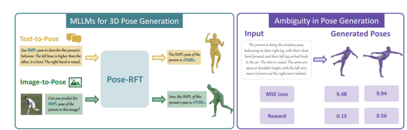

# Pose-RFT

## **摘要**

从图像或文本等多模态输入生成三维人体姿态，要求模型同时捕捉丰富的空间与语义对应关系。虽然面向姿态的多模态大语言模型（MLLMs）在该任务上已展现出潜力，但它们通常依赖监督式目标（如 SMPL 参数回归或逐 token 预测）进行训练，这类方法难以刻画任务的内在多解性，并且难以实现三维姿态生成所需的任务特定对齐。为克服这些局限，我们提出 **Pose-RFT**：一种专为 MLLM 的三维人体姿态生成而设计的**强化式微调**框架。我们将任务表述为**混合动作**的强化学习问题，**联合优化**离散的语言预测与连续的姿态生成。为此，我们引入 ==**HyGRPO**，一种混合强化学习算法==：对采样得到的多候选响应进行**组内奖励归一化**，以引导离散与连续动作的联合优化。Pose-RFT 还设计了==**任务特定的奖励函数**==：在**图像→姿态**任务中引导空间对齐，在**文本→姿态**任务中引导语义一致性。在多个姿态生成基准上的大量实验表明，Pose-RFT 相较现有的面向姿态的 MLLM 能**显著提升**性能，从而验证了基于混合动作的强化式微调在三维姿态生成上的有效性。

## Introduction（引言）

近年来，==三维人体姿态生成==的研究 [10, 11, 18, 44] 日益聚焦于从多模态输入（如图像与文本）中理解并推理三维人体姿态的问题。其中，**面向姿态的多模态大语言模型（MLLMs）** [14, 27] 展示出很大潜力：它们==在通用语言模型的基础上加入专用的姿态解码器==，使模型能够在语言、视觉与三维姿态之间进行联合推理，并在**图像→姿态**与**文本→姿态**两类生成任务上都取得了优秀表现。

尽管已有进展，==当前面向姿态的 MLLMs 多采用**监督式目标**进行训练==，例如 **SMPL** [33] 参数回归 [14] 或**逐 token 预测** [27]。这类目标虽然能与标注数据保持一致，但不足以刻画三维姿态生成所固有的**多解性**，也难以达到任务所需的**空间与语义对齐**。在**图像→姿态**生成中，二维图像的深度与视角限制会带来**歧义**，常常对应于多个合理的三维姿态；在**文本→姿态**生成中，自然语言的**模糊性与主观性**进一步加剧了困难，导致有效姿态呈现**宽分布**。如图1所示，不同的三维姿态可能得到相近的重建损失（如 MSE），但在语义上存在明显差异，这突显了标准监督目标的局限性，并表明我们需要能更好反映**语义对齐**的奖励信号。

上述挑战促使我们考虑**强化学习（RL）**：它为超越监督标签、朝向更契合空间与语义的输出提供了系统化的优化路径。然而，大多数现有的**强化式微调（RFT）**算法 [1, 21, 32, 42, 26] 仅在**纯离散 token 空间**中工作，主要用于语言层面的对齐；这类离散方法先天难以优化三维姿态生成所需的**细粒度连续输出**。

为解决这些问题，我们提出 **Pose-RFT**（见图2），即一个专为 MLLMs 的三维姿态生成而设计的**强化式微调框架**。首先，我们将任务表述为**混合动作空间**下的强化学习问题，使策略能够**同时**产生**离散动作**（如文本 token）与**连续动作**（如三维姿态参数）。受**混合强化学习**研究 [34, 13, 25] 启发，我们利用现有面向姿态的 MLLMs 所学习到的**语言对齐多模态表征**构建统一表示空间；连续动作由**多元高斯策略**建模，姿态头同时输出**均值与协方差**。其次，我们提出 **HyGRPO**，一种基于 GRPO [41] 的**在线混合强化学习算法**，直接在原生的混合动作空间上优化策略：对每个输入，预训练的面向姿态 MLLM 会生成多个“文本+姿态”的候选，对其**组内奖励**进行归一化，并更新策略以偏好高奖励响应。最后，我们为三维姿态生成设计了**四种可验证、任务特定的奖励函数**以引导策略优化：（i）**图像→姿态**的**关节位置奖励**（空间对齐），（ii）**文本→姿态**的**语义一致性奖励**，（iii）**输出格式正确性奖励**，以及（iv）**文本嵌入相似度奖励**。借助多样的输出与结构化反馈，HyGRPO 促使模型生成同时**空间准确**且**语义对齐**的三维姿态。

**贡献概述**：
 (1) 提出 **Pose-RFT**，首个专为 MLLMs 的三维姿态生成而设的强化式微调框架；
 (2) 提出 **HyGRPO**，一种有效优化面向姿态 MLLMs 的**离散+连续**混合输出的强化学习算法；
 (3) 在多项姿态生成基准上的大量实验显示 Pose-RFT **显著优于**现有面向姿态的 MLLMs，验证了**混合动作强化式微调**在三维姿态生成中的有效性。

## Related Work（相关工作）

### 2.1 Human Pose Generation（人体姿态生成）

人体姿态生成指在图像或文本的条件下生成三维人体姿态。对于**图像→姿态**生成（亦称“姿态估计”），现有方法通常分为**基于优化**与**基于回归**两类。基于优化的方法 [6, 36] 通过迭代细化，使投影到二维的关节与检测到的二维关键点对齐，从而估计三维姿态参数。相比之下，基于回归的方法 [22, 7, 12, 16] 倚赖深度神经网络，直接从输入图像预测三维姿态。**文本→姿态**生成旨在依据文本描述（如体态特征或动作）合成三维人体姿态 [10, 44, 18]。尽管上述方法取得了可喜进展，但它们仍然局限于“图像→姿态”或“文本→姿态”中的单一路径，尚缺乏一个**能够统一利用跨模态知识、同时从视觉与文本输入推断人体姿态**的框架。

### 2.2 Multimodal Large Language Models（多模态大语言模型）

**多模态大语言模型（MLLMs）** [1, 30, 24, 48, 9] 通过联合建模视觉输入与自然语言，在视觉—语言理解任务上展现出强劲性能。这类模型擅长多模态推理、视觉指代与指令跟随，因而能够在多种应用场景中理解复杂视觉内容。利用这些能力，近期工作已成功将 MLLMs 迁移到下游的视觉中心任务，如图像分割 [23, 4]、异常检测 [17] 与关键点定位 [47]，显示出其超越纯语言领域的可迁移性。为适配下游任务，常见的**后训练**策略包括**监督式微调（SFT）\**与\**强化式微调（RFT）**。例如 ChatPose [14] 与 UniPose [27] 采用 SFT 将 MLLMs 扩展至三维姿态生成，借力其视觉—语言推理能力。然而，这些方法**仅依赖 SFT**，并未引入基于强化的优化；缺少 RFT 会限制模型在**歧义**与**任务特定对齐**场景下进一步提升生成质量的能力。

### 2.3 Reinforcement Learning（强化学习）

**强化学习（RL）** [43] 是机器学习中的核心范式，智能体通过与环境交互并优化累计回报来学习**策略**（从观测到动作的映射）。经由试错学习，智能体依据**标量回报**的反馈改进策略。经典算法（如 Q-learning [50]）已在机器人、自动控制与博弈等领域获得成功。随着**大语言模型** [38, 45, 1] 的兴起，**基于人类反馈的强化学习（RLHF）** [3] 成为利用人类偏好数据微调模型的关键技术，常借助 **PPO** [40] 与 **DPO** [39] 等算法，引导模型行为以提升回应的**对齐性、连贯性与有用性**。在多模态大语言模型背景下，近期研究 [56, 31, 53, 32, 52, 55, 42] 已探索使用**可验证的奖励信号**强化视觉推理。然而，RL 在**三维人体姿态生成**中的应用仍然**研究不足**，主要因为姿态回归的**连续性**给原本面向离散动作空间的 RL 方法带来挑战。为应对其他领域中的类似问题，已有工作提出了**离散—连续混合动作**的建模方式 [34, 13, 25]，为将强化学习适配于三维姿态生成这类**结构化连续任务**提供了有前景的方向。

## 3 方法（Methodology）

本节首先将三维人体姿态生成在混合动作空间下重构为一个强化学习问题；随后给出我们提出的“混合动作空间组相对策略优化（HyGRPO）”算法，用以联合优化离散的语言输出与连续的姿态输出；最后说明如何结合为三维姿态生成专门设计的任务型奖励函数，用 HyGRPO 对姿态专用的 MLLM 进行微调。

### 3.1 将 3D 姿态生成重构为强化学习问题

我们把姿态专用 MLLM 的 3D 人体姿态生成建模为一个**混合动作**强化学习问题，动作同时包含离散的语言词元与连续的 3D 姿态参数。整体策略定义为

$\pi_\theta(a,p\mid q)=\pi_\theta(a\mid q)\cdot \pi_\theta(p\mid q,a), \tag{1}$

其中，$q$ 为多模态输入，$a$ 为离散的文本响应，$p$ 为连续的 3D 姿态参数。我们将 $\pi_\theta(a,p\mid q)$ 视作整体策略，并分解为离散子策略 $\pi_\theta(a\mid q)$（建模文本响应分布）与连续子策略 $\pi_\theta(p\mid q,a)$（在给定输入与文本的条件下建模 3D 姿态分布）。

为参数化连续策略，我们采用定义在 3D 姿态空间上的多变量高斯分布：

$\pi_\theta(p\mid q,a)=\mathcal{N}\!\big(p;\,\mu_\theta(q,a),\,\Sigma_\theta(q,a)\big), \tag{2}$

其中均值 $\mu_\theta(q,a)$ 与协方差 $\Sigma_\theta(q,a)$ 由连续姿态头在条件 $q,a$ 下预测。该概率式建模通过对条件姿态向量的分布建模，捕获 3D 姿态生成中固有（aleatoric）不确定性；同时可在训练中进行随机采样，并在连续姿态空间内进行高效的梯度优化。

受益于 MLLM 预训练阶段建立的强跨模态对齐，离散与连续策略均构建在**共享的、语言对齐的多模态嵌入空间**上。为进一步增强姿态理解，我们在原有姿态专用 MLLM 中加入**姿态感知编码器**，以丰富多模态状态表征：具体地，引入在人体姿态估计任务上预训练的 Vision Transformer 提取高分辨率、对姿态敏感的特征，并与语言对齐的多模态嵌入进行融合，从而得到更具姿态相关性的状态空间（细节见附录 A）。优化时，各策略头用各自的奖励信号更新，而共享骨干网接收合并后的梯度，从而在离散与连续动作空间上实现端到端训练。

### 3.2 HyGRPO：混合动作空间的组相对策略优化

我们提出 **HyGRPO**——一种面向 3D 姿态生成、用于提升姿态专用 MLLM 的在线强化学习算法。借助预训练阶段习得的统一表示空间，HyGRPO 在共享的语言对齐多模态嵌入空间内，直接联合优化离散语言头与连续姿态头，促成文本与姿态输出的一致对齐。该算法弥合了离散词元预测与连续姿态生成之间的鸿沟。

对混合输出，HyGRPO 在给定输入问题 $q$ 的条件下，同时对离散文本答案 $a$ 与连续人体姿态 $p$ 建模。对来自数据集 $D$ 的每个样本 $q$，从当前策略采样 $G$ 个候选 $\{(a_i,p_i)\}_{i=1}^G$，并最小化如下目标：

$\mathbb{E}_{q\sim D,\{(a_i,p_i)\}\sim\pi_\theta}\!\left[\frac{1}{G}\sum_{i=1}^{G} r_i(\theta)\,\hat{A}_i\right], \tag{3}$

其中第 $i$ 个样本输出的**重要性权重**定义为当前策略与参考策略之比：

$r_i(\theta)= \frac{\pi_\theta(a_i,p_i\mid q)}{\pi_{\text{ref}}(a_i,p_i\mid q)} = \underbrace{\frac{\pi_\theta(a_i\mid q)}{\pi_{\text{ref}}(a_i\mid q)}}_{r_d(a_i\mid q)} \cdot \underbrace{\frac{\pi_\theta(p_i\mid q,a_i)}{\pi_{\text{ref}}(p_i\mid q,a_i)}}_{r_c(p_i\mid q,a_i)}. \tag{4}$

我们将归一化优势 $\hat{A}$ 分解为对应离散与连续动作的两部分：

$\hat{A}(q,a,p)=\underbrace{\hat{F}(q,a)}_{\text{离散优势}} +\underbrace{\hat{\Delta}(q,a,p)}_{\text{连续优势}}. \tag{5}$

其中 $\hat{F}$ 衡量生成文本的质量，$\hat{\Delta}$ 评估预测姿态的质量。为稳定训练，我们采用与 PPO 一致的**截断重要性采样**。最终 HyGRPO 的训练目标为：

$\begin{aligned} J_{\text{HyGRPO}} =\mathbb{E}\Bigg[ &\frac{1}{G}\sum_{i=1}^{G} \big(\min(r_d\,\hat{F}_i,\ \text{clip}(r_d,1-\epsilon,1+\epsilon)\,\hat{F}_i)\big) \\ &+\frac{1}{V}\sum_{i=1}^{V} \big(\min(r_c\,\hat{\Delta}_i,\ \text{clip}(r_c,1-\epsilon,1+\epsilon)\,\hat{\Delta}_i)\big) -\beta\,\mathrm{D}_{\mathrm{KL}}(\pi_\theta\Vert \pi_{\text{ref}}) \Bigg], \end{aligned} \tag{6}$

其中 $G$ 为每组生成的候选数，$V$ 为带有姿态输出的候选数。该目标为离散与连续两条头分别提供优势信号，同时用合并梯度更新共享骨干，实现混合动作空间上的稳定、可泛化训练（推导见附录 B）。

**算法 1** 给出了 HyGRPO 的伪代码：每次迭代，从训练集采样一批问题，用当前策略生成多候选混合输出，调用任务奖励模型计算两类奖励，进行组内相对优势估计，并用式（6）更新策略。

### 3.3 用 HyGRPO 增强姿态专用 MLLM

我们将 HyGRPO 作用到姿态专用 MLLM 的混合动作输出上，并结合**任务型奖励**进行优化。对每个问题 $q$，策略 $\pi_\theta$ 生成 $G$ 个混合候选 $O_i=(a_i,p_i)$。对每个候选，依据不同的生成设定计算相应奖励，并通过 HyGRPO 驱动策略更新。

**（1）图像到姿态的关节位置奖励）**
 在图像到姿态任务中，模型需在给定图像时输出 SMPL 姿态系数。为鼓励**空间精度**，奖励应反映预测姿态与视觉输入的一致性。按照姿态估计的通行做法，我们以**平均关节位置误差**（MPJPE）为基础，将其倒数作为奖励：

$R_{\text{joint}}=\frac{1}{\lVert J_{\text{pred}}-J_{\text{gt}}\rVert_2}. \tag{7}$

误差越小，奖励越大。

**（2）文本到姿态的语义对齐奖励）**
 在文本到姿态任务中，重点是**高层语义**的一致性。我们采用预训练的“文本–姿态检索”模型，把文本与姿态映射到共享嵌入空间，以二者的余弦相似度作为奖励：

$R_{\text{semantic}}=\cos\big(\phi_t(q),\,\phi_p(p)\big). \tag{8}$

**（3）格式正确性奖励）**
 为促使输出遵循指定模板（如“The SMPL pose of this person is <POSE>.”），我们基于正则匹配定义**格式奖励**：

$R_{\text{format}}= \begin{cases} 1,& \text{若输出匹配期望格式}\\ 0,& \text{否则}. \end{cases} \tag{9}$

**（4）文本嵌入相似度奖励）**
 为在专注姿态任务的同时保留通用 VQA 能力，我们加入**文本奖励**：用 BGE-M3 编码器分别对模型答案与参考答案做密集嵌入，取归一化嵌入的余弦相似度：

$R_{\text{text}}=\cos\big(E(a_{\text{pred}}),\,E(a_{\text{gt}})\big). \tag{10}$

## 4 实验（Experiments）

### 4.1 实验设置（Experimental Setup）

**数据集。** 为了训练 Pose-RFT，我们整合了四类数据以增强多模态理解能力：（1）**文本-姿态数据**：使用 PoseScript 数据集，它提供与 3D 人体姿态配对的自然语言描述，帮助模型学习语言与人体姿态之间的细粒度语义关联；（2）**图像-姿态数据**：沿用 Human3.6M、MPI-INF-3DHP、COCO 和 MPII 等标准人体姿态估计训练集；评估时在 3DPW 与 Human3.6M 测试集上进行；（3）**图像-文本数据**：采用 PoseEmbroider 引入的 BEDLAM-Script 数据集（基于 BEDLAM 构建，包含图像、3D 姿态与文本描述）；（4）**VQA 数据**：视觉问答采用 LLaVA-Instruct-150k。

**评价指标。** 图像到姿态任务（Image-to-Pose）用重建指标 **MPJPE** 与 **PA-MPJPE**（是否做 Procrustes 对齐）衡量关节位置误差；文本到姿态任务（Text-to-Pose）遵循既有工作，报告 **Recall@K（K=5,10,20）** 的文本→姿态（RT2P）与姿态→文本（RP2T）检索指标，用以评估姿态与对应文本描述的匹配准确率。

### 表 1：人体姿态估计任务比较（3DPW 与 Human3.6M，↓ 越低越好）

| 方法                   | 3DPW MPJPE ↓ | 3DPW PA-MPJPE ↓ | H36M MPJPE ↓ | H36M PA-MPJPE ↓ |
| ---------------------- | ------------ | --------------- | ------------ | --------------- |
| HMR                    | 130.0        | 76.7            | 88.0         | 56.8            |
| PyMAF                  | 92.8         | 58.9            | 57.7         | 40.5            |
| SMPLer                 | 73.7         | 43.4            | 45.2         | 32.4            |
| HMR2.0                 | 70.0         | 44.5            | 44.8         | 33.6            |
| Zolly                  | 76.2         | 47.9            | 49.4         | 32.3            |
| MEGA                   | 67.5         | 41.0            | –            | –               |
| TokenHMR               | 71.0         | 44.3            | –            | –               |
| ChatPose               | 163.6        | 81.9            | 126.0        | 82.4            |
| UniPose                | 94.7         | 59.1            | 69.2         | 41.8            |
| **Pose-RFT（本方法）** | **85.9**     | **51.6**        | **63.0**     | **44.5**        |
|                        |              |                 |              |                 |

### 4.2 在人体姿态生成任务上的比较（Comparisons on Human Pose Generation Tasks）

**图像到姿态生成。** 在 3DPW 与 Human3.6M 上，我们将 Pose-RFT 与传统估计方法（如 HMR、PyMAF、SMPLer、HMR2.0、Zolly、MEGA、TokenHMR）以及基于 MLLM 的方法（ChatPose、UniPose）进行比较。结果显示，Pose-RFT 明显优于其他“姿态特化”的 MLLM，并缩小了与专用姿态估计模型之间的差距。我们将这一改进主要归因于**姿态感知编码器**，它更充分地捕获了与姿态相关的信息，从而提升了模型理解与生成姿态的能力。

**文本到姿态生成。** 在 PoseScript-H2 测试集（包含 1234 条高质量人工标注的文-姿配对）上，我们与现有文本条件姿态生成模型比较。由于这些模型并不原生支持检索，按惯例先由输入文本生成 3D 姿态，再用预训练的文本-姿态检索模型计算 Recall@K 作为生成质量代理。Pose-RFT 在多数指标上取得最优，主要得益于引入**语义对齐奖励**的强化微调，从而更好地捕获文本-姿态的细粒度对应关系。

**两种评测协议。** 既有工作在 PoseScript-H2 上使用两套检索协议：**协议一（Full Retrieval）**在全测试集做一一匹配，计算 Recall@K；**协议二（Random Sampling）**对每条查询随机采样 N=32 个候选（含真值），重复 R=10 次取平均。我们在两种协议下均报告结果以确保公平、全面的比较。

### 表 2：文本到姿态生成任务比较（Recall@K，K=5/10/20，↑ 越高越好）

**PoseScript（Full Retrieval）**：先列 RT2P（K=5/10/20），再列 RP2T（K=5/10/20）
 **PoseScript（Random Sampling）**：同上顺序

| 方法                   | Full RT2P              | Full RP2T              | Rand. RT2P             | Rand. RP2T             |
| ---------------------- | ---------------------- | ---------------------- | ---------------------- | ---------------------- |
| PoseScript             | 40.4 / 52.3 / 65.0     | 41.4 / 54.1 / 65.9     | 73.3 / 82.5 / 89.4     | 70.0 / 82.5 / 87.4     |
| ChatPose               | 17.6 / 25.3 / 35.8     | 28.0 / 39.0 / 54.4     | 39.9 / 50.6 / 58.7     | 56.1 / 65.3 / 72.5     |
| ChatHuman              | 41.8 / 52.6 / 65.1     | 42.1 / 52.3 / 66.5     | –                      | –                      |
| UniPose                | –                      | –                      | 73.7 / 82.4 / 89.6     | 70.9 / 80.5 / 89.6     |
| **Pose-RFT（本方法）** | **42.2 / 53.0 / 65.5** | **45.3 / 57.2 / 70.4** | **71.8 / 82.6 / 88.7** | **74.6 / 86.5 / 91.5** |
|                        |                        |                        |                        |                        |

### 4.3 消融研究与讨论（Ablation Studies and Discussions）

**姿态感知编码器。** 在整个训练过程中，我们评估了所提**姿态感知编码器**的有效性。相较仅依赖 CLIP 的基线，姿态感知模型在 3DPW 上取得更高的**关节位置奖励**；这表明仅用 CLIP 不利于姿态估计。引入在姿态估计任务上预训练的 ViT，并采用**token-level**特征融合后，模型能更好地捕获细粒度姿态信息，从而显著提升姿态精度。不过我们也观察到，它对文本到姿态的**语义奖励**提升有限，可能因为新增的视觉 token 与文本的对齐度较弱，限制了跨模态理解的增益。

**GRPO vs. HyGRPO。** 在多任务数据上，我们比较了仅在离散动作空间优化下一词预测的 **GRPO** 与本工作的 **HyGRPO**。如图示结果所示，GRPO 对 3D 姿态生成质量提升甚微；而 HyGRPO 在**语义对齐奖励**与**关节位置奖励**的共同引导下，同时优化离散文本与连续姿态，训练中两类奖励均持续上升，显示在文本与图像条件下的姿态生成都获得了更好的对齐。

**强化微调的作用。** 以预训练的姿态特化 MLLM 为起点，我们用 HyGRPO 在多任务数据上进行 1000 步强化微调。结果显示，文本到姿态与图像到姿态均有稳定提升，其中**文本到姿态**的收益尤为显著。我们将其归因于预训练文本-姿态检索模型的强联合建模能力，能有效指导文本条件的姿态生成。

### 表 3：分布式建模（“Dist.”）消融（↓ 越低越好，↑ 越高越好）

| 方法                       | Dist. | RFT   | MPJPE ↓  | PA-MPJPE ↓ | mRecall_{T2P} ↑ | mRecall_{P2T} ↑ |
| -------------------------- | ----- | ----- | -------- | ---------- | --------------- | --------------- |
| Baseline                   | ✗     | ✗     | 90.4     | 57.1       | 36.2            | 41.5            |
| Baseline + Dist.           | ✓     | ✗     | 91.4     | 59.2       | 37.4            | 42.0            |
| **Baseline + Dist. + RFT** | **✓** | **✓** | **85.9** | **51.6**   | **53.6**        | **57.6**        |
|                            |       |       |          |            |                 |                 |

**分析。** 将 3D 姿态生成建模为**概率分布**的效果：若不做强化微调，分布式（高斯）头略逊于确定性回归；一旦引入强化信号，概率模型显著更优，表明分布式建模更利于基于奖励的学习，更好地融合多模态的语义与空间反馈，生成更高质量的 3D 姿态。

### 4.4 定性结果（Qualitative Results）

在固定的一组文本提示上，我们展示了不同强化微调步数下采样的 3D 姿态。随着以语义对齐奖励进行的强化训练推进，生成的姿态在语义一致性与结构合理性上逐步提升。

## Conclusion（结论）

本文提出 **Pose-RFT**，这是首个专为**姿态特化的多模态大语言模型（MLLMs）\**设计、用于增强三维姿态生成的\**强化式微调**框架。为应对离散—连续**混合动作空间**带来的挑战，我们引入了**混合动作空间组相对策略优化（HyGRPO）**，这是一种能够**联合优化文本响应与 3D 姿态输出**的新型强化学习算法。通过融入既能体现**空间准确性**又能体现**语义对齐**的**任务特定奖励函数**，Pose-RFT 在不同输入模态下均能有效提升生成质量。在多个基准上的大量实验显示，Pose-RFT 持续**优于**现有的姿态特化 MLLM，验证了**混合动作强化式微调**在 3D 姿态生成任务中的有效性。

## 附录 A　姿态感知编码器与视觉融合策略

为弥补通用视觉编码器对**细粒度姿态细节**捕获不足的问题，我们在视觉流水线中引入一个**姿态感知编码器**，并提出与语言空间对齐的**视觉融合策略**。

以往方法（如 ChatPose、UniPose）多采用 **CLIP** 视觉编码器作为骨干。但 CLIP 的预训练目标主要是**图文对的全局匹配**，难以学习到人体关键点级别的精细表征；相比之下，**人体姿态估计**任务天然要求对关键点进行**精确定位**，能促使模型获得更强的姿态敏感特征。因此，我们在 CLIP 之外，额外引入一个在姿态估计任务上预训练过的 **Vision Transformer** 作为**姿态感知编码器**。

记 **$f_a$** 为 CLIP 视觉编码器，**$f_b$** 为姿态感知编码器。给定输入图像 **$x$**，两路编码器分别输出**视觉 token 序列**：

$v_a=f_a(x)\in\mathbb{R}^{L_v\times d_a},\qquad v_b=f_b(x)\in\mathbb{R}^{L_v\times d_b},$

其中 $L_v$ 为视觉 token 数，$d_a,d_b$ 为各自通道维。直接把两路特征在通道维上**拼接**后再做一次线性投影（如 UniPose 的做法）可能因为两路编码器的**预处理与贴片划分不同**而导致**patch 级错配**，影响融合质量。形式化地，先拼接

$v=[\,v_a\ \|\ v_b\,]\in\mathbb{R}^{L_v\times(d_a+d_b)},$

再右乘线性层

$v'=v\,W,\qquad W\in\mathbb{R}^{(d_a+d_b)\times d},$

这种“先拼接后投影”的做法在实践中会出现上述错配问题。

为此，我们提出**分别投影、再融合**的策略：不做通道拼接，而是先把两路特征**各自投影到语言对齐空间**，再与语言 token 做**token 级融合**。具体为

$v'_a = v_a\,W_a,\qquad v'_b = v_b\,W_b,\qquad W_a\in\mathbb{R}^{d_a\times d},\ \ W_b\in\mathbb{R}^{d_b\times d},$

使得 $v'_a,v'_b\in\mathbb{R}^{L_v\times d}$ 形状一致；随后在**联合训练**期间与语言特征进行**逐 token 的融合与对齐**。该设计既**保留**了两路编码器的各自表征能力，又能把输出**稳定对齐**到语言模型的嵌入空间，缓解了简单拼接带来的 patch 级错配。

## 附录 B　HyGRPO 目标的理论推导

我们的目标是优化一个**混合策略** $\pi_\theta(a, p \mid q)$。其中 $a$ 是离散动作（例如文本序列），$p$ 是连续动作（例如三维人体姿态），二者均以输入 $q$ 为条件。我们假设该策略可因式分解为：

$\pi_\theta(a, p \mid q)=\pi_d(a\mid q)\cdot \pi_c(p\mid q, a),\tag{12}$

其中 $\pi_d$ 是离散策略，$\pi_c$ 是以离散输出为条件的连续策略。为简化推导，我们**暂时去除** GRPO [41] 目标中的**截断（clipping）\**与\**KL 正则**两项；它们会在最终训练目标中加入，但此处为清晰起见省略。我们从 GRPO 的**简化形式**出发：

$\mathbb{E}_{q\sim D,\{(a_i,p_i)\}_{i=1}^{G}\sim \pi_\theta(\cdot\mid q)} \Bigg[\frac{1}{G}\sum_{i=1}^{G} r_i(\theta)\,\hat{A}_i\Bigg].\tag{13}$

这里，$r_i(\theta)$ 是对第 $i$ 个采样输出的**重要性权重**，由**当前策略**与**参考策略**之比给出：

$r_i(\theta)= \frac{\pi_\theta(a_i,p_i\mid q)}{\pi_{\mathrm{ref}}(a_i,p_i\mid q)} = \underbrace{\frac{\pi_\theta(a_i\mid q)}{\pi_{\mathrm{ref}}(a_i\mid q)}}_{r_d(a_i\mid q)} \cdot \underbrace{\frac{\pi_\theta(p_i\mid q,a_i)}{\pi_{\mathrm{ref}}(p_i\mid q,a_i)}}_{r_c(p_i\mid q,a_i)}. \tag{14}$

为了有效训练该混合策略，我们把**代理损失**分解为**离散**与**连续**两部分。这样做的动机来自我们的任务设计：**离散输出**与**连续输出**各自有独立的奖励信号。具体地，文本奖励 $R_d(q,a)$ 用来评估生成答案 $a$ 的语义正确性；姿态奖励 $R_c(q,a,p)$ 用来评估在给定问题与答案条件下生成姿态 $p$ 的合理性与相关性。

据此，我们将**优势估计**分解为离散与连续两部分：

$\hat{A}(q,a,p)=\underbrace{\hat{F}(q,a)}_{\text{离散优势}} +\underbrace{\hat{\Delta}(q,a,p)}_{\text{连续优势}}.\tag{15}$

其中 $\hat{F}$ 衡量生成文本的质量，$\hat{\Delta}$ 评估预测姿态的质量。

这种分解**不依赖**于对某个**共享奖励函数**做加性假设；相反，它反映了离散与连续部分分别由**针对各自模态**设计的独立奖励信号来监督。因此，我们从这两个独立奖励中计算**两组优势**，并在每个输入的候选组内做**样本级归一化**：

$\hat{F}(q,a_i)=\frac{R_d^{(i)}-\mathrm{mean}\big(\{R_d\}_{i=1}^{G}\big)} {\mathrm{std}\big(\{R_d\}_{i=1}^{G}\big)},\qquad \hat{\Delta}_i(q,a_i,p_i)=\frac{R_c^{(i)}-\mathrm{mean}\big(\{R_c\}_{i=1}^{G}\big)} {\mathrm{std}\big(\{R_c\}_{i=1}^{G}\big)}. \tag{16}$

> 注：在本文主文中，我们在还原**截断重要性采样**与**KL 正则**后，得到最终的 HyGRPO 训练目标；其形式见式（6）。该目标为离散与连续两条头分别提供优势信号，同时以合并梯度更新共享骨干网。

接下来，我们把上面的分解**代入 GRPO 目标**。为便于推导，先把对**连续动作**的期望移入到内层项中：

$\mathbb{E}_{q\sim D,\{a_i\}_{i=1}^G\sim\pi_\theta(\cdot|q)} \Bigg[ \frac{1}{G}\sum_{i=1}^{G} \,r_d(a_i|q)\; \mathbb{E}_{p_i\sim\pi_\theta(\,p|q,a_i\,)}\!\big[r_c(p_i|q,a_i)\,\hat{A}_i(q,a_i,p_i)\big] \underbrace{\vphantom{\sum}}_{=:~G(q,a_i)} \Bigg]. \tag{17}$

随后，对内层项 $G(q,a_i)$ 代入优势的分解并化简：

$\begin{aligned} G(q,a_i) &=\mathbb{E}_{p_i\sim\pi_\theta}\!\big[r_c(p_i|q,a_i)\,\hat{F}_i(q,a_i) \,+\,r_c(p_i|q,a_i)\,\hat{\Delta}_i(q,a_i,p_i)\big]\\ &=\hat{F}_i(q,a_i)\;\underbrace{\mathbb{E}_{p_i\sim\pi_\theta}\!\big[r_c(q,a_i,p_i)\big]}_{=~1} \;+\;\mathbb{E}_{p_i\sim\pi_\theta}\!\big[r_c(q,a_i,p_i)\,\hat{\Delta}_i(q,a_i,p_i)\big]\\[2pt] &=\hat{F}_i(q,a_i)\;+\;\mathbb{E}_{p_i\sim\pi_\theta}\!\big[r_c(q,a_i,p_i)\,\hat{\Delta}_i(q,a_i,p_i)\big]. \end{aligned} \tag{18}$

把 $G(q,a_i)$ 代回外层期望，可得到一个**自然的二分解**：

$\underbrace{\mathbb{E}\big[r_d(a_i|q)\,\hat{F}_i(q,a_i)\big]}_{J_d} \;+\; \underbrace{\mathbb{E}\big[r_d(a_i|q)\,r_c(q,a_i,p_i)\,\hat{\Delta}_i(q,a_i,p_i)\big]}_{J_c}. \tag{19}$

虽然离散重要性权重 $r_d(a|q)$ 与连续策略 $\pi_\theta(p|q,a)$ 共享同一嵌入空间，因此**通过共享参数**存在隐式耦合，但 $r_d(a|q)$ 本身**不直接依赖**连续分支的参数。实践中，为了生成**合法的连续 3D 姿态**，离散答案 $a$ 多为**模板化**内容，因此在优化**连续部分**时，可将 $r_d(a|q)$**视为常数**。于是，连续部分的策略梯度与下式**成正比**：

$\nabla_\theta J_c \;\propto\; \nabla_\theta\; \mathbb{E}_{q\sim D,\{a_i,p_i\}\sim\pi_\theta}\big[ \,r_c(q,a_i,p_i)\,\hat{\Delta}_i(q,a_i,p_i)\, \big]. \tag{20}$

基于上述**分解后的梯度结构**，我们对**离散部分**与**连续部分**分别采用 **PPO 风格的裁剪（clipping）**来稳定训练；在此基础上再加入 KL 正则，可得到文中给出的 **HyGRPO 最终训练目标**（式 (6)）。

$\begin{aligned} \mathcal{J}_{\text{HyGRPO}} =\mathbb{E}_{(q,a,p)\sim \mathcal{D},\ \{a_i,p_i\}_{i=1}^{G}\sim \pi_\theta(\cdot\mid q)}\Bigg[ &\frac{1}{G}\sum_{i=1}^{G}\Big(\min\big(r_d\,\hat{F}_i,\ \mathrm{clip}(r_d,\,1-\epsilon,\,1+\epsilon)\,\hat{F}_i\big)\Big)\\ &+\frac{1}{V}\sum_{i=1}^{V}\Big(\min\big(r_c\,\hat{\Delta}_i,\ \mathrm{clip}(r_c,\,1-\epsilon,\,1+\epsilon)\,\hat{\Delta}_i\big)\Big) -\beta\,D_{\mathrm{KL}}\!\left(\pi_\theta \,\|\, \pi_{\mathrm{ref}}\right) \Bigg]. \end{aligned} \tag{21}$

其中，$G$ 是**每个输入**所采样的候选总数，$V\le G$ 是具有**有效连续输出**的候选数。该目标函数使我们能够在一个统一的强化学习框架中，对**离散**与**连续**两条策略分支进行**分别的、稳定的**且**与奖励对齐**的优化。

## 附录 C　Experimental Details（实验细节）

我们在表 4 中给出了两阶段的详细超参数设置：一是**姿态特化 MLLM 的预训练**（将基础 LLaVA 模型适配 3D 姿态任务），二是**强化式微调**（进一步优化策略行为）。

**表 4　预训练与强化微调的超参数设置**

| 超参数              | 预训练             | 强化微调           |
| ------------------- | ------------------ | ------------------ |
| Batch Size          | 80                 | 16                 |
| Learning Rate       | 3e-4               | 1e-6               |
| Training Steps      | 10000              | 1000               |
| Optimizer           | AdamW              | AdamW              |
| Adam β              | (0.9, 0.95)        | (0.9, 0.95)        |
| LR Schedule         | Cosine             | Cosine             |
| Computing Resources | NVIDIA A100 (40GB) | NVIDIA A800 (80GB) |

## 附录 D　Limitations（局限性）

尽管本文方法朝着“用强化学习做 3D 人体姿态生成”的方向迈出了一步，但仍存在若干局限。首先，效果**本质上受奖励函数质量所限**。为姿态生成设计**可靠且具有语义意义**的奖励依然困难，尤其当要刻画诸如**合理性、自然度或情境相关性**等细微人类偏好时更是如此；**不准确或不完整**的奖励反馈可能会误导策略优化，导致**次优甚至不自然**的姿态。

其次，我们的框架在每个输入上**需要采样多个候选**以执行**组内奖励归一化**。这一设计虽然提升了在**混合动作空间**中的训练稳定性，但也引入了**不可忽视的计算开销**；当应用到更大的模型或更大的数据集时，**可扩展性**可能受到限制。