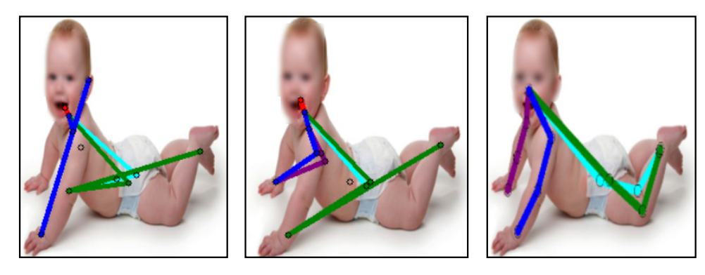
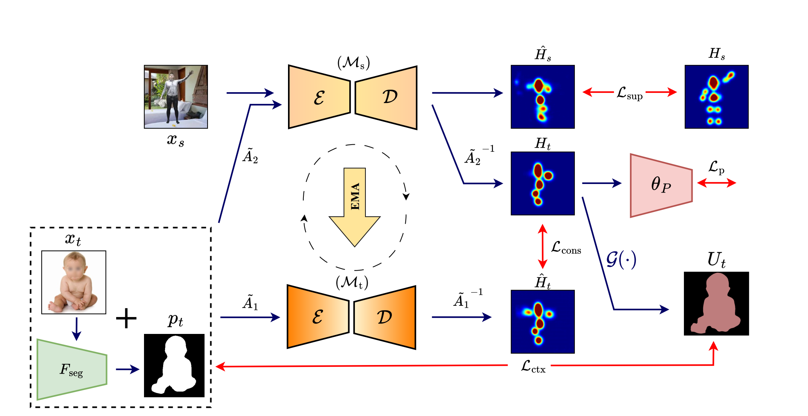

## 利用成人合成数据集进行无监督婴儿姿态估计

**Sarosij Bose、Hannah Dela Cruz、Arindam Dutta、Elena Kokkoni、Konstantinos Karydis、Amit K. Roy‑Chowdhury**
 美国加利福尼亚大学河滨分校
 {sbose007, hdela004, adutt020, elenak}@ucr.edu, {kkarydis, amitrc}@ece.ucr.edu

> **摘要**
>  人体姿态估计是众多医疗应用中的关键工具。尽管针对成人的姿态估计算法取得了显著进展，但针对婴儿的相关发展仍很有限。现有婴儿姿态估计算法在取得不错性能的同时，依赖于需要大量标注数据的全监督方法。该类算法在分布发生偏移时还存在泛化能力差的问题。为了应对这些挑战，我们提出了 **SHIFT：利用成人合成数据集进行无监督婴儿姿态估计**，该方法利用基于伪标签的平均教师框架来弥补标注数据的缺乏，通过在学生模型和教师模型的伪标签之间施加一致性约束来应对分布差异。此外，为了惩罚平均教师框架产生的不合理预测，我们还引入了婴儿姿态流形先验。为了增强 SHIFT 的自遮挡感知能力，我们提出了新的可见性一致性模块，用于改进预测姿态与原始图像之间的对齐。
>  大量实验表明，SHIFT 在多个基准数据集上显著优于现有最新的无监督领域适应（UDA）姿态估计方法约 5%，并且比监督式婴儿姿态估计方法高约 16%。项目页面：sarosijbose.github.io/SHIFT。

------

## 1 引言

为婴儿估计关键点姿态是一项具有挑战性的任务，并在多种生物医学应用中发挥作用。例如，对存在发育障碍风险的婴儿进行神经运动评估、面部表情识别、安全监测，以及为穿戴式辅助机器人设计反馈控制等场景，都需要可靠的姿态估计能力 [25, 27–29, 35, 43, 44, 51]。现有的婴儿姿态估计算法虽能取得不错的性能，但大多依赖**完全监督**的方法，这就需要对大量婴儿图像进行精确标注 [11, 14, 36]。与此同时，==出于**隐私与伦理**方面的考量，加之对婴儿姿态进行逐点标注本身**耗时费力**，构建一个大规模且覆盖面广的婴儿姿态数据集极为困难== [11, 14, 36]。相比之下，关于成人的人体姿态公开数据与算法近年来极为丰富，进展迅速 [1, 3, 4, 7, 10, 16, 17, 30, 31, 33, 37, 41, 45, 47, 49]。这自然引出一个问题：**能否在无监督的前提下，将成熟的成人姿态估计模型迁移到婴儿姿态估计任务上？**

近期的研究尝试把在**合成成人数据**上训练的姿态模型适配到**真实目标域** [8, 12, 13, 20, 24, 26, 32, 46, 50]。然而，当目标域由**婴儿**图像构成时，这条路径面临额外挑战：例如，==**婴儿与成人在解剖结构上的差异** [15]，**动作模式与运动学规律的差异** [22, 38]，以及**婴儿姿态的高多样性**（相较成人更为丰富的姿态变化）等，都可能导致直接迁移失败== [11, 14, 36, 43, 44, 51]。也有工作尝试在合成成人数据上预训练，再在婴儿数据上**监督微调** [14]；但这种做法需要访问带标注的婴儿数据，且在跨数据集的**泛化**上也存在明显不足（见图 1）。

***图1**.无监督域自适应婴儿姿势估计的需要。从左到右，来自基线成人姿势估计模型[20]的关键点预测，来自SOTA UDA姿势估计模型[14]的预测，以及来自我们方法的预测，。成人姿势估计模型在直接应用于婴儿数据时失败;类似地，UniFrame [20]努力克服成人和婴儿之间的域转移。相反，UniFrame考虑了婴儿的高度自遮挡姿势分布，从而有效地适应婴儿域。*

为此，我们提出了一个面向婴儿姿态估计的**无监督领域适应**框架 **SHIFT**。其核心思想是结合**平均教师（mean-teacher）\**范式 [39]：通过对学生模型权重做\**指数移动平均（EMA）**，得到稳定的教师模型，从而为未标注的目标域数据生成**可靠伪标签**，并在此基础上对学生模型进行自监督训练。我们在学生与教师的两路增强视图之间施加**估计空间一致性**约束，以充分利用未标注数据。然而，仅凭一致性仍不足以避免==**物理解剖不合理**的预测==。为此，我们还引入两项关键设计：
 (1) **婴儿姿态流形先验**：受 PoseNDF [40] 启发，我们把**物理可行的婴儿姿态**刻画为一个**零水平集**，并训练一个先验对预测姿态的**可行性**进行评分，从而惩罚**不合理**的估计；
 (2) **姿态-图像一致性模块**：借助预训练的分割网络（DeepLab-v3）[2] 在目标域上**自动提取伪分割掩膜**，再用一个从关键点热图到分割掩膜的**可学习映射（Kp2Seg）**，迫使预测姿态与图像的**可见区域**保持一致，从上下文层面增强对**自遮挡**情形的稳健性。

**本文贡献概括如下：**
 • 我们提出了**SHIFT**，一个将预训练的**成人 2D 姿态**模型迁移到**婴儿**目标域的**无监督领域适应**框架；据我们所知，这是**首个**专门面向婴儿姿态估计的 UDA 方法。
 • 我们引入了一个**婴儿姿态流形先验**以约束解剖合理性，并设计了**姿态-图像一致性**模块，利用**域无关**的分割信号缓解**严重自遮挡**带来的歧义。
 • 在两个具有挑战性的婴儿姿态数据集上（MINI-RGBD 与 SyRIP），我们进行了大量定量与定性实验，并给出消融研究。结果显示，相比最先进的 UDA 方法，SHIFT **平均提升约 5%**，且在**无任何目标域标注**的前提下，仍较一个监督微调的婴儿方法**高出约 16%**。

------

## 2 相关工作

### 2.1 人体姿态估计

人体姿态估计旨在从图像中定位如**头部、肩膀、肘部、膝盖**等解剖关键点 [1, 3, 4, 7, 10, 16, 17, 30, 31, 33, 37, 41, 45, 47, 49]。方法大致分为两类：**自上而下**与**自下而上**。
 **自上而下**方法通常先进行**人体检测**，再在检测框内进行姿态估计，往往能获得更高精度。典型代表是**Hourglass** 体系 [30]，通过堆叠式编码-解码结构回归二维高斯热图，之后又出现了更高分辨率与更强表征能力的改进方法 [3, 37, 47, 49]。
 **自下而上**方法则倾向于**先估计全图关键点**，再通过图模型或分组策略进行**关节关联**与**实例组装** [7, 16, 33, 41, 45]。此类方法常依赖**海量标注**以学习稳健的全局关系，因此在**标注稀缺**或**完全无标注**的目标域中适配会更加困难。

### 2.2 婴儿姿态估计

与成人相比，婴儿在**体型、比例、活动模式**等方面存在显著差异 [15, 22, 38]，这使得直接把成人模型迁移到婴儿数据上面临挑战。为促进该方向发展，研究者构建了若干**婴儿特定**的数据资源与算法：
 ==**MINI-RGBD** 数据集== [11] 通过 SMIL（Skinned Multi-Infant Linear）模型合成 RGB-D 视频序列，提供了==**合成婴儿**的关键点标注==；
 ==**SyRIP** 数据集== [14] 则==同时覆盖**真实与合成**婴儿图像==，并给出**17 个关键点**标注；
 此外，在 2D-to-3D 提升与评估方面也有探索（如 ZEDO-i 等），并出现了面向**婴儿面部与上肢**的专门识别与评估研究 [43, 44]。但需要强调的是，大部分**高性能**方法仍然**依赖标注**，而标注在婴儿场景下既**难以获得**又**成本高昂**。这正是我们考虑**无监督**适配方案的动机所在。

### 2.3 用于姿态估计的无监督领域适应（UDA）

UDA 旨在把在**有标注的源域**上训练的模型，迁移到**无标注的目标域** [12, 20, 24, 26, 32, 46, 50]。典型做法包括基于**对抗训练**的域对齐与基于**教师-学生**的一致性学习。其中，**平均教师**范式（mean-teacher）[39] 通过**EMA**维持一个**稳定的教师模型**，对未标注样本生成**高质量伪标签**；而**输入/输出层面对齐**与**风格迁移**等策略可进一步缓解源-目标分布差异 [12, 13, 20]。在**人体姿态**方向，已有 UDA 方法在**合成→真实**的迁移上取得了显著进展 [18, 20, 24, 26, 32, 46]，但当目标域换作**婴儿**时，由于**解剖差异与遮挡模式**差异加剧，现有方法往往**退化明显**。与之不同，本文的 **SHIFT** 在**估计空间一致性**之外，进一步引入**婴儿姿态流形先验**与**姿态-图像一致性**，从**解剖合理性**与**可见性上下文**两端约束模型，有效提升“成人→婴儿”的无监督适配效果。

------

## 3. 方法论

在源域 $S$ 中，我们有一个带标注的成人姿态数据集 $\mathcal{D}_S=\{(x_s^i,y_s^i)\}_{i=1}^{N_s}$，其中包含 $N_s$ 张图像，$x_s\in\mathbb{R}^{H\times W\times 3}$（$H$ 与 $W$ 分别表示图像的空间尺寸），以及相应的二维关键点真值 $y_s\in\mathbb{R}^{K\times 2}$（$K$ 表示各关键点的坐标数目）。在目标域 $T$ 中，我们有一个未标注的婴儿姿态数据集 $\mathcal{D}_T=\{x_t^i\}_{i=1}^{N_t}$，包含 $N_t$ 张图像，$x_t\in\mathbb{R}^{H\times W\times 3}$。我们在源域 $S$ 上预训练了一个二维姿态估计模型 $\mathcal{M}$，用于预测关键点热图。我们的目标是在未标注的目标域 $T$ 上将该模型 $\mathcal{M}$ 进行适配，使其性能优于未进行适配的源模型。框架的概览见图 2。以下小节中，我们按如下方式描述 SHIFT 的不同组成部分：

- 在 **第 3.1 节**，我们描述姿态估计模型 $\mathcal{M}$ 的预训练方法，以便在源域 $S$ 上提供权重初始化。
- 在 **第 3.2 节**，我们描述在**估计空间**中使用平均教师范式进行的适配过程，并展示其为何不足以捕捉婴儿的解剖与语义信息。
- 在 **第 3.3 节**，我们描述所提出的**流形姿态先验**的工作原理，并概述其设计以捕捉婴儿姿态中精细的解剖细节。
- 在 **第 3.4 节**，我们详细阐述**姿态-图像一致性模块**，并说明其如何通过对齐预测姿态与婴儿分割掩膜之间的可见性来执行适配。

### 3.1 源域预训练

我们采用源域预训练的方法来初始化姿态估计模型 $\mathcal{M}$。遵循 [41]，给定一个转换函数 $\varphi:\mathbb{R}^{K\times 2}\to\mathbb{R}^{K\times H'\times W'}$（其中 $H'$ 与 $W'$ 表示所得热图的空间尺寸），我们生成二维高斯热图。以监督方式进行训练，使用 MSE 损失，即

$\mathcal{L}_{\text{sup}} =\frac{1}{N_s}\sum_{x_s\in\mathcal{D}_S}\bigl\|\varphi(\mathcal{M}(x_s)) - H_s\bigr\|_2. \tag{1}$

### 3.2 估计空间适配

已有研究表明，与仅使用最终模型相比，**权重平均的训练步骤**对于模型训练更为有利（例如 [26]）。因此，类似于平均教师（mean-teacher）[39] 设置，我们拥有一个预训练的**学生模型** $\mathcal{M}_s$ 与一个**教师模型** $\mathcal{M}_t$。在时间步 $t=0$ 时，经过权重初始化的学生模型 $\mathcal{M}_s$ 与教师模型 $\mathcal{M}_t$ 都通过**指数移动平均（EMA）**将学生模型的权重 $\theta_{\mathcal{M}_s}$ 更新到教师模型的权重 $\theta_{\mathcal{M}_t}$，如下：

$\theta_{\mathcal{M}_t}=\alpha\,\theta_{\mathcal{M}_{t-1}}+(1-\alpha)\,\theta_{\mathcal{M}_s}. \tag{2}$

衰减率 $\alpha$ 设为 0.999。这样做是为了在先前参数与最新更新之间平衡教师模型的权重，确保教师模型 $\theta_{\mathcal{M}_t}$ 随着学生模型 $\theta_{\mathcal{M}_s}$ 得到更新，从而防止灾难性遗忘。这种稳定化对于预训练至关重要，因为它通过避免过拟合来提升教师模型为未标注目标数据生成可靠伪标签的能力，从而提高整体训练效果。

我们对输入的目标域图像 $x_t$ 生成两个不同视图：分别对学生模型 $\mathcal{M}_s$ 与教师模型 $\mathcal{M}_t$ 的输入施加增强 $\tilde{A}_1$ 和 $\tilde{A}_2$。类似于 [20]，我们==**选择性地打补丁（patch-out）**==那些教师模型 $\mathcal{M}_t$ 产生最高激活的关键点，用一个打补丁操作 $P$ 表示：

$\hat{x}_t = P\bigl(\tilde{A}_2(x_t)\bigr).$

这有助于==引导学生模型的热图预测 $H_t=\varphi\bigl(\mathcal{M}_s(\hat{x}_t)\bigr)$ 更加聚焦于这些关键点==。我们使用阈值 $\tau_c$ 来过滤不可靠的伪标签。因此，针对学生模型 $\mathcal{M}_s$ 在第 $k$ 个关键点上的学生热图 $\hat{H}_t^k$ 与伪标签 $\hat{x}_t^k$，其学习目标由 MSE 损失定义为

$\mathcal{L}_{\text{cons}} =\frac{1}{N_t'}\sum_{x_t\in\mathcal{D}_T}\sum_{k=0}^{K} \bigl(\hat{H}_t^k\ge\tau_c\bigr)\, \Bigl\|\tilde{A}_1^{-1}\bigl(\hat{H}_t^k\bigr) -\tilde{A}_2^{-1}\bigl(\mathcal{M}_s(\hat{x}_t^k)\bigr)\Bigr\|_2. \tag{3}$

其中，$N_t'$ 指目标（婴儿）域输入图像的批大小，$\tilde{A}_1^{-1}$ 与 $\tilde{A}_2^{-1}$ 分别表示通过教师与学生模型之后的逆增强操作。阈值 $\tau_c$ 用于仅考虑高置信度伪标签并拒绝其余样本。因此，这个损失在教师模型产生的伪标签与学生模型估计的关键点之间施加了一致性约束。

**图 2. 框架总览。** SHIFT 采用平均教师框架 [39]，使用学生模型 $\mathcal{M}_s$ 权重的指数移动平均（EMA）来更新教师模型 $\mathcal{M}_t$，以便将一个在带标注的成人源数据集 $(x_s,y_s)$ 上预训练的模型（第 3.2 节）适配到未标注的婴儿目标图像 $x_t$。为应对婴儿的解剖学差异，SHIFT 使用一个婴儿**姿态先验** $\theta_p$，它会对学生模型 $\mathcal{M}_s$ 的每个预测分配一个**合理性得分**（第 3.3 节）。此外，为了处理目标域中的大量自遮挡，我们使用一个**模型外**的 $F_{\text{seg}}$ 生成伪分割掩膜 $p_t$，并让我们的 **Kp2Seg** 模块 $G(\cdot)$ 学习执行**姿态-图像可见性对齐**（第 3.4 节），从而有效利用每张图像可见部分中存在的上下文信息。框架中所有**可学习**的组件以红色表示，其余以黑色表示。

### 3.3. 婴儿姿态流形先验

仅在学生模型 $M_s$ 与教师模型 $M_t$ 的估计空间中强制一致性，缺乏对目标域不同解剖学要素的感知。为此，我们设计了一个**流形先验**，将所有**物理上可行**的姿态建模为**零水平集**。该先验借鉴了 PoseNDF [40] 的架构，用于基于婴儿姿态的物理可行性生成评分。该模块以**跨数据集**的方式进行离线训练，即先在与评测所用数据集**不同**的数据集上对先验进行预训练。最终得到的姿态先验模块 $(\theta_p)$ 能够针对多样的解剖学变化，评估由学生模型生成的姿态。

为设计**域不敏感**的姿态表示，我们首先在人体骨架中定义一组**解剖学上相连**的关节对。它们以二维**方向向量**的形式表示如下：

$V = (\theta^i_1, \theta^i_2, \ldots, \theta^i_L),\ \ \theta_l \in \mathbb{R}^2. \tag{4}$

利用**流形假设** [5]，我们假设所有物理上可行的婴儿姿态可以位于由**零水平集**定义的流形上

$P = \{\theta \in V \mid p(\theta) = 0\},$

其中 $l$ 给出了某个姿态可能位于距离该流形多远的位置。我们使用一个编码函数 $p_{\text{enc}}$ 来存储这一串联的单个姿态方向编码。每个编码可写为

$v_1 = p^{1}_{\text{enc}}(\theta_1),\quad  v_i = p^{l}_{\text{enc}}(\theta_l, v_f),\ \ l \in \{2,\ldots,L\}, \tag{5}$

而整体的姿态编码表示为

$p = [\,v_1 \mid \cdots \mid v_L\,]. \tag{6}$

遵循 [40]，我们据此构造了一份**先验数据集**（供先验模型 $\theta_p$ 训练使用）的“姿态编码—距离”对：

$D_{pd} = \{(\theta^i, l_i)\}^{N_t}_{i=1}.$

位于流形上的所有姿态被赋值为 $l=0$。这些生成的姿态编码**不与 RGB 图像配对**，从而节省存储（无需保存配对的 RGB–Pose 信息），并且具有**域无关性**。随后我们采用**多阶段**训练方法以确保先验的鲁棒性（见第 4.1 节）。我们通过从 **von Mises 分布** [6] 采样噪声来生成**噪声姿态**。给定第 $i$ 个目标域图像 $x^i_t$，我们获得热图

$H^i_t = \phi(M_s(x^i_t)),$

并由目标域中获得的热图 $H^i_t$ 的像素坐标计算一组**归一化方向向量**。这些归一化方向向量针对 $D_{pd}$ 中每一对解剖学相连的关键点进行计算。因此，对于给定的一对相连关键点 $(m,n)$，我们得到从初始像素坐标 $p_m$ 指向 $p_n$ 的**单位向量** $\theta$，表示为

$\theta_{(m,n)} = \frac{p_m - p_n}{\lVert p_m - p_n\rVert_2},\ \ \forall (m,n)\in V. \tag{7}$

**借助姿态先验进行适配。\**在适配过程中，我们利用该已训练的先验来预测一个\**平均可行性评分**，该评分基于学生模型的预测姿态与可行姿态流形之间的**距离**。我们可以将先验 $(\theta_p)$ 的目标设定为预测“学生模型的预测姿态与我们**预学习**的流形上可行姿态集合之间的距离 $l$”。其形式为

$L_p = \frac{1}{N'_t}\sum_{x_t\in D_t}\theta_p\!\big(T(M_s(x_t))\big), \tag{8}$

其中 $N'_t$ 表示目标域图像的批大小，$T$ 是一个**可微的方向变换函数**，用于把学生模型的预测转换为一组方向向量；先验随后据此给出**平均可行性评分**。 

### 3.4 上下文感知适配

大多数婴儿姿态数据集都面临**高度自遮挡**的问题，例如当婴儿处于侧卧位姿时更为明显。为了解决这个问题，并进一步提升我们框架在目标域中处理自遮挡的能力，我们首先使用 **DeepLab-v3** [2] 从目标域 $T$ 中**提取二值的前景-背景分割掩膜**。我们将该**预提取的伪掩膜集合**记为 $\mathcal{D}_{\text{seg}}=\{p_t^i\}_{i=1}^{N_t}$，其中 $N_t$ 是目标数据集 $\mathcal{D}_T$ 中图像的数目。

在学生模型的**估计空间**中，我们引入一个**分割编码器模块** $G$，作为一个映射函数，将学生模型的预测热图 $\hat{H}_s$ 转换为分割掩膜 $U$。这是一个**非平凡**的操作，因为它需要把表示关键点的**稀疏、低分辨率**热图，映射为**稠密的、高分辨率**分割图。我们使用 **DC-GAN** [34] 架构中的**解码器**，作为一个**学习到的映射函数**，把热图预测转换为分割掩膜。为了训练 $G$，我们准备了一个**合成的辅助集合**，它由真实姿态与分割掩膜组成，记为

$\mathcal{D}_{\text{aux}}=\{(g_s^i,p_s^i)\}_{i=1}^{N_s},$

其中 $g_s^i$ 与 $p_s^i$ 分别是第 $i$ 个样本的姿态与从辅助集合中**预提取**的分割掩膜。随后，我们以端到端监督的方式训练 $G$，使其从辅助集合的关键点映射到分割掩膜。具体地，可以将其表述为一个监督目标：在预提取的分割掩膜 $p_s$ 与通过 $u_s=G(\varphi(g_s))$ 获得的映射分割掩膜之间，使用**交叉熵损失**，

$\mathcal{L}_{G} =\frac{1}{N_s}\sum_{i=1}^{N_s}\sum_{j=1}^{H''\times W''} \bigl(-\,p_{s,j}^i\log(u_{s,j}^i)\bigr), \tag{10}$

其中 $N_s$ 表示源图像的批大小。**注意**，我们在适配过程中以及离线训练中**均不使用真值分割掩膜**；同时，在训练 $G$ 的过程中也**不使用任何 RGB 信息**，因此它是**域无关的（domain-agnostic）**。

在学生模型与伪分割之间的**自监督一致性**目标，可用交叉熵损失写成

$\mathcal{L}_{\text{ctx}} =\frac{1}{N_t'}\sum_{i=1}^{N_t'}\sum_{j=1}^{H''\times W''} \bigl(-\,p_j^i\log(U_{t,j}^i)\bigr), \tag{9}$

其中 $N_t'$ 是目标域图像的批大小；$p_j^i$ 是第 $i$ 个预提取伪掩膜在像素 $j$ 处的二值标签（0 或 1）；$U_{t,j}^i$ 是在像素 $j$ 处的预测概率。

### 3.5 总体适配

将上述所有损失组合起来，我们用**加权适配目标**来训练学生模型 $\mathcal{M}_s$：

$\mathcal{L}_{\text{total}} =\mathcal{L}_{\text{sup}} +\lambda_{\text{cons}}\mathcal{L}_{\text{cons}} +\lambda_{p}\mathcal{L}_{p} +\lambda_{\text{ctx}}\mathcal{L}_{\text{ctx}}. \tag{11}$

超参数 $\lambda_{\text{cons}}$ 依照 [20] 设为 1；$\lambda_{p}=10^{-6}$ 依照 [40] 设定，$\lambda_{\text{ctx}}=10^{-5}$。

------

## 4. 评估与结果

在本节中，我们在**没有**真值标注的情况下，通过对目标域的全面评估来展示 SHIFT 的有效性。我们提供了大量**定量**与**定性**结果，以凸显我们框架的优势与局限。此外，我们还进行了消融研究，以评估**各损失项**的作用、对**伪标签阈值**选择的敏感性，以及**各个模块**对整体框架的贡献。

**数据集。** 本文使用以下数据集：
 • **SURREAL** [42]：一个大规模的合成数据集，包含**超过 600 万**张带有**25 个关节**标注的人体图像。SURREAL 由室内环境中的三维人体运动序列生成，具有多样的姿态与视角。
 • **MINI-RGBD** [11]：包含 **12,000** 张合成婴儿图像，并标注 **25 个关节**。遵循标准的训练与评估设置，我们在分割 ‘01’ 至 ‘10’ 上训练，并在分割 ‘11’ 与 ‘12’ 上验证。
 • **SyRIP** [14]：包含 **1,000** 张合成与 **700** 张真实婴儿图像，对 **17 个关节**进行标注。我们在由 **1,200** 个真实与合成样本构成的训练划分上训练，并在包含 **500** 张真实图像的测试划分上评估。

### 4.1 实现细节

**基模型训练。** 依照 [47] 的方法，我们采用 ResNet-101 [10] 作为骨干姿态估计模型。我们首先在源数据集上预训练 **40** 个 epoch，随后在目标域进行 **30** 个 epoch 的适配。初始学习率设为 **1e-4**，并在第 **5** 与 **20** 个 epoch 之后以 **0.1** 的倍率进行多步衰减。所有实验中批大小为 **32**，优化器为 Adam [21]。为与 FiDIP [14] 进行比较，我们以合成到真实的领域适配方式**重新训练**其模型，并将其骨干替换为 ResNet-101 [47]。关于不同**伪标签阈值**对性能的影响，我们在第 **4.4** 节中作了详尽讨论。

**基线与度量。** 我们将所提方法与 UDA 框架 **RegDA** [18] 与 **UniFrame** [20]，以及执行从合成到真实的**监督领域适配**的 **FiDIP** [14] 进行比较。为确保公平比较，我们将这些模型**统一**在 ResNet-101 [47] 架构上重新训练，使其在所有情形下均作为骨干网络。为更全面的基线表示，我们还考虑两个附加基线：**Oracle**（在目标〔婴儿〕域上**完全监督**训练得到的上界）与 **Source-Only**（在目标域上对**未适配**的源模型直接推理得到的下界）。按照既往工作 [18,20]，我们在全部评估中采用 **PCK（Percentage of Correct Keypoints）** 度量，它衡量在**指定距离**内被检测到的关键点占真值关键点的百分比。此后报告的**所有精度**均使用 **16** 个关键点上的 **PCK@0.05** 指标。

### 4.2 定量结果

我们在两种“成人→婴儿”的 UDA 场景下评估 SHIFT：**SURREAL [42] → MINI-RGBD [11]** 与 **SURREAL [42] → SyRIP [14]**；同时将我们的方法与最先进的 UDA 方法 **[18,20]** 对比。另外，我们还进行了 **SyRIP → MINI-RGBD** 的**无监督**评估，以与 **FiDIP** [14] 进行比较；FiDIP 在对婴儿姿态进行微调时引入了一个**域分类器**来区分真实与合成图像。结果分别汇总于**表 1**、**表 2** 与**表 3**（文中亦称表 8）。在这些方法中，**SHIFT 在所有情形下取得了最高性能**，相较 **UniFrame** [20] 与 **RegDA** [18] 分别**约高 5%\**与\**超过 30%**。在婴儿的 **16** 个单独关键点（包括肩〔sld.〕、肘〔elb.〕、腕、髋、膝、踝）上，除了在 **MINI-RGBD** 的**踝**与 **SyRIP** 的**头与肩**之外，SHIFT 在所有类别中均表现更优。值得注意的是，尽管 **FiDIP** 在**同一数据集（SyRIP）\**内以\**完全监督**方式进行微调，我们的框架**未使用任何标注**也能**超越**其方法。

这些结果强调了在存在**显著域间差距**的情形下，仅仅学习**判别性特征**或执行**预测空间对齐**的局限性。SHIFT 通过在目标域中**整合婴儿姿态先验**与 **Kp2Seg** 模块，从**解剖**与**上下文**线索两方面有效弥合了这一差距——这两者都可以**离线**直接训练。由此构成的**综合方案**确保了稳健的“成人→婴儿”适配。

**表 1.** **SURREAL [42] → MINI-RGBD [11]** 的 **PCK@0.05** 定量结果。最佳精度以红色高亮，次佳以蓝色高亮。（原文表题与数值如下）

| Algorithm     | Head       | Sld.      | Elb.      | Wrist     | Hip       | Knee      | Ankle     | Avg.      |
| ------------- | ---------- | --------- | --------- | --------- | --------- | --------- | --------- | --------- |
| Source only   | 99.50      | 04.10     | 06.10     | 11.50     | 69.60     | 11.50     | 75.20     | 47.40     |
| Oracle        | 100.00     | 99.70     | 97.40     | 75.00     | 92.60     | 86.10     | 84.30     | 89.20     |
| RegDA [18]    | 90.80      | 15.10     | 24.50     | 26.90     | 73.80     | 24.60     | 62.10     | 37.80     |
| UniFrame [20] | 100.00     | 05.00     | 54.30     | 42.70     | 96.50     | 32.20     | 75.40     | 51.50     |
| **SHIFT**     | **100.00** | **14.90** | **68.80** | **45.20** | **96.50** | **40.60** | **72.70** | **56.40** |

**表 2.** **SURREAL [42] → SyRIP [14]** 的 **PCK@0.05** 定量结果。最佳精度以红色高亮，次佳以蓝色高亮。（原文表题与数值如下）

| Algorithm     | Head  | Sld.  | Elb.      | Wrist     | Hip       | Knee      | Ankle     | Avg.      |
| ------------- | ----- | ----- | --------- | --------- | --------- | --------- | --------- | --------- |
| Source only   | 52.40 | 35.60 | 23.50     | 27.10     | 32.90     | 14.20     | 24.70     | 26.30     |
| Oracle        | 89.40 | 82.10 | 65.70     | 66.10     | 64.10     | 50.70     | 54.50     | 63.80     |
| RegDA [18]    | 48.60 | 27.90 | 16.00     | 19.00     | 12.00     | 11.90     | 14.40     | 16.90     |
| UniFrame [20] | 54.40 | 47.50 | 13.50     | 31.10     | 50.60     | 26.00     | 36.50     | 34.20     |
| **SHIFT**     | 53.40 | 46.10 | **34.20** | **38.70** | **51.10** | **31.20** | **37.60** | **39.80** |

**表 3.** **SyRIP [14] → MINI-RGBD [11]** 的 **PCK@0.05** 定量结果。最佳精度以红色高亮，次佳以蓝色高亮。（原文表题与数值如下）

| Algorithm  | Unsup | Head      | Sld.      | Elb.      | Wrist     | Hip       | Knee      | Ankle     | Avg.      |
| ---------- | ----- | --------- | --------- | --------- | --------- | --------- | --------- | --------- | --------- |
| Oracle     | -     | 100.00    | 99.70     | 97.40     | 75.00     | 92.60     | 86.10     | 84.30     | 89.20     |
| FiDIP [14] | ✗     | 24.80     | 54.10     | 88.30     | **83.60** | 19.50     | **88.40** | **74.60** | 68.10     |
| **SHIFT**  | ✓     | **32.80** | **99.00** | **98.90** | 70.20     | **60.70** | 87.70     | 87.10     | **84.10** |

### 4.3 定性结果

我们还在**图 3**中给出了从 **SURREAL → MINI-RGBD** 与 **SURREAL → SyRIP** 适配所得的一些具代表性的定性结果；此外，我们在**图 4**中展示了 SHIFT 如何**有效处理遮挡**。在图 3 中，我们展示了 SHIFT 在各种情形下**捕获合理婴儿姿态**并对**被遮挡区域**进行推理的能力。现有方法在图 3 的**第一行**显然**缺乏**对婴儿解剖学的理解，而我们的方法能够**合理**预测关键点；同时在图 3 的**第二、第三行**中，**UniFrame** 未能正确预测婴儿**肘部与手腕**附近的关键点，而 **SHIFT** 可以做到。此外，在**图 4**中，尽管存在**严重的自遮挡**，SHIFT 仍能对婴儿的**下背部**与**左手**进行**合理估计**。在所有这些情形下，可以清楚地看出，我们的框架 SHIFT **无需任何标注**，即可以**数据高效**的方式顺畅地执行“成人→婴儿”的领域适配。

**图 3.** **SURREAL → SyRIP**（**上 3 行**）与 **SURREAL → MINI-RGBD**（**下 2 行**）的定性结果。自左至右依次为：**仅源模型**关键点、**UniFrame** 的关键点预测、**FiDIP** 的预测、**SHIFT** 的预测、以及**真值**关键点。如图所示，在**其他方法失败**的情况下（顶行），**婴儿先验**对于预测**可信**姿态至关重要。此外，我们的方法能够**利用可见区域**中的上下文信息在**自遮挡区域**预测关键点（第 2、3 行），并在**不同场景**中无缝适配（第 4、5 行）。图中“⃝”标记图像中的**自遮挡**区域。

**图 4.** **应对自遮挡：SURREAL → SyRIP。** **UniFrame** 的预测（左面板）未能正确估计婴儿**下背部**与**左手**的大面积区域，而 **SHIFT** 则能够**合理**做到。图中还展示了**真值**（最右面板）与**提取的掩膜**（自左数第二个面板）。

### 4.4 消融研究

**损失项的影响。** 我们进行了严格分析，以评估流水线中**各模块**以及适配目标中**各损失项**如何影响整体性能。**表 4** 的结果表明：引入**婴儿姿态先验**与 **Kp2Seg** 模块可以**显著提高**整体性能。更多消融结果见补充材料。

**表 4.** 我们在 **SURREAL [42] → MINI-RGBD [11]** 情形下分析各损失项与模块的影响（PCK@0.05）。原文表格如下：

| Module       | Lsup | Lcons | Lp   | Lctx | PCK@0.05  |
| ------------ | ---- | ----- | ---- | ---- | --------- |
| Pre-Training | ✓    | ✗     | ✗    | ✗    | 47.40     |
| UDA [20]     | ✓    | ✓     | ✗    | ✗    | 51.50     |
| UDA + Prior  | ✓    | ✓     | ✓    | ✗    | 53.60     |
| **SHIFT**    | ✓    | ✓     | ✓    | ✓    | **56.40** |

**伪标签阈值（$\tau_c$）的影响。** 最后，我们研究伪标签阈值对框架的影响。**表 5** 所列的结果表明：无论阈值**过低或过高**，都会对适配过程产生**负面影响**。这可归因于：阈值过低会**降低**伪标签质量，而阈值过高会**过滤掉**大多数伪标签。

**表 5.** 我们分析不同 $\tau_c$ 取值对性能（PCK@0.05）的影响。源数据集为 **SURREAL [42]**。

| $\tau_c$           | 0.1   | 0.3   | 0.5       | 0.7   | 0.9   |
| ------------------ | ----- | ----- | --------- | ----- | ----- |
| **SyRIP [14]**     | 35.00 | 39.00 | **39.80** | 37.50 | 35.10 |
| **MINI-RGBD [11]** | 53.00 | 53.70 | **56.40** | 54.10 | 53.50 |

------

## 5 结论

本文提出了无监督婴儿姿态估计框架 SHIFT。与现有方法不同，SHIFT 不需要耗时昂贵的标注数据。它利用平均教师框架生成可靠伪标签，结合婴儿姿态流形先验提供解剖正则化，以及姿态‑图像一致性模块提供上下文指导。大量实验证明该方法在挑战性的婴儿数据集上显著优于现有最先进方法。

------

## 6 训练细节与额外结果

我们还提供关于先验训练方式和进一步实验的讨论。例如，通过比较直接在目标无关的数据集上训练先验与先在源域预训练再微调两种方式，我们发现前者更优。对于 SyRIP→MINI‑RGBD 的无监督适配，我们的 SHIFT 同样显著优于监督方法 FiDIP。

**表 6.** SHIFT 在不同先验训练方案下与 FiDIP 的比较（SURREAL→MINI‑RGBD）。

**表 7.** SHIFT 在不同先验训练方案下与 FiDIP 的比较（SURREAL→SyRIP）。

**表 8.** SyRIP→MINI‑RGBD 的 PCK@0.05 结果。SHIFT 在无监督设置下，在各关节和平均 PCK 指标上都超越 FiDIP。

**表 9.** 在 SyRIP 数据集上的消融结果表明，Kp2Seg 模块在处理自遮挡时发挥关键作用。

------

## 7 参考文献

文末列出了 51 条参考文献。为了节省篇幅，此处不再逐条翻译。有关详细文献，请参阅原文。

------

总之，本文全面介绍了 SHIFT 框架，包括其设计动机、理论基础、实现细节、实验评估以及与现有方法的比较。SHIFT 通过结合平均教师伪标签、婴儿流形姿态先验和姿态‑图像一致性模块，在无需标注的情况下显著提升婴儿姿态估计性能。