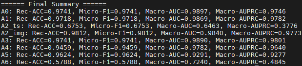
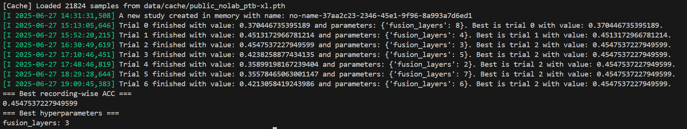

|                    |   ACC    | F1 Score |   AUC    |  AUPRC   |
| ------------------ | :------: | :------: | :------: | :------: |
| A0                 | 0.988208 | 0.975369 | 0.992206 | 0.990043 |
| A1(w/o Laboratory) | 0.945755 | 0.895928 | 0.989922 | 0.983534 |
| A2_ts(w/o IMG)     |  0.6753  |  0.6232  |  0.6463  |  0.3948  |
| A2_img(w/o TS)     | 0.90566  | 0.823009 | 0.974333 | 0.940833 |
| A3(w/o Contrast)   | 0.964623 | 0.921466 | 0.984124 | 0.986163 |
| A4(w/o Shared)     |  0.9459  |  0.9082  |  0.9682  |  0.9540  |
| A5(Late-Concat)    | 0.851415 | 0.762264 | 0.926225 | 0.894192 |
| A6(All-Shared)     | 0.509434 | 0.485149 | 0.760188 | 0.547737 |

shaoxing

ningbo

ptb

sdu-sh

