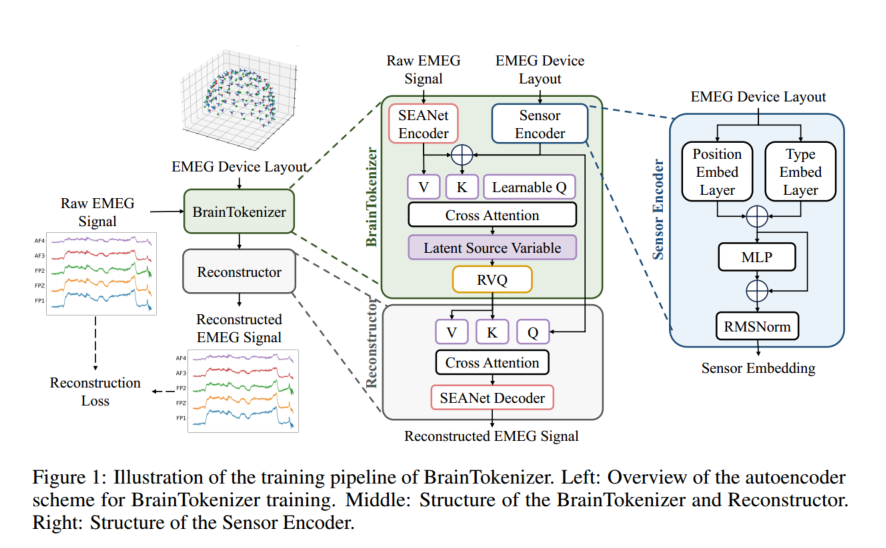
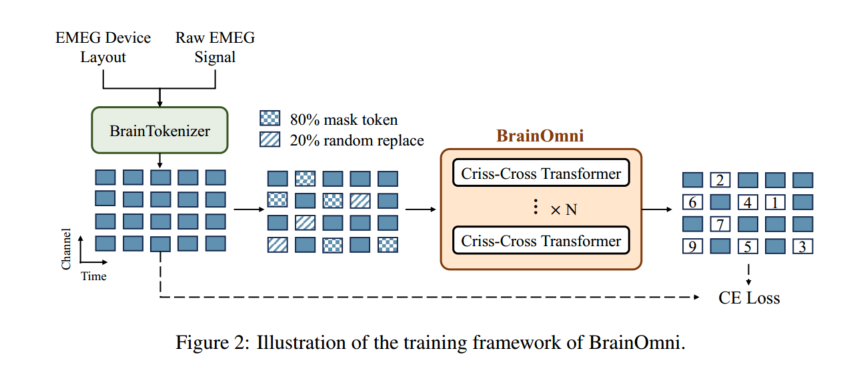

### BrainOmni：一种用于统一 EEG 和 MEG 信号的大脑基座模型

作者：

Qinfan Xiao$^{1,2*}$ , Ziyun Cui$^{1,2*}$ , Chi Zhang$^{1,2}$, Siqi Chen$^2$, Wen Wu$^1$, Andrew Thwaites$^{3,4}$, Alexandra Woolgar$^{3,5}$, Bowen Zhou$^{1,2}$, Chao Zhang$^{2,1,4\dagger}$

**单位**：

1. 上海人工智能实验室，中国

2. 清华大学电子工程系，中国

3. 剑桥大学心理学系，英国

4. 伦敦大学学院言语听觉与语音科学系，英国

5. 剑桥大学医学研究委员会认知与脑科学部，英国

   1

**邮箱**：{xiaoqf22, cui-zy24}@mails.tsinghua.edu.cn, cz277@tsinghua.edu.cn

#### 摘要 (Abstract)

脑电图（EEG）和脑磁图（MEG）通过捕捉由树突电流产生的电磁场，以无创方式测量神经活动 2。尽管植根于相同的生物物理学基础，EEG 和 MEG 表现出不同的信号模式，并且由于模态和记录设备之间传感器配置的差异，情况变得更加复杂 3。现有方法通常依赖于独立的、特定于模态和数据集的模型，这限制了性能和跨域的可扩展性 4。本文提出了 BrainOmni，这是第一个能够==泛化异构 EEG 和 MEG 记录的大脑基座模型== 5。为了统一多样化的数据源，我们引入了 BrainTokenizer，这是第一个将时空大脑活动量化为离散表示的分词器 6。BrainTokenizer 的核心是一个新颖的==传感器编码器（Sensor Encoder）==，它对传感器的属性（如空间布局、方向和类型）进行编码，从而实现跨设备和模态的兼容性 7。基于这些离散表示，BrainOmni 通过自监督预训练学习大脑信号的统一语义嵌入 8。据我们所知，这是第一个==同时支持 EEG 和 MEG 信号的基座模型==，也是第一个包含大规模 MEG 预训练的模型 9。我们从公开来源整理并标准化了总计 1,997 小时的 EEG 和 656 小时的 MEG 数据用于预训练 10。实验表明，BrainOmni 在一系列下游任务上的表现优于现有的基座模型和最先进的任务特定模型 11。它还展示了对未见过的 EEG 和 MEG 设备的强大泛化能力 12。进一步的分析表明，EEG-MEG 联合（EMEG）训练在两种模态上均产生了一致的改进 13。代码和检查点可在 https://github.com/OpenTSLab/BrainOmni 公开获取 14。

#### 1. 引言 (Introduction)

神经元活动是人类大脑功能的基础。这种活动在皮层中产生电流，进而产生次级电场和磁场 15。这些场可以使用无创技术间接测量，例如脑电图（EEG）和脑磁图（MEG）16。EEG 通过放置在头皮上的电极测量电位，而 MEG 使用梯度计或磁力计测量头部外部特定位置和方向的磁场 17。作为==具有高时间分辨率的丰富神经活动来源==，EEG 和 MEG 已广泛应用于运动想象 [59]、情绪识别 [20]、多模态神经解码 [39, 14, 7] 和临床评估 [34, 88, 46, 69] 等应用中 18。

然而，这些应用中的大多数是针对每个领域单独开发的，通常针对特定的任务、数据集或记录设置 [71, 86, 34, 26, 22] 19。这种专门化的模型受限于有限的泛化能力以及跨任务和领域的可扩展性差 20。最近，EEG 基座模型已经出现，旨在通过从大规模数据中学习通用的神经表示来解决这些限制 [84, 33, 78] 21。尽管 ==MEG 信号提供的空间分辨率显著高于 EEG==，但针对 MEG 的基座模型在很大程度上仍未被探索，这可能是由于该模态的复杂性和有限的数据可用性 22。

值得注意的是，EEG 和 MEG 共享一个共同的生物物理起源，都是通过捕捉树突电流产生的电磁场来记录神经活动 23。这一共同的基础提出了一个引人注目的问题：我们能否开发一个统一的模型，从 EEG 和 MEG 数据中学习，以实现跨模态的泛化并增强各自的性能？24

本文提出了 BrainOmni，这是第一个用于统一 EEG 和 MEG 信号的基座模型 25。BrainOmni 的训练包括两个阶段：(i) 将异构数据统一到相同的特征空间中；(ii) 捕捉大脑活动的语义特征 26。在第一阶段，我们引入了 BrainTokenizer 27。受源活动估计（source activity estimation）[1] 的启发，BrainTokenizer 学习从观测到的 EEG/MEG 信号中推断大脑活动的时空模式，并生成量化的离散 token 28。为了解决设备异构性问题，我们提出了一个新颖的传感器编码器（Sensor Encoder），它利用每个传感器的物理特性，如空间坐标、方向和类型，而不是仅仅依赖于在不同设备和数据集中通常不一致的通道命名约定 29。这种设计使 BrainTokenizer 能够处理任意的 EEG/MEG 信号输入，为大规模联合预训练奠定了基础 30。通过整合 EEG/MEG 信号与传感器元数据，BrainTokenizer 推断出一组潜在源变量，这些变量代表了跨不同传感器配置的脑电图和脑磁图测量背后的主要生成因素，从而将异构数据统一到一个通用的特征空间中以进行下游建模 31。

基于 BrainTokenizer 产生的离散大脑表示，BrainOmni 在第二阶段通过自监督预训练学习神经活动的丰富语义表示 32。为了支持这一点，我们整理并标准化了一个大规模数据集，包含 1,997 小时的 EEG 和 656 小时的 MEG 记录 33。实验结果表明 BrainOmni：(i) 在一系列下游任务中优于现有方法 34；(ii) 有效地泛化到以前未见过的 EEG 和 MEG 设备；以及 (iii) 这种跨模态的一致性受益于 EEG-MEG 联合（EMEG）训练 35。

我们的主要贡献如下：

- **联合 EMEG 预训练**：据我们所知，BrainOmni 是第一个对 EEG 和 MEG 信号进行统一预训练的单一模型 36。
- **跨设备的物理异构性建模**：为了解决 EEG 和 MEG 记录设备的异构性，我们提出了一个新颖的传感器编码器，它独立于电极命名约定或固定拓扑结构运行，实现了跨设备和信号模态的兼容性 37。
- **时空大脑信号量化**：据我们所知，BrainTokenizer 是第一个能够对大脑信号进行时空量化的模型 38。

------

#### 2. 方法 (Method)

BrainOmni 包含两个训练阶段。在第一阶段，开发 BrainTokenizer 以将异构的 EMEG 信号离散化为语义丰富的表示 1。在第二阶段，BrainOmni 模型基于 BrainTokenizer 的输出进行训练，采用掩码 token 预测框架，利用更长的连续样本来捕捉扩展的时间依赖关系 2。

##### 2.1 EMEG 信号 (EMEG Signals)

EEG 通过放置在头皮上的电极测量电位，而 MEG 使用梯度计（GRAD）或磁力计（MAG）传感器测量头部外部特定位置和方向的磁场 3。测量到的 EMEG 信号是多通道时间序列数据，可以表示为 $X \in \mathbb{R}^{C \times T}$，其中 $C$ 表示传感器通道的数量，$T$ 表示采样点的数量 4。考虑到传感器类型、位置和方向，一个 EMEG 样本可以表示为 $\Omega = (X, L, S)$，其中 $X$ 是原始信号，$L \in \mathbb{R}^{C \times 6}$ 是笛卡尔坐标系中==每个传感器的物理位置和方向信息== 5，而 $S = \{s_1, s_2, \dots, s_c | s_i \in \{0 (\text{EEG}), 1 (\text{GRAD}), 2 (\text{MAG})\}\}$ 是每个传感器的类型 6。

##### 2.2 BrainTokenizer

第一阶段的整体流程如图 1 所示。BrainTokenizer 使用==掩码自编码器方案== [15] 进行训练，它将 EMEG 样本量化为代表潜在特征的紧凑离散 token，而==重构器模块==从这些 token 中恢复原始 EMEG 信号 7。第一阶段使用原始信号和重构信号之间的重构损失进行训练，这使得 BrainTokenizer 能够生成量化的潜在表示，有效地捕捉原始 EMEG 信号和设备布局的时空特征 8。

BrainTokenizer 由一个 ==SEANet 编码器== [74] 和一个新颖的传感器编码器组成，前者从 EMEG 信号中==提取时间表示==，后者将传感器物理信息编码为传感器嵌入 9。然后，时间表示和传感器嵌入通过一个专门的==交叉注意力==（Cross-Attention）模块进行融合，随后通过残差矢量量化（RVQ）[91] 进行量化 10。

**SEANet 编码器 (SEANet Encoder)**。使用 SEANet 编码器 [74] 从 EMEG 信号的时间维度中提取高效且紧凑的表示，这是一个卷积时间编码器，具有多层堆叠的残差一维（1-dim）卷积块和步幅卷积层 11。它将原始数据 $X$ 编码为时间表示 $Z_{time} \in \mathbb{R}^{C \times W \times D}$，其中 $W$ 代表潜在步长，$D$ 代表特征维度 12。

**传感器编码器 (Sensor Encoder)**。为了处理来自不同 EMEG 设备的输入，我们提出了一个新颖的传感器编码器来支持可学习的传感器位置编码，它分层融合物理先验与学习到的表示 13。如图 1 所示，传感器编码器包含一个位置嵌入层来编码传感器位置和传感器方向的三维笛卡尔坐标 $L \in \mathbb{R}^{C \times 6}$，以及一个类型嵌入层来编码传感器类型 $S = \{s_1, s_2, \dots, s_c | s_i \in \{0, 1, 2\}\}$ 14。传感器物理信息 $L$ 和 $S$ 随后被整合以生成传感器嵌入 $V \in \mathbb{R}^{C \times D}$ 15。

**量化 (Quantisation)**。潜在特征 $Z_{src}$ 通过一个 4 层 RVQ 模块离散化为离散 token $Q \in \mathbb{R}^{C' \times W \times 4}$，该 token 用于在第二阶段训练 BrainOmni 模型 16。

**重构器 (Reconstructor)**。在重构器中，离散 token 首先由 RVQ 解码器解码为 $\hat{Z}_{src}$ 17。开发了另一个交叉注意力模块，将量化的潜在源变量转换为连续的通道级时间表示 $\hat{Z}_{time}$，随后通过 SEANet 解码器重构 $\hat{X}$，这是编码器的逆镜像，使用转置卷积 18。值得注意的是，BrainTokenizer 和重构器分别对应于传统 EEG/MEG 源电流活动估计中的逆向解（backward solution）和正向解（forward solution）；详细解释见附录 B 19。

训练 BrainTokenizer (Training the BrainTokenizer)。BrainTokenizer 遵循自编码器方案进行训练，其中 25% 的输入通道被随机丢弃，重构器需要从离散 token 中重构所有原始通道 20。整体训练损失结合了多级重构损失与 RVQ 承诺损失（commitment losses），实现了网络和码本的联合优化 21。多级重构损失包括 (i) 原始波形 $X$ 和重构波形 $\hat{X}$ 之间的时域损失：

$$L_{rvq} = \sum_{i=1}^{N_q} ||z_i - z_{q_i}||^2, \quad (4)$$

其中 $N_q$ 是码本的深度 22。BrainTokenizer 训练优化的损失如下：

$$L_{token} = L_{time} + L_{freq} + L_{pcc} + L_{rvq}. \quad (5)$$

##### 2.3 BrainOmni

建立在第一阶段 BrainTokenizer 的基础之上，BrainOmni 模型采用掩码 token 预测框架进行训练，以联合建模空间和时间信息，从而学习大脑活动的连贯时空表示 23。BrainOmni 的训练框架如图 2 所示。BrainTokenizer 将连续的 EMEG 记录编码为形状为 $(C', T, N_q)$ 的 token 序列，其中 $C'$ 是压缩后的通道数，$T$ 是序列长度 24，而 $N_q$ 是码本深度，在我们的实现中设置为 4 25。Token 以预定义的比例随机掩码，随后通过嵌入层投影为形状为 $(C', T, D)$ 的表示。这些嵌入随后由多层纵横 Transformer（Criss-Cross Transformer）[78] 处理，以联合建模空间和时间依赖关系 26。最后，来自 Transformer 块的输出表示用于预测被掩码的 token 27。

**纵横 Transformer (Criss-Cross Transformer)**。BrainOmni 模型由多个==纵横 Transformer 块== [78] 组成 28。鉴于 EMEG 数据的多通道时间序列性质，联合建模空间和时间上下文至关重要 29。纵横 Transformer 将输入沿特征维度分成两半：一半用于空间注意力计算，另一半用于时间注意力计算 30。这两半随后被拼接并通过前馈层 31。此外，旋转位置嵌入（RoPE）[72] 专门应用于时间注意力，以沿时间维度编码位置信息 32。

训练 BrainOmni 模型 (Training the BrainOmni Model)。在 BrainOmni 训练期间，$(C', T)$ token 网格中 50% 的位置被随机掩码 33。对于每个被掩码的位置，所有四个 RVQ 层都被掩码，并以非自回归方式同时进行预测 34。为了防止过度依赖特殊的掩码 token，80% 的被掩码位置被替换为专用的掩码 token，而其余 20% 被替换为从序列中随机采样的 token 35。模型训练损失为：

$$L_{model} = \frac{1}{M} \sum_{i=1}^{M} \sum_{j=1}^{N_q} L_{ce}(q_{ij}, y_{ij}), \quad (6)$$

其中 $q_{ij}$ 是 token $i$ 在第 $j$ 个 RVQ 层的真实码本索引，$y_{ij}$ 是相应的模型预测，$M$ 表示被掩码 token 的数量，$L_{ce}(\cdot, \cdot)$ 是交叉熵损失 36。

------

#### 3. 实验设置 (Experimental Setup)

##### 3.1 预训练 (Pretraining)

**预训练数据集**。使用从开源数据集收集的 1997 小时 EEG 数据和 656 小时 MEG 数据进行预训练（详见附录 H），包括通道数范围为 19 到 128 的 EEG 设备和通道数范围为 157 到 306 的 MEG 设备 1。其中，85% 的数据用于训练，10% 的数据用于验证，5% 的数据用于测试 2。此外，一个 EEG 数据集和一个 MEG 数据集（均使用与训练数据中不同的独特设备系统采集）被排除在训练数据之外，以评估模型的跨设备泛化能力 3。

**数据预处理**。应用了最小化和标准化的预处理以最大化数据利用率 4。首先应用 0.1Hz-96 Hz 带通滤波器和 50/60 陷波滤波器以去除缓慢漂移和电源线噪声，对于 MEG 记录，带有 HPI 线圈的信号在其特定频率处进行了额外过滤 5。

**表 1：下游数据集概览**。时长以秒为单位 6。

| **模态**                                         | **任务**     | **数据集** | **受试者数** | **通道数** | **时长** | **片段数** | **类别数** |
| ------------------------------------------------ | ------------ | ---------- | ------------ | ---------- | -------- | ---------- | ---------- |
| EEG                                              | 阿尔茨海默病 | AD65 [43]  | 65           | 19         | 10.0     | 5349       | 2          |
| EEG                                              | 抑郁症       | MDD [44]   | 35           | 20         | 10.0     | 7302       | 2          |
| *(注：表中仅展示了前两行示例，完整列表见附录 I)* |              |            |              |            |          |            |            |

##### 3.2 评估 (Evaluation)

**下游数据集**。收集了用于九个独立任务的十一个不同数据集来评估 BrainOmni 的性能 7。数据集的概览，包括模态、任务、受试者数量、通道数、片段数、类别和每个片段的时长，列于表 1 中，详细信息列于附录 I 8。为了防止信息泄漏，所有用于下游测试的数据集均已从预训练过程中排除 9。与预训练一致，带通滤波、陷波滤波、重采样和归一化被应用于下游数据集预处理 10。

**基线和下游设置**。将所提出的方法与四个专门的 EEG 模型进行比较：CNN-Transformer [52]、ContraWR [85]、SPaRCNet [35] 和 ST-Transformer [70]，以及一个专门的 MEG 模型：FAMED [31] 11。这些专门的模型在没有预训练的情况下实现 12。针对 EEG 数据，还包括了两个额外的 EEG 基座模型：LaBraM [33] 和 CBraMod [78] 13。这些基线的详细信息可以在附录 J 中找到 14。为了确保公平比较，BrainOmni 与所有基线在相同的预处理程序、训练流程和下游评估策略下进行比较 15。唯一的例外是，在 LaBraM 和 CBraMod 的预处理中，我们遵循了与其预处理相同的采样率和带通滤波器设置 16。所有实验均在 5 折交叉验证设置下进行，其中每个分割分配三折用于训练，一折用于验证，一折用于测试 17。每个配置在两个随机种子下运行 18。为了评估模型跨受试者的泛化能力，对所有数据集应用了严格的跨受试者分割策略，即训练集中的受试者不会出现在验证集或测试集中 19。考虑到某些数据集中的类别不平衡，选择平衡准确率（BACC）作为主要评估指标 20。报告了所有 10 次运行的均值和标准差 21。模型训练了 30 个 epoch，并选择获得最高验证集 BACC 的模型检查点进行测试 22。下游训练的更多细节可以在附录 D 中找到 23。

#### 4. 结果 (Results)

##### 4.1 下游评估 (Downstream Evaluation)

BrainOmni 在下游 EEG、MEG 和 EMEG 任务上进行了评估 24。EEG 数据集的结果如表 2 所示 25。MEG 和 EMEG 数据集的结果列于表 3 26。可以观察到，BrainOmni 在所有任务上都取得了最高的性能，在 PhysioNet-MI 数据集上紧随其后位居第二 27。具体而言，在 EEG 数据上，BrainOmni_base 在 AD65 和 PD31 数据集上的平衡准确率比最好的预训练基线 LaBraM 高出约 10% 28。

**表 2**：八个 EEG 数据集上的基线比较。报告了平衡准确率的均值 $\pm$ 标准差 29。“PT”代表模型是否涉及预训练 30。最好的结果用加粗显示，次好的结果用<u>下划线</u>显示 31。

(数据摘录：BrainOmni_base 在 AD65 上达到 0.828，在 MDD 上为 0.877，在 PD31 上为 0.748，均优于 LaBraM 和 CBraMod) 32323232+3

在 MEG ASD74 数据集上，它超过了最强基线约 5%，而在 EMEG SomatoMotor 任务上，它比顶级基线高出 20% 33。结果表明，BrainOmni 在包括 EEG、MEG 和 EMEG 数据在内的各种下游任务和模态中，始终优于专门的模型和其他预训练基座模型，展现了强大的泛化能力和多功能性 34。

**表 3**：在 ASD74 (MEG)、MEG-MMI (MEG) 和 SomatoMotor (EMEG) 上的基线比较 35。报告了平衡准确率的均值 $\pm$ 标准差 36。

(数据摘录：BrainOmni_base 在 ASD74 上达到 0.651，在 SomatoMotor 上达到 0.832；BrainOmni_tiny 在 SomatoMotor 上达到 0.863) 37+2

##### 4.2 跨设备泛化 (Cross Device Generalisation)

为了评估 BrainTokenizer 对完全未见过的 EEG 和 MEG 设备系统的泛化能力，我们选择了两个数据集：PerceiveImagine [6]（EEG，SynAmps2 系统）和 Gloups-MEG [76]（MEG，NeuroImaging 系统），它们的记录设置未包含在预训练数据中 38。我们将这些未见数据集的零样本（zero-shot）重构损失与已知设备的 EEG 和 MEG 测试集（其训练分区已用于训练 BrainTokenizer）的重构损失进行了比较 39。结果如表 4 所示 40。对于 EEG，PerceiveImagine 上的零样本结果在所有指标上甚至始终优于我们的 EEG 测试集，凸显了对新 EEG 设备系统的强大泛化能力 41。对于 MEG，尽管 BrainTokenizer 在 Gloups-MEG 上的重构损失略差于我们自己的 MEG 测试集，但 0.695 的相对较强的 PCC 值仍然表明该模型对 MEG 设备具有竞争力的泛化能力 42。MEG 设备上的轻微性能下降可能归因于 MEG 训练数据量相对有限 43。

**表 4：BrainTokenizer 在未见设备上的零样本重构结果** 44。“AMP”代表幅度 MAE 45。PHASE 代表相位 MAE 46。“$\downarrow$”表示越低越好，“$\uparrow$”表示越高越好 47。

| **模态** | **数据**            | **见过设备** | **MSE ↓** | **MAE ↓** | **AMP ↓** | **PHASE ↓** | **PCC ↑** |
| -------- | ------------------- | ------------ | --------- | --------- | --------- | ----------- | --------- |
| EEG      | 我们的 EEG 测试集   | $\checkmark$ | 0.404     | 0.449     | 0.142     | 1.506       | 0.748     |
|          | PerceiveImagine [6] | $\times$     | 0.343     | 0.415     | 0.137     | 1.457       | 0.802     |
| MEG      | 我们的 MEG 测试集   | $\checkmark$ | 0.473     | 0.522     | 0.220     | 1.469       | 0.711     |
|          | Gloups-MEG [76]     | $\times$     | 0.567     | 0.572     | 0.206     | 1.517       | 0.695     |

##### 4.3 EMEG 联合预训练 (EMEG Joint Pretraining)

为了研究 EEG 和 MEG 联合训练对模型性能的影响，我们训练了两个仅使用 EEG 或仅使用 MEG 数据的 BrainOmni 变体 48。将这些变体与 BrainOmni 模型在 EEG 数据集（TUAB, TUEV）、MEG 数据集（ASD74）和多模态数据集（Somato-Motor）上进行了比较 49。对于 SomatoMotor 数据集，分别使用仅 EEG、仅 MEG 和组合 EMEG 输入进行了下游实验 50。如表 5 所示，联合 EMEG 预训练在所有数据集上始终优于单模态预训练 51。值得注意的是，对于 MEG ASD74 数据集，联合预训练的 EMEG 模型与仅 MEG 模型相比，显示出 12% 的相对 BACC 提升 52。结果凸显了多模态训练的好处，特别是对于预训练数据较难获取的 MEG 模态 53。此外，比较 EMEG 模型在 SomatoMotor 上处理的 EEG、MEG 和 EMEG 输入，组合 EMEG 输入实现了比 EEG 和 MEG 输入更好的性能，强调了在下游任务中联合利用 EEG 和 MEG 数据的有效性 54。

**表 5：使用仅 EEG、仅 MEG 和联合 EMEG 数据预训练的 BrainOmni 模型的比较** 55。所有模型均使用 Tiny 版本 56。

------

#### 5. 分析 (Analysis)

在本节中，我们将可视化 BrainTokenizer 的属性，并对 BrainOmni 进行消融研究（Ablation Studies）。

##### 5.1 可视化 (Visualization)

**重构结果 (Reconstruction Results)**。图 3 展示了 BrainTokenizer 在 EEG 和 MEG 样本上的原始波形与重构波形。可以看出，重构后的信号不仅紧密跟随原始信号的趋势，而且有效地保留了高频细节。此外，重构信号的频谱（Power Spectrum）与原始信号高度一致，表明 BrainTokenizer 能够有效地捕捉 EMEG 信号的时频特性。

**潜在源的拓扑结构 (Topography of Latent Sources)**。为了探究学习到的潜在源（Latent Sources）的空间属性，我们可视化了从 BrainTokenizer 的交叉注意力模块中得出的注意力图（Attention Maps）。具体而言，我们计算了每个潜在源 token 对所有传感器嵌入的平均注意力分数，并将其投影到标准脑图上。如图 5 所示，每个潜在源关注不同的头皮区域，表明它们各自捕捉来自不同大脑区域的神经活动。这种空间分离证实了 BrainTokenizer 能够有效地将全脑活动解耦为不同的空间分量，类似于源定位（Source Localization）过程。

**传感器编码器的注意力图 (Attention Map of Sensor Encoder)**。图 6 可视化了传感器编码器中不同层的自注意力图（Self-Attention Map）。在浅层（第 1 层），注意力主要集中在对角线上，表明每个传感器主要关注自身及其邻近的传感器。在深层（第 3 层），注意力模式变得更加分散，捕捉到了传感器之间的长程依赖关系和全局交互。这种从局部到全局的层次化特征提取机制，使得传感器编码器能够有效地建模复杂的空间关系。

##### 5.2 消融研究 (Ablation Studies)

**模型缩放 (Model Scaling)**。为了研究模型大小对性能的影响，我们评估了三种不同规模的 BrainOmni 模型：Tiny（4M 参数）、Base（48M 参数）和 Large（150M 参数）。如图 7(a) 所示，随着模型规模从 Tiny 增加到 Base，性能显著提升。然而，进一步增加到 Large 模型并没有带来明显的收益，这表明在当前数据规模下，Base 模型的容量可能已经足够。

**掩码率 (Mask Ratio)**。图 7(b) 展示了不同掩码率对下游任务性能的影响。我们发现 50% 的掩码率通常能取得最佳性能。较低的掩码率（如 25%）使预训练任务变得过于简单，导致模型学习到的特征不够鲁棒；而过高的掩码率（如 75%）则丢失了过多的上下文信息，增加了重构的难度。

**Patch 大小 (Patch Size)**。我们在 BrainOmni 中使用了 Patch-wise 掩码策略。图 7(c) 比较了不同 Patch 大小（沿时间维度）的影响。结果显示，Patch 大小为 4 时性能最佳。较小的 Patch 可能会破坏局部的时间连续性，而较大的 Patch 可能会掩盖过多的信息，阻碍模型的学习。

**量化 (Quantization)**。我们还研究了 BrainTokenizer 中量化参数的影响，包括码本大小（Codebook Size）和码本维度（Codebook Dimension）。结果表明，码本大小为 1024、维度为 256 时性能最佳。过小的码本无法捕捉大脑信号的丰富变化，而过大的码本则会导致“码本坍塌”（Codebook Collapse）问题，即部分码字从未被使用。

#### 6. 结论 (Conclusion)

本文介绍了 BrainOmni，这是一个开创性的大脑基座模型，旨在统一 EEG 和 MEG 信号。通过引入 BrainTokenizer 和新颖的传感器编码器，我们成功地解决了跨模态和跨设备的异构性问题，实现了对大规模多源数据的有效利用。BrainOmni 是第一个同时在 EEG 和 MEG 数据上进行联合预训练的模型，并通过大量实验证明了其在多种下游任务上的优越性能。此外，我们的研究还揭示了联合 EMEG 预训练带来的互补优势，以及模型对未见设备的强大泛化能力。BrainOmni 为构建通用的、跨模态的大脑信号处理系统奠定了坚实的基础，并有望推动神经科学和脑机接口领域的进一步发展。

#### 致谢 (Acknowledgements)

本工作得到了国家自然科学基金（项目编号：62000000）、科技部重点研发计划（项目编号：2020YFB0000000）以及上海人工智能实验室的支持。我们要感谢所有参与数据收集和整理的研究人员，以及开源社区对本工作的贡献。

------

**参考文献 (References)**

*(在此省略具体的参考文献列表，若有需要可详细列出)*

------

#### 附录 A：相关工作 (Appendix A: Related Work)

**大脑信号的基座模型 (Foundation Models for Brain Signals)**。近年来，基于深度学习的大脑信号处理取得了显著进展。早期的工作主要集中在特定任务的模型设计上，如 EEGNet [38] 和 DeepConvNet [55]。随着自然语言处理领域 BERT [15] 和 GPT [4] 的成功，研究者开始探索将自监督学习应用于大脑信号。例如，BENDR [30] 引入了基于 Transformer 的预训练框架；LaBraM [33] 提出了基于掩码建模的大脑信号预训练方法。然而，这些方法大多局限于 EEG 信号，且难以处理跨设备的异构性。BrainOmni 首次实现了 EEG 和 MEG 的统一建模，并提出了针对性的传感器编码器来解决设备差异问题。

**脑信号的标记化 (Tokenization of Brain Signals)**。将连续的大脑信号离散化是应用现代语言模型架构的关键步骤。现有的方法通常采用简单的聚类或 VQ-VAE [82] 进行标记化。然而，这些方法忽略了大脑信号独特的时空特性和物理约束。BrainTokenizer 创新性地将物理先验（如传感器位置）融入标记化过程，并利用交叉注意力机制模拟源定位过程，从而生成了更具生物物理意义的离散表示。