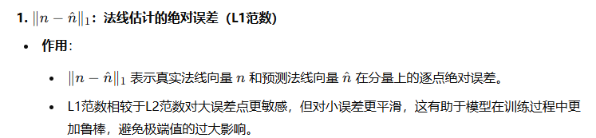
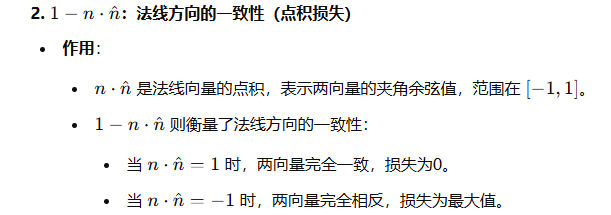

# 20241203组会讲稿

## Pretraining

采用==掩码自动编码器（Masked-Autoencoder，MAE）==的方法进行预训练

编码器将可见图像映射到潜在表示

解码器从潜在表示中重建原始图像

==将图像划分为固定大小的非重叠正方形块==

## 2D姿态估计

==从输入图像 $ I \in \mathbb{R}^{H \times W \times 3} $ 中检测 $ K $ 个关键点的位置==

我们采用==自上而下的方法==，该方法试图==从输入图像 $ I \in \mathbb{R}^{H \times W \times 3} $ 中检测 $ K $ 个关键点的位置==。大多数方法将此问题表述为热力图预测，其中每个关键点的热力图表示该关键点在任意空间位置存在的概率。  

类似于【111】，我们定义了一个姿态估计transformer $ \mathcal{P} $ 来处理关键点检测。训练和推理中，边界框被缩放至 $ H \times W $ 并作为输入提供给 $ \mathcal{P} $。令 $ y \in \mathbb{R}^{H \times W \times K} $ 表示与给定输入 $ I $ 对应的==$ K $ 个关键点的热力图==。姿态估计器将 $ I $ 转换为一组预测热力图 $ \hat{y} \in \mathbb{R}^{H \times W \times K} $，使得 $ \hat{y} = \mathcal{P}(I) $。我们通过最小化均方误差损失来训练 $ \mathcal{P} $：  
$$
\mathcal{L}_{\text{pose}} = \text{MSE}(y, \hat{y})
$$
与现有方法最多68个面部关键点相比，我们的注释包含了多达243个面部关键点，其中涵盖了眼睛、嘴唇、鼻子和耳朵等细节。

通过这些关键点，我们对100万张4K分辨率的图像进行了人工注释。

## 身体部位分割

==身体部位分割的目标是将输入图像 $ I $ 的像素分类为 $ C $ 类==

通过计算真实概率图 $ p $ 和预测概率图 $ \hat{p} $ 之间的==加权交叉熵==损失来优化：
$$
\mathcal{L}_{\text{seg}} = \text{WeightedCE}(p, \hat{p})
$$
我们微调了 $ S $（分割模型），使用两套分割词汇表：标准词汇表（$ C = 20 $【40】）以及一套新的更大词汇表（$ C = 28 $），如图4（右）所示。

我们手动注释了10万张4K分辨率的图像

## 深度估计

采用==与分割相同的架构==，但将==解码器输出通道设置为1==，以用于回归

我们用 $ d \in \mathbb{R}^{H \times W} $ 表示深度图，其中的值是深度估计 $ \hat{d} = D(I) $，而 $ M $ 是图像中的人像像素数量。对于==相对深度估计==，我们将深度 $ d $ 归一化至范围 $[0, 1]$，使用图像中的最大深度和最小深度。深度损失【32】 $ \mathcal{L}_{\text{depth}} $ 定义如下：
$$
\Delta d = \log(d) - \log(\hat{d})
$$

$$
\overline{\Delta d} = \frac{1}{M} \sum_{i=1}^M \Delta d_i
$$

$$
\overline{(\Delta d)^2} = \frac{1}{M} \sum_{i=1}^M (\Delta d_i)^2
$$

$$
\mathcal{L}_{\text{depth}} = \sqrt{\overline{(\Delta d)^2} - \frac{1}{2} (\overline{\Delta d})^2}
$$

渲染了500,000张合成图像，使用600个高分辨率的光照人像扫描图像

4K分辨率的深度图真值

## **表面法线估计** 

解码器输出通道设置为3，对应每个像素的法线向量的 $ xyz $ 分量

## 结论

我们将模型的**最先进性能**归因于以下几点：  

1. **大规模预训练**：基于一个专门设计以理解人为目标的大型精心策划的数据集。  
2. **高分辨率和高容量的视觉transformer骨干网络**：利用扩展后的高效架构进行训练。  
3. **高质量的标注**：基于增强的影棚数据和合成数据完成精细标注。