# Sapiens: Foundation for Human Vision Models

## 摘要

我们推出了 **Sapiens**，一个专注于四项核心以人为中心的视觉任务的模型家族——2D姿态估计、身体部位分割、深度估计以及表面法线预测。我们的模型原生支持1K高分辨率推理，并且通过对预训练模型（基于超过3亿张真实场景中的人类图像）进行简单的微调，可以轻松适配到各个单独任务中。我们发现，在相同的计算预算下，在精心挑选的人类图像数据集上进行自监督预训练，能够显著提升多种以人为中心的任务性能。最终的模型在标注数据稀缺甚至完全基于合成数据的情况下，依然展现了出色的泛化能力。我们的简单模型设计还带来了可扩展性——通过将模型参数规模从0.3亿扩展到20亿，任务性能得到了显著提升。

**Sapiens** 在各种以人为中心的基准测试中始终超越现有基线。在以下任务中，我们相较于此前的最新技术成果取得了显著改进：  

- **Humans-5K**（姿态估计）提高了7.6 mAP；  
- **Humans-2K**（部位分割）提升了17.1 mIoU；  
- **Hi4D**（深度估计）相对RMSE降低了22.4%；  
- **THuman2**（表面法线预测）相对角度误差降低了53.5%。

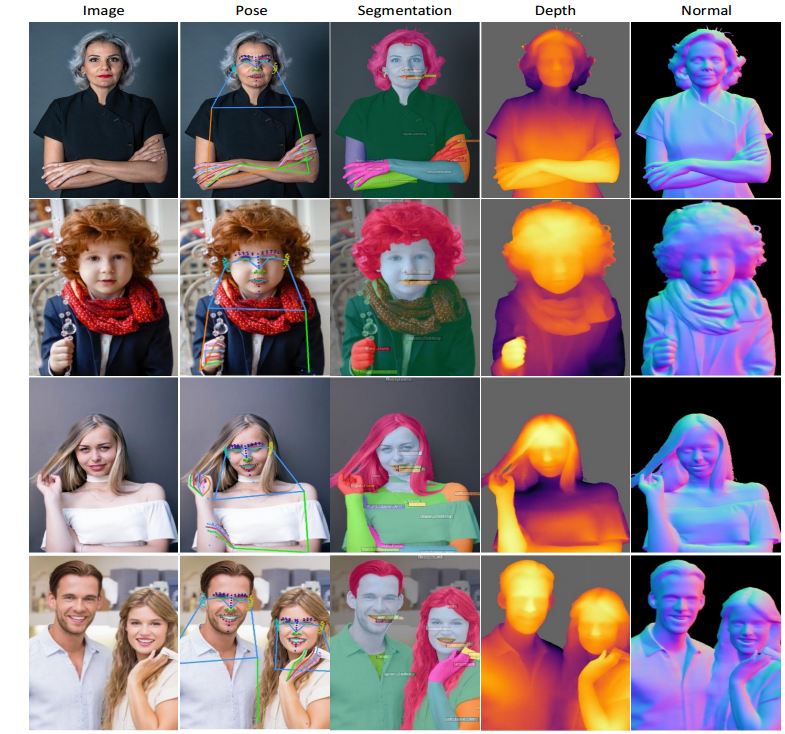

图1. Sapiens模型针对四项人类任务进行了微调- 2D姿势估计，身体部位分割，深度预测和正常预测。我们的模型适用于各种野外面部，上身，全身和多人图像。

## 引言

近年来，在生成2D【17, 28, 50, 118】和3D【69, 89, 102, 109】的逼真人体模型方面取得了显著进展。这些方法的成功很大程度上归功于对各种资产的稳健估计，例如2D关键点【14, 67】、细粒度身体部位分割【119】、深度【113】以及表面法线【89, 108】。然而，这些资产的稳健且精确的估计仍是一个活跃的研究领域，而为了提高单一任务性能而设计的复杂系统常常阻碍了更广泛的应用。此外，在真实场景中获取高精度的标注数据难以扩展。我们的目标是提供一个统一的框架和模型，以在真实场景中推断这些资产，从而解锁广泛的以人为中心的应用场景，让每个人都能使用。

我们认为，这类以人为中心的模型应满足三个标准：**泛化性、广泛适用性和高保真度**。  
- **泛化性** 确保模型在未知条件下的鲁棒性，使其能够在不同环境中始终如一地执行任务；  
- **广泛适用性** 表明模型的多功能性，使其能够通过最小的修改适应各种任务；  
- **高保真度** 指模型生成精确、高分辨率输出的能力，这对逼真人体生成任务至关重要。

本文详细介绍了体现这些属性的模型开发，这些模型统称为 **Sapiens**。

根据【34, 79, 91】的洞见，利用==大规模数据集和可扩展模型架构是实现泛化的关键==。为实现广泛适用性，我们采用了==“预训练-微调”==的方法，使模型在预训练后能够通过最小调整适配具体任务。这种方法引出了一个关键问题：**什么类型的数据对预训练最有效？** 在计算资源有限的情况下，应优先收集尽可能多的人类图像，还是应选择更少但更具代表性的非结构化数据以更好地反映真实世界的多样性？现有方法常常忽略了预训练数据分布对下游任务的影响。为研究预训练数据分布对人类相关任务的影响，我们收集了 **Humans-300M** 数据集，该数据集包含3亿张多样化的人类图像。这些未标注的图像用于从零开始预训练一组视觉Transformer【27】，其参数规模从3亿到20亿不等。

在多种从大数据集中学习通用视觉特征的自监督方法【5, 19, 34, 47, 48, 121】中，我们选择了 ==**MAE（Masked Autoencoder）** 方法==【48】，因为它在预训练中的简单性和高效性。与对比学习或多次推理策略相比，MAE 的单次推理模式允许在相同的计算资源下处理更多图像。为实现更高保真度，与现有方法相比，我们将预训练的原生输入分辨率提高到1024像素，这导致FLOPs（浮点运算量）相比最大现有视觉主干【91】增加了约4倍。每个模型在1.2万亿个tokens上进行预训练。表1展示了与早期方法的对比。 

在针对以人为中心的任务【15, 101, 113, 119】进行微调时，我们使用==一致的编码器-解码器架构==。编码器使用预训练的权重初始化，而解码器（一个轻量级、任务特定的头部）随机初始化，然后对两部分进行端到端的微调。我们聚焦于四项关键任务——2D姿态估计、身体部位分割、深度估计和表面法线估计，如图1所示。

与先前研究【56, 122】一致，我们确认==标注质量对模型在真实场景中的表现有着重要影响==。公共基准【23, 40, 55】中常存在噪声标签，在模型微调期间提供了不一致的监督信号。同时，利用细粒度且精确的标注对齐我们的主要目标（3D人体数字化）至关重要。为此，我们提出了一个密集的2D全身关键点集合用于姿态估计，并引入了详细的身体部位分割类别词汇，超越了之前数据集的范围（参见图1）。具体而言，我们**提出了一个包含308个关键点的全面集合，涵盖身体、手、脚、表面和面部。此外，我们将分割类别扩展至28个类别，包括头发、舌头、牙齿、上下唇和躯干等身体部位**。为确保标注质量、一致性和高自动化程度，我们利用多视角捕获设置收集姿态和分割标注。同时，我们利用以人为中心的合成数据进行深度和法线估计，基于 **RenderPeople**【84】的600个详细扫描生成高分辨率的深度图和表面法线。

我们表明，将特定领域的大规模预训练与有限但高质量的标注相结合，可以实现稳健的真实场景泛化。总体而言，我们的方法展示了一种有效的策略，能够开发出高精度的判别模型，在不需要收集昂贵且多样化标注数据的情况下，胜任真实世界场景中的任务。

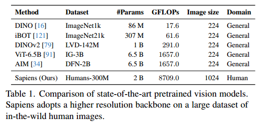

我们的贡献总结如下：  

- **提出 Sapiens**：一个在大规模人类图像数据集上预训练的视觉==**Transformer**==模型家族。  
- **验证预训练优势**：本研究表明，简单的数据筛选与大规模预训练能够在相同计算预算下显著提升模型性能。  
- **出色泛化能力**：我们的模型在使用高质量甚至是合成标注数据进行微调后，展现了卓越的真实场景泛化能力。  
- **高分辨率模型**：首个原生支持1K分辨率高保真推理的以人为中心任务模型，在2D姿态、身体部位分割、深度估计和法线估计等基准测试中达到了最先进的性能。

## 相关工作

我们的工作探索了在大量真实场景人类图像上训练大规模模型的潜力。基于来自不同领域的前期工作，我们将大规模预训练、人类视觉任务以及大型视觉Transformer技术结合起来。

### **大规模预训练**  
大规模预训练【26, 95】及其后续的任务特定微调在语言建模领域【2, 13, 53, 96, 99, 100】已成为标准实践。同样，计算机视觉方法【1, 4, 33, 34, 42, 79, 82, 85, 87, 120】也逐渐采用大规模数据进行预训练。大型数据集的出现（如 LAION5B【90】、Instagram-3.5B【77】、JFT-300M【92】、LVD142M【79】、Visual Genome【60】和YFCC100M【97】）拓展了传统基准测试范围【61, 67, 86】之外的数据探索。  

在这一领域的显著研究包括：  

- **DINOv2【79】**：通过在 LDV-142M 数据集上扩展对比学习 iBot 方法【121】，生成自监督特征的最新性能。  
- **MAWS【91】**：研究了掩码自编码器（MAE）【48】在十亿图像上的扩展性能。  
- **AIM【34】**：探索了类似 BERT【26】的自回归视觉预训练在视觉Transformer【27】上的扩展性。  

与这些主要关注通用图像预训练或零样本分类的方法不同，我们采用了以人为中心的独特方式：通过庞大的人类图像集合进行预训练，并针对多种人类相关任务进行微调。

### **人类视觉任务**  

大规模 3D 人体数字化【8, 44, 64, 74】始终是计算机视觉领域的核心目标【12】。尽管在受控环境或工作室内【3, 59, 63, 69, 70, 76, 89】取得了显著进展，但将这些方法扩展到非受控环境【29】仍面临挑战。为了应对这些挑战，开发能够执行多种基础任务的通用模型至关重要，包括：
- **关键点估计**【21, 35, 46, 51, 57, 78, 80, 93, 106】；
- **身体部位分割**【36, 40, 41, 41, 75, 104, 105】；
- **深度估计**【9, 10, 32, 43, 52, 66, 83, 113】；
- **表面法线预测**【6, 7, 31, 39, 62, 88, 101, 108】。

我们旨在开发能够推广到真实场景的模型，用于解决这些关键任务。

### **扩展模型架构**  
目前，最大的公开语言模型参数量已超过1000亿【49】，而更常用的语言模型【94, 100】的参数量约为70亿。相比之下，尽管==Vision Transformers（ViT）==【27】具有类似的架构，但其扩展尚未达到这一水平。尽管已经有显著尝试，包括开发基于文本和图像的密集型 ViT-4B【20】，以及提出稳定训练 ViT-22B【25】的方法，但现有常用视觉主干模型的参数量仍集中在300M至600M之间【24, 38, 45, 68】，并主要在约224像素的图像分辨率上进行预训练。同样，现有基于Transformer的图像生成模型（如DiT【81】）的参数量少于700M，且在高度压缩的潜在空间中运行。

为弥补这一差距，我们推出了 **Sapiens**：一个大规模、高分辨率的视觉Transformer模型集合，在数百万张人类图像上以原生1024像素分辨率进行预训练。

## 方法  

### Humans-300M 数据集  

我们使用了一个大型专有数据集用于预训练，包含大约10亿张真实场景中的人类图像。该数据集专注于人类图像，通过以下步骤进行预处理：  
1. **图像筛选**：剔除带有水印、文字、艺术化表现或非自然元素的图像。  
2. **边界框检测**：使用一个现成的人员边界框检测器【103】筛选图像，仅保留检测得分高于0.9且边界框尺寸超过300像素的图像。

图2展示了数据集中每张图像中人物数量的分布情况，数据显示超过2.48亿张图像包含多个主体。

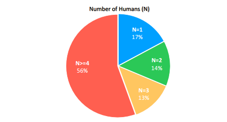

图2. Humans-300 M数据集中每幅图像的人类数量概述。

### **预训练**  
我们采用==掩码自动编码器（Masked-Autoencoder，MAE）==的方法进行预训练。我们的模型通过仅看到原始图像的一部分来重建完整图像。与所有自动编码器一样，我们的模型有一个编码器，该编码器将可见图像映射到潜在表示，并有一个解码器，该解码器从潜在表示中重建原始图像。  

我们的预训练数据集由单人和多人图像组成，每张图像被调整为固定尺寸且具有方形宽高比。与ViT类似，我们==将图像划分为固定大小的非重叠正方形块==。这些图像块的一部分被随机选择进行遮挡（masking），留下其余部分可见。**遮挡图块与可见图块的比例被定义为遮挡比率**，并在整个训练过程中保持固定。我们参考MAE【48】以了解更多细节。图3（上部）展示了我们的预训练模型在未见过的真人图像上的重建结果。

我们的模型表现出对图像特性的广泛泛化能力，包括尺度、裁剪、主体的年龄和种族以及主体数量等。与标准ViT相比，我们的模型块仅占图像面积的0.02%（标准ViT的16倍减少），这提供了更精细的令牌间推理能力。图3（下部）展示了即使遮挡比率增加到95%，我们的模型在未见样本上依然能够实现合理的重建结果。

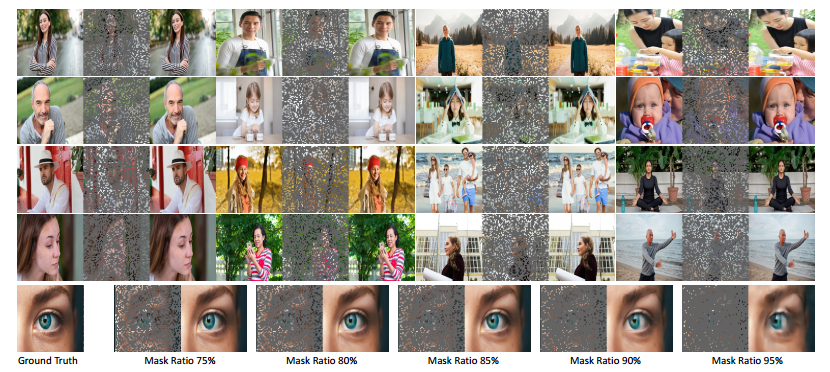

图3.未见过图像上的Sapiens重建。上图：每个三元组包含地面真值（左）、掩蔽图像（中）和MAE重建（右），掩蔽率为75%，补丁大小为16，图像大小为1024。下图：在推理过程中，在[0.75，0.95]之间改变掩模比率，显示出质量的最小降低，强调了模型对人类图像的理解。

### **2D姿态估计**  
我们采用==自上而下的方法==，该方法试图==从输入图像 $ I \in \mathbb{R}^{H \times W \times 3} $ 中检测 $ K $ 个关键点的位置==。大多数方法将此问题表述为热力图预测，其中每个关键点的热力图表示该关键点在任意空间位置存在的概率。  

类似于【111】，我们定义了一个姿态估计transformer $ \mathcal{P} $ 来处理关键点检测。训练和推理中，边界框被缩放至 $ H \times W $ 并作为输入提供给 $ \mathcal{P} $。令 $ y \in \mathbb{R}^{H \times W \times K} $ 表示与给定输入 $ I $ 对应的==$ K $ 个关键点的热力图==。姿态估计器将 $ I $ 转换为一组预测热力图 $ \hat{y} \in \mathbb{R}^{H \times W \times K} $，使得 $ \hat{y} = \mathcal{P}(I) $。我们通过最小化均方误差损失来训练 $ \mathcal{P} $：  
$$
\mathcal{L}_{\text{pose}} = \text{MSE}(y, \hat{y})
$$
在微调阶段，$ \mathcal{P} $ 的编码器从预训练权重初始化，解码器则从头开始随机初始化。输入的宽高比 $ H : W $ 设置为 4:3，并对预训练的位置嵌入进行插值【58】。我们使用轻量级解码器，结合反卷积和卷积操作。

我们在多个骨架上微调 $ \mathcal{P} $，包括 $ K=17 $【67】，$ K=133 $【55】，以及一个全新高细节的骨架 $ K=308 $，如图4（左）所示。与现有方法最多68个面部关键点相比，我们的注释包含了多达243个面部关键点，其中涵盖了眼睛、嘴唇、鼻子和耳朵等细节。这种设计旨在捕捉现实世界中人脸表情的微妙细节。通过这些关键点，我们对100万张4K分辨率的图像进行了人工注释。

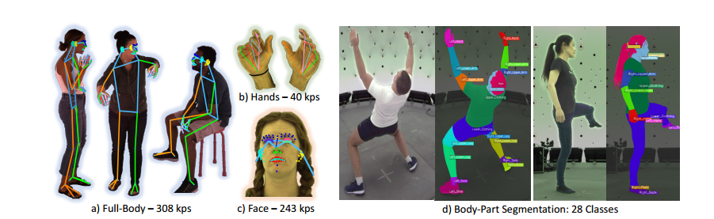

图4. 2D姿态估计和身体部位分割的ground truth注释。

### **身体部位分割**  
通常称为人体解析，==身体部位分割的目标是将输入图像 $ I $ 的像素分类为 $ C $ 类==。大多数方法【40】将此问题表述为每个像素的分类问题，通过计算真实概率图 $ p $ 和预测概率图 $ \hat{p} $ 之间的==加权交叉熵==损失来优化：
$$
\mathcal{L}_{\text{seg}} = \text{WeightedCE}(p, \hat{p})
$$
我们微调了 $ S $（分割模型），使用两套分割词汇表：标准词汇表（$ C = 20 $【40】）以及一套新的更大词汇表（$ C = 28 $），如图4（右）所示。我们提出的词汇表在重要方面超越了之前的数据集。例如，它能够区分上下肢，并包含了更详细的分类（如上下嘴唇、牙齿和舌头）。为此，我们手动注释了10万张4K分辨率的图像。

### **深度估计**  
对于深度估计，我们采用==与分割相同的架构==，但将==解码器输出通道设置为1==，以用于回归。我们用 $ d \in \mathbb{R}^{H \times W} $ 表示深度图，其中的值是深度估计 $ \hat{d} = D(I) $，而 $ M $ 是图像中的人像像素数量。对于==相对深度估计==，我们将深度 $ d $ 归一化至范围 $[0, 1]$，使用图像中的最大深度和最小深度。深度损失【32】 $ \mathcal{L}_{\text{depth}} $ 定义如下：
$$
\Delta d = \log(d) - \log(\hat{d})
$$
$$
\overline{\Delta d} = \frac{1}{M} \sum_{i=1}^M \Delta d_i
$$
$$
\overline{(\Delta d)^2} = \frac{1}{M} \sum_{i=1}^M (\Delta d_i)^2
$$

$$
\mathcal{L}_{\text{depth}} = \sqrt{\overline{(\Delta d)^2} - \frac{1}{2} (\overline{\Delta d})^2}
$$
我们渲染了500,000张合成图像，使用600个高分辨率的光照人像扫描图像，如图5所示。这些图像使用HDRI环境光贴图集合的随机背景，通过调整焦距、旋转和位置捕获图像及其关联的4K分辨率的深度图真值。

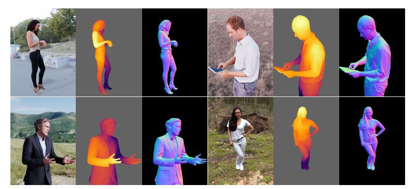

图5.深度和表面法线估计的地面实况合成注释。

### **表面法线估计**  
与之前的任务类似，我们将法线估计器 $ \mathcal{N} $ 的==解码器输出通道设置为3，对应每个像素的法线向量的 $ xyz $ 分量==。生成的合成数据也用作表面法线估计的监督数据。令 $ n $ 表示图像 $ I $ 的法线真值图，$ \hat{n} = \mathcal{N}(I) $。类似于深度估计，损失 $ \mathcal{L}_{\text{normal}} $ 仅在图像中有人像的像素处计算，定义如下：
$$
\mathcal{L}_{\text{normal}} = \| n - \hat{n} \|_1 + (1 - n \cdot \hat{n})
$$

## **实验**  

在本节中，我们首先概述实现细节，随后在多个任务上进行全面的基准测试：姿态估计、部位分割、深度估计和法线估计。

### **实现细节**  
我们的最大模型 **Sapiens-2B** 使用 **1024块A100 GPU** 进行预训练，为期 **18天**，采用 PyTorch 实现。我们在所有实验中使用 AdamW 优化器【73】。学习率调度包括一个线性预热阶段，然后是余弦退火【72】用于预训练，以及线性衰减【65】用于微调。  

所有模型在分辨率为 $1024 \times 1024$、patch 大小为16的图像上进行预训练。微调时，输入图像调整为宽高比为 4:3（即 $1024 \times 768$）。我们使用标准的数据增强方法，例如缩放、翻转和光度失真。随机从非人类的 COCO 数据集中添加背景【67】，用于分割、深度和法线预测任务。

重要的是，我们使用==差异化学习率==【114】来提高泛化能力，即**对于浅层的学习率较低，而对于后续层则较高**。分层学习率的设定为从 **0.85** 到 **3e-4**，权重衰减为 **0.1**。下表列出了 Sapiens 系列模型的设计规格（表2）。  

根据【34, 100】，我们优先考虑宽度而非深度的缩放模型。由于 Sapiens-0.3B 的较高分辨率，其在计算复杂度上超过传统的 ViT-Large，尽管架构上类似。

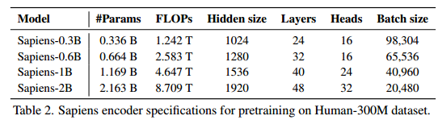

### **2D 姿态估计**  
我们在高精度标注上微调了 Sapiens 用于面部、身体、脚部和手部的姿态估计（$K=308$）。在训练中，我们使用训练集（train set）包含 **100万张**图像，而测试集（test set）为 **Humans-5K**，包含 **5000张**图像。  

我们的评估采用自上而下方法【111】，即**先使用现成的检测器【37】生成边界框，然后推断人体姿态。**表3展示了我们模型与现有全身姿态估计方法的对比。我们评估了所有 **114个公共关键点**，以及来自 **COCO-WholeBody** 数据集中的 **133个关键点** 和 **308个关键点词汇表**。

我们的模型在相同的参数规模下表现优于其他方法。例如，Sapiens-0.3B 在 AP 值上超越 **ViTPose-L**【73】 **+5.6 AP**，Sapiens-0.6B 则进一步超越 **ViTPose-H** **+7.9 AP**。在 Sapiens 系列中，我们的结果表明模型大小和性能之间存在直接相关性。Sapiens-2B 达到了 **61.1 AP** 的最新水平，比之前的基线提升了 **+7.6 AP**。尽管使用室内摄影棚捕获的注释进行微调，Sapiens 展示了对真实场景的强泛化能力，如图6所示。

图6.使用Sapiens-1B对野外图像上的308个关键点进行姿态估计。

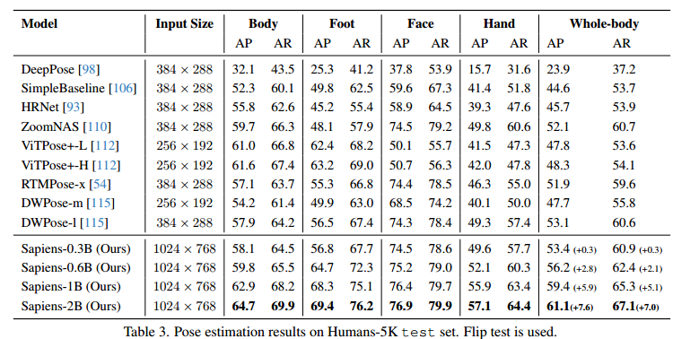

### **身体部位分割**  
我们使用包含 **28个类别** 的分割词汇表，对我们的标注数据进行微调和评估。训练集包含 **10万张** 图像，测试集（Humans-2K）包含 **2000张** 图像。我们将 Sapiens 与现有的身体部位分割方法进行对比，这些方法均在我们的训练集上进行微调。值得注意的是，我们使用每种方法推荐的预训练检查点作为初始化。与姿态估计类似，我们观察到 Sapiens 在分割任务上的泛化能力，如表4所示。  

有趣的是，我们的最小模型 **Sapiens-0.3B** 由于其更高的分辨率和大规模以人为中心的预训练，在性能上超越了现有的分割领域先进方法，例如 **Mask2Former**【22】和 **DeepLabV3+**【18】，并提高了 **12.6 mIoU**。此外，增大模型规模会进一步提升分割性能。**Sapiens-2B** 在测试集上实现了 **81.2 mIoU** 和 **89.4 mAcc** 的最佳性能。图7展示了我们模型的定性结果。  

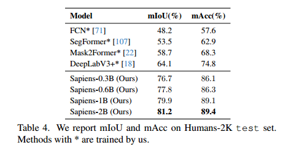

### **深度估计**  
我们在 **THuman2.0**【117】和 **Hi4D**【116】数据集上评估了模型的深度估计能力。**THuman2.0** 数据集包含 **526个高质量的三维人体扫描数据**，我们利用虚拟相机从中提取出三组测试图像：a）面部，b）上半身，c）全身。通过 **1578张图像**，THuman2.0 支持对单人图像在多个尺度上的模型性能进行评估。相反，**Hi4D** 数据集主要关注多人场景，每个序列展示了两个人在执行涉及人际互动的活动。我们选择了配对序列 28、32 和 37，从摄像机4拍摄的序列中提取出 **6个独特主体**，总计 **1195张多人真实图像** 用于测试。  

我们遵循 **MiDaSv3.1**【11】中定义的**相对深度评估协议，报告标准评估指标**，包括 **AbsRel**（平均绝对相对误差）和 **δ1**。此外，我们还报告了 **RMSE**（均方根误差）作为主要评估指标，因为 **δ1** 对于细微深度变化的人体场景并不能有效反映模型性能。  

**表5** 将我们的模型与现有的单目深度估计方法的最新成果进行了比较。值得注意的是，**Sapiens-2B** 仅在合成数据上进行了微调，但在所有单人图像尺度和多人场景中显著优于此前的方法。  

我们观察到，**在 Hi4D 图像上，与表现最优的 Depth-Anything 模型相比，RMSE 降低了 20%**。需要强调的是，尽管基线模型是在多种场景上进行训练的，但 **Sapiens 专注于以人为中心的深度估计任务**。**图8** 展示了 Sapiens-1B 与 Depth-Anything-L 之间在深度估计任务上的定性比较。为了确保公平比较，在基线可视化中使用人体遮罩对预测深度进行了重新归一化处理。  

### **表面法线估计**  
用于表面法线评估的数据集与深度估计所使用的数据集相同。根据文献【30】，我们报告了以下指标：**平均角误差（Mean Angular Error, MAE）、中值角误差（Median Angular Error），以及在误差角度 $t$ （$t \in \{11.25^\circ, 22.5^\circ, 30^\circ\}$）内的像素百分比。**  

**表6** 比较了我们的模型与现有的人体特定表面法线估计方法。所有我们的模型都显著优于现有方法。**Sapiens-2B** 在 **THuman2.0**（单人场景）和 **Hi4D**（多人场景）数据集上的平均角误差约为 **12°**。图9展示了 **Sapiens-1B** 与 **PIFuHD**【89】和 **ECON**【108】在表面法线估计任务中的定性比较。需要注意的是，**PIFuHD**【89】使用了与我们相同的三维扫描数据集进行训练，而 **ECON**【108】使用了包含我们三维扫描数据的超集（总计4000个扫描数据）进行训练。  

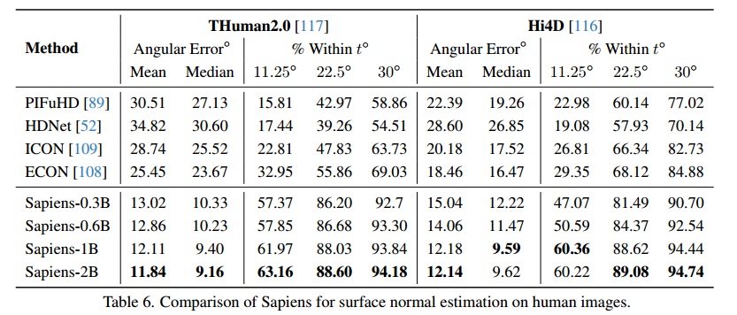

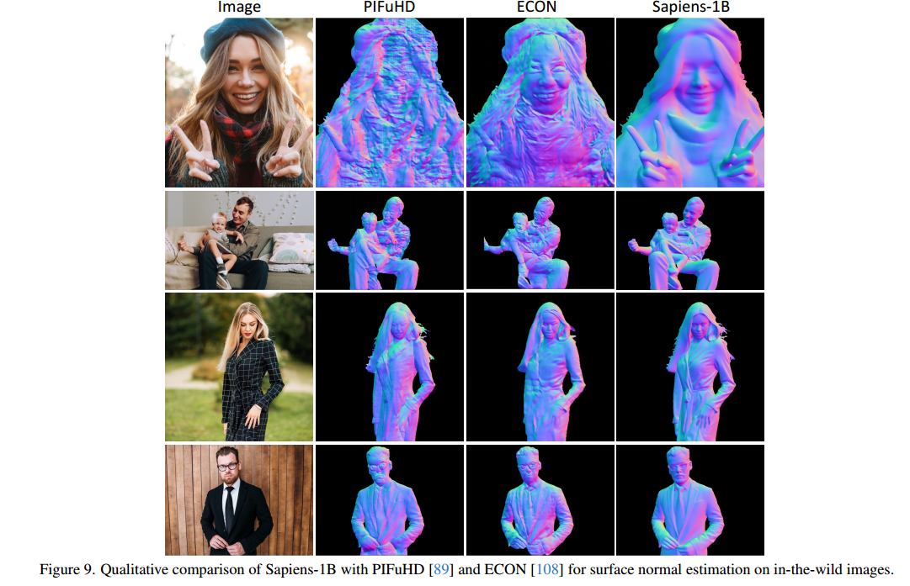

## **讨论**  

### **预训练数据源的重要性**  

特征质量与预训练数据的质量密切相关。我们通过在不同的数据源上预训练 **Sapiens-0.3B** 来评估预训练数据在以人为中心任务中的重要性。所有实验在相同的训练计划和迭代次数下进行。我们微调模型用于每个任务，并选择早期的检查点进行评估，因为早期微调阶段更能反映模型的泛化能力。  

我们研究了在通用图像（可能包含人类）与专注于人类图像的预训练在规模上的影响。具体而言，从我们10亿图像语料库中随机选择了1亿和3亿通用图像，分别创建了 **General-100M** 和 **General-300M** 数据集。**表7** 展示了预训练结果的比较，分别报告以下任务的性能指标：Humans-5K 上的姿态检测 mAP、Humans-2K 上的分割 mIoU、THuman2.0 上的深度估计 RMSE，以及 Hi4D 上表面法线估计的平均角误差（以度为单位）。与文献【112】的发现一致，我们的结果表明，使用 **Human300M** 进行预训练能在所有指标上实现更优的性能，凸显了在固定计算预算下以人为中心的预训练的优势。  

此外，我们还研究了预训练过程中观察到的独特人体图像数量与表面法线估计性能之间的关系，报告了在 $30^\circ$ 范围内的像素百分比。在预训练和微调条件保持一致的情况下，图10显示了随着预训练数据规模的增加，性能稳步提升且未出现饱和现象。综上所述，在预训练过程中观察到的人体图像的多样性与下游任务的泛化能力直接相关。  

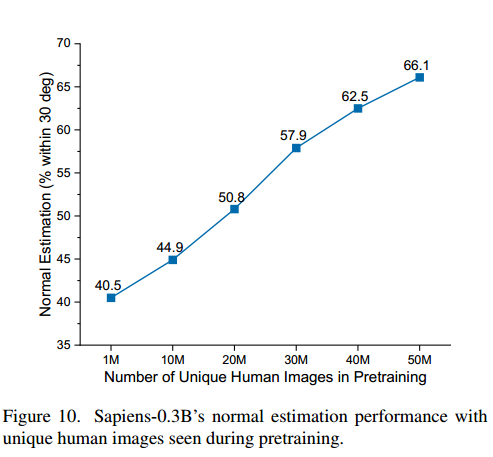

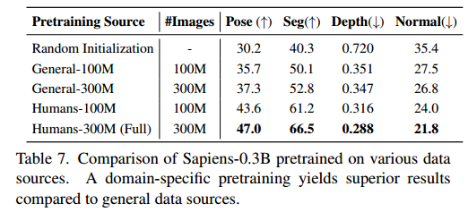

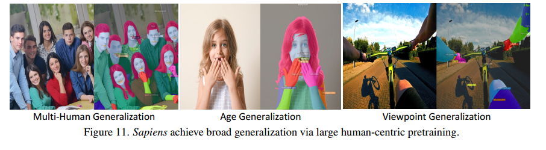

### **零样本泛化**  

我们的模型表现出广泛的泛化能力。例如，在分割任务中，Sapiens 模型仅在具有有限主体多样性、最小背景变化，以及完全第三人称视角的单人图像上进行了微调（如图4所示）。然而，大规模预训练使模型能够在不同主体数量、年龄变化以及第一人称视角上实现泛化（见图11）。这种观察也同样适用于其他任务。  

### **局限性**  

尽管我们的模型通常表现良好，但仍然存在一些不足之处。在处理复杂或罕见姿势、拥挤场景以及严重遮挡的人体图像时，模型表现可能受到限制（详见补充材料）。虽然积极的数据增强策略和检测-裁剪策略可以缓解这些问题，但我们将模型视为一种工具，通过**人类参与的循环**来获取大规模的真实世界监督，以开发下一代人体视觉模型。  

## **结论**  

**Sapiens** 代表着将以人为中心的视觉模型提升为基础模型的重要一步。我们的模型在多种以人为中心的任务中展现了出色的泛化能力。我们将模型的**最先进性能**归因于以下几点：  

1. **大规模预训练**：基于一个专门设计以理解人为目标的大型精心策划的数据集。  
2. **高分辨率和高容量的视觉transformer骨干网络**：利用扩展后的高效架构进行训练。  
3. **高质量的标注**：基于增强的影棚数据和合成数据完成精细标注。  

我们相信，这些模型能够成为多个下游任务的核心构建模块，并为更广泛的社区提供高质量的视觉骨干网络。未来工作的一条潜在方向是将 **Sapiens** 扩展到**三维数据**和**多模态数据**领域。  

### **致谢**  
我们特别感谢 **He Wen** 和 **Srivathsan Govindarajan** 在训练和优化 **Sapiens** 模型中的贡献。  

