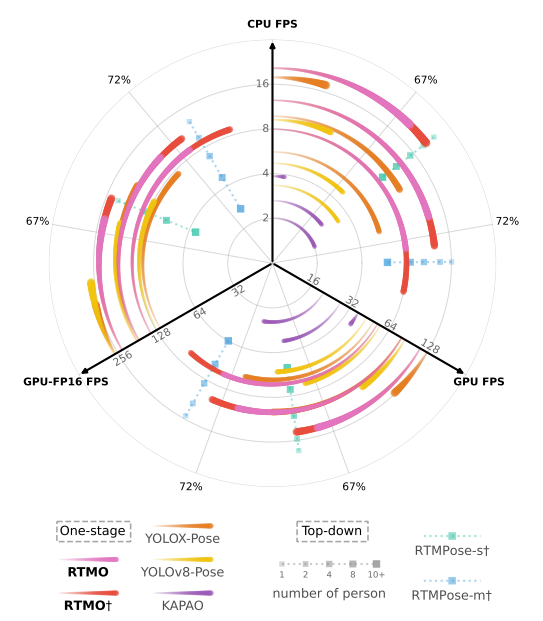
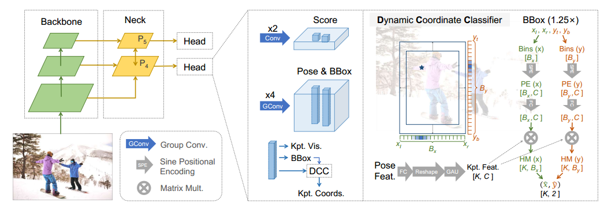

# RTMO

## 摘要

实时多人姿态估计在平衡速度与精度方面面临显著挑战。虽然两阶段的顶部-底部（top-down）方法随着图像中人物数量的增加会变慢，但现有的单阶段方法往往无法同时实现高精度和实时性能。本文提出了一种名为 **RTMO** 的单阶段姿态估计框架，通过在 YOLO 架构中使用双一维热图（dual 1-D heatmaps）表示关键点，无缝集成了坐标分类，达到与顶部-底部方法相当的精度，同时保持了较高的速度。我们设计了一种动态坐标分类器以及一种专门为热图学习设计的定制损失函数，专门解决了坐标分类与密集预测模型之间的不兼容问题。

**RTMO** 超越了现有的单阶段姿态估计器，在使用相同骨干网络的情况下，在 COCO 数据集上的平均精度（AP）提高了 1.1%，且运行速度快约 9 倍。我们最大的模型 **RTMO-l** 在 COCO val2017 数据集上达到了 74.8% 的 AP，并在单张 V100 GPU 上实现了 141 帧每秒（FPS）的速度，展现了其高效性和准确性。代码和模型可在以下地址获取：
 https://github.com/openmmlab/mmpose/tree/main/projects/rtmo

## 引言

多人姿态估计（MPPE）在计算机视觉领域至关重要，其应用范围从增强现实到体育分析等广泛场景。对于需要即时反馈的应用，例如运动员姿态指导，实时处理尤为关键。尽管已经出现了许多实时姿态估计技术【3, 16, 17, 31】，但如何在速度和精度之间取得平衡仍是一个具有挑战性的问题。

当前的实时姿态估计方法分为两类：**顶部-底部方法（top-down）**【3, 16】和**单阶段方法（one-stage）**【17, 31】。

图1 不同推理后端和设备的实时姿态估计方法的效率和功效比较。径向轴表示推理速度，单位为每秒帧数（FPS）。外圆轴表示 COCO val2017 数据集上的平均精度 (AP)。标有 † 的模型使用 COCO train2017 之外的额外数据进行训练。

- ==**顶部-底部方法**==使用预训练的检测器在目标周围创建边界框，然后对每个个体进行姿态估计。这种方法的一个==主要局限在于推理时间会随着图像中人数的增加而线性增长==（见图1）。
- ==**单阶段方法**==直接预测图像中所有人的关键点位置。然而，现有的实时单阶段方法【17, 31, 34】在精度方面落后于顶部-底部方法（见图1）。这些方法依赖于 YOLO 架构，直接回归关键点坐标，但由于此技术类似于为每个关键点使用狄拉克 delta 分布，忽略了坐标位置的内在模糊性和不确定性【21】，从而限制了性能。

相比之下，==**坐标分类方法**==通过在整幅图像中分布的==两个独立的1维热图==（dual 1-D heatmaps）来增加空间分辨率，将关键点位置的概率分布在两个区间上。这种方法以较小的额外计算成本提供了更精确的预测【16, 23】。然而，将坐标分类直接应用于像单阶段姿态估计这样的密集预测场景，会导致低效的区间利用，因为图像中的每个人仅占据很小的区域。此外，传统的 Kullback-Leibler 散度（KLD）损失对所有样本一视同仁，这对于实例难度在网格中显著变化的单阶段姿态估计来说是次优的。

在这项工作中，我们克服了上述挑战，==将坐标分类方法融入基于 YOLO 的框架中，开发了实时单阶段多人姿态估计模型（RTMO）==。RTMO 引入了一种==动态坐标分类器（Dynamic Coordinate Classifier，DCC）==，该分类器包含局限于边界框的动态坐标范围分配以及可学习的坐标表示。

此外，我们提出了一种==基于最大似然估计（Maximum Likelihood Estimation, MLE）的新型损失函数==，用于高效训练坐标热图。这种新的损失函数能够学习每个样本的不确定性，自动调整任务难度，并在困难样本和简单样本之间实现优化平衡，从而实现更有效和协调的训练。

因此，RTMO 实现了与实时顶部-底部方法相当的精度，并超越了其他轻量级单阶段方法（见图1）。此外，RTMO 在处理图像中的多个实例时表现出了卓越的速度，超过了具有类似精度的顶部-底部方法。值得注意的是，**RTMO-l** 在 COCO val2017 数据集上达到了 74.8% 的平均精度（AP），并在 NVIDIA V100 GPU 上实现了 141 帧每秒（FPS）。在 CrowdPose 基准测试中，**RTMO-l** 达到 73.2% 的 AP，成为单阶段方法中的新标杆。

本文的主要贡献包括：

- 一种创新的坐标分类技术，针对密集预测任务设计，通过使用坐标区间实现精确的关键点定位，同时处理实例大小和复杂性的变化。
- 一种新的实时单阶段多人姿态估计方法，将坐标分类无缝集成到 YOLO 架构中，在现有多人姿态估计方法中实现了性能与速度的最佳平衡。

## 相关工作

### 2.1 单阶段姿态估计器

受单阶段目标检测算法【8, 10, 25, 41, 52】发展的启发，一系列单阶段姿态估计方法应运而生【11, 31, 35, 40, 52】。
 这些方法通过==一次前向传播完成多人姿态估计（MPPE）==，直接从预定的根位置回归实例特定的关键点。其他方法如 PETR【38】和 ED-Pose【47】，将姿态估计视为一组关键点的预测问题，实现端到端关键点回归。此外，技术如 FCPose【32】、InsPose【36】 和 CID【43】则利用动态卷积或注意力机制生成实例特定的热图以进行关键点定位。

==与两阶段姿态估计方法相比，单阶段方法消除了预处理（如顶部-底部方法中的人体检测）和后处理（如底部-顶部方法中的关键点分组）的需求==。这带来了两大好处：

1. ==推理时间与图像中实例的数量无关，保持一致性；==
2. ==简化了管道，便于部署和实际应用。==

尽管有这些优势，==现有的单阶段方法在实现高精度与实时推理之间仍存在困难==。==高精度模型==【43, 47】通常依赖于资源密集型的骨干网络（如 HRNet【39】或 Swin【26】），难以满足实时需求。而==实时模型==【31, 34】则在性能上有所妥协。我们的模型针对这一权衡进行了优化，既实现了高精度又支持快速的实时推理。

### 2.2 坐标分类

SimCC【23】和 RTMPose【16】在姿态估计中采用了坐标分类方法，通过将关键点分类到沿水平和垂直轴的子像素区间中，平衡了精度和速度，而无需高分辨率特征。然而，在密集预测方法中，将区间分布在整幅图像中并不实际，因为需要大量区间来减少量化误差，导致许多区间对单个实例而言是多余的。DFL【21】则在每个锚点附近预定义范围内分配区间，但这可能无法覆盖大实例的关键点，并可能对小实例产生显著的量化误差。

我们的方法在每个实例大小的比例范围内分配局部化区间，从而优化了区间利用率，确保关键点覆盖，并最大限度地减少量化误差。

### 2.3 基于 Transformer 的姿态估计

基于 Transformer 的架构已广泛应用于姿态估计领域，通过最先进的 Transformer 骨干网络（如 ViTPose【46】）提升精度，或结合 Transformer 编码器和 CNN 捕获空间关系【48】。例如，TokenPose【22】和 Poseur【33】在热图和回归方法中验证了基于 token 的关键点嵌入的有效性，充分利用了视觉线索和解剖学约束。PETR【38】和 ED-Pose【47】将 Transformer 引入端到端多人姿态估计，而 RTMPose【16】则==将自注意力与基于 SimCC【23】的框架结合==，用于关键点依赖性分析。这一方法也被 RTMO 采用。

虽然位置编码在注意力机制中用于通知查询和关键位置已是标准操作，但我们创新性地将其用于为每个空间区间形成表示向量，从而计算区间与关键点的相似性，促进关键点的准确定位预测。

图2. **RTMO网络架构概览**
 网络头部为每个网格单元输出得分、边界框、关键点坐标和可见性预测。动态坐标分类器（Dynamic Coordinate Classifier）将姿态特征转换为水平轴和垂直轴上各 $K$ 对 1D 热图，这些热图覆盖了预测边界框大小的 1.25 倍的扩展区域。从这些热图中可以精确提取关键点坐标。这里，$K$ 表示关键点的总数量。

## 方法

我们的模型采用类似 YOLO 的架构（如图2所示）。主干网络使用 **CSPDarknet**【10】，并通过一个混合编码器【29】处理最后三层特征图，从而生成具有分别为 16 和 32 下采样率的空间特征 P4 和 P5。这些特征中的每个像素映射到原始图像平面上均匀分布的网格单元。网络的头部利用每个空间层的双卷积块，为每个网格单元生成==得分==和相应的==姿态特征==。这些姿态特征被用于==预测边界框、关键点坐标和可见性==。

==1D 热图的生成通过动态坐标分类器（Dynamic Coordinate Classifier, DCC）实现==，具体详见第 3.1 节；而基于最大似然估计（MLE）的热图损失则在第 3.2 节介绍。完整的训练和推理过程概述在第 3.3 节。

### 3.1 动态坐标分类器

每个网格单元的姿态特征包含关键点相对于该网格的位移信息。先前的研究【11, 31, 35】直接回归这些位移，但其性能存在局限。我们的研究探讨了将坐标分类方法与单阶段姿态估计框架相结合，以提高关键点定位的精度。==现有的坐标分类方法存在一个显著问题，即它们采用静态的区间分配策略==。

为了解决这一问题，我们提出了**动态坐标分类器（DCC）**，通过在两个 1D 热图中动态分配区间范围并生成区间表示，解决了==坐标分类在密集预测场景中的不兼容性==。

#### 动态区间分配

顶部-底部姿态估计器中的坐标分类技术通常在整个输入图像上分配区间【16, 23】，但==在单阶段方法中，由于每个目标仅占据图像的一小部分，这种策略会导致大量区间的浪费==。DFL【21】尝试在锚点附近的预定义范围内分配区间，但可能会漏掉大实例的关键点，并对小实例产生显著的量化误差。

==DCC 通过动态分配区间以对齐每个实例的边界框，从而确保局部化覆盖==。边界框最初通过点卷积层回归生成，并扩展 1.25 倍以覆盖所有关键点，即使在预测不准确的情况下。这些扩展后的边界框在水平和垂直方向上均匀划分为 $B_x$ 和 $B_y$ 个区间。水平轴上每个区间的 $x$ 坐标计算如下：
$$
x_i = x_l + \frac{(x_r - x_l) \cdot (i - 1)}{B_x - 1}
$$

其中，$x_r$ 和 $x_l$ 分别表示边界框的右边界和左边界，i 为区间索引，从 1 到 $B_x$。垂直方向的计算方法与此类似。

#### 动态区间编码

在 DCC 中，每个网格的区间位置因其预测的边界框不同而变化，这与以前的固定区间坐标方法【16, 23】不同。传统方法为所有网格共享区间表示，而==DCC 在每次推理时动态生成区间表示==。我们通过将每个区间的坐标编码为位置编码（Positional Encoding）来生成区间特定的表示。具体来说，位置编码采用如下公式：
$$
[\text{PE}(x_i)]_c = \begin{cases}  \sin\left(\frac{x_i}{t^{c/C}}\right), & \text{当 } c \text{ 是偶数时} \\ \cos\left(\frac{x_i}{t^{(c-1)/C}}\right), & \text{当 } c \text{ 是奇数时}  \end{cases}
$$

其中，$t$ 是温度参数，$c$ 是索引，$C$ 是总维度数。我们通过一个可学习的线性变换优化位置编码的适应性。

动态坐标分类器的主要目标是==根据区间坐标和关键点特征准确预测每个区间中关键点出现的概率==。关键点特征由姿态特征中提取，并通过门控注意单元（Gated Attention Unit, GAU）模块进一步优化，以增强关键点之间的一致性。概率热图通过关键点特征与区间位置编码的相似性计算生成，公式如下：
$$
\hat{p}_k(x_i) = \frac{e^{f_k \cdot \phi(\text{PE}(x_i))}}{\sum_{j=1}^{B_x} e^{f_k \cdot \phi(\text{PE}(x_j))}}
$$

其中，$f_k$ 表示第 $k$ 个关键点的特征向量。

### 3.2 基于最大似然估计的坐标分类

在分类任务中，通常使用 one-hot 目标和交叉熵损失进行优化。为了提高性能，一些方法采用标签平滑技术，例如 SimCC【23】和 RTMPose【16】中的高斯标签平滑，与 KLD 结合使用。高斯分布的均值 $\mu_x, \mu_y$ 和方差 $\sigma^2$ 被设为注释坐标和预定义参数，其目标分布为：
$$
p_k(x_i | \mu_x) = \frac{1}{\sqrt{2\pi}\sigma} e^{-\frac{(x_i - \mu_x)^2}{2\sigma^2}}
$$

重要的是，我们注意到 $p_k(x_i \mid \mu_x)$ 数学上等价于在高斯误差模型下，真实值 $x_i$ 的似然估计 $p_k(\mu_x \mid x_i)$。

这种对称性源于高斯分布关于其均值对称的特性。因此可以用负对数似然损失来优化：
$$
L_{mle}^{(x)} = -\log \left[ \sum_{i=1}^{B_x} \frac{1}{\sigma} e^{-\frac{|x_i - \mu_x|}{2\sigma s}} \hat{p}_k(x_i) \right]
$$

其中，$s$ 是实例大小的归一化参数，$\sigma$ 是可预测的方差。最大化该似然值能够建模标注数据的真实分布。总损失为：
$$
L_{mle} = L_{mle}^{(x)} + L_{mle}^{(y)}
$$

与 KLD 不同，MLE 损失允许学习方差以表示不确定性，从而自适应调整困难样本和简单样本的优化。

### 3.3 训练与推理

#### 训练

我们的模型基于 YOLO 架构，采用密集网格预测进行人体检测和姿态估计。区分正样本网格和负样本网格对模型至关重要。我们扩展了 SimOTA【10】，根据网格得分、边界框回归以及姿态估计精度分配正样本网格。网络头的得分分支对这些网格进行分类，监督信号为 varifocal loss【51】 LclsL_{cls}，其目标分数为每个网格的预测姿态与分配的真实值之间的目标关键点相似度（Object Keypoint Similarity, OKS）。

正样本网格的特征用于预测边界框、关键点坐标和可见性。关键点坐标由 DCC 提供，其他预测结果则通过点卷积层生成。所使用的损失包括边界框的 IoU 损失 $L_{bbox}$、关键点的 MLE 损失 $L_{mle}$ 和可见性的 BCE 损失 $L_{vis}$。

鉴于 DCC 的计算需求，我们实现了一个点卷积层用于初步坐标回归，类似于 YOLO-Pose【31】，以避免内存不足问题。这些回归的关键点 kptregkpt_{reg} 被用作 SimOTA 中选择正样本网格的代理，并使用解码后的关键点 kptdeckpt_{dec} 来计算 OKS。回归分支的损失为 OKS 损失【31】：
$$
L_{proxy} = 1 - \text{OKS}(kpt_{reg}, kpt_{dec})
$$

整个模型的总损失为：
$$
L = \lambda_1 L_{bbox} + \lambda_2 L_{mle} + \lambda_3 L_{proxy} + \lambda_4 L_{cls} + L_{vis}
$$

其中超参数 $\lambda_1, \lambda_2, \lambda_3, \lambda_4$ 的值设为：$\lambda_1 = \lambda_2 = 5、λ3=10\lambda_3 = 10、λ4=2\lambda_4 = 2$。

------

#### 推理

在推理过程中，我们的模型使用 0.1 的得分阈值，并应用非极大值抑制（NMS）对网格进行过滤。随后，从选定网格中解码姿态特征生成热图，并通过对热图进行积分以推导关键点坐标。这种选择性解码方法最小化了处理特征的数量，从而减少了计算成本。

## 实验

### 4.1 设置

**数据集**
 实验主要在 COCO2017 关键点检测基准测试【24】上进行，该数据集包含约 250,000 个包含 17 个关键点的人体实例。性能对比在 val2017 和 test-dev 数据集上进行。为了探索我们模型的性能上限，我们还扩展训练了其他数据集，包括 CrowdPose【19】、AIC【44】、MPII【1】、JHMDB【15】、Halpe【9】和 PoseTrack18【2】。这些注释数据被转换为 COCO 格式。此外，我们还在 CrowdPose 基准测试【19】上评估了 RTMO 的表现。CrowdPose 以其高密度人群和遮挡场景的高难度而闻名，包含 20,000 张图像和约 80,000 个人体实例，标注了 14 个关键点。

OKS（目标关键点相似度）平均精度（AP）被用作两个数据集的评估指标。

**实现细节**
 在训练过程中，我们采用了 YOLOX【10】的图像增强管道，包括 mosaic 数据增强、随机颜色调整、几何变换和 MixUp【50】。训练图片被调整为 [480, 800] 尺寸。在 COCO 和 CrowdPose 数据集上分别训练了 600 和 700 个 epoch。训练过程被分为两个阶段：第一阶段同时使用姿态注释训练代理分支和 DCC，第二阶段将代理分支的目标切换为由 DCC 解码的姿态。我们使用了 AdamW 优化器【27】，权重衰减为 0.05，并在 Nvidia GeForce RTX 3090 GPU 上以 256 的批量大小进行训练。初始学习率分别为 4×10−34 \times 10^{-3} 和 5×10−45 \times 10^{-4}，通过余弦退火法衰减到 2×10−42 \times 10^{-4}。推理阶段中，图像被调整为大小为 640。CPU 推理延迟在 Intel Xeon Gold CPU 上使用 ONNXRuntime 测量，GPU 推理延迟在 NVIDIA V100 GPU 上通过 ONNXRuntime 和 TensorRT 的半精度浮点（FP16）格式测量。我们使用 MMPose【7】工具箱实现了 RTMO 模型。

------

### 4.2 基准测试结果

**COCO**
 为了评估 RTMO 相较于其他实时姿态估计器的表现，我们在 COCO val2017 数据集上测量了平均精度（AP）和推理延迟。对于单阶段方法，我们选择了 KAPAO【34】、YOLOv8-Pose【17】和 YOLOX-Pose（YOLO-Pose【31】在 YOLOX【10】上的适配版）。对于顶部-底部方法，我们选择了 RLE【20】、SimCC【23】和 RTMPose【16】。RTMDet-nano【30】作为顶部-底部模型的人体检测器。由于顶部-底部模型的速度随着图像中人物数量的增加而降低，我们根据人物数量将 COCO val2017 数据集划分，并分别评估顶部-底部模型的速度。

如图 3 所示，RTMO 系列在性能和速度方面均优于可比的轻量级单阶段方法。与顶部-底部模型相比，RTMO-m 和 RTMO-l 在精度上与 RTMPose-m 和 RTMPose-l 相当，但在图像中人物较多时速度更快。在 ONNXRuntime 上，RTMO 在大约 4 个人物时速度与 RTMPose 相当；在 TensorRT FP16 上，当人物数量达到 2 或更多时，RTMO 更快。这表明 RTMO 在多人场景中的优势。尽管处理的 token 数量随着图像中的人物数量而变化，但推理延迟的差异非常小。例如，在包含超过 10 人物的子集上，RTMO-l 的 GPU 推理延迟仅比单人子集高出约 0.1 毫秒，占总延迟的 0.5%。

我们在 COCO test-dev 数据集上对 RTMO 与最先进单阶段姿态估计器的对比结果如表 1 所示。RTMO 在速度和精度上表现出显著改进。例如，RTMO-s 使用 ResNet-50【12】骨干网络时，比 PETR【37】快 10 倍，且具有相似的精度。与轻量级模型 KAPAO 和 YOLO-Pose 相比，RTMO 在所有模型大小下的精度均更高。当仅在 COCO train2017 数据集上训练时，RTMO-l 是所有测试模型中性能第二的。性能最高的模型 ED-Pose【47】依赖复杂的 Swin-L【26】骨干网络，不适合部署。相比之下，RTMO-l 在使用相同 ResNet-50 骨干网络时超越了 ED-Pose 1.1% 的 AP，且速度更快。此外，将 ED-Pose 转换为 ONNX 格式会导致其延迟高于原始 PyTorch 模型（每帧约 1.5 秒），而 RTMO-l 的 ONNX 模型仅需 19.1 毫秒处理一张图片。

**CrowdPose**
 为了评估 RTMO 在复杂场景下的表现，我们在 CrowdPose【19】基准测试上进行了测试，该数据集以拥挤和遮挡场景为特征。结果汇总在表 2 中。与底部-顶部和单阶段方法相比，RTMO-s 的精度与 DEKR【11】相当，但仅使用其 15% 的参数量。在 CrowdPose 数据集上训练时，RTMO-l 在模型大小较小的情况下超越了使用 Swin-L【26】骨干网络的 ED-Pose【47】。值得注意的是，RTMO-l 在中等和高难度样本上的表现优于 ED-Pose，表明其在具有挑战性场景中的有效性。此外，使用额外训练数据后，RTMO-l 达到了 81.7% 的 AP，进一步表明了模型的潜力。

------

### 4.3 定性结果

RTMO 使用坐标分类方法，在小目标和高遮挡的多人场景中表现出了较强的性能。图 4 显示了 RTMO 在这些困难条件下生成的空间准确的热图，展现了每个关键点的稳健性和上下文感知预测能力。

------

### 4.4 消融实验

**分类与回归对比**
 为了评估坐标分类与回归的有效性，我们用全连接层替换了模型的 1D 热图生成功能，并使用 OKS 损失【31】监督其优化。表 3 显示了对比结果。结合 DCC 模块和 MLE 损失，坐标分类比回归方法在 COCO 数据集上的 AP 提高了 2.0%。

**坐标分类的损失函数**
 相比于使用 KLD 损失的其他姿态估计方法，我们的研究表明 KLD 在 RTMO 上的效果不佳。表 3 显示，我们的 MLE 损失比 KLD 提供了更高的精度。这种改进归因于 MLE 损失中可学习的方差，它能在困难样本和简单样本之间平衡学习。困难样本的预测方差较大以缓解优化难度，而简单样本的预测方差较小以提高精度。相比之下，KLD 无法考虑这种差异，效果较差。

**动态策略在坐标分类中的作用**
 我们最初采用静态坐标分类策略，类似于 DFL【21】，将区间分配在每个网格附近的固定范围内。这种方法在 COCO 数据集上的表现优于回归方法，但在 CrowdPose 上效果较差。引入动态区间分配（DBA）策略后，性能在两个数据集上均有所下降。这是因为不同样本中的区间语义不同，未作调整的表示可能会降低性能。通过引入动态区间编码（DBE），DCC 的性能超越了静态策略，在两个数据集上均有提升。没有 DBE 的情况下，相邻区间的概率可能会有显著差异，而 DBE 能够使输出热图更平滑，提高解码的训练效果（如图 6 所示）。

**特征图选择**
 特征金字塔【18】利用多尺度特征来检测不同大小的目标，较深的特征通常用于检测较大的对象。我们的初始模型使用 P3、P4 和 P5 特征，其步长分别为 8、16 和 32 像素。然而，P3 在模型头中的 FLOPs 占比为 78.5%，但其检测准确率仅占 10.7%。为了提高效率，我们仅保留了 P4 和 P5。表 4 显示，去掉 P3 后显著提高了速度，但精度损失很小，这表明 P4 和 P5 对多人姿态估计已经足够有效。这表明 P3 在检测较小目标中的作用可以被剩余特征所弥补。

## 结论

总之，我们的 RTMO 模型在单阶段多人姿态估计中显著改善了速度与精度之间的权衡。通过将坐标分类集成到基于 YOLO 的框架中，我们实现了实时处理与高精度的结合。我们的方法采用动态坐标分类器和基于最大似然估计的损失函数，有效提高了密集预测模型中的定位精度。这一突破不仅增强了姿态估计的效果，还为视觉检测任务中密集预测领域的未来发展奠定了坚实的基础。