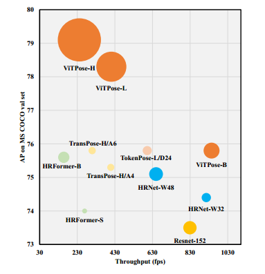
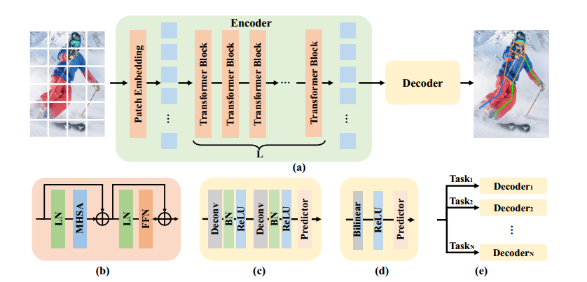
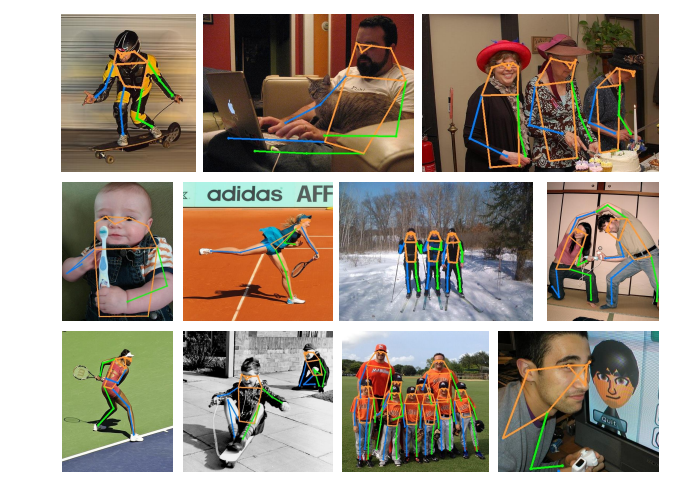

# ViTPose: Simple Vision Transformer Baselines for Human Pose Estimation

## 摘要

尽管在设计上没有考虑具体的领域知识，但简单的视觉Transformer在视觉识别任务中表现出了卓越的性能。然而，很少有人尝试探索这种简单结构在姿态估计任务中的潜力。在本文中，我们通过一个名为ViTPose的简单基线模型，从模型结构的简洁性、模型规模的扩展性、训练范式的灵活性以及模型之间知识的可迁移性等方面，展示了纯视觉Transformer在姿态估计任务中的惊人能力。具体来说，ViTPose使用简单且非分层的视觉Transformer作为骨干网络，提取给定人体实例的特征，并利用轻量级解码器进行姿态估计。通过利用Transformer可扩展的模型容量和高并行性，模型规模可以从100M参数扩展到1B参数，设置了吞吐量和性能之间新的Pareto前沿。此外，ViTPose在注意力类型、输入分辨率、预训练和微调策略以及多种姿态任务处理方面表现出极大的灵活性。我们还通过一个简单的知识Token实验证明，大规模ViTPose模型的知识可以轻松转移到小规模模型中。实验结果显示，我们的基本ViTPose模型在具有挑战性的MS COCO关键点检测基准上优于代表性方法，而最大的模型在MS COCO test-dev集上达到了新的最先进水平（80.9 AP）。代码和模型已公开：https://github.com/ViTAE-Transformer/ViTPose。

## 引言

人体姿态估计是计算机视觉中的一项基础任务，拥有广泛的现实世界应用 [51, 29]。其目标是定位人体的解剖学关键点，由于遮挡、裁剪、尺度变化以及人体外观的多样性，这一任务具有较高的挑战性。为了解决这些问题，基于深度学习的方法取得了迅速发展 [37, 42, 36, 50]，这些方法通常使用卷积神经网络（CNN）来处理这一具有挑战性的任务。

近年来，视觉Transformer [13, 31, 10, 34, 32] 在许多视觉任务中展现出了巨大的潜力。受其成功的启发，不同的视觉Transformer结构被应用于姿态估计任务。这些方法中的大多数采用CNN作为骨干网络，然后使用设计精巧的Transformer结构来提取特征并建模人体关键点之间的关系。例如，PRTR [23] 结合了Transformer编码器和解码器，以级联的方式逐步优化预测关键点的位置。TokenPose [27] 和 TransPose [44] 则采用了仅由编码器组成的Transformer结构，处理由CNN提取的特征。而另一方面，HRFormer [48] 使用Transformer直接提取特征，并通过多分辨率并行Transformer模块引入高分辨率表示。这些方法在姿态估计任务上取得了优异的性能。然而，它们要么需要额外的CNN来提取特征，要么需要精心设计Transformer结构以适应任务需求。这促使我们从相反的方向思考：纯视觉Transformer在姿态估计任务中表现究竟如何？

为了回答这一问题，我们提出了一个名为 **ViTPose** 的简单基线模型，并在 MS COCO Keypoint 数据集 [28] 上展示了其潜力。具体来说，ViTPose 使用简单且非分层的视觉Transformer [13] 作为骨干网络，从给定的人体实例中提取特征图，这些骨干网络==通过遮挡图像建模的预训练任务（例如 MAE [15]）进行预训练==，从而提供良好的初始化。随后，一个轻量级的解码器通过对特征图进行==上采样并回归关键点对应的热图==来处理这些提取的特征，该解码器由两层反卷积层和一层预测层组成。尽管该模型的结构没有复杂的设计，ViTPose 在具有挑战性的 MS COCO Keypoint 测试集上达到了80.9 AP的最新性能（SOTA）。需要注意的是，本文并不主张算法本身的优越性，而是提出了一个简单且稳健的Transformer基线，具有出色的姿态估计性能。

**图1：MS COCO瓦尔集上ViTPose和SOTA方法在模型大小、通量和精度方面的比较。每个气泡的大小表示模型参数的数量**

除了优异的性能，我们还从以下几个方面展示了ViTPose的惊人能力：简单性、可扩展性、灵活性以及可迁移性。

1. **简单性**：得益于视觉Transformer的强大特征表达能力，ViTPose框架非常简单。例如，其骨干编码器的设计不需要任何特定领域知识，仅通过简单堆叠多个Transformer层即可实现非分层编码器结构。解码器可以进一步简化为一个上采样层和一个卷积预测层，且性能下降可忽略不计。这样的结构简单性使得ViTPose在推理速度和性能之间达到了新的Pareto前沿（如图1所示）。
2. **可扩展性**：这种简单性使得ViTPose展现了卓越的扩展能力。因此，它受益于可扩展预训练视觉Transformer的快速发展。具体而言，可以通过堆叠不同数量的Transformer层或调整特征维度（例如，使用ViT-B、ViT-L或ViT-H）来控制模型规模，以平衡推理速度和性能，从而满足不同的部署需求。
3. **灵活性**：我们展示了ViTPose在训练范式上的高度灵活性。ViTPose可以通过微小的修改适应不同的输入分辨率和特征分辨率，且输入分辨率越高，姿态估计结果越精确。此外，除了常规的单一姿态数据集训练方法，我们可以通过添加额外的解码器，灵活地将其调整为多姿态数据集训练方式，形成联合训练流程，并显著提升性能。由于解码器非常轻量级，这种训练范式只带来极少的额外计算开销。此外，当使用较小的无标签数据集进行预训练或冻结注意力模块进行微调时，ViTPose仍能获得SOTA性能，相较于完全微调的训练范式，训练成本更低。
4. **可迁移性**：通过添加一个额外的可学习知识Token，小规模的ViTPose模型的性能可以轻松通过大规模ViTPose模型的知识转移得到提升，展示了ViTPose的良好迁移能力。

总之，本文的贡献包括以下三点：

1. 我们提出了一个名为ViTPose的简单有效基线模型用于人体姿态估计。尽管没有复杂的结构设计或框架，该模型在 MS COCO Keypoint 数据集上达到了SOTA性能。
2. ViTPose展现了惊人的能力，包括结构简单性、模型规模可扩展性、训练范式灵活性以及知识可迁移性。这些能力为基于视觉Transformer的姿态估计任务建立了一个强有力的基线，并可能为该领域的进一步发展提供启发。
3. 在流行基准数据集上进行了全面的实验，以研究和分析ViTPose的能力。使用超大规模视觉Transformer模型（即ViTAE-G [52]）作为骨干网络的单一ViTPose模型，在 MS COCO Keypoint 测试集上达到了最佳80.9 AP的性能。

## 相关工作

### 2.1 用于姿态估计的视觉Transformer

人体姿态估计从基于 CNN 的方法 [42] 快速发展到基于视觉Transformer的网络。早期的工作倾向于将Transformer视为更强大的解码器 [23, 27, 44]，例如，TransPose [44] 直接处理由 CNN 提取的特征以建模全局关系。TokenPose [27] 通过引入额外的 token 表示来估计被遮挡关键点的位置，并建模不同关键点之间的关系。为了摆脱对 CNN 提取特征的依赖，HRFormer [48] 被提出使用 Transformer 直接提取高分辨率特征。在 HRFormer 中，设计了精细的并行 Transformer 模块以逐步融合多分辨率特征。这些基于 Transformer 的姿态估计方法在流行的关键点估计基准上取得了优异的性能。然而，==这些方法要么需要 CNN 进行特征提取，要么需要精心设计 Transformer 结构==。在此基础上，对于纯视觉Transformer在姿态估计任务中的潜力，仍然缺乏深入探索。本文通过提出一个简单但有效的基线模型 **ViTPose** 来填补这一空白，该模型完全基于纯视觉Transformer。

------

### 2.2 视觉Transformer的预训练

受 ViT [13] 成功的启发，已经提出了许多不同的视觉Transformer骨干网络 [31, 43, 40, 55, 39, 52, 38, 53]，它们通常在 ImageNet-1K [12] 数据集上以完全监督的方式进行训练。近年来，自监督学习方法 [15, 4] 被提出用于训练纯视觉Transformer。这些方法通过==遮挡图像建模（MIM）作为预训练任务==，为纯视觉Transformer提供了良好的初始化。在本文中，我们专注于姿态估计任务，采用具有 MIM 预训练的纯视觉Transformer作为骨干网络。此外，我们还探讨了在姿态估计任务中是否必须使用 ImageNet-1K 数据集进行预训练。令人惊讶的是，我们发现使用较小的无标签姿态数据集进行预训练也可以为姿态估计任务提供良好的初始化。

**图2：（a）ViTPose的框架。（B）Transformer块。（c）经典解码器。（d）简单解码器。（e）多数据集的解码器。**

## ViTPose

### 3.1 ViTPose 的简单性

**结构简单性**：本文的目标是为姿态估计任务提供一个简单而有效的视觉Transformer基线，并探索纯粹非分层视觉Transformer [13] 的潜力。因此，我们尽量保持结构简单，避免使用复杂的模块设计，即使这些模块可能会提升性能。为此，我们在Transformer骨干网络之后简单地添加了几层解码器，用于估计关键点对应的热图，如图 2(a) 所示。为简单起见，我们在解码器层中没有采用跳跃连接或交叉注意力机制，而是仅使用了简单的反卷积层和一个预测层，与 [42] 的方法类似。

具体来说，给定一个==人体实例图像 $X \in \mathbb{R}^{H \times W \times 3}$==作为输入，ViTPose 首先通过一个 ==Patch Embedding 层将图像嵌入为 tokens==，即：
$$
F \in \mathbb{R}^{\frac{H}{d} \times \frac{W}{d} \times C},
$$
其中 $d$（默认值为 16）是 Patch Embedding 层的下采样率，$C$ 是通道维度。随后，嵌入的 tokens 由==若干 Transformer 层处理，每一层包含一个多头自注意力（MHSA）层和一个前馈网络（FFN）==，具体公式为：
$$
F_{i+1}' = F_i + \text{MHSA}(\text{LN}(F_i)), \quad F_{i+1} = F_{i+1}' + \text{FFN}(\text{LN}(F_{i+1}')).
$$
其中，ii 表示第 ii 层 Transformer 的输出，初始特征 $F_0 = \text{PatchEmbed}(X)$ 表示经过 Patch Embedding 层处理后的特征。需要注意的是，每个 Transformer 层的空间和通道维度是恒定的。骨干网络的输出特征记为：
$$
F_{\text{out}} \in \mathbb{R}^{\frac{H}{d} \times \frac{W}{d} \times C}.
$$
我们采用两种轻量级解码器来处理骨干网络提取的特征并定位关键点。

1. **经典解码器**：由两个反卷积块组成，每个块包含一个反卷积层、批归一化（Batch Normalization [19]）和 ReLU [1]。按照常见设置 [42, 50]，每个块将特征图上采样 2 倍。随后，使用一个核大小为 $1 \times 1$ 的卷积层得到关键点的热图：

$$
K = \text{Conv}_{1 \times 1}(\text{Deconv}(\text{Deconv}(F_{\text{out}}))),
$$

其中 $K \in \mathbb{R}^{\frac{H}{4} \times \frac{W}{4} \times N_k}$ 表示估计的热图（每个关键点对应一个热图），$N_k$ 是关键点的数量，在 MS COCO 数据集中设置为 17。

1. **简单解码器**：我们尝试了另一种更简单的解码器，得益于视觉Transformer骨干网络的强大表示能力，这种解码器同样有效。具体而言，我们直接将特征图通过双线性插值上采样 4 倍，然后应用一个 ReLU 激活函数和一个核大小为 $3 \times 3$ 的卷积层得到热图：

$$
K = \text{Conv}_{3 \times 3}(\text{Bilinear}(\text{ReLU}(F_{\text{out}}))).
$$

尽管这种更简单的解码器的非线性能力较弱，但其性能与经典解码器以及之前代表性方法中精心设计的 Transformer 解码器相当，进一步证明了 ViTPose 的结构简单性。

### 3.2 ViTPose 的可扩展性

由于 ViTPose 的结构简单性，用户可以根据部署需求在图 1 中选择Pareto前沿的某一点，并==通过堆叠不同数量的 Transformer 层或调整特征维度轻松控制模型的规模==。因此，ViTPose 可以从快速发展的可扩展预训练视觉Transformer中获益，而对其他部分无需进行较大修改。

为了研究 ViTPose 的可扩展性，我们在 MS COCO 数据集上对不同容量的预训练骨干网络进行微调。例如，我们使用 ViT-B、ViT-L、ViT-H [13] 和 ViTAE-G [52] 作为骨干网络，并搭配经典解码器进行姿态估计。观察到随着模型规模的增加，性能也一致提升。对于 ViT-H 和 ViTAE-G，我们在预训练期间使用大小为 $14 \times 14$ 的 Patch Embedding，在微调时通过零填充调整为 $16 \times 16$ 的 Patch Embedding，与 ViT-B 和 ViT-L 保持一致。

### 3.3 ViTPose 的灵活性

**预训练数据的灵活性**：在骨干网络上使用 ImageNet [12] 进行预训练已经成为默认的良好初始化方法。然而，这需要额外的数据，而不仅仅是姿态数据，从而提高了姿态估计任务的数据需求。这使我们想到，是否可以在整个训练阶段仅使用姿态数据，从而放宽对数据的需求。

为了探索数据的灵活性，除了使用默认的 ImageNet [12] 预训练设置外，我们还==使用 MAE [15] 对骨干网络进行预训练==，分别在 MS COCO [28] 数据集和 MS COCO 与 AI Challenger [41] 数据集的组合上进行预训练。具体来说，我们随机遮挡图像的 75% 的 Patch 并重建这些被遮挡的 Patch。然后，我们使用这些预训练权重来初始化 ViTPose 的骨干网络，并在 MS COCO 数据集上微调模型。

令人惊讶的是，尽管姿态数据的总量远小于 ImageNet 数据，但仅使用姿态数据进行训练的 ViTPose 仍能取得有竞争力的性能。这表明 ViTPose 能够从不同规模的数据中灵活地学习良好的初始化。

**分辨率的灵活性**：我们调整 ViTPose 的输入图像尺寸和 Patch Embedding 层的下采样率 $d$ ，以评估其在输入和特征分辨率方面的灵活性。具体来说，为了适应更高分辨率的输入图像，我们仅需调整输入图像的大小，并相应地训练模型。此外，为了适应更低的下采样率（即更高的特征分辨率），我们简单地改变 Patch Embedding 层的步幅，使 tokens 部分重叠，同时保持每个 Patch 的大小。

我们证明，无论是更高的输入分辨率还是更高的特征分辨率，ViTPose 的性能都会持续提升。

**注意力类型的灵活性**：在更高分辨率的特征图上使用全局注意力会带来巨大的内存占用和计算成本，因为注意力计算的计算复杂度和内存消耗是二次增长的。为了解决内存问题，我们采用了==基于窗口的注意力（Window Attention）和相对位置嵌入 [25, 26] 方法==。然而，仅仅为所有 Transformer 层使用基于窗口的注意力会降低性能，因为缺乏全局上下文建模能力。

为了解决这一问题，我们采用了两种技术：

1. **==移动窗口（Shift Window）==**：与使用固定窗口进行注意力计算不同，我们采用了移动窗口机制 [31]，以帮助在相邻窗口之间传播信息。
2. **==池化窗口（Pooling Window）==**：除了移动窗口机制外，我们还尝试了另一种解决方案，即通过池化操作为每个窗口提取全局上下文特征。这些特征随后被馈送到每个窗口，作为 key 和 value token，从而实现跨窗口的特征通信。

此外，我们证明了这两种策略是互补的，可以结合起来通过简单修改注意力计算提高性能并减少内存占用，而无需额外的参数或模块。

**微调的灵活性**：正如 NLP 领域中的研究所示 [30, 2]，预训练的 Transformer 模型可以通过调整部分参数很好地泛化到其他任务。为了研究这一特性是否适用于视觉Transformer，我们在 MS COCO 数据集上分别在以下三种设置下微调 ViTPose：

1. 解冻所有参数；
2. 冻结多头自注意力（MHSA）模块；
3. 冻结前馈网络（FFN）模块。

实验表明，即使冻结 MHSA 模块，ViTPose 仍能取得与完全微调设置接近的性能，这表明 MHSA 模块更倾向于任务无关的建模，例如在 MIM 预训练任务或特定姿态估计任务中基于特征相似性建模 token 的关系。

**任务的灵活性**：由于 ViTPose 的解码器非常简单且轻量，我们可以采用多个解码器来处理多个姿态估计数据集，而无需过多的额外开销。这些解码器可以共享骨干编码器。我们从多个训练数据集中随机采样实例，每次迭代将其输入到骨干网络和解码器中，以估计对应数据集的热图。

### 3.4 ViTPose 的迁移能力

提高小模型性能的一种常见方法是从大模型中迁移知识，即==知识蒸馏==（Knowledge Distillation）[17, 14]。具体来说，给定一个教师网络 $T$ 和一个学生网络 $S$，一种简单的蒸馏方法是增加一个输出蒸馏损失 $L_{\text{od}}^{t \to s}$，以使学生网络的输出模仿教师网络的输出，例如：
$$
L_{\text{od}}^{t \to s} = \text{MSE}(K_s, K_t),
$$
其中 $K_s$ 和 $K_t$ 分别是学生和教师网络对相同输入的输出。

除了上述常见的蒸馏方法，我们还探索了一种==基于 token 的蒸馏方法==，以在大模型和小模型之间架起桥梁，这种方法与上述方法是互补的。具体而言，我们随机初始化一个额外的可学习知识 token $t$，并将其附加到教师模型的 Patch Embedding 层后生成的视觉 tokens 中。然后，我们冻结经过良好训练的教师模型，并仅对知识 token 进行若干轮调优以获取知识，即：
$$
t^* = \arg\min_t (\text{MSE}(T(\{t; X\}), K_{\text{gt}})),
$$
其中 $K_{\text{gt}}$ 是热图的真实值，$X$ 是输入图像，$T(\{t; X\})$ 表示教师的预测值，$t^*$ 表示使损失最小化的最优 token。

之后，我们冻结知识 token $t^*$，并在学生网络的训练过程中将其与视觉 tokens 进行拼接，以将教师网络的知识迁移到学生网络。此时，学生网络的损失为：
$$
L_{\text{td}}^{t \to s} = \text{MSE}(S(\{t^*; X\}), K_{\text{gt}}),
$$
或者：
$$
L_{\text{tod}}^{t \to s} = \text{MSE}(S(\{t^*; X\}), K_t) + \text{MSE}(S(\{t^*; X\}), K_{\text{gt}}),
$$
==其中 $L_{\text{td}}^{t \to s}$ 和 $L_{\text{tod}}^{t \to s}$ 分别表示 token 蒸馏损失和输出蒸馏损失与 token 蒸馏损失的组合==。

## 4. 实验

### 4.1 实现细节

ViTPose 采用人体姿态估计任务中常见的==自顶向下（Top-down）设置==，即先使用检测器检测人体实例，再用 ViTPose 估计检测到的实例的关键点。我们利用 SimpleBaseline [42] 提供的检测结果来评估 ViTPose 在 MS COCO 骨干网络上的表现。我们使用 ViT-B、ViT-L 和 ViT-H 作为骨干网络，并将相应模型分别命名为 ViTPose-B、ViTPose-L 和 ViTPose-H。这些模型基于 **mmpose** 代码库 [11]，在 8 块 A100 GPU 上进行训练。骨干网络使用 MAE [15] 的预训练权重初始化。

在训练 ViTPose 模型时，我们采用了 mmpose 的默认训练设置，即使用 256×192 的输入分辨率，并采用 AdamW [33] 优化器，初始学习率为 $5 \times 10^{-4}$。后处理阶段使用了 UDP [18]。模型共训练 210 个 epoch，并在第 170 和 200 个 epoch 时将学习率缩小为原来的十分之一。我们为每个模型调整了层级学习率衰减（Layer-wise Decay）和随机丢弃路径比例（Stochastic Drop Path Ratio），其最佳设置如表 1 所示。

**表 1：ViTPose 在仅使用 MS COCO 和多数据集设置下的训练超参数。斜杠前后的参数分别对应于仅 MS COCO 设置和多数据集设置。**

| Model     | Batch Size | Learning Rate                       | Weight Decay | Layer-wise Decay | Drop Path Rate |
| --------- | ---------- | ----------------------------------- | ------------ | ---------------- | -------------- |
| ViTPose-B | 512/1024   | $5 \times 10^{-4}/1 \times 10^{-3}$ | 0.1          | 0.75             | 0.30           |
| ViTPose-L | 512/1024   | $5 \times 10^{-4}/1 \times 10^{-3}$ | 0.1          | 0.80             | 0.50           |
| ViTPose-H | 512/1024   | $5 \times 10^{-4}/1 \times 10^{-3}$ | 0.1          | 0.80             | 0.55           |
| ViTPose-G | 512/1024   | $5 \times 10^{-4}/1 \times 10^{-3}$ | 0.1          | 0.85             | 0.55           |

------

### 4.2 消融研究与分析

**表 2：ViTPose 在 MS COCO 验证集上的结构简单性消融实验结果。**

| Backbone   | Decoder        | AP        | AP50      | AP75      | AR        | AR50      | AR75      |
| ---------- | -------------- | --------- | --------- | --------- | --------- | --------- | --------- |
| ResNet-50  | Classic/Simple | 71.8/53.1 | 89.8/86.9 | 79.0/63.8 | 77.3/62.0 | 93.7/92.1 | 82.9/66.2 |
| ResNet-152 | Classic/Simple | 73.5/55.3 | 90.5/87.9 | 80.1/66.8 | 79.0/63.8 | 94.3/92.9 | 84.0/68.7 |
| ViTPose-B  | Classic/Simple | 75.8/75.5 | 90.7/90.6 | 83.2/83.0 | 81.1/80.9 | 94.6/94.6 | 87.7/87.6 |
| ViTPose-L  | Classic/Simple | 78.3/78.2 | 91.4/91.4 | 85.8/85.7 | 83.5/83.4 | 95.3/95.3 | 89.7/89.6 |
| ViTPose-H  | Classic/Simple | 79.1/78.9 | 91.7/91.6 | 86.5/86.3 | 84.1/84.0 | 95.4/95.4 | 90.3/90.2 |

**结构简单性与可扩展性**：我们分别使用经典解码器和简单解码器（见 3.1 节描述）对 ViTPose 进行训练，并将结果与使用 ResNet 作为骨干网络的 SimpleBaseline [42] 方法进行对比（表 2）。可以观察到，ResNet-50 和 ResNet-152 使用简单解码器时性能大幅下降（约 18 AP）。然而，使用视觉Transformer作为骨干网络的 ViTPose 在使用简单解码器时仍表现出色，性能下降非常小（低于 0.3 AP）。对于 AP50 和 AR50 等指标，无论是经典解码器还是简单解码器，ViTPose 的性能几乎相同，表明纯视觉Transformer具有很强的特征表示能力，复杂的解码器并不是必要的。此外，随着模型规模的增加（如从 ViT-B 到 ViT-H），ViTPose 的性能也持续提升，展示了其良好的可扩展性。

**预训练数据的影响**

**表 3：不同预训练数据对 ViTPose-B 在 MS COCO 验证集性能的影响。**

| 预训练数据集                   | 数据集规模 | AP   | AP50 | AP75 | AR   | AR50 | AR75 |
| ------------------------------ | ---------- | ---- | ---- | ---- | ---- | ---- | ---- |
| ImageNet-1K                    | 1M         | 75.8 | 90.7 | 83.2 | 81.1 | 94.6 | 87.7 |
| COCO（裁剪版）                 | 150K       | 74.5 | 90.5 | 81.9 | 80.0 | 94.5 | 86.6 |
| COCO + AI Challenger（裁剪版） | 500K       | 75.8 | 90.8 | 83.0 | 81.0 | 94.6 | 87.4 |
| COCO + AI Challenger（未裁剪） | 300K       | 75.8 | 90.5 | 83.0 | 81.0 | 94.5 | 87.4 |

为了评估 ImageNet-1K 数据是否是姿态估计任务的必要条件，我们分别使用 ImageNet-1K、MS COCO 以及 MS COCO 和 AI Challenger 的组合数据集对骨干网络进行预训练（表 3）。结果表明，使用 MS COCO 和 AI Challenger 数据集的组合进行预训练时，ViTPose 的性能与使用 ImageNet-1K 预训练时相当，而所需数据量仅为 ImageNet-1K 的一半。这表明在下游任务数据上进行预训练具有更高的数据效率。此外，仅使用 MS COCO 数据进行预训练时，性能下降了 1.3 AP，这可能是由于 MS COCO 数据集的实例数量较少，仅为 COCO 和 AI Challenger 组合数据的三分之一。

**输入分辨率的影响**

**表 4：不同输入分辨率对 ViTPose-B 在 MS COCO 验证集性能的影响。**

| 输入分辨率 | AP   | AR   |
| ---------- | ---- | ---- |
| 224×224    | 74.9 | 80.4 |
| 256×192    | 75.8 | 81.1 |
| 256×256    | 75.8 | 81.1 |
| 384×288    | 76.9 | 81.9 |
| 384×384    | 77.1 | 82.0 |
| 576×432    | 77.8 | 82.6 |

我们测试了不同的输入图像分辨率（表 4）。结果表明，随着输入分辨率的增加，ViTPose 的性能逐渐提升。然而，使用方形输入并未带来显著的性能提升（如 256×256 对比 256×192）。这可能是由于 MS COCO 数据集中人体实例的平均长宽比为 4:3，方形输入尺寸与数据统计特性不符。

**注意力类型的影响**

**表 5：使用 1/8 特征分辨率时，不同注意力机制对 ViTPose-B 在 MS COCO 验证集性能的影响。**

| 注意力机制          | 窗口大小 | 训练内存（M） | GFLOPs | AP   | AP50 | AR   | AR50 |
| ------------------- | -------- | ------------- | ------ | ---- | ---- | ---- | ---- |
| 全局注意力          | N/A      | 36,141        | 76.59  | 77.4 | 91.0 | 82.4 | 94.9 |
| 窗口注意力          | 8×8      | 21,161        | 66.31  | 66.4 | 87.7 | 72.9 | 91.9 |
| 移动窗口注意力      | 8×8      | 21,161        | 66.31  | 76.4 | 90.9 | 81.6 | 94.5 |
| 池化窗口注意力      | 8×8      | 22,893        | 66.39  | 76.4 | 90.6 | 81.6 | 94.6 |
| 移动+池化窗口注意力 | 8×8      | 22,893        | 66.39  | 76.8 | 90.8 | 81.9 | 94.8 |

我们发现，简单使用全局注意力在高分辨率特征图上效果最佳，但其内存和计算成本过高（表 5）。使用窗口注意力可以显著降低内存消耗，但性能有所下降（从 77.4 AP 降至 66.4 AP）。通过采用移动窗口和池化窗口机制，可在内存增加不到 10% 的情况下大幅提升性能（从 66.4 AP 提高至 76.8 AP）。

**部分微调的影响**

**表 6：冻结不同模块对 ViTPose-B 在 MS COCO 验证集性能的影响。**

| 模块冻结  | 训练内存（M） | GFLOPs | AP   | AP50 | AR   | AR50 |
| --------- | ------------- | ------ | ---- | ---- | ---- | ---- |
| 无冻结    | 14,090        | 17.1   | 75.8 | 90.7 | 81.1 | 94.6 |
| 冻结 MHSA | 11,052        | 10.9   | 75.1 | 90.5 | 80.3 | 94.4 |
| 冻结 FFN  | 10,941        | 6.2    | 72.8 | 89.8 | 78.3 | 93.8 |

冻结多头自注意力（MHSA）模块对性能影响较小（75.1 AP），而冻结前馈网络（FFN）模块则显著降低性能（72.8 AP），这表明 FFN 更依赖任务特定建模，而 MHSA 则更多用于任务无关的建模。

### 4.3 与 SOTA 方法的对比

我们使用 256×192 的输入分辨率并采用多数据集训练方法来完成姿态估计任务。在 MS COCO 验证集和测试集上的结果如表 9 和表 10 所示。所有方法的速度均在单块 A100 GPU 上测得，批量大小为 64。

**表 9：ViTPose 与 SOTA 方法在 MS COCO 验证集上的对比。带“\*”的模型表示采用多数据集设置进行训练。**

| Model               | Backbone   | Params (M) | Speed (fps) | Input Res | Feature Res | AP   | AR   |
| ------------------- | ---------- | ---------- | ----------- | --------- | ----------- | ---- | ---- |
| SimpleBaseline [42] | ResNet-152 | 60         | 829         | 256×192   | 1/32        | 73.5 | 79.0 |
| HRNet [36]          | HRNet-W32  | 29         | 916         | 256×192   | 1/4         | 74.4 | 78.9 |
| HRNet [36]          | HRNet-W32  | 29         | 428         | 384×288   | 1/4         | 75.8 | 81.0 |
| HRNet [36]          | HRNet-W48  | 64         | 649         | 256×192   | 1/4         | 75.1 | 80.4 |
| ViTPose-B           | ViT-B      | 86         | 944         | 256×192   | 1/16        | 75.8 | 81.1 |
| ViTPose-B*          | ViT-B      | 86         | 944         | 256×192   | 1/16        | 77.1 | 82.2 |
| ViTPose-L           | ViT-L      | 307        | 411         | 256×192   | 1/16        | 78.3 | 83.5 |
| ViTPose-L*          | ViT-L      | 307        | 411         | 256×192   | 1/16        | 78.7 | 83.8 |
| ViTPose-H           | ViT-H      | 632        | 241         | 256×192   | 1/16        | 79.1 | 84.1 |
| ViTPose-H*          | ViT-H      | 632        | 241         | 256×192   | 1/16        | 79.5 | 84.5 |

可以观察到，尽管 ViTPose 的模型规模较大，但它在吞吐量和准确性之间取得了更好的平衡，表明纯视觉Transformer具有强大的特征表示能力，并且对现代硬件友好。此外，ViTPose 在使用更大骨干网络时表现更好。例如，ViTPose-L 相比 ViTPose-B 显著提升了性能（验证集上的 AP 为 78.3 对比 75.8，AR 为 83.5 对比 81.1）。同样，ViTPose-H 相比 HRFormer-B [48] 提供了更高的性能和更快的推理速度（验证集上的 AP 为 79.1 对比 75.6，推理速度为 241 fps 对比 158 fps）。

**表 10：ViTPose 与 SOTA 方法在 MS COCO 测试集上的对比结果。**

| Method         | Backbone    | AP   | AP50 | AP75 | APM  | APL  | AR   |
| -------------- | ----------- | ---- | ---- | ---- | ---- | ---- | ---- |
| Baseline+ [42] | ResNet-152  | 76.5 | 92.4 | 84.0 | 73.0 | 82.7 | 81.5 |
| HRNet [36]     | HRNet-W48   | 77.0 | 92.7 | 84.5 | 73.4 | 83.1 | 82.0 |
| MSPN+† [24]    | 4×ResNet-50 | 78.1 | 94.1 | 85.9 | 74.5 | 83.3 | 83.1 |
| DARK [49]      | HRNet-W48   | 77.4 | 92.6 | 84.6 | 73.6 | 83.7 | 82.3 |
| RSN+‡ [8]      | 4×RSN-50    | 79.2 | 94.4 | 87.1 | 76.1 | 83.8 | 84.1 |
| ViTPose-G      | ViTAE-G     | 80.9 | 94.8 | 88.1 | 77.5 | 85.9 | 85.4 |
| ViTPose-G+     | ViTAE-G     | 81.1 | 95.0 | 88.2 | 77.8 | 86.0 | 85.6 |

为了进一步探索 ViTPose 的性能极限，我们构建了一个更强大的模型 ViTPose-G。该模型使用了 ViTAE-G [52] 作为骨干网络（具有 10 亿参数），更高的输入分辨率（576×432），以及 MS COCO 和 AI Challenger 数据集联合训练。使用来自 BigDet [7] 的更强的检测器（COCO 数据集上的人物类别检测精度为 68.5 AP），单一 ViTPose-G 模型在 MS COCO 测试集上实现了 80.9 AP，超越了之前所有的 SOTA 方法。通过集成三个模型，ViTPose-G+ 进一步提升到 81.1 AP，创下新纪录。

### 4.4 可视化结果

为了更好地理解 ViTPose 的性能，我们在图 4 中展示了 ViTPose-H 的可视化结果，这些结果是在 MS COCO 验证集上生成的。从图中可以看出，ViTPose 能够准确地估计复杂背景中人体的关键点，即使存在遮挡或非典型姿态。此外，ViTPose 在多人体场景中也表现出色，无需额外的模块即可分离不同实例。这些可视化结果证明了 ViTPose 强大的特征提取能力和任务适应性。

**图3：ViTPose在MS COCO数据集的一些测试图像上的视觉姿态估计结果。**

## 5. 结论

在本文中，我们提出了 ViTPose，这是一种简单但强大的纯视觉Transformer基线模型，用于人体姿态估计任务。ViTPose 通过非分层的视觉Transformer骨干网络和轻量级解码器实现了出色的性能，而无需复杂的模块设计。实验结果表明，ViTPose 在 MS COCO 骨干网络上的性能达到了新的最先进水平，验证了纯视觉Transformer在这一任务中的潜力。此外，ViTPose 展现了强大的灵活性和可扩展性，例如适应不同分辨率、训练范式以及数据集的能力。我们希望 ViTPose 能够为基于 Transformer 的姿态估计方法奠定基线，并推动该领域的进一步研究。

## 6. 限制与未来工作

尽管 ViTPose 在人体姿态估计任务中表现出色，但其仍然存在一些局限性。首先，ViTPose 的训练依赖于大规模数据和计算资源，这可能限制其在资源受限环境中的适用性。其次，我们发现 ViTPose 在极端遮挡或小目标场景下的性能可能受限，这些问题可能需要进一步研究更复杂的上下文建模方法。此外，目前的工作仅关注单一姿态估计任务，而未探索联合其他相关任务（例如人体分割或3D姿态估计）的可能性。

未来，我们计划从以下几个方面改进 ViTPose：

1. **提升数据效率**：通过开发高效的自监督学习方法或探索领域自适应策略，减少对大规模标注数据的依赖。
2. **优化计算效率**：通过引入分层视觉Transformer结构或稀疏注意力机制，降低计算复杂度。
3. **扩展任务范围**：将 ViTPose 应用于多任务学习框架，以实现人体相关任务的联合建模。

我们相信，这些改进将进一步提升 ViTPose 的实用性和泛化能力。