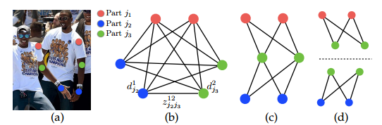

# 组会讲稿

## Background

### Top-down

**Top-down 方法** 先检测图像中的每个人的边界框，然后对每个检测到的个体单独执行关键点检测。这类方法将姿态估计分解为两个子问题：**人体检测** 和 **单人姿态估计**。

**单人姿态估计精度高**：由于在边界框内进行检测，可以专注于单个人的姿态。

**对复杂背景的鲁棒性强**：通过将任务分解为独立模块，可以减少背景对关键点检测的干扰。

**模型成熟度高**：依赖已有成熟的目标检测框架。

**计算成本高**：每检测到一个人都需要单独执行一次姿态估计，计算复杂度随人数线性增加。

**依赖检测器的性能**：如果检测器未正确检测到所有人（如在人群密集场景中），后续的关键点检测会受到影响。

**推理时间长**：尤其在多人场景中，单人姿态估计的重复调用导致效率下降。

### Bottom-up

**Bottom-up 方法** 直接在整张图像中检测所有关键点，然后通过关联策略（如 **Part Affinity Fields (PAFs)**）将属于同一个人的关键点分组。

**效率高**：整个图像仅需一次前向传播，计算复杂度与图像大小相关，而与人数无关。

**多人场景处理能力强**：尤其在人群密集的场景中，不需要单独检测每个人。

**不依赖检测器**：减少了目标检测模块带来的误差传播。

**关键点分组难度高**：复杂场景中的遮挡或关键点重叠可能导致分组错误。

**精度略低于 Top-down 方法**：由于无法聚焦于单个边界框，可能对背景干扰更敏感。

**推理复杂度受关联算法影响**：解析关键点关联（如贪婪解析或图优化）需要额外计算。

### One-stage

**One-stage 方法** 将目标检测和关键点检测整合为一个单一的端到端框架，直接从图像中输出姿态估计结果。

**端到端学习**：简化了流程，避免了传统多阶段方法中模块间的不一致问题。

**推理速度快**：单一网络一次性完成检测和姿态估计，减少了重复计算。

**易于部署**：由于模型整合为一个网络，框架更轻量化。

**多人场景的适配性较弱**：由于直接处理整体图像，可能难以区分密集场景中的个体。

**精度受限**：尤其在需要高精度的场景中，单一网络可能难以达到顶级性能。

### Multi-stage

**Multi-stage 方法** 通过多阶段的迭代优化，在每个阶段逐步细化关键点检测结果，或者在检测基础上增加后续的精炼步骤。

**精度高**：通过逐步细化过程，能够更好地处理复杂场景和细节。

**适应复杂场景**：多阶段优化适合处理非典型姿态或多人交互等复杂情况。

**模块化设计**：可以独立优化每个阶段的模型。

**推理时间长**：由于多阶段处理，每次迭代都需要消耗额外的计算资源。

**训练复杂**：多阶段网络的训练需要仔细调试超参数，并且容易出现梯度不稳定问题。

**效率受限**：难以满足实时应用的需求。

## CPN1

我们用 $Y_p \in Z \subseteq \mathbb{R}^2$ 表示 $P$ 个解剖学标志点（即部位）的像素位置，其中 $Z$ 是图像中的所有 $(u, v)$ 位置的集合。我们的目标是预测所有 $P$ 个部位的位置 $Y = (Y_1, \dots, Y_P)$。

一个姿态机器【29】（见图 2(a) 和 2(b)）由一系列==多类别预测器 $g_t(\cdot)$== 组成，这些预测器被训练用于在层级结构的每一级预测每个部位的位置。在每个阶段 $t \in {1, \dots, T}$ 中，==分类器 $g_t$==用于预测每个部位的信念值，从而为每个部位 $Y_p = z, \forall z \in Z$ 生成belief map：
$$
g_1(x_z) \to \{b_{p1}(Y_p = z)\}_{p \in \{0, \dots, P\}},
$$
其中，==$b_{p1}(Y_p = z)$ 是分类器 $g_1$ 在图像位置 $z$ 为第 $p$ 个部位预测的得分==。我们将所有部位 $p$ 在图像每个位置 $z = (u, v)^T$ 处的信念表示为 $b_{p1} \in \mathbb{R}^{w \times h}$，其中 $w$ 和 $h$ 分别是图像的宽度和高度，即：
$$
b_{pt}[u, v] = b_{pt}(Y_p = z)。
$$
为简化表示，我们将所有部位的belief map集合表示为 $b_t \in \mathbb{R}^{w \times h \times (P+1)}$（==$P$ 个部位加一个背景==）。

在后续阶段中，分类器预测每个部位的信念 $Y_p = z, \forall z \in Z$，此时的输入包括：(1) 图像数据 $x_t^z \in \mathbb{R}^d$ 的特征，以及 (2) 来自上一阶段的分类器的belief map的上下文信息：
$$
g_t(x'_z, \psi_t(z, b_{t-1})) \to \{b_{pt}(Y_p = z)\}_{p \in \{0, \dots, P+1\}}，
$$
其中，$\psi_{t>1}(\cdot)$ 是从 $b_{t-1}$ 到上下文特征的映射。在每个阶段中，计算的belief map会逐步优化每个部位的位置估计。需要注意的是，==后续阶段的图像特征 $x'_z$ 允许不同于第一阶段的图像特征 $x$==。文献【29】中提出的姿态机器使用提升随机森林作为预测器（$g_t$），所有阶段中使用固定的手工设计图像特征（$x' = x$），以及固定的手工设计==上下文特征映射（$\psi_t(\cdot)$）==来捕捉空间上下文。

## CPN2

==第一阶段的belief map是由一个小感受野的网络从局部图像信息中生成的。在第二阶段中，我们设计了一个网络，通过极大地增加有效感受野以捕获长距离的空间交互==。==大感受野==可以通过以下方式实现：

1. **池化操作**，但可能会以精度为代价；
2. **增大卷积核大小**，但会增加模型的参数数量；
3. **增加卷积层的数量**，但可能会导致训练过程中出现梯度消失问题。

我们在图 2(d) 中展示了第二阶段及后续阶段（$t \geq 2$）的网络设计和对应的感受野。在belief map上，我们==使用多层卷积来实现大的感受野，而不是依赖步幅较大的池化操作==。这种设计能够==以较少的模型参数实现大的感受野，同时保持较高的精度==。实验表明，即使在高精度范围内，步幅为 8 的网络与步幅为 4 的网络表现相当，但步幅为 8 的设计更容易实现较大的感受野。

## CPN3

我们通过在网络的每个阶段输出处定义一个损失函数来鼓励网络不断生成这样的表示，==该损失函数最小化预测belief map与理想belief map之间的 $l_2$ 距离==。==对于某个部位 $p$ 的理想belief map记为 $b_p^*(Y_p = z)$，其通过在每个身体部位 $p$ 的真实位置放置高斯峰值生成==。我们在每个阶段 $t$ 的输出处希望最小化的代价函数为：
$$
f_t = \sum_{p=1}^{P+1} \sum_{z \in Z} \| b_p^t(z) - b_p^*(z) \|_2^2。
$$
==完整架构的总体目标是将每个阶段的损失相加==，其表示为：
$$
F = \sum_{t=1}^T f_t。
$$
我们使用标准的随机梯度下降（Stochastic Gradient Descent, SGD）对网络的所有 $T$ 个阶段进行联合训练。为了在所有后续阶段共享图像特征 $x'$，我们在 $t \geq 2$ 的阶段中共享对应卷积层的权重（见图2）。

## Hourglass

每个Hourglass module的结构如下图所示，其中每个box都是一个残差结构。可以看到在top-down阶段，对于两个**相邻**分辨率的feature map，我们通过upsampling（这里用的是nearest neighbor upsampling）对较低分辨率的feature map进行上采样，然后通过**skip connection**将bottom-up阶段较高分辨率的feature map拿过来，此时再通过element-wise addition将这两部分特征进行合并。通过这种方式，在top-down阶段将不同分辨率下的特征逐步进行了融合。

## CPN1

我们的网络架构包括两个阶段：GlobalNet 和 RefineNet。==GlobalNet基于特征金字塔网络[24]学习良好的特征表示==。更重要的是，金字塔特征表示能够提供足够的上下文信息，这是推理遮挡和不可见关节所必需的。基于金字塔特征，==RefineNet通过在线难关键点挖掘损失显式地处理这些“难”关键点==。

## CPN2

### **GlobalNet 的结构**

1. **基于 ResNet 的网络架构**：
   - **GlobalNet** 通常基于成熟的卷积神经网络架构，如 **ResNet**，作为骨干网络。ResNet 的不同卷积层会生成不同尺度的特征图，例如 C2,C3,C4,C5C_2, C_3, C_4, C_5C2,C3,C4,C5 层，每一层的特征图提供了不同层次的空间分辨率和语义信息。
   - 浅层特征（如 C2C_2C2 和 C3C_3C3）包含较多的细节信息，但语义信息较少；而深层特征（如 C4C_4C4 和 C5C_5C5）包含丰富的语义信息，但空间分辨率较低。
2. **特征金字塔结构**：
   - 在 **GlobalNet** 中，采用了一种类似于 **特征金字塔网络（FPN）** 的结构，逐步提取不同尺度的特征。通过上采样和下采样操作，**GlobalNet** 融合了不同层次的特征图，增强了对图像中目标的全局上下文理解。
   - 在 **GlobalNet** 中，上采样和下采样层的融合有助于同时保持较高的空间分辨率和丰富的语义信息。
3. **多尺度特征融合**：
   - **GlobalNet** 通过融合不同尺度的特征图来处理多尺度目标，确保网络能够同时识别大目标和小目标，尤其是在复杂场景中的小关节点（如手指、脚趾等）的定位。
   - 在网络的不同层次，浅层特征负责提供细节信息，深层特征负责提供全局语义信息。通过融合这些信息，GlobalNet 能够提高关节定位的准确性。
4. **特征整合与逐元素相加**：
   - 在多尺度特征融合过程中，**GlobalNet** 在不同特征图之间进行逐元素相加（element-wise addition），确保每个层的特征信息都能够有效传递到后续层。
   - 为了确保通道数匹配，通常使用 **$1 \times 1$ 卷积** 来调整不同层特征图的通道数，从而使得它们能够顺利进行相加操作。

## CPN3

### **RefineNet 的工作流程**

假设输入图像的大小为 $512 \times 512$：

1. **特征提取**：
   - 使用 ResNet 提取不同层次的特征（例如 $C2$, $C3$, $C4$, $C5$）。
   - 特征分辨率从高到低，语义信息从弱到强。
2. **特征细化**：
   - 将深层特征（低分辨率，强语义）通过上采样恢复到更高分辨率。
   - 与对应浅层特征进行融合，结合语义和细节信息。
3. **逐步细化**：
   - 多层 RefineNet 模块串联，逐层细化特征。
   - 最终生成高分辨率的分割预测。
4. **分割结果**：
   - 输出与原图分辨率一致的分割图，每个像素点对应一个类别标签。

为了更高效地利用特征，RefineNet 在较深层次添加了更多瓶颈块（Bottleneck Blocks），以在空间分辨率较低的层级上实现性能和效率的平衡。

## RTMO1

我们的模型采用类似 YOLO 的架构（如图2所示）。主干网络使用 **CSPDarknet**【10】，并通过一个混合编码器【29】处理最后三层特征图

## RTMO2

==现有的坐标分类方法存在一个显著问题，即它们采用静态的区间分配策略==。

为了解决这一问题，我们提出了**动态坐标分类器（DCC）**，通过在两个 1D 热图中动态分配区间范围并生成区间表示，解决了==坐标分类在密集预测场景中的不兼容性==。

#### 动态区间分配

顶部-底部姿态估计器中的坐标分类技术通常在整个输入图像上分配区间【16, 23】，但==在单阶段方法中，由于每个目标仅占据图像的一小部分，这种策略会导致大量区间的浪费==。DFL【21】尝试在锚点附近的预定义范围内分配区间，但可能会漏掉大实例的关键点，并对小实例产生显著的量化误差。

==DCC 通过动态分配区间以对齐每个实例的边界框，从而确保局部化覆盖==。边界框最初通过点卷积层回归生成，并扩展 1.25 倍以覆盖所有关键点，即使在预测不准确的情况下。这些扩展后的边界框在水平和垂直方向上均匀划分为 $B_x$ 和 $B_y$ 个区间。水平轴上每个区间的 $x$ 坐标计算如下：
$$
x_i = x_l + \frac{(x_r - x_l) \cdot (i - 1)}{B_x - 1}
$$

其中，$x_r$ 和 $x_l$ 分别表示边界框的右边界和左边界，i 为区间索引，从 1 到 $B_x$。垂直方向的计算方法与此类似。

#### 动态区间编码

在 DCC 中，每个网格的区间位置因其预测的边界框不同而变化，这与以前的固定区间坐标方法【16, 23】不同。传统方法为所有网格共享区间表示，而==DCC 在每次推理时动态生成区间表示==。我们通过将每个区间的坐标编码为位置编码（Positional Encoding）来生成区间特定的表示。具体来说，位置编码采用如下公式：
$$
[\text{PE}(x_i)]_c = \begin{cases}  \sin\left(\frac{x_i}{t^{c/C}}\right), & \text{当 } c \text{ 是偶数时} \\ \cos\left(\frac{x_i}{t^{(c-1)/C}}\right), & \text{当 } c \text{ 是奇数时}  \end{cases}
$$

其中，$t$ 是温度参数，$c$ 是索引，$C$ 是总维度数。我们通过一个可学习的线性变换优化位置编码的适应性。

动态坐标分类器的主要目标是==根据区间坐标和关键点特征准确预测每个区间中关键点出现的概率==。关键点特征由姿态特征中提取，并通过门控注意单元（Gated Attention Unit, GAU）模块进一步优化，以增强关键点之间的一致性。概率热图通过关键点特征与区间位置编码的相似性计算生成，公式如下：
$$
\hat{p}_k(x_i) = \frac{e^{f_k \cdot \phi(\text{PE}(x_i))}}{\sum_{j=1}^{B_x} e^{f_k \cdot \phi(\text{PE}(x_j))}}
$$

其中，$f_k$ 表示第 $k$ 个关键点的特征向量。

## RTMO3

基于最大似然估计的坐标分类

在分类任务中，通常使用 one-hot 目标和交叉熵损失进行优化。为了提高性能，一些方法采用标签平滑技术，例如 SimCC【23】和 RTMPose【16】中的高斯标签平滑，与 KLD 结合使用。高斯分布的均值 $\mu_x, \mu_y$ 和方差 $\sigma^2$ 被设为注释坐标和预定义参数，其目标分布为：
$$
p_k(x_i | \mu_x) = \frac{1}{\sqrt{2\pi}\sigma} e^{-\frac{(x_i - \mu_x)^2}{2\sigma^2}}
$$

重要的是，我们注意到 $p_k(x_i \mid \mu_x)$ 数学上等价于在高斯误差模型下，真实值 $x_i$ 的似然估计 $p_k(\mu_x \mid x_i)$。

这种对称性源于高斯分布关于其均值对称的特性。因此可以用负对数似然损失来优化：
$$
L_{mle}^{(x)} = -\log \left[ \sum_{i=1}^{B_x} \frac{1}{\sigma} e^{-\frac{|x_i - \mu_x|}{2\sigma s}} \hat{p}_k(x_i) \right]
$$

其中，$s$ 是实例大小的归一化参数，$\sigma$ 是可预测的方差。最大化该似然值能够建模标注数据的真实分布。总损失为：
$$
L_{mle} = L_{mle}^{(x)} + L_{mle}^{(y)}
$$

与 KLD 不同，MLE 损失允许学习方差以表示不确定性，从而自适应调整困难样本和简单样本的优化。

## OpenPose1

图 2 说明了我们方法的整体流程。系统以一张尺寸为 $w \times h$ 的彩色图像作为输入（图 2a），输出每个人的解剖关键点的二维位置（图 2e）。首先，前馈网络预测一组用于检测==身体部位位置的二维置信度图 $S$==（图 2b），以及一组用于==编码身体部位之间关联程度的二维矢量场 $L$，即部分亲和域（Part Affinity Fields, PAFs）==（图 2c）。集合 $S = (S_1, S_2, \dots, S_J)$ 包含 $J$ 个置信度图，每个部位对应一个置信度图，其中：
$$
S_j \in \mathbb{R}^{w \times h}, \quad j \in {1, \dots, J}.
$$
集合 $L = (L_1, L_2, \dots, L_C)$ 包含 $C$ 个矢量场，每个肢体对应一个矢量场，其中：
$$
L_c \in \mathbb{R}^{w \times h \times 2}, \quad c \in {1, \dots, C}.
$$
每张图片中 ==$L_c$ 的每个位置编码了一个二维矢量==（图 1）。最后，通过贪婪推理算法解析置信度图和 PAFs，输出图中每个人的二维关键点。

## OpenPose3

图像首先通过 CNN（由 VGG-19 [53] 的前 10 层初始化并微调）生成一组特征图 $F$，作为第一个阶段的输入。在第一个阶段，网络生成一组部分亲和域（PAFs），即：
$$
L^1 = \phi_1(F),
$$
其中 $\phi_1$ 表示第 1 阶段的 CNN 推理。之后的每个阶段中，将前一阶段的预测结果与原始图像特征 $F$ 进行连接，并用于生成更精确的预测：
$$
L^t = \phi_t(F, L^{t-1}), \forall 2 \leq t \leq T_P,
$$
其中 $\phi_t$ 表示第 $t$ 阶段的 CNN 推理，$T_P$ 为 PAF 阶段的总数。在 $T_P$ 次迭代后，==置信度图检测的过程基于最新的 PAF 预测结果开始==：
$$
S^{T_P} = \rho_t(F, L^{T_P}), \forall t = T_P, \\
S^t = \rho_t(F, L^{T_P}, S^{t-1}), \forall T_P < t \leq T_P + T_C,
$$
其中 $\rho_t$ 表示第 $t$ 阶段的 CNN 推理，$T_C$ 为置信度图阶段的总数。

这种方法不同于 [3]，==在 [3] 中，PAF 和置信度图（confidence map）的分支都在每个阶段进行了细化。因此，每个阶段的计算量减少了一半。==我们在 5.2 节中实证观察到，==细化的亲和域预测会提升置信度图的结果，而反之则不会==。==从直觉上讲，如果观察 PAF 通道的输出，可以推测身体部位的位置。然而，如果仅看到一堆身体部位而没有其他信息，我们无法将它们解析为不同的个体。==

为了指导网络在第一个分支中迭代预测身体部位的 PAF，并在第二个分支中预测置信度图，我们在每个阶段的末尾应用损失函数。我们使用 $L_2$ 损失在估计的预测与ground truth映射和字段之间进行比较。在这里，我们==对损失函数进行空间加权，以应对一个实际问题，即某些数据集并未完全标注所有人==。具体来说，第 $t_i$ 阶段的 PAF 分支的损失函数和第 $t_k$ 阶段的置信度图分支的损失函数为：
$$
f_L^{t_i} = \sum_p \sum_{c=1}^C W(p) \cdot \| L_c^{t_i}(p) - L_c^*(p) \|_2^2, \tag{4}
$$

$$
f_S^{t_k} = \sum_p \sum_{j=1}^J W(p) \cdot \| S_j^{t_k}(p) - S_j^*(p) \|_2^2, \tag{5}
$$

其中 $L_c^*$ 是地面真值 PAF，$S_j^*$ 是地面真值部位置信度图，$W$ 是一个二进制掩码，当==像素 $p$ 处==的注释缺失时，$W(p) = 0$。==掩码用于避免在训练中惩罚真实正例的预测结果==。

每个阶段的中间监督通过定期补充梯度，解决了梯度消失问题 [20]。总体目标是：
$$
f = \sum_{t=1}^{T_P} f_L^{t} + \sum_{t=T_P+1}^{T_P+T_C} f_S^{t}. \tag{6}
$$

------

## OpenPose4

在训练过程中，为了计算式（6）中的 $f_S$，我们从标注的二维关键点生成置信度图 $S^*$。每个置信度图是一种二维表示，描述某一特定身体部位可能出现在任意像素的概率分布。对于每个标注的人物 $k$ 和身体部位 $j$，置信度图 $S^*_{j,k}$ 的值在位置 $p \in \mathbb{R}^2$ 处定义为：
$$
S^*_{j,k}(p) = \exp \left( -\frac{|p - x_{j,k}|^2_2}{\sigma^2} \right),
$$
其中 $x_{j,k}$ 是人物 $k$ 的身体部位 $j$ 的标注位置，$\sigma$ 控制分布的扩散范围。最终的置信度图通过对单个人置信度图的最大值运算得到：
$$
S^*_j(p) = \max_k S^*_{j,k}(p).
$$
在测试时，通过置信度图生成身体部位候选点，并通过非极大值抑制进行优化。

## OpenPose5

给定一组检测到的身体部位（如图 5a 中的红点和蓝点所示），我们需要将这些部位组合起来，形成一个未知人数的完整身体姿态。为此，我们需要每对身体部位检测的关联置信度，即它们是否属于同一个人。

一种可能的关联度量方法是，在每对部位之间检测一个额外的中点，并检查其与候选部位检测之间的关联性，如图 5b 所示。然而，当人群密集时——这很常见——这些中点可能支持错误的关联（图 5b 中的绿色线表示这种错误关联）。这种错误关联主要由两种表示局限性引起：

1. 它仅编码了每个肢体的位置，而未编码其方向。
2. 它将肢体的支持区域减少为一个点。

**部分亲和域（PAFs）** 解决了这些局限性。它们==在肢体的支持区域内保留了位置和方向信息（如图 5c 所示）==。==每个 PAF 是对应肢体的一个二维矢量场==（如图 1d 所示）。对于属于特定肢体区域的每个像素，一个二维矢量编码从肢体的一端指向另一端的方向。==每种类型的肢体都有一个相应的 PAF，用于连接其两个关联的身体部位。==

考虑图中展示的一个单一肢体。设 $x_{j1,k}$ 和 $x_{j2,k}$ 为图像中肢体 $c$ 的部位 $j1$ 和 $j2$ 的真实位置。==如果点 $p$ 位于该肢体上，则 $L^*_{c,k}(p)$ 的值是一个指向 $j1$ 和 $j2$ 的单位向量；对于其他点，该向量的值为零。==

训练过程中，为了计算公式 (6) 中的 $f_L$，我们定义了图像点 $p$ 处的真实 PAF $L^*_{c,k}$ 为：

$$
L^*_{c,k}(p) =
\begin{cases} 
v & \text{如果 } p \text{ 在肢体 } c,k \text{ 上}, \\
0 & \text{否则},
\end{cases}
$$

其中 ==$v = \frac{x_{j2,k} - x_{j1,k}}{\|x_{j2,k} - x_{j1,k}\|_2}$ 是指向肢体方向的单位向量==。肢体上的点集定义为那些距离线段在一定阈值范围内的点，即满足以下条件的点 $p$：

1. $0 \leq v \cdot (p - x_{j1,k}) \leq l_{c,k}$，且
2. $|v^\perp \cdot (p - x_{j1,k})| \leq \sigma_l$，

其中==肢体宽度 $\sigma_l$== 以像素为单位，==肢体长度为 $l_{c,k} = \|x_{j2,k} - x_{j1,k}\|_2$==，$v^\perp$ 是垂直于 $v$ 的向量。

对于图像中的所有人，真实的部分亲和域通过所有人的亲和域取平均值计算：

$$
L^*_c(p) = \frac{1}{n_c(p)} \sum_k L^*_{c,k}(p),
$$

其中 $n_c(p)$ 是点 $p$ 处所有 $k$ 个非零向量的数量。

## OpenPose6

在测试时，我们通过计算==沿连接候选部位位置的线段的线积分来测量候选部位检测之间的关联性==。在这种方法中，PAF 的预测值与由检测的身体部位形成的候选肢体进行对齐，从而计算其关联置信度。具体而言，对于两个候选部位位置 $d_{j1}$ 和 $d_{j2}$，我们沿着线段采样预测的部分亲和域 $L_c$，以测量它们的关联置信度：

$$
E = \int_{u=0}^{u=1} L_c(p(u)) \cdot \frac{d_{j2} - d_{j1}}{\|d_{j2} - d_{j1}\|_2} du, \tag{11}
$$

其中 $p(u)$ 是两身体部位 $d_{j1}$ 和 $d_{j2}$ 位置的插值：

$$
p(u) = (1 - u) d_{j1} + u d_{j2}.
$$

在实际操作中，我们通过对 $u$ 进行均匀间隔采样和求和来近似积分。

## OpenPose7

我们在检测置信度图上进行==非极大值抑制（Non-Maximum Suppression, NMS）==，以获得一组离散的部位候选位置。对于每个部位，由于图像中包含多个个体或存在假阳性（见图 6b），可能会存在多个候选点。这些部位候选点定义了一个可能的肢体集合。我们使用式（11）中定义的线积分计算对 PAF 上的每个候选肢体进行评分。==找到最优解析的问题对应于一个 $K$ 维匹配问题，该问题已知是 NP 难的（NP-Hard）（见图 6c）==。在本文中，我们提出了一种贪婪松弛算法，它能够一致地产生高质量的匹配结果。我们推测原因在于成对关联的分数隐式地包含了全局上下文信息，这是由于 PAF 网络的大感受野所致。

我们首先为多个个体获取一组身体部位检测候选点，记为 $D_j = {d_m^j : m \in {1, \dots, N_j}}$，其中 $j \in {1, \dots, J}$ 是部位索引，$N_j$ 是第 $j$ 个部位的候选点数量，而 ==$d_m^j \in \mathbb{R}^2$ 表示第 $j$ 个身体部位的第 $m$ 个候选点的位置==。这些部位候选点仍需要与同一个人的其他部位关联，也就是说，我们需要找到属于同一人的身体部位检测点并将其连接成树结构。我们定义一个变量 $z_{j1j2}^{mn} \in {0, 1}$，表示两个候选检测点 $d_m^{j1}$ 和 $d_n^{j2}$ 是否连接。目标是为所有可能的连接集 $Z = {z_{j1j2}^{mn} : j1, j2 \in {1, \dots, J}, m \in {1, \dots, N_{j1}}, n \in {1, \dots, N_{j2}}}$ 找到最优分配。

如果我们仅考虑一对部位 $j1$ 和 $j2$（例如，脖子和右臀部）对应的 $c$ 型肢体，那么找到最优关联可以简化为一个==加权最大匹配的二分图问题（见图 5b）==。在此图匹配问题中，图的节点是身体部位检测候选点 $D_{j1}$ 和 $D_{j2}$，边表示所有候选部位对之间的可能连接。此外，每条边由式（11）加权，即 PAF 的聚合。二分图中的匹配是边的一个子集，这些边以一种方式选择，使得没有两个边共享节点。我们的目标是找到具有最大权重的匹配：
$$
\max_{Z_c} E_c = \max_{Z_c} \sum_{m \in D_{j1}} \sum_{n \in D_{j2}} E_{mn} \cdot z_{j1j2}^{mn} \tag{13}
$$

$$
s.t. \quad \forall m \in D_{j1}, \quad \sum_{n \in D_{j2}} z_{j1j2}^{mn} \leq 1 \tag{14}
$$

$$
\quad \quad \forall n \in D_{j2}, \quad \sum_{m \in D_{j1}} z_{j1j2}^{mn} \leq 1 \tag{15}
$$

其中 $E_c$ 是从类型 $c$ 的肢体匹配中获得的总权重，$Z_c$ 是类型 $c$ 的肢体子集，$E_{mn}$ 是通过式（11）定义的部位 $d_m^{j1}$ 和 $d_n^{j2}$ 的 PAF 权重。

## OpenPose8

==在处理多个个体的全身姿态时，确定 $Z$ 是一个 $K$ 维匹配问题==。这个问题是 NP 难的 [54]，并且存在许多松弛解。在这项工作中，我们对该问题进行==两种特定于领域的松弛优化==。首先，我们==选择最小数量的边来获得一个连接骨架（spanning tree），而不是使用完整图==，如图 6c 所示。其次，我们==将匹配问题进一步分解为一组二分图匹配子问题，并独立确定相邻树节点之间的匹配==，如图 6d 所示。

第 5.1 节的详细比较结果表明，最小贪婪推理能够以远低于计算成本的代价很好地近似全局解。原因在于，虽然相邻树节点之间的关系由 PAF 明确建模，但非相邻树节点之间的关系被 CNN 隐式建模。这一属性的出现是由于 CNN 在具有大感受野的训练过程中对非相邻节点之间的关系进行了学习，并且非相邻树节点的 PAF 也会影响预测的 PAF。

通过这两个松弛优化，优化目标被简单表述为：
$$
\max_Z E = \sum_{c=1}^C \max_{Z_c} E_c. \tag{16}
$$
因此，我们可以使用式（13）到式（15）分别独立获取每种肢体类型的肢体连接候选点。通过所有肢体连接候选点，可以将共享同一部位的肢体连接组装成多人的全身姿态。我们的树结构优化方案的速度比完整图的优化快几个数量级 [1,2]。

## ViTPose2

**核心组件少**：ViTPose 的架构主要由三个核心模块组成：

1. **Patch Embedding**：用于将图像切分并转换为序列形式。
2. **Transformer 编码器**：以标准的 Vision Transformer 结构提取全局特征。
3. **解码器**：通过简单的上采样和卷积生成热图。

**无额外复杂模块**：不依赖于特定的任务定制化设计，如额外的特征融合模块、分层设计或多阶段优化。

由于 ViTPose 的结构简单性，用户可以根据部署需求在图 1 中选择Pareto前沿的某一点，并==通过堆叠不同数量的 Transformer 层或调整特征维度轻松控制模型的规模==。因此，ViTPose 可以从快速发展的可扩展预训练视觉Transformer中获益，而对其他部分无需进行较大修改。

**数据灵活性**

- 多数据集联合训练

  ：

  - 支持在单个数据集（如 MS COCO）上训练，也能够通过联合多个数据集（如 COCO + AI Challenger）提升模型泛化能力。

- 适应不同规模的数据

  ：

  - 在大规模数据上表现卓越，同时支持通过迁移学习在小规模数据上高效应用。

**分辨率灵活性**

- 支持多分辨率输入

  ：

  - ViTPose 能够处理从低分辨率到高分辨率的图像输入，适应不同任务对细节捕捉的需求。
  - 高分辨率输入有助于在复杂场景中提供更高的关键点定位精度。

**注意力类型的灵活性**：在更高分辨率的特征图上使用全局注意力会带来巨大的内存占用和计算成本，因为注意力计算的计算复杂度和内存消耗是二次增长的。为了解决内存问题，我们采用了==基于窗口的注意力（Window Attention）和相对位置嵌入 [25, 26] 方法==。然而，仅仅为所有 Transformer 层使用基于窗口的注意力会降低性能，因为缺乏全局上下文建模能力。

为了解决这一问题，我们采用了两种技术：

1. **==移动窗口（Shift Window）==**：与使用固定窗口进行注意力计算不同，我们采用了移动窗口机制 [31]，以帮助在相邻窗口之间传播信息。
2. **==池化窗口（Pooling Window）==**：除了移动窗口机制外，我们还尝试了另一种解决方案，即通过池化操作为每个窗口提取全局上下文特征。这些特征随后被馈送到每个窗口，作为 key 和 value token，从而实现跨窗口的特征通信。

此外，我们证明了这两种策略是互补的，可以结合起来通过简单修改注意力计算提高性能并减少内存占用，而无需额外的参数或模块。

**微调的灵活性**：正如 NLP 领域中的研究所示 [30, 2]，预训练的 Transformer 模型可以通过调整部分参数很好地泛化到其他任务。为了研究这一特性是否适用于视觉Transformer，我们在 MS COCO 数据集上分别在以下三种设置下微调 ViTPose：

1. 解冻所有参数；
2. 冻结多头自注意力（MHSA）模块；
3. 冻结前馈网络（FFN）模块。

实验表明，即使冻结 MHSA 模块，ViTPose 仍能取得与完全微调设置接近的性能，这表明 MHSA 模块更倾向于任务无关的建模，例如在 MIM 预训练任务或特定姿态估计任务中基于特征相似性建模 token 的关系。

**任务的灵活性**：由于 ViTPose 的解码器非常简单且轻量，我们可以采用多个解码器来处理多个姿态估计数据集，而无需过多的额外开销。这些解码器可以共享骨干编码器。我们从多个训练数据集中随机采样实例，每次迭代将其输入到骨干网络和解码器中，以估计对应数据集的热图。

这种多样化的蒸馏方法，充分利用了 Transformer 架构中 **Token 表示能力** 和 **全局特征建模能力**，为学生网络的优化提供了多层次的知识迁移途径，从而实现了 **性能与效率的双赢**。