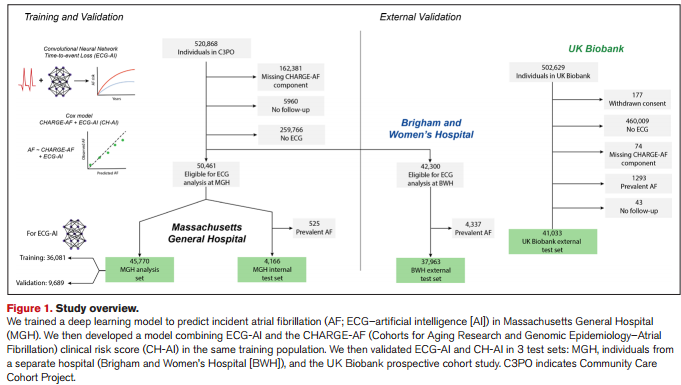

# ECG-Based Deep Learning and Clinical Risk Factors to Predict Atrial Fibrillation

## 摘要

### 背景：
人工智能（AI）支持的12导联心电图（ECG）分析可以促进对新发房颤（AF）风险的高效估计。然而，尚不清楚AI是否能够在预测准确性方面提供超越房颤临床风险因素的有意义且可推广的改进。

### 方法：
我们训练了一个卷积神经网络（ECG-AI），利用12导联心电图推测在马萨诸塞总医院（MGH）接受长期初级保健的患者5年内新发房颤的风险。随后，我们拟合了3个Cox比例风险模型，分别由ECG-AI的5年房颤发生概率、CHARGE-AF临床风险评分（来自心脏和老年基因流行病学队列的房颤风险评分）以及同时包含ECG-AI和CHARGE-AF项（CH-AI）的模型组成。我们通过计算区分度（接收者操作特征曲线下的面积）和校准度，在内部测试集和两个外部测试集（布莱根妇女医院[BWH]和英国生物银行[UK Biobank]）中评估模型性能。由于英国生物银行的随访数据有限，模型被重新校准以估算2年内的房颤风险。我们使用显著性映射来识别对ECG-AI风险预测影响最大的心电图特征，并评估了ECG-AI与CHARGE-AF线性预测因子的相关性。

### 结果：
训练集包括45770名个体（平均年龄55±17岁，53%为女性，2171例房颤事件），测试集包括83162名个体（平均年龄59±13岁，56%为女性，2424例房颤事件）。CHARGE-AF的接收者操作特征曲线下面积（AUC）分别为：MGH 0.802（95% CI, 0.767–0.836）；BWH 0.752（95% CI, 0.741–0.763）；英国生物银行 0.732（95% CI, 0.704–0.759）；ECG-AI的AUC分别为：MGH 0.823（95% CI, 0.790–0.856）；BWH 0.747（95% CI, 0.736–0.759）；英国生物银行 0.705（95% CI, 0.673–0.737）。CH-AI模型的AUC最高，分别为：MGH 0.838（95% CI, 0.807–0.869）；BWH 0.777（95% CI, 0.766–0.788）；英国生物银行 0.746（95% CI, 0.716–0.776）。使用ECG-AI的校准误差分别为：MGH 0.0212；BWH 0.0129；英国生物银行 0.0035；使用CH-AI的校准误差分别为：MGH 0.012；BWH 0.0108；英国生物银行 0.0001。在显著性分析中，P波对AI模型预测的影响最大。ECG-AI与CHARGE-AF的线性预测因子相关（Pearson相关系数：MGH 0.61；BWH 0.66；英国生物银行 0.41）。

### 结论：
基于AI的12导联心电图分析在预测新发房颤风险方面与临床风险因素模型具有相似的实用性，且两种方法具有互补性。ECG-AI可能有助于高效量化未来房颤的风险。

**关键词：**房颤、深度学习、电子病历

## 创新点

1. 基于人工智能的12导联心电图分析与已建立的房颤（AF）临床风险因素模型具有相似的预测有用性，两者是互补的。
2. AF的ECG人工智能模型在独立研究样本中具有预测有用性，可区分心力衰竭和中风患者的风险，并适用于单导联ECG描记。

## 临床意义

1. 使用12导联ECG的基于人工智能的AF风险预测模型可以有效量化未来的AF风险。
2. AF的预测可以使用临床风险因素或基于人工智能的ECG分析来进行，但两者的组合提供了最大的预测准确性

## 引言

房颤（AF）是一种常见的病态房颤。1 -4识别AF风险升高的个体是临床上的当务之急，因为改变生活方式和行为因素可以预防AF 5，6，心律监测可以识别未确诊的AF个体，从而预防中风。7 -9

最近的研究突显了人工智能（AI）从 12 导联心电图预测房颤的潜力。首先，现有模型尚未明确纳入无事件生存或普查，而这对于准确估计绝对风险非常重要。其次，目前尚不清楚人工智能是否补充或扩展了经过充分验证的房颤临床风险因素模型，这些模型不需要确定心电图来预测风险，如 CHARGE-AF 评分（基因组流行病学中的心脏和衰老研究队列-房颤）。第四，以前的模型都是专有的，没有经过严格的外部验证。11，12

在当前研究中，我们训练了一个卷积神经网络，以明确预测在马萨诸塞州总医院（MGH）接受纵向初级护理的>40000人样本中的房颤事件时间（ECG-AI）。我们在来自3个独立测试集的>80000个个体中验证了该模型，包括来自MGH的额外个体，在单独的医疗机构接受纵向初级护理的个体。布里格姆妇女医院（Brigham and Women's Hospital）以及前瞻性队列研究的参与者（英国生物银行）。然后，我们比较了ECG-AI与CHARGEAF的预测准确性，并检查了包括ECG-AI和CHARGE-AF（CH-AI）的模型的性能我们还检查了ECG的哪些区域对预测AF的ECG-AI模型性能影响最大。

## 非标准缩略语和首字母缩略词

AF房颤

AI人工智能

AP平均精度

AUROC受试者工作特征曲线下面积

BWH布莱根妇女医院

CH-AI  CHARGE-AF（老龄化研究和基因组流行病学队列-房颤）和ECG-AI

CHARGE-AF 老龄化研究和基因组流行病学队列研究-心房颤动

EHR电子健康记录

HR风险比

ICI综合校准指数

MGB Mass General Brigham 

MGH Massachusetts General Hospital

NRI 净重新分类改善

## 方法

### 数据可用性

英国生物库数据可通过应用程序公开获取（www.ukbiobank.ac.uk）。MGH和BWH数据包含受保护的健康信息，不能公开共享。用于执行本文所述分析的数据处理脚本可在https://github.com/shaankhurshid/ecg_ai获得。

### 研究人群

我们在社区护理队列项目（C3 PO）中对ECG-AI进行了培训和验证，该数据集包括2000年至2019年期间在马萨诸塞州总布里格姆（MGB）网络内接受纵向初级保健的18至90岁患者。18如果在MGB网络内的7家医院中的任何一家医院接受了≥2次间隔1至3年的初级保健访视，则将其纳入。所有这些都链接到一个共同的电子健康记录（EHR）数据库。19随访在纳入窗口期后开始，包括从EHR到8月31日确定的数据，2019.在开始随访前3年内在MGH进行≥1次ECG的个体中培训ECG-AI ECG-AI然后在包括来自MGH的4166个个体的独立测试集中进行评估。（内部测试集）和一组单独的37963名在3年基线期内在BWH进行≥1次ECG的个体（图1）。

我们在英国生物样本库中进行了额外的外部验证，这是一个前瞻性队列，在2006年至2010年期间招募了502629名参与者。20约有920万40至69岁的人居住在英格兰，威尔士和苏格兰的22个评估中心的25英里范围内，其中5.4%参与了基线评估。在招募时收集了生物样本，并在一个大的子集中进行了诊断测试。使用国家数据集（更新至2021年3月31日）跟踪参与者的健康结果。我们分析了所有接受标准化研究12导联ECG的个体。分析样本的概述见图1。

英国生物样本库已获得英国生物样本库研究伦理委员会的批准（参考11/NW/0382）。所有英国生物样本库参与者均提供了书面知情同意书。MGB和英国生物样本库（申请7089）数据的使用已获得MGB机构审查委员会的批准。

### ECG采集和ECG-AI训练

ECG-AI是一种经过训练的卷积神经网络，用于预测5年无房颤生存率。==ECG-AI的输入是单个12导联ECG==，包含以500 Hz采样的12导联中每一导联的5000个电压测量值的时间序列，持续时间为10秒。对少数采样率较低的心电图进行线性重采样至 500 Hz，并对持续时间较短的心电图进行 0 填充，使其包含 5000 个测量值，从而得到 ==5000 x 12 维的统一输入张量==。从MUSE心脏病学信息系统中提取原始波形数据以及表格元数据，包括日期、时间、机器类型、采样频率以及自动读数和医生读数（GE Healthcare），存储MGB内进行的所有心电图的数据。MGH和BWH内分析的所有心电图均出于临床目的进行;作为研究方案的一部分，在英国生物样本库中前瞻性地进行ECG检查。没有ECG根据特定结果从训练或测试集中排除。

==ECG-AI 采用的不是二元分类法10,11 ，而是编码和损失函数21 ，既考虑了结果（即房颤）发生的时间，也考虑了普查（定义为最早的死亡或随访丢失）带来的遗漏。==为此，==ECG-AI 编码将时间划分为离散的时间段，在这些时间段内，房颤事件或剔除事件均有可能发生，而损失函数优化了每个时间段内预测房颤发生的负对数可能性==。这样，剔除的个体就不会对剔除后发生的时间分段造成损失（更多详情见补充方法）。在训练时，ECG-AI 会接触到随访开始前 3 年内进行的所有 12 导联心电图。在评估时，ECG-AI 仅使用 MGH/BWH 随访开始前的最新心电图和英国生物库的单次研究访问心电图进行测试。由于诊断为房颤的患者的窦性心律心电图可能包含有用的训练信号（即提供了房颤相关窦性心律变化的实例）10 ，因此我们将有房颤病史的患者纳入了模型训练。然而，我们仅对无房颤病史的个体进行了心电图-AI 评估。除了事件房颤预测外，我们还训练 ECG-AI 执行三项相关任务（年龄估计、性别分类和跟踪中的房颤识别），因为我们观察到，与其他模型构建方法相比，多任务方法提高了房颤预测性能。

### 临床因素

我们计算了所有个体的CHARGE-AF（一种有效的AF预测工具）。13，14，17从EHR获得基线年龄、性别、种族、身高、体重和血压值。18使用药物列表确定抗高血压药物的使用。14将烟草使用分为存在或不存在。种族分为白色或非白色，如先前使用CHARGE-AF确定的。14，22心力衰竭、糖尿病和心肌梗死的存在是使用先前发表的诊断代码和药物（例如，降糖药）确定的，MGH和BWH中每种疾病的阳性预测值≥85%。14，23我们在所有分析中使用了完整的病例方法（图1）。

### Outcomes（研究结果）
主要结果是新发房颤（AF）。房扑被视为等同于房颤。在MGH和BWH，新发房颤的定义基于一个先前发表的房颤算法，该算法结合了诊断代码、手术代码和心电图报告（修改后的房颤算法），其房颤的阳性预测值为92%【24】。在英国生物银行，房颤的定义使用了先前发表的一组自我报告的诊断、住院诊断代码和手术代码。虽然在英国生物银行中无法进行直接验证，但房颤定义此前在一个外部数据集中评估，其阳性预测值同样为92%【25】。每个房颤定义的详细信息在表S3中展示。

### Statistical Analysis（统计分析）
与先前的CHARGE-AF算法推导一致【13】，我们定义新发房颤（AF）发生的时间为5年（在MGH和BWH数据集中）。由于英国生物银行的随访时间有限（中位数2.8年[四分位数1.9，四分位数3.4]）【13】，我们将新发房颤的结局时间设定为2年。==ECG-AI用于训练推算5年房颤风险==。我们使用CHARGE-AF得分计算了5年房颤风险，该得分是通过==Cox比例风险模型==推导出的CHARGE-AF评分【13】。为了比较ECG-AI与CHARGE-AF（通过Cox比例风险模型推导的评分），我们在MGH训练集中拟合了3个Cox比例风险模型，分别是：（1）仅使用ECG-AI的模型、（2）仅使用CHARGE-AF评分的模型、（3）同时包含ECG-AI和CHARGE-AF（CH-AI）的模型。模型使用的调整项为年龄和性别。虽然ECG-AI和CHARGE-AF评分是非线性关系，但通过对数转换后，我们实现了与对数危害比的线性关系【16】。在次级分析中，我们还评估了CH-AI的一个版本，该版本将每个CHARGE-AF的组成部分作为一个单独的协变量。 

在每个测试集中，我们通过计算时间依赖的接收者操作特征曲线（AUROC）来评估模型区分度【27】。由于AUROC可能对时间相关结果的模型预测具有误导性，我们还使用时间依赖的准确度（AP）进行区分度评估【27】。

### Results（结果）
#### Training and Validation Samples（训练和验证样本）
MGH数据集中，共有45770名符合条件的患者参与研究（平均年龄55岁，53%为女性），其中分为训练集（n=36081）和验证集（n=9689）用于ECG-AI模型的训练。训练集包括100954份12导联心电图（每名患者中位数3份心电图，四分位数1, 3）。CH-AI和CHARGE-AF的风险估计显示ECG-AI和CHARGE-AF的风险评分具有良好的预测性能，且无显著交互作用（P=0.60）。

我们在3个独立的测试集中评估了每个模型的性能：MGH（n=4166），BWH（n=37963），以及英国生物银行（n=41033）。MGH和BWH的发病率明显高于英国生物银行。MGH的房颤发病率为12.8每1000人年（95% CI, 11.0–14.5），BWH的发病率为12.9（95% CI, 12.3–13.4），而英国生物银行则为4.2（95% CI, 3.7–4.7）。

#### Discrimination（区分度）
ECG-AI显示出适度的房颤区分能力（AUROC：MGH, 0.823；BWH, 0.743；UK Biobank, 0.705），与CHARGE-AF评分相当（MGH, 0.802；BWH, 0.752；UK Biobank, 0.732）。结合CH-AI，区分能力更高（MGH, 0.838；BWH, 0.777；UK Biobank, 0.746）。尽管在英国生物样本库中差异无统计学意义（MGH和BWH P<0.05;英国生物样本库P=0.28;表2）。根据AP，辨别力的改善更为显著，其中ECG-AI（0.27，0.19，0.06）和CH-AI（0.30，0.21，0.06）与CHARGE-AF（0.21，0.17，0.02; ECG-AI：P=0.06，P<0.05，P<0.05; CH-AI：P<0.05）相比是有利的。模型识别的总体模式对于1 - 5年之间发生的事件通常是一致的，尽管CH-AI和CHARGEAF的识别倾向于随着预测窗口的延长而增加，而使用ECG-AI的识别倾向于保持不变当在特定阈值下评估时，ECG-AI和CH-AI倾向于在更高特异性下提供更高的精确度。使用ECG-AI（MGH，17.3%; BWH，12.6%; UK Biobank，4.12%）和CH-AI（17.9%，14.6%，4.85%）的精密度显著高于CHARGE-AF（11.0%，12.0%，3.28%;表S6）。

### 校准

CH-AI在MGH中校准良好（综合校准指数0.012）和BWH（0.019），但英国生物库中的风险被高估（0.068;图S4）。给定接近最佳的校准斜率（1.01 [95% CI，0.92-1.10]），高估可能归因于MGH训练集中平均2年AF风险较高（1.48%）对比英国生物样本库因此，在重新校准到UK Biobank中的平均2年AF危害后，UK Biobank中的CH-AI校准非常好（综合标定指数7.1×10-5;图3）。在使用CHARGE-AF和ECG-AI分类为高风险的个体中，AF的累积风险最大，在使用CHARGE-AF和ECG-AI分类为低风险的个体中，AF的累积风险最低，在使用单独的CHARGE-AF或单独的ECG-AI分类为高风险的个体中为中等（图4）。根据使用CH-AI的估计风险分层的AF累积风险见图S6。

### 模型表现

显著性图显示P波及其周围区域对ECG-AI AF风险的影响最大（图5）。中值波形分析特别显示，估计AF风险高的个体倾向于具有较长的P波持续时间，以及略宽的QRS和平坦的ST段（图5）。

### 重新分类和亚组分析

与 CHARGE-AF 相比，CH-AI 在使用标准风险阈值、高风险阈值和连续风险值时显示出良好的 NRI（表 S7-S9 和图 S7）。与 CHARGE-AF 相比，ECG-AI 在使用标准风险阈值或连续风险值时不会产生有利的 NRI，但在使用高风险阈值时会产生有利的再分类（表 S7-S9 和图 S7）。接收者操作特征和精确召回曲线见图 S8。

与 CHARGE-AF 相比，CH-AI 模型性能的提高在心衰和中风患者中基本一致（表 S10），在年龄分组中更为突出（图 S9）。在仅使用导联 I 和单独使用导联 II（单导联心电图的典型向量）建立的模型中，CH-AI 的判别能力仍然高于 CHARGE-AF，但使用 ECG-AI 的判别能力较低（表 S11）。在 MGH 和 BWH，CH-AI 和 ECG-AI 在 2 年房颤风险方面的表现与 5 年房颤风险方面的表现相似（表 S12）。当 ECG-AI 与性别协变量项和 CHARGE-AF 评分的各个组成部分依次拟合时，我们观察到，与单用 ECG-AI 相比，加入年龄和性别可提高辨别能力，而加入 CHARGE-AF 的其他组成部分后，辨别能力进一步提高（表 S13）。使用 ECG-AI、性别和 CHARGE-AF 评分的每个单独成分进行模型拟合，得出的判别结果与 CH-AI 几乎相同，但英国生物库中的校准结果较差（表 S13）。图 S10 显示了 CHARGE-AF 和 ECGAI 风险分层的显著性图。ECG-AI 和 CHARGE-AF 的线性预测因子始终相关（Pearson r：MGH，0.61；BWH，0.66；UK Biobank，0.41；P<0.01）。

## 讨论

我们开发了 ECG-AI，这是一种深度学习模型，能利用 12 导联心电图数据明确预测房颤的发生时间。ECG-AI 的训练使用了来自初级保健队列中超过 4 万人的大约 10 万张心电图。CH-AI是一个结合了ECG-AI和CHARGE-AF的模型，与CHARGEAF相比，CH-AI在3个独立测试集中的多个预后模型指标上都表现出了更好的性能，这些测试集包括临床特征差异很大的超过8万名个体。与 CHARGE-AF 的 11 个分量相比，仅从 ECG-AI 得出的房颤风险估计值就具有相当的区分度。我们进一步观察到，ECG-AI 和 CHARGE-AF 高度相关，这表明 ECG-AI 的大部分预测作用可能反映了心房颤动既有临床风险因素的心电图表现。总的来说，我们的研究结果表明，在预测房颤事件方面，基于深度学习的心电图衍生风险具有与临床风险模型相当的预测作用。此外，我们的研究结果表明，心电图 AI 和临床风险因素可提供互补信息，从而增强房颤预测能力。

Attia 等人10 开发了一种深度学习模型，该模型对正常窦性心律患者房颤状态的分类准确率达 80%。随后，Raghunath 等人11 利用 12 导联心电图开发了一种预测房颤事件的神经网络，1 年后显示出良好的分辨能力，在子集分析中与 CHARGE-AF 相比，性能略有提高。我们的研究结果引入了一个明确包含生存时间的深度学习模型，并进行了严格的流行病学评估，包括判别量化、校准、重新分类和广泛的外部验证，从而对之前的工作有了实质性的补充。我们无法将我们的方法与以前的模型进行直接比较，因为这些模型无法应用到我们的数据中。即使有以前的模型，模型设计上的重要差异（例如，时间到事件模型无法计算标准 c 统计量）也可能会使我们的模型指标无法与以前的模型进行直接比较。尽管如此，我们的结果广泛支持这样一种观点，即使用 12 导联心电图的深度学习模型对确定房颤风险具有重要的预测作用。我们的研究结果还提供了新的证据，证明心电图得出的风险估计值具有普遍性，其预测价值在进行心电图检查后可维持 5 年之久。预测未来 5 年内发生房颤的能力可促进预防性干预措施的实施（例如，酗酒、酗酒和酗酒过度）。

我们的研究结果表明，当使用严格的流行病学指标进行评估时，使用心电图估算房颤风险的深度学习模型在不同人群中是稳健有效的。我们在测试集中对 ECG-AI 进行了评估，测试集包括与训练集来自同一机构的独立个体、同一医疗保健网络中的独立机构以及来自不同大陆的前瞻性研究队列，其中房颤风险要低得多。与之前的研究结果17 一致，心电图人工智能在最接近训练集的人群中表现最佳，而在逐渐不同的样本中辨别力下降，这强调了人工智能模型广泛的外部验证对于评估临床实用性的重要性。最终，我们怀疑辨别力的差异可能与不同的样本特征（如年龄、基线房颤风险）有关，导致特定心电图特征与未来房颤风险之间的关系各不相同。尽管如此，CH-AI 始终优于 CHARGE-AF，而单独的 ECG-AI 始终显示出至少中等程度的辨别力。我们在英国生物库（一个低风险样本）中观察到，使用 CH-AI 估算房颤风险时存在严重的高估。然而，根据基线风险进行简单的重新校准（这是传统预后模型通常需要的过程37）后，校准结果非常好。即使在重新校准后，CHARGE-AF 的校准结果也比 CH-AI 差，这表明深度学习的房颤风险可能会对房颤的预后产生影响。

我们注意到我们的结果对基于深度学习的心电图风险信号与房颤传统临床风险因素之间关系的两个重要影响。首先，临床风险因素似乎以深度学习模型可感知的方式体现在心电图上。在每个测试集中，ECGAI 概率和 CHARGE-AF 评分呈中度相关。通过突出映射和中位波形分析，我们观察到 ECGAI 概率受到心房去极化和复极化周期（即 P 波和周围周期）的重要影响，这是心房结构和功能的反映，可能受到年龄和高血压等慢性疾病的影响38,39。

其次，深度学习模型似乎可以提取与临床风险因素互补的房颤风险要素。CH-AI是一种结合了CHARGE-AF和ECG-AI的模型，与单独的ECG-AI或CHARGE-AF相比，CH-AI在房颤辨别、校准和再分类方面一直表现优异，这表明当临床风险信息与人工智能支持的ECG风险分层相结合时，其预测有用性得到了显著提高。同时根据 ECG-AI 和 CHARGE-AF 被归类为高危人群的房颤风险远远高于单独使用其中一种模型的人群。使用CH-AI和CHARGE-AF的识别率往往随着预测窗口期的延长而增加，这可能与临床风险因素随时间的累积效应有关，而使用ECGAI的识别率往往保持相对稳定，这表明基于心电图的房颤风险在短期预测房颤事件方面的相对贡献可能最大。未来还需要做更多的工作，以更好地描述深度学习在心电图上显示的房颤风险增加的生物学相关性，而不依赖于临床风险因素。

使用单一模式而非复杂的临床评分来估算房颤风险的便利性和外部有效性表明，深度学习模型可能有助于临床应用。虽然临床因素越来越多，但考虑到用户交互要求和输入易被误分类，风险评分功能的实现仍具有挑战性。与此相反，ECG-AI 等模型可实现瞬时房颤风险估计，从而有助于快速识别房颤风险升高的个体，为预防工作提供指导，并通过针对最有可能通过诊断检测发现房颤的个体提高房颤筛查的效率。40 为此，ECG-AI 在临床特别关注的两个人群--房颤和中风--中保持了预测作用，考虑到与房颤相关的发病率和中风高风险，房颤风险评估可能与这两个人群特别相关。此外，ECG-AI 在仅使用单个心电图导联的模型中也有稳定的表现，这表明深度学习可以促进使用可穿戴设备进行房颤风险评估，而可穿戴设备通常都配备了单导联心电图功能。未来的工作需要验证和评估 ECG-AI 在不同临床环境中以及应用于可穿戴心电图时的预测作用。

我们的研究应在其设计背景下进行解读。首先，我们在临床目的下至少进行过一次心电图检查的个体中训练了ECG-AI模型，并且要求这些个体在基线时具备CHARGE-AF评分的所有组成部分。这些要求可能引入选择偏差。然而，分析包含接受长期初级保健的个体的电子健康记录样本可能减少偏差，并且我们的模型在完全独立的前瞻性队列研究中继续有效区分房颤。其次，我们的训练集来自单一机构，在多个机构中使用更大样本进行训练可能会生成更准确、可推广性更强的模型。第三，鉴于UK Biobank的随访时间有限，我们评估了2年（而不是在MGH和BWH的5年）的较短预测窗口。第四，ECG-AI是一个黑箱模型。然而，与之前的房颤预测模型相比，我们使用显著性图和中位波形分析表明，生物学上合理的心电图变化（例如更长的P波持续时间）对房颤风险估计的影响最大。第五，5年的预测窗口可能代表较不立即可行的房颤风险评估。然而，我们的模型在较短的时间窗口内也具有一致的区分能力。我们不能排除ECG-AI识别了未诊断的已有房颤个体的可能性。第六，ECG-AI和CH-AI在UK Biobank中需要重新校准。重新校准在将预测模型转移到不同人群中时经常是必要的，简单的重新校准UK Biobank中的房颤发生率后，产生了非常良好的校准结果，这表明最初的校准错误可能归因于UK Biobank中基线房颤发生率约为MGH和BWH的三分之一。此外，尽管CHARGE-AF在UK Biobank中同样进行了重新校准，CH-AI的校准仍然优于CHARGE-AF。

在跨度大于 800 万人的 3 个独立测试集中，ECG-AI（一种利用 12 导联心电图明确预测房颤发生时间的深度学习模型）与由 11 个成分组成的 CHARGE-AF 临床风险评分相比，对 5 年房颤风险的判别能力相当。CH-AI是一个整合了CHARGE-AF和ECG-AI的模型，在辨别、校准和再分类方面始终处于领先地位。基于深度学习的心电图心房颤动风险信号具有广泛应用的潜力，可在心电图检查后数年内提供准确、可推广的绝对心房颤动风险估计。

## 补充方法

### ECG-AI训练

心电图人工智能的输入是 XML 格式的 12 导联心电图，其中==每个导联表示为 10 秒钟内以 250 或 500Hz 采样的相对电压振幅向量==。采样频率为 250Hz 的心电图被升采样至 500Hz，以实现统一的输入形状。对于在基线窗口内有多个心电图的个体，在每个epoch用于训练的心电图是从该个体的所有心电图中随机选择的。

虽然新发房颤（AF）可以被建模为一个二元分类任务，但==这种方法并未考虑删失（数据不完整性），可能导致样本级别校准不佳==。为了解决这个问题，我们扩展了Gensheimer和Narasimhan提出的方法，==开发并实施了一种编码和损失函数==，该函数同时考虑了由于事件（如AF）和正确的审查所引入的遗漏。==编码将总随访时间划分为n个时间段==，在我们的案例中，n=25，每个时间段跨度约为72天。==每个个体由两个长度为n的二进制向量表示，其中一个表示删除日期的二进制掩码，另一个表示AF事件状态的one-hot编码==。删失向量$V_{\text{censor}}$在个体被删失的时间段中为0，在他们处于风险集中的时间段中为1。事件向量$V_{\text{AF}}$如果在该时间段内发生AF诊断则为1，否则为0。ECG-AI输出长度为n的向量$V_{\text{predict}}$，代表在每个时间段内AF存活的概率。我们的==损失函数最小化了ECG-AI预测的负对数似然==。似然函数分为时间段内幸存个体和发生事件的时间段中的贡献。具体来说，我们最小化以下公式：

$$
L = -\sum \log(L_{\text{survival}} + L_{\text{event}})
$$
其中，

$$
L_{\text{survival}} = 1 - (V_{\text{AF}} * V_{\text{predict}})
$$

$$
L_{\text{event}} = (V_{\text{censor}} * V_{\text{predict}}) + (1 - V_{\text{censor}})
$$

通过这种方式，==删失个体在删失后的时间段中不会对损失做出贡献==（例如，死亡或随访最后时间）。第一个时间段被保留用于记录随访开始前的事件。==该模型为每个时间段预测独立的生存概率（通过sigmoid激活函数）==，因此不假设比例风险，并有助于处理不连续的生存曲线建模。

心电图人工智能==在两个不同的时间尺度（10 秒心电图和 5 年预测生存曲线）之间进行映射==。该映射由==一维卷积神经网络（CNN）==学习，其心电图输入为（5000，12），输出向量为 25 个存活概率，每个时间分段一个。通过贝叶斯超参数优化，选择了包括宽度、深度、激活、归一化和正则化在内的架构超参数。41 性能最好的架构包含超过 1800 万个神经元，使用整流线性单元（ReLU）激活，16 层卷积，每层有 21 个时间步卷积核，密集残差连接，卷积层上的 Poincare 归一化42，最大池化而非平均池化，全连接层中有 208 个神经元（见附图 I）。ECG-AI 采用整顿亚当随机梯度下降法43 进行优化，学习率为 2e4，批量大小为 48，卷积层的辍学率44 为 0.2，全连接层的辍学率为 0.5。使用 Nvidia V100（加利福尼亚州圣克拉拉市）图形处理单元，模型训练在 4 小时后完成。

### 英国生物数据库中的特定位点剔除

在英国生物样本库中，最后一次随访日期取决于链接医院数据的可用性，因此，英格兰和苏格兰登记的参与者的最后一次随访日期被定义为 2021 年 2 月 28 日，威尔士登记的参与者的最后一次随访日期被定义为 2018 年 2 月 28 日。

### 显著性映射

显著性图突出显示了输入电压最小变化导致房颤预测风险最大变化的心电图部分。Saliency 被定义为模型输出相对于输入心电图的梯度。除了在训练过程中梯度是损失函数的梯度而不是模型输出的梯度，以及梯度是相对于模型权重而不是模型输入的梯度外，在模型训练中使用相同的反向传播机制可实现高效计算。这两种情况都依赖于链式法则和 Python 软件包 “Tensorflow ”的自动微分功能。中位心电图波形被叠加在心电图显著性上。QRS 波群检测和双线性插值将所有心电图映射到相同的相位和心率。针对每个人和心动周期中的每个时间分段，计算出这些搏动的中值电压。我们使用类似的方法绘制了随机抽取的 1,000 人的心电图波形中值，这些人属于使用我们的标准风险阈值定义的 ECG-AI 风险二元层（即低 = <2.5% 5 年房颤风险与高 = >5% 5 年房颤风险）。

### 二次分析

我们进行了多项二次分析。首先，鉴于能够生成单导联心电图（ECG）记录的移动设备日益普及，我们分别评估了只提供标准12导联心电图中的导联I和导联II的ECG-AI和CH-AI版本。其次，由于年龄是一个非常强的房颤（AF）风险因素，我们在不同年龄亚组内比较了CH-AI和CHARGE-AF的区分能力，年龄组按样本年龄分布的大致三分位数划分。第三，由于AF风险评估在患有心力衰竭和中风的个体中可能尤为重要，我们分别评估了在心电图时已患有心力衰竭和中风的个体中各模型的表现。由于MGH和UK Biobank测试集中的事件发生率非常有限，我们将此分析限定在BWH测试集内。第四，为了评估ECG-AI行为是否根据临床风险因素负担而变化，我们生成了跨CHARGE-AF风险和ECG-AI风险二元分层的显著性图。第五，我们评估了ECG-AI和CHARGE-AF线性预测变量之间的皮尔逊相关性，作为ECG-AI是否隐含地包含从心电图中提取的临床AF风险因素信息的替代指标。第六，为了量化特定临床风险因素对CH-AI区分能力的相对贡献，我们拟合了Cox比例风险模型，其中协变量按组逐步添加到ECG-AI中。协变量分组添加，具体为：a）年龄和性别，b）年龄、性别、收缩压、舒张压、身高和体重，c）年龄、性别、收缩压、舒张压、身高、体重、白种人、吸烟、高血压药物使用、糖尿病、心肌梗死和心力衰竭（即性别和CHARGE-AF评分的每个组成部分）。