# Explainable detection of myocardial infarction using deep learning models with Grad-CAM technique on ECG signals

## 摘要

心肌梗死（MI）是全球死亡人数最多的疾病。在急性MI中，准确的心电图（ECG）对于在紧急情况下及时诊断和干预非常重要。机器学习越来越多地用于心血管疾病的自动计算机辅助ECG诊断。在这项研究中，我们已经开发了DenseNet和CNN模型，用于根据心肌受累的位置对健康受试者和患有10类MI的患者进行分类。对德国联邦统计局数据库进行预处理，采用R峰检测算法提取心搏信号，分别输入两个模型，两个模型均取得了较高的分类精度（超过95%），DenseNet是分类任务的首选模型，因为它的计算复杂度低，并且由于特征可重用性而比CNN模型具有更高的分类精度。随后将称为Grad-CAM的增强型类别激活映射（CAM）技术应用于两个模型的输出，以使特定ECG导联和ECG波部分的可视化成为可能，这些部分对11个类别的模型做出的预测决策最有影响。据观察，导联V4是DenseNet和CNN模型中激活最多的导联。此外，这项研究还确定了每个类别激活的不同导联和信号部分。这是第一项报告影响MI和健康ECG多类别分类深度模型分类决策的特征的研究。因此，这项研究至关重要，并对医学领域做出了重要贡献，因为它具有一定程度的可见解释性基于模型的内部工作原理，所开发的DenseNet和CNN模型可以获得所需的临床认可，并且有可能在医院和远程院外环境中实现MI诊断的ECG分类。

**关键词**-心肌梗死，DenseNet模型，可解释人工智能，GradCAM，深度学习

## 概述

心血管疾病每年导致1790万人死亡[1]，预计到2030年将增加到2360万人，肥胖，糖尿病和其他风险因素的患病率不断增加[2]。在心血管疾病中，心肌梗死（MI）占死亡的比例最大[3]。MI的发生是由于动脉粥样硬化疾病部位的冠状动脉急性血栓性闭塞，导致心肌坏死[3]。MI的临床表现包括胸痛和呼吸急促[4]，但症状和体征对MI诊断既不敏感也不特异。心肌酶是急性环境中早期诊断的基石，这决定了是否需要紧急干预，然而，心肌酶在急性心肌梗死过程中的早期可能不会升高[5]。因此，反映心脏电活动并将显示心肌梗死诱导心肌缺血期间瞬时形态学变化的ECG信号[6]构成了紧急情况下的一线研究[7]。

手动心电图判读需要领域知识，并且受观察者间差异的影响。在某些情况下，可能无法获得医学专业知识，例如，这促使越来越多的研究使用ECG信号对MI进行人工智能（AI）计算机辅助诊断[5] [6]。机器学习一般可分为特征工程和深度学习方法。前者需要将高级设计输入到手工特征中。相比之下，后者的特征提取和选择过程是完全自动化的，由于其便利性，鲁棒的性能和训练大型数据集的能力而受到欢迎[6]。

## 现有工作中的问题说明和差距

深度模型的主要缺点是缺乏可解释性：模型的内部工作和机制无法解释，预测背后的原理也无法理解[8]。这也是现有文献中的一个重大空白，其中在最近的研究中开发MI检测深度模型的作者都没有解释模型是如何进行预测的。此外，缺乏对这些模型机制的解释也带来了挑战，因为临床医生对在临床环境中使用深度模型来帮助诊断决策失去了信心。因此，为了解决这个问题并弥合现有文献中的差距，我们开发并比较了两种用于MI分类的深度学习模型的性能。之后，我们将称为Grad-CAM的类激活映射（CAM）可视化技术应用于模型输出，以描绘影响预测的ECG信号上的详细位置。

## 深度学习模型

基于人工智能的机器学习已经成为多种疾病的有价值的诊断和预测工具，包括心血管疾病[9]，有时甚至优于医学专家[9]。深度学习可以识别训练数据中的复杂模式，并且比传统的浅层学习模型更具可扩展性。此外，网络或数据的大小可以增加，这提高了预测准确性[10]。由于特征提取和选择是完全自动化的，无需手工特征工程，深度学习因其方便性和可扩展性而受到欢迎。深度学习模型正在各个领域中广泛探索，包括在心脏病紧急情况下，及时识别ECG信号异常对于患者管理至关重要[10]。

卷积神经网络（CNN）模型通常用于从ECG波形中提取信息特征。应用包括用于心律失常分类[11]和其他诊断目的的QRS波和ST段检测，例如冠状动脉疾病，心肌梗死和充血性心力衰竭[12]，以及高血压[13]。（DenseNet）是CNN网络的一种形式，在整个网络中增强的信息流和梯度使网络训练无缝。此外，DenseNet支持特征重用并支持特征传播，这显著减少了网络中的参数数量。因此，我们选择开发本研究的CNN和DenseNet模型用于MI分类。

## 使用的数据

本研究中使用的ECG从开放访问的Physikalisch-Technische Bundesanstalt（PTB）数据库下载[14]。该数据库包括来自健康和不同异常类别的290名参与者的ECG信号。参与者包括209名男性和81名女性，年龄在17至87岁之间。然而，我们使用来自健康和MI类别的ECG信号进行研究。

我们的研究数据集包括148名MI患者（根据MI位置分为10类）和52名健康对照者的同步12导联ECG信号。

## 方法

### 信号预处理

所有ECG信号均在1000 Hz下以16位分辨率在源[14]的± 16.384 mV范围内进行数字采样。我们使用Daubechies 6（Db6）小波函数[15]对信号进行噪声和基线漂移去除。分解最多进行四级。忽略较低频率系数以去除基线漂移。

### R峰检测，用于搏动选择

去噪后，通过使用Pan-Tompkin算法[16]选择ECG信号上的单个搏动，以检测每个QRS复合波中的R波峰值。在识别R峰后，通过分别选择左侧和右侧的250和400个样本来提取相应的ECG搏动，由于ECG信号是同时采集的，每个心跳将产生12个651样本段。（每拍12次）然后被馈送到深度CNN和DenseNet模型。表1详细说明了健康和10个MI类别提取的ECG搏动数量。图1显示了预处理技术的输出，使用健康信号作为示例。

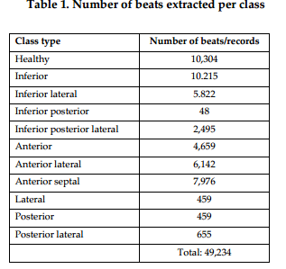

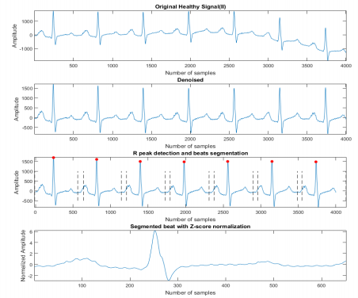

图1：以健康信号为例的预处理技术的输出。

### CNN和DenseNet模型

典型的CNN模型包括三个主要层：卷积层、池化层和全连接层。卷积层中的滤波器经过训练，从输入数据中提取不同的特征，形成特征图。后者又被馈送到下一个卷积层，这个过程在网络中重复进行，其中提取了越来越复杂的特征[17]。池层降低了特征映射的维度并防止网络的过拟合。我们的CNN模型使用反向传播算法进行训练[18]，其中层中的权重系数基于随机梯度下降进行更新[19]。CNN末尾的全连接层然后基于表示倒数第二层中提取的特征对数据进行分类。

与CNN的顺序架构相比，DenseNet中的每一层都以前馈方式连接到网络中的每一个其他层[20]。DenseNet形成了一种密集的连接模式，$\frac{L(L+1)}{2}$连接在具有L层的网络中[20]，而具有L层的典型CNN模型将仅具有L个连接（两层之间的一个）。一个典型的DenseNet包含密集块和过渡层。前者包括许多卷积块，每个卷积块具有相同数量的输出通道。在前向传播过程中，不同层学习的特征映射被连接起来，实现特征重用并导致后续层的输入发生变化，从而提高功效[20]。过渡层执行卷积和池化操作，这有助于减少通道数量和网络的复杂性。我们在DenseNet模型中添加了一个瓶颈层，以限制特征映射的数量并降低模型的计算复杂性[20]。然后根据网络中的所有特征图进行分类。图2说明了研究工作流程。

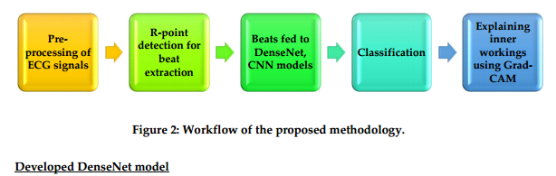

#### 开发DenseNet模型

我们首先开发了一个用于单导联心电图（ECG）信号分类的DenseNet模型，使用了以下超参数：批大小为50；60个epoch；学习率为0.0001；Adam优化器的betas参数为(0.9, 0.999) [21]。Dense块中的每一层接收来自所有前层的特征图输入，然后进行一系列操作：批归一化，用于标准化前一层的输出；修正线性单元激活，以引入非线性，使模型能够更快地学习并提高性能；以及3 x 1的一维（1D）卷积。因此，第l层获取所有先前层的特征图 $x_0, \dots, x_{l-1}$ 作为输入数据，计算公式如下：

$$
x_l = H_l([\ x_0, x_1, \dots, x_{l-1} \ ])
$$
其中 $[\ x_0, x_1, \dots, x_{l-1} $$) 指的是将 $0, \dots, l-1$ 形成的所有特征图连接起来。然后，在Dense块之间添加了转换层，这些转换层包括一个批归一化层和一个1 x 1卷积，这有助于减少特征图并改善模型的紧凑性，接着是一个2 x 1的1D平均池化层，帮助减小特征图的大小。为了控制每一层贡献到全局状态的新信息量，网络的增长率设置为k=8。在每个3 x 1 1D卷积之前引入了一个1 x 1卷积作为瓶颈层，与Dense块中通常使用的3 x 3卷积相比，这减少了特征图的数量，从而提高了网络的计算效率。使用了加权损失函数中的权重图 [22] 来平衡本研究中使用的数据。在卷积层和池化层之间，使用了ReLU（修正线性单元）激活函数引入非线性并减少网络的计算量。SoftMax激活用于输出层，其中提供数据属于某一类别的概率。这使得结果预测成为可能。相同的DenseNet模型也开发用于12导联ECG信号中的每个心跳（表2）。DenseNet和CNN模型的可训练参数分别为82,355和65,843。

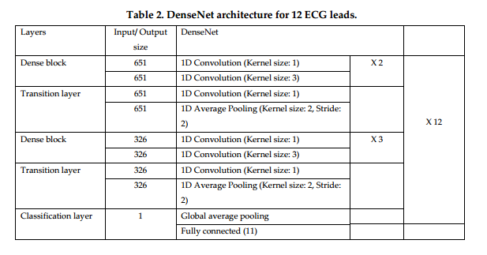

#### 开发的CNN模型

用于开发DenseNet模型的相同超参数和层也被用于CNN模型，不同之处在于CNN模型中移除了连接，以禁用特征的拼接。与传统CNN类似，我们的CNN模型将第l层的输出传递给第(l+1)层，计算公式如下：

$$
x_l = H_l(x_{l-1})
$$

## 结果

两个模型均采用10倍交叉验证进行评估，其中90%的数据用于训练，其余数据用于测试。训练数据进一步分为80%用于训练，20%用于模型验证。

准确度、特异性和灵敏度性能矩阵用于评估模型。准确度、特异性和灵敏度矩阵分别表示所有分类中的正确分类、原始阴性病例总数中的阴性病例以及原始阳性病例总数中的阳性病例。由于这些是关键性能矩阵，DenseNet和CNN模型均获得了良好的分类结果（表3和表4），平均准确率分别为98.9%和98.5%。两种模型在下后、外侧、后和后外侧MI类别中均观察到最佳性能。

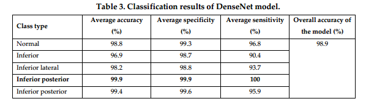

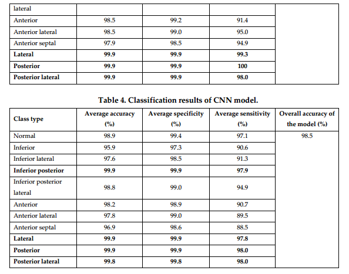

## 讨论

表5总结了最近的研究（在过去的五年中），这些研究使用相同的PTB数据库，使用相同数量的MI（148）和正常（52）受试者，使用深度学习模型对MI进行分类。大多数作者在他们的研究中使用了CNN模型。一些研究的分类准确率略高于我们的模型[23]。其中，Liu等人

[23]，Liu et al [24]，Baloglu et al [25]，Liu et al [26]，Fu et al [27]和Jafarian et al [28]使用CNN模型进行分类任务。与其他CNN模型相比，我们研究中的DenseNet模型使用过渡层和瓶颈层来减少特征映射的大小和计算网络的复杂性，允许模型更快地预测分类结果。虽然我们的DenseNet比CNN模型有更多的可训练参数，它是一个更好的模型，因为它的复杂性低（使用1x1卷积瓶颈层，而不是3x3卷积）和更高的分类精度利用DenseNet模型的低计算复杂度，很好地阐明了训练和测试模型的计算成本降低。因此，该模型适合用于MI检测的临床环境。Zhang等人[29]和Tripathi等人[30]采用混合机器学习和深度学习技术，Han等人[31]使用ResNet模型，该模型的参数大小明显大于DenseNet，因为层包含可训练的权重[20]。

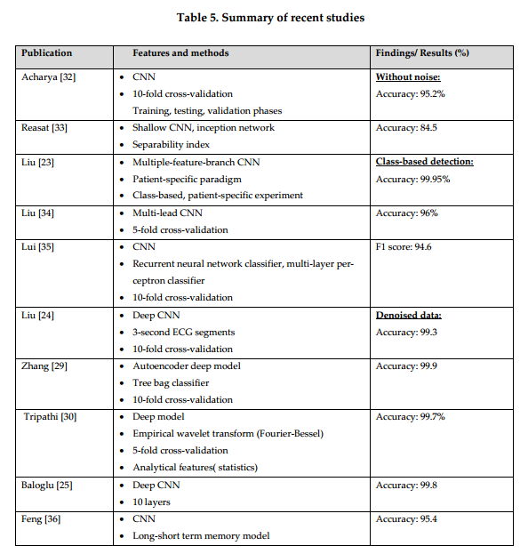

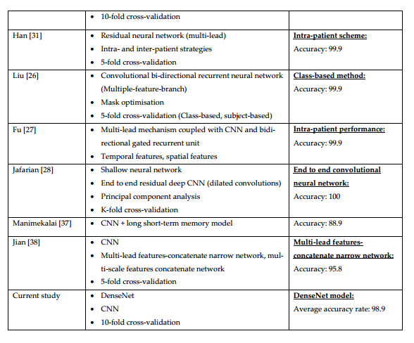

图3描绘了DenseNet和CNN模型的准确度图。虽然两个模型都很好地学习了数据，并且在60个时期内训练得很好，但DenseNet模型收敛得更好，这可能是由于密集层的归一化效应，这减少了模型的过拟合[20]。证实了模型的良好性能，所有类别的错误分类率都非常低，如DenseNet和CNN模型的混淆矩阵所示（图4）。

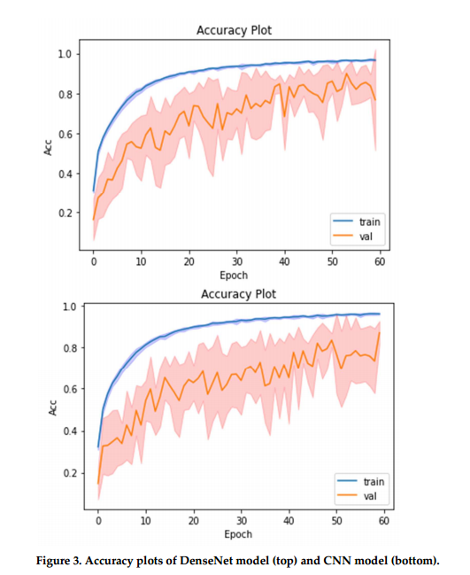

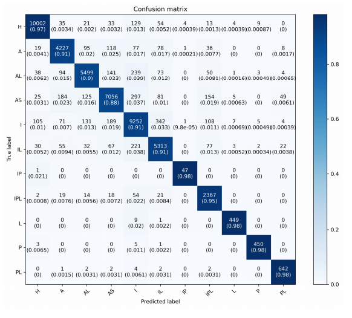

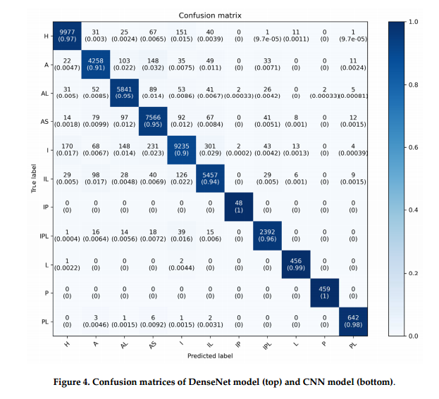

#### 用Grad-CAM技术解释人工智能

尽管深度学习模型具有良好的分类性能，但它们仍然没有得到充分利用，因为临床医生不信任它们的黑箱性质，并且不能接受这些模型做出涉及患者健康的预测的不可破译的基础[39] [40]。作为回应，一些作者使用CAM来设想如何在CNN模型中进行预测。Kim等人[40]采用了Grad-Cam技术，CAM的增强版本，用于使用DenseNet模型进行心律失常分类。Grad-CAM允许模型中任何选定层的可视化以及每个特征映射层的详细检查，这对于理解输入值如何影响模型分类是必要的[40]。受这项工作的启发，我们将Grad-CAM应用于我们的模型的输出。图4和图5描绘了由Grad-CAM生成的激活图，其覆盖在DenseNet和CNN模型中的不同MI类的示例ECG搏动上，图7示出了DenseNet和CNN模型中所有MI类别的个体导联激活的热图。

图7. DenseNet模型（上）和CNN模型（下）中所有心肌梗死和健康类别的单个导联激活的热图。前，A;前外侧，AL;前间隔，AS;健康，H;下，I;下外侧，IL;下后，IP;下后外侧，IPL;外侧，L;后，P;后外侧，PL。

#### 实验结果

对于DenseNet模型的ECG输出（图4），P波和T波在所有导联中普遍被激活，用于检测前壁MI; P波和T波在导联II中被激活最多，P波、QRS波和T波在导联V5中被激活最多，用于检测前壁MI; P波和T波在所有导联中普遍被激活，用于检测健康类别; P波和T波在II导联激活最多，QRS波群在V5导联激活最多，P波和T波在2导联激活最多，P波和T波在V2导联激活最多; ST段在aVF导联下外侧心肌梗死时最活跃，P、QRS和T波在II导联下后外侧心肌梗死时最活跃，P和T波在所有导联下后外侧心肌梗死时普遍激活;在检测侧壁MI时，II导联P、T波最活跃，在检测后壁MI时，V2导联P、QRS、T波最活跃，V5导联P、RS、T波最活跃; QRS波群在aVR导联中最活跃，用于检测后外侧MI。（图5），P、QRS和T波在导联II中最活跃，在导联V6中最活跃，用于检测前壁MI; P、QRS和T波在导联aVR和V5中最活跃，用于检测前壁MI; V5导联P波和T波在前间隔心肌梗死时最活跃，aVL导联P波和T波在健康类别心肌梗死时最活跃，aVL导联P波、QRS波和T波在下壁心肌梗死时最活跃。aVL导联P、QRS和T波在检测下外侧心肌梗死时最活跃，V6导联P、QRS和T波在检测下后外侧心肌梗死时最活跃，aVF导联P、QRS和T波在检测下后外侧心肌梗死时最活跃。aVL和V5导联P、QRS和T波最活跃，V4导联P、QRS和T波最活跃; P、QRS和T波在导联aVL和导联V3中的PR和ST段中被激活最多，用于检测后外侧MI。从图6中可以看出，观察到导联V4是影响用于MI和健康类别分类的DenseNet和CNN模型的最活跃的导联。

该研究的优点和缺点如下：

优点：

1. 本研究使用了全部12导联的心电图数据，而在相关研究中，大多数作者仅使用一个或几个导联进行分类。
2. 本研究中使用了包含PTB数据库中所有10种MI类别的ECG数据，而在相关研究中，一些作者仅研究了10种MI类别的子集进行分类。
3. DenseNet和CNN模型都获得了良好的分类性能。
4. 所开发的DenseNet具有低计算复杂度，并有可能应用于临床环境中的MI的快速分诊。
5. 这是唯一一项将深度模型的分类决策映射到ECG信号上的特定ECG导联和位置的研究，分类健康和10类MI，从而提供了临床医生可以涉及的某种程度的解释。

缺点：

1. 本研究使用的数据集不平衡。
2. 本研究使用了公共数据库，而不是真实的医院数据。

## 结论

在各种心血管疾病中，心肌梗死是全球死亡人数最多的疾病。在急性心肌梗死中，准确的心电图诊断对于在紧急情况下及时干预非常重要。机器学习正越来越多地被探索用于心血管疾病的心电图诊断。在本研究中，我们开发了基于心肌梗死部位的健康受试者和10类MI患者的分类的DenseNet和CNN模型。预处理后，检测12导联心电图各导联信号的R峰，提取心搏（每个心搏由来自所有12个导联的采样数据组成），然后将其输入到DenseNet和CNN模型中，尽管DenseNet和CNN模型都具有高分类性能，DenseNet由于其较低的计算复杂度和特征可重用性而成为首选模型。CAM技术随后被应用于两个模型的输出，以解释各自模型所做的决定。V4导联在DenseNet和CNN模型中均为最活跃的导联，对心肌梗死和健康人的分类影响最大，这是第一次报道影响脑深部电生理分类决策的特征的研究。因此，本研究是至关重要的，并对医学领域做出了重大贡献，因为它为临床医生可能涉及的深层模型的内部工作提供了一定程度的解释。因此，开发的模型与GradCAM结合更有可能获得临床认可，并可用于在医院和偏远的院外环境中对MI进行分类。