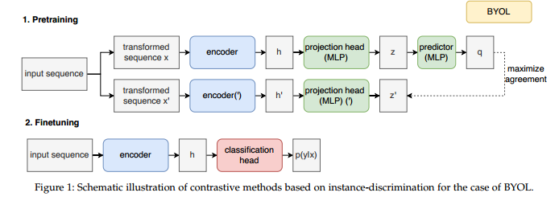
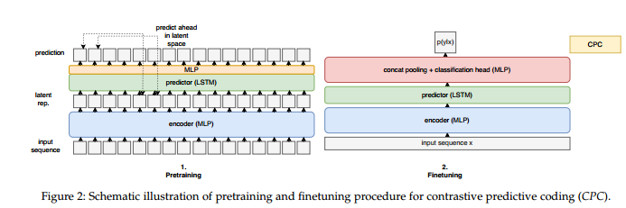
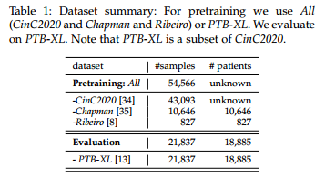

# 基于12导联ECG数据的自监督表示学习

## 摘要

临床12导联心电图（ECG）是最常见的生物信号之一。尽管公共ECG数据集的可用性越来越高，但标签稀缺仍然是该领域的核心挑战。自监督学习是缓解这一问题的一种有前途的方法。这将允许在相同数量的标记数据的情况下训练更强大的模型，并结合或改进对罕见疾病的预测，在这项工作中，我们提出了从临床12导联ECG数据中进行自监督表示学习的第一个全面评估。为此，我们将基于实例判别和潜在预测的最先进的自监督方法应用于ECG领域。在第一步中，我们学习对比表示并基于最近建立的综合临床ECG分类任务的线性评估性能来评估其质量。

在第二步中，我们分析了自监督预训练对微调ECG分类器的影响，与纯监督性能相比。对于性能最好的方法，对比预测编码的适应，我们发现线性评估性能仅低于监督性能0.5%。对于微调模型，我们发现与监督性能，标签效率，以及对生理噪声的鲁棒性。这项工作清楚地建立了通过自监督学习从ECG数据中提取有区别的表示的可行性，以及与纯监督训练相比，在下游任务中微调这种表示时的众多优势。作为ECG领域中专门针对公开数据集进行的第一次全面评估，我们希望在快速发展的生物信号表示学习领域中，为可重复的进展迈出第一步。

**关键词：**深度神经网络，心电图，时间序列分析，无监督学习

## 概述

在机器学习中，具有高质量标签的数据集的可用性通常是一个无所不在的挑战，但在健康领域尤其如此，其中标记过程特别昂贵，并且在许多情况下难以定义临床基础事实。然而，未标记数据的数量通常超过标记数据的数量几个数量级，这就有力地证明了（自我监督）表示学习从未标记的数据。在过去的几年里，自监督学习在不同的领域取得了巨大的进步，从自然语言处理[1]到语音[2]再到计算机视觉[3]。自我监督学习可以是解决数据稀缺问题的一个组成部分。在相同数量的标记数据下，它可以帮助训练更准确，也可能更健壮的模型，这对任何应用领域都是一个理想的前景。对于医学领域来说，特别重要的是标签效率的提高，这可以允许在更细粒度，因此更少的标签层次上训练模型，或者包括传统训练方法无法达到的罕见疾病。

在这项工作中，我们在临床心电图（ECG）数据的背景下研究了自我监督表示学习。ECG是一种非侵入性方法，可以评估患者的一般心脏状况。因此，它是诊断心血管疾病的一线检查的重要工具，心血管疾病是死亡率最高的疾病之一[4]。特别是，我们在这项工作中关注的（短）12导联ECG是最常用的ECG类型，具有非常广泛的临床适用性，范围从初级护理中心到重症监护病房。即使ECG的基础技术到现在已经有100多年的历史并且它是一种非常常见的程序，在美国，5%的门诊访视期间订购或提供ECG [5]，其解释仍然主要是手动执行的，只有有限的算法支持。在这里，重要的是要认识到，ECG解释在某些情况下甚至对心脏病专家具有挑战性[6]。

有一些基于深度学习的心电图解释算法具有非常高的性能[7]，[8]已经在大型闭源数据集上进行了训练。公开可用的数据集的大小要小几个数量级，这为研究自我监督学习技术是否以及如何提高在这些数据集上训练的算法的性能提供了动力。此外，即使对于上述大规模数据集，标签质量的问题仍然具有挑战性。这里，重要的是要强调，即使自监督方法已经成功地应用于计算机视觉和语音，ECG记录是时间序列（而不是一维图像）和多变量数据（不同于言语）具有与言语相当不同的属性。这意味着自我-监督方法在这一领域的工作从一开始就不清楚，值得深入研究。为其他应用领域开发的，它需要微妙的适应，例如仔细选择增强变换或模型架构和训练过程的适应，以使它们实际上在ECG数据的上下文中工作。最后，就像监督学习的情况一样[9]，ECG数据表示学习领域的可衡量进展需要基于明确定义的评估标准进行基准测试，在理想情况下，在公开访问的数据集上使用开放软件。我们希望朝这个方向迈出第一步。

除了对ECG领域的表示学习算法进行基准测试之外，真实的好处在于自监督预训练对微调下游分类器的潜在好处。这包括与纯监督方式训练的模型相比，提高数据效率，提高定量性能或提高一般意义上的鲁棒性等方面。在我们的实验结果中，我们为这些好处提供了明确的证据。把这些结果放在正确的角度来看，通过自我监督的预训练在下游性能方面表现出显着的改善不应被视为理所当然，因为效果通常仍然很小[10]。监督很少在其他领域得到明确证明，更不用说ECG数据领域了。

我们的主要贡献可归纳如下：

- 我们首次对12导联ECG数据的自监督表示学习进行了全面评估，以促进生物信号表示学习子领域的可衡量进展。
- 我们采用并直接比较了基于实例的自监督方法（视觉表示对比学习的简单框架（Simplified），Bootstrap Your Own Latent（BYOL），多个视图之间的切换（SWaV））和对比，潜在预测方法（对比预测编码（CPC）），并找到了令人信服的证据，证明通过自监督学习从ECG数据中学习有用表示的可行性。
- 我们提出并评估了CPC架构和培训过程中的几项修改，这些修改导致了相当大的性能改进。
- 我们评估了从自监督模型中微调的下游分类器与从头开始训练相比的不同质量方面，并找到了在相同的下游训练集下提高定量性能的证据，通过自监督预训练提高了标签效率和鲁棒性。

## 材料和方法

### 使用深度学习进行ECG分析

到目前为止，心电图数据的分析已经发展成为深度学习方法的一个非常流行的应用领域。由于我们在本文中只关注深度学习方法，因此对该领域最先进的方法进行简要讨论是适当的。对于不同方法的详细比较，我们请读者参阅最近的综述[11]，[12]。直到最近，由于缺乏用于算法的训练和评估的适当的、大的、可公开获得的ECG数据集以及由于缺乏明确定义的基准标准，在该领域中新提出的方法的优点一直很难评估。第一个问题最近随着几个大的临床ECG数据集的公布而得到解决，关于第二个问题，我们利用了最近对PTB-XL数据集[13]的基准研究[9]，该数据集也被用作本研究的下游数据集。其中对不同的临床相关ECG分类任务评估了许多不同的分类算法。本研究中的执行方法被证明是现代卷积网络结构，即基于resnet或inception的结构，这与文献[7]、[8][14个]作者报告了在访问受限的数据集上的出色性能，这些数据集比当前可用的数据集大几个数量级公共数据集。

### ECG数据的自监督表示学习

在过去的几个月里，计算机视觉中的对比方法取得了巨大的进步[3]，[15]- [18]，显着提高了ImageNet上的线性评估性能，并证明了学习特征对其他计算机视觉任务的有用性。如果将时间序列记录解释为一维多通道图像，并采用适合时间序列的变换，这些方法可以直接适用于从大量相对较短的时间序列片段中学习表示，主要使用的方法依赖于实例判别作为预训练任务，将在第2.2.1节中详细讨论。第二个领域是表示学习语音的领域，其中已经成功地实现了用于非离散数据的自监督方法，其中预测编码方法[2]，[19]已经应用于传统的声学特征[19]-[21]，而且还应用于原始波形数据[2]，[22]，[23]该领域中表现最好的方法依赖于潜在的预测任务，并在第2.2.2节中进行了讨论。

#### 实例识别（Simplified/BYOL/SwAV）

当前最先进的计算机视觉对比方法旨在学习基于同一实例的多个视图的表示，参见图1。这些是通过对输入数据应用随机变换创建的。这个想法在Simplified [3]中以最直接的方式实现，其中噪声对比损失用于吸引两个（正）副本源自同一原始实例，并排斥所有其他实例（负）实例，这种方法通常依赖于大批量训练，这在我们的情况下问题较少，因为与图像数据相比，时间序列数据的维数降低了。BYOL [17]没有明确地依赖于与同一批次中的阴性样本进行对比，而是使用模型本身的移动平均值，并报告了在图像域中比Simplified略有改进。最后，SwAV [18]依赖于对比聚类分配而不是单个实例，并再次提高了ImageNet上的线性评估分数。在我们的案例中，我们构建了PyTorch Lightning Bolts中所有三个框架的实现[24]。

作为模型架构，我们使用xresnet 1d家族的卷积神经网络，这是计算机视觉中流行的xresnet架构的一维改编[25]，在最近的ECG分类基准研究中表现非常好[9]，该研究是在PTB-XL数据集上进行的，参见第2.3节，使用与本工作中使用的相同的评估方案，参见第2.4节。我们的实验基于xresnet 1d 50，其性能与[9]中性能最好的xresnet 1d 101在误差条内兼容。然而，它更有效地使用参数，并且在线性评估和微调方面表现出略微上级的性能。在这一点上，我们再次强调，即使我们使用的架构在PTB-XL上实现了最先进的性能，我们研究的重点在于证明与监督性能相比的相对改进。

用于生成给定原始记录的两个语义等效视图的转换是计算机视觉中对比方法最近成功的核心。如[3]所示，学习表征的质量关键取决于变换的选择和适当组合。因此，我们评估了一些受到计算机视觉中有效变换和特定于时间序列，请参见A节的详细描述。最后，我们还评估了在预训练期间仅使用原型生理噪声获得的表示。

#### 潜势预测（CPC）

对比预测编码（CPC）[2]也是一种对比方法，与上述方法相比，显式地利用了数据的顺序排序。其思想是通过具有步幅卷积或全连接层的编码器对输入序列进行编码，并训练模型来预测未来给定的固定步骤数的序列的潜在表示。过去再次使用噪声对比估计方法对序列进行编码表示，参见图2的图形表示。当我们使用100 Hz的数据时，与音频域中10 kHz的典型采样率相比，100 Hz的数据采样相当粗糙，因此不需要通过步幅卷积对信号进行大幅下采样。相反，我们使用完全连接的编码器，在我们的情况下，由四层组成，具有512个过滤器，具有批量归一化，因为它也是在从经典音频特征的自监督表示学习中完成的[19]-[21]。我们预测未来的12个时间步或相当于0.12秒，并使用从与原始记录相同的序列中提取的128个假阴性。对于预测任务，我们使用具有2层和512个隐藏单元的LSTM模型[26]。我们提出并评估了CPC架构的增强版本，在LSTM的线性输出层之前增加了一个额外的隐藏层和非线性。这种修改受到Simplified中额外的多层感知器的启发，这是与先前在计算机视觉中使用的自监督方法相比导致上级性能的关键组件之一。

当对分类模型进行微调时，我们应用了一个连接池层[27]，它连接了所有LSTM输出的最大值，所有LSTM输出的平均值，以及对应于最后一步的LSTM输出，以及一个具有512个单元的单个隐藏层的全连接分类头，包括用于正则化的批归一化和丢弃。为了评估线性评估性能，我们在concat-pooling层的顶部使用一个单独的全连接层。2与标准CPC实现和微调调度相比，不同修改的效果将在C节中详细研究。

#### 生理时间序列数据的自监督表示学习

自监督方法也已用于生物医学序列数据的表示学习，最突出的包括ECG [28]-[31]和脑电图（EEG）[28]，[29]，[32]，[33]数据。除了[31]之外，现有的工作都没有考虑临床12导联ECG的表示学习的情况，临床上最常见的ECG测量类型。[31]的作者也考虑使用BYOL和Simplified进行预训练，但使用了只有五层的非常浅的网络架构。我们认为有必要使用更大的模型，这些模型在大型，全面的ECG数据集（如PTB-XL）上达到最先进的性能，因此允许学习更丰富的表示，沿着更大数据集的预训练。特别是，目前尚不清楚小模型体系中的预训练进步是否会延续到具有竞争性监督性能的较大模型。此外，从方法论的角度来看，[31]与我们的方法显著偏离，因为他们的目标是学习一个独立于引线的通用单引线编码器，与我们的情况中的联合12导联编码器相反。前者不直接适用于下游12导联ECG任务。此外，他们提出了新的对比方法，可以在预训练期间使用12导联ECG数据，但与我们的方法不同，因为它们不适合下游12导联ECG数据。这是因为所提出的模型不直接处理12导联数据，而是利用在预训练期间来自同一患者的不同导联可以被认为是正对的事实。从方法论的角度来看，[29]也接近我们的对比方法，但他们的实验结果仅限于不到50条记录的小型2导联数据集。如果无法访问原始实现，则无法评估他们提出的方法是否在12导联数据和大型数据上具有竞争力。（预训练）数据集，其中自监督方法揭示了它们的全部潜力。早期的方法，例如[28]使用skip-gram模型从2导联ECG训练表示。最后，[30]使用转换识别作为借口任务，并提出了一个特定于单导心电图表示学习的框架。

### ECG数据集

我们使用三个数据集的集合进行预训练，此后称为All，即CinC 2020 [34]，Ribeiro [8]和Chapman [35]，这构成了最大的公开可用的12导联ECG数据集的集合，共有54，566条记录。值得一提的是，CinC 2020，用于心脏病学计算挑战赛2020的训练数据集，它本身是五个不同数据集的汇编。特别是，它包括我们在本研究中也用于评估的PTB-XL数据集[13]，[36]。在这里使用的最细粒度级别，PTB-XL数据集带有71个标签，评估任务被框定为多个标签，标签分类任务。值得强调的是，这些标签涵盖了各种各样的诊断，形式和节奏语句，可用于心电分析算法的综合评价。44个诊断语句可分类为五个超级类（正常/传导障碍/心肌梗塞/肥大/ST-T改变），19种形式陈述涉及特定ECG段中的大多数形态变化，例如异常QRS波群，并且12种节律陈述包括表征正常心律以及心律失常的陈述。其中前8个用作训练集，第9个用作验证集，第10个用作测试集[13]。所有数据集总结见表1。

### 培训和评价议定书

在所有情况下，我们将自己限制在采样率为100 Hz的ECG数据上。我们在长度为10秒的输入序列上预训练CPC模型，所有其他模型（包括微调的CPC模型）在长度为2.5秒的输入序列上进行训练。在训练期间，从输入记录中随机裁剪序列。在微调的测试期间，我们使用test-timeaugmentation并将所有序列裁剪为2.5秒的长度（使用1.25秒的步幅）并取它们各自的输出概率的平均值作为最终预测，与朴素评估相比，该方法大大提高了模型性能，在宏观AUC中约为0.01 [9]。对于微调和预训练，我们使用AdamW优化器[37]，权重衰减为0.001。在预训练期间，我们使用CPC的恒定学习率计划优化InfoNCE损失[2]，并使用Simplified，BYOL，和SwAV，如原始出版物中所述。在微调过程中，我们使用适合多标签分类任务的恒定学习率计划优化二进制交叉熵，并基于宏AUC评估模型性能，如[9]中所述，从PTB-XL中最细粒度级别的71个标签计算[13].我们对验证进行模型选择，并选择在预训练期间具有最低验证损失和在微调期间具有最高宏AUC的模型。我们报告所选最佳模型的相应测试集得分。源代码复制我们所有的实验是公开可用的[38]。

正如在自监督表示学习研究中通常所做的那样，我们使用两种不同的评估程序，线性评估和微调。线性评估协议旨在通过学习表示的线性可分性来评估学习表示的质量。为此，我们用单个线性层替换分类头，并冻结所有其他层以及批量归一化统计。在微调协议中，我们研究了这些表示对下游任务的有用性，在下游任务中，我们解冻了分类头以及预训练模型的所有层。对于CPC，我们发现在微调过程中遵循两步方法是有益的：在第一步骤中，我们只微调分类头50个epoch，同时保持剩余的预训练权重固定，但仍然更新批量归一化统计数据。使用验证集得分进行选择，然后使用区分性的（即依赖于层的）学习率以降低的学习率微调整个模型20个时期，以减轻在预训练期间捕获的信息错误的危险，其中我们通常将模型分为头部，主体和主干/编码器，并且与相应的先前层组相比将学习速率降低10倍。同样在这种情况下，我们根据验证集得分选择最终模型。在所有其他情况下，我们使用恒定的学习率训练100个epoch的模型。

## 实验

基于实例判别的自监督对比方法的性能关键取决于用于创建原始输入序列的两个语义等价副本的转换的选择。为了确定适当的转换，我们进行了一个实验，在这个实验中，我们使用Simplified和不同的转换组合来预训练一个模型，并基于PTB-XL上的线性评估性能来评估学习的表示的质量，详见补充材料中的第B节。结果清楚地表明，超时（TO）与随机调整大小的裁剪（RRC）相结合是最有效的转换对，对于所考虑的所有变换的描述，参见补充材料中的A部分。此外，我们考虑生理噪声变换，其被设计为模仿在ECG测量期间可能发生的典型生理噪声，即基线漂移、电力线噪声、肌电图噪声和基线偏移。在第二步骤中，我们使用类似的协议来比较三个不同的对比学习框架Simplified、BYOL和SwAV，现在使用预定的变换集。尽管Simplified显然达到了最佳的线性评估性能，但从BYOL表示进行微调会导致微调后的上级下游性能，这就是为什么我们在下面的部分中考虑这两种方法。

## 总结和结论

在这项工作中，我们提出了对12导联临床ECG数据的自监督表示学习的全面评估。尽管自监督算法已成功应用于计算机视觉和语音，但ECG是一种不同的数据模式，自监督学习的工作程度从一开始就不清楚。自我监督学习是非常有效的：自监督表示（通过CPC）在线性评估期间的得分仅落后于0.5%的监督性能，并且与微调期间的监督性能相比提高了1.0%，这代表了在分析中90%的时间都有显著增加，包括系统和统计不确定性。相当大的性能差距转化为提高的标签效率，也就是说，预训练模型达到与监督模型相同的性能，但仅使用大约50-60%的样本。我们还研究了自我监督预训练对相应的微调分类器对生理噪声的鲁棒性的影响。我们发现，与从头开始训练的相应模型相比，大多数预训练模型的鲁棒性都有所提高，尤其是那些使用特定领域噪声变换进行预训练的模型。这为在预训练期间使用特定领域噪声变换提供了强有力的案例。

总而言之，自监督学习是一条通往更强大和更标签效率更高的训练程序的道路，这可能会缓解标签稀缺的问题，这在医学应用中尤为紧迫。在这项工作中，我们在定量性能，标签效率和鲁棒性方面表现出明显的优势。如果这些扩展到进一步的质量维度，那将是很有趣的。我们认为我们的工作是朝着12导联ECG表征学习领域可衡量进展的第一步。我们研究所使用的所有数据集和源代码都是公开的[38]。
