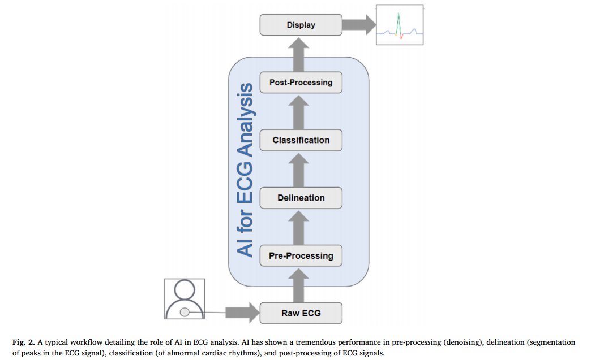
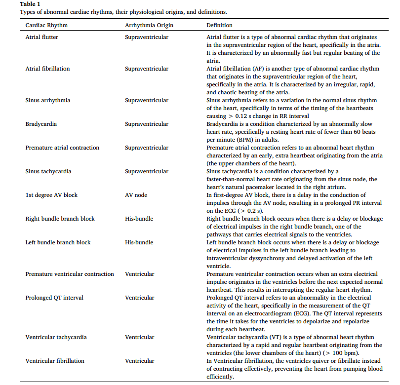
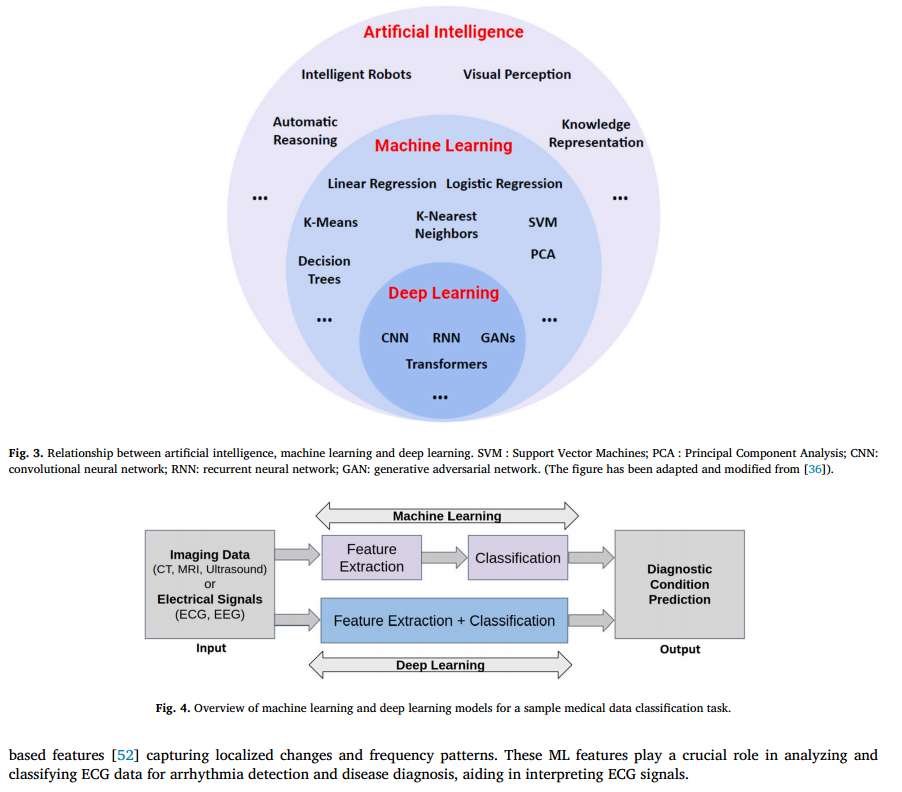
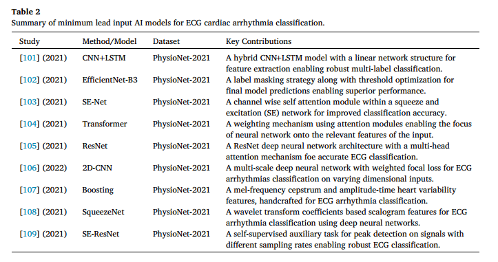

# 利用心电图对异常心律进行分类的高效人工智能模型综述

## 摘要

深度学习在利用心电图（ECG）波形进行数据分类方面取得了许多进展。在过去十年中，数据科学研究的重点是开发基于人工智能（AI）的模型，这些模型可以分析心电图波形，准确识别异常心律并对其进行分类。然而，==当前人工智能模型的主要缺点是，这些模型大多计算量大、计算密集、实时实施成本低==。在本综述中，我们首先讨论了目前用于基于心电图的心律分类的最先进人工智能模型。接下来，我们将介绍一些即将推出的建模方法，这些方法有望实时实现基于人工智能的心律诊断。这些模型具有轻便、计算效率高而又不影响准确性的特点，因此大有可为。当代模型主要利用 12 导联心电图来进行心律分类和心血管状态预测，这增加了计算负担，使实时实施具有挑战性。我们还总结了评估高效数据设置潜力的研究，这些数据设置可在不影响分类准确性的情况下减少心电图导联的数量。最后，我们展望了人工智能在精准医疗领域的应用前景，为准确预测和诊断患者的心血管状况提供了机会。

## 概述

心脏性猝死（SCD）通常表现为心律失常的首发症状，仅在欧洲，估计每年就有 35 万人因此而死亡[1]。心脏组织区域电生理特性（折返期、电压和传导速度）的异质性可导致传导不规则，从而引发心律失常 [2,3]。据称，约有 1.5%-5% 的普通人群表现为房性或室性心律失常 [4]，这些心律失常与大量发病、中风风险增加、住院和死亡有关，因此造成了巨大的经济和医疗负担 [5]。

通过测量心脏电活动随时间产生的电压变化，可以用数学方法解释心电图（ECG）的工作原理。心脏产生的电脉冲会调节心脏的收缩和舒张，从而导致皮肤上的电压发生微小变化。在 12 导联心电图等导联系统中，电极被精确定位在记录这些变化的区域。由此产生的 P、QRS 和 T 波形分别代表心房和心室的去极化和复极化，并与心动周期的不同阶段相对应。根据这些波之间的时间间隔可以推断心脏的传导系统，R-R 间期可用来计算心率[6]。心电图需要经过多个过程进行预处理，以提高信号质量并实现可靠的解读。具体来说，预处理步骤包括滤波以去除基线漂移和电源线干扰、通过高通滤波和去除伪影降低噪音、振幅归一化以保持一致性、R 峰检测以识别心室去极化、分割以分离单个心搏、质量控制以处理伪影、重新采样以获得统一的采样率、插值以处理缺失数据，以及心率归一化以进行比较分析[7]。这些预处理阶段确保了心电图数据的清洁和标准化，并为医疗专家的正确解读做好了准备，从而有助于诊断和治疗心血管疾病。

已知导致 SCD 的最常见室性心律失常表型是室性心动过速（VT）和室颤（VF）。植入式心律转复除颤器（ICD）是治疗致死性 VT/VF 的最主要、最有效的方法 [8]。据报道，每年有超过 20 万例 ICD 植入手术[9]，但由于人体心脏结构复杂，有效控制心率和预防致命性心律一直是一项挑战。同样，房性快速性心律失常虽然比 VT/VF 对生命的威胁小，但也对健康构成重大威胁，美国有 230 多万人患有房颤 [10]。房颤是导致中风的最主要原因之一，而目前的抗心律失常药物治疗或导管消融治疗策略仅部分有效。早期发现房颤对预防房颤相关并发症[11]和进行适当的针对性治疗[12]至关重要。

人工智能（AI）和先进计算技术的出现给医疗诊断带来了巨大变革[13]。在过去十年中，人们研究了新型机器学习（ML）和深度学习（DL）模式，利用心电图数据和其他生命体征指标预测患者的心血管状况，并协助医生进行诊断[14-26]。特别是，基于心电图数据的心律识别和分类一直备受重视，以帮助预测即将发生的心律失常并及时应用治疗。基于人工智能的方法包括神经网络、贝叶斯网络、模糊逻辑系统，以及使用线性或逻辑回归、决策树、最近邻、随机森林或支持向量机的机器学习模型，这些方法已被证明能准确预测患者的心血管预后[27,28,14,16]。此外，基于 12 导联心电图的分类算法在心律失常的早期诊断中表现出极高的精确度，凸显了基于人工智能的方法在支持心血管患者管理方面的潜力[29-31]。表 1 列出了使用人工智能模型识别的常见异常心律的详细信息。图 1 显示了心房去极化、心室去极化和复极化的心电图信号样本。此外，图 2 显示了一个典型的工作流程，详细说明了人工智能在心电图分析中的作用。如图所示

参考文献[32-35]对基于心电图的心律失常/心律分类进行了全面回顾。[32-35]对基于心电图的心律失常/心律分类进行了全面综述。除了对用于心电图分类的人工智能模型进行全面讨论外，我们还在本综述中对用于基于心电图的 “心律 ”分类的 “高效人工智能 ”模型进行了系统评估/分类。用于心电图分类的 “高效人工智能 ”模型分为三类进行介绍/讨论：（1）最小心电图导联输入模型（成本高效）；（2）轻量级深度学习模型（计算高效）；（3）数据注释高效模型（成本和时间高效）。手稿的其余部分安排如下： 第 2 节详细介绍了用于确定心电图分类任务最新进展的各种数据库。第 3 节讨论人工智能、机器学习和深度学习之间的关系。第 4 节详细分析了用于心电图分类的人工智能模型。第 5 节讨论了用于心电图分类的高效人工智能方法。最后，第 6 节对人工智能在精准医疗和远程保健中的作用进行了展望。

## 搜索策略

对谷歌学术（Google Scholar）和 PubMed 这两个主要数据库进行了全面搜索，没有语言限制。文献搜索的重点是使用 12 导联信号和优化的轻量级模型进行心电图分类的新型 ML 和 DL 技术，这些技术主要是在过去五年内开发的。重点是作为 Physionet 2020 和 2021 挑战赛的一部分而开发的方法。以下关键词被用作搜索标准： “深度学习或人工智能或机器学习或心律失常预测或轻量级模型或 Physionet 挑战）和心电图分类"）。在进行全面综述之前，我们将在下一节介绍人工智能、ML 和 DL 的一般概述。

## 人工智能

约翰-麦卡锡（John McCarthy）将人工智能描述为制造智能机器的科学和工程[37]。近年来，人工智能的本质是利用计算机建立模型，在没有人类参与或人类参与极少的情况下，对现实生活中的问题做出认知决策。在过去的二十年里，它影响了多个应用领域，从视觉感知到制造智能机器人，再到知识表示、自动编程和自动推理[38]。基于人工智能的分析在医疗诊断领域越来越受欢迎，因为它可以分析大量复杂的病人数据，并利用数据集中的关系来治疗和预测疾病[39]。机器学习是人工智能的一个子集，它不断发展并利用计算算法，通过对周围环境进行自适应学习来模拟人类智能[40]。机器学习的核心在于确定数据中的模式，这些模式最终可用于分析未知情况。DL 是人工智能和 ML 的进一步子集，与 ML 遵循相同的目标，但主要由多层神经网络组成。多个隐藏层的存在（因此被称为深度学习）使其在更广泛的数据和应用中更加高效和有效。最近，它已被广泛应用于医疗保健领域，如医疗成像以及医疗保健数据分析，用于各种任务，包括分类、诊断和治疗。

在过去五年中，DL 算法取得了巨大进步，许多研究小组都在积极研究可增强医疗诊断能力的新型 DL 模型[48-50]。图 3 展示了人工智能、ML 和 DL 之间的关系。图 4 显示了 ML 和 DL 之间的根本区别。ML 涉及从数据中手动选择重要信息（特征提取）并利用它们进行预测。另一方面，DL 使用人工神经网络（或其变体）从原始数据中自动学习重要模式。DL 需要大量数据才能很好地学习，并且需要功能强大的计算机。ML 的可解释性更强，因为人类会选择/手工制作重要信息，而 DL 通常更准确，但更难理解。如图 4 所示，对于医疗数据的样本分类任务（预测诊断条件：良性还是恶性），ML 算法需要手动制作特征来执行分类，而 DL 模型则自动完成特征提取和分类任务。在下面的小节中，我们将详细讨论与本综述相关的 ML 和 DL 模型，这将有助于更好地理解这些方法对当前问题的实用性。

### 机器学习

人工特征表征对 ML 方法影响很大。例如，在心电图信号处理中，这些特征包括平均值、标准差和心率变异性测量等时域特征[51]，功率谱密度等频域成分，偏度和熵等统计测量[51]，以及捕捉局部变化和频率模式的基于小波的特征[52]。这些 ML 特征在分析和分类心电图数据以进行心律失常检测和疾病诊断方面发挥着至关重要的作用，有助于解读心电信号。

### 深度学习

深度学习（DL）"一词由 Hinton 等人提出[53]，主要建立在人工神经网络（ANN）的概念之上。作为一个分支，DL 属于人工智能和 ML 的一个大桶（图 3）。它涉及构建各种神经网络，使这些模型模拟人脑处理数据的方式。这些模型已应用于多个领域，如智能医疗、机器人、自然语言处理（NLP）、网络安全等。人工智能网络由多个层组成，这些层是训练时使用的数据的抽象表示。训练这些人工智能网络通常需要大量数据（因此有时被称为 “数据饥渴 ”模型）。不过，一旦训练完成，这些模型与其他 ML 算法相比，准确率高，推理时间短 [54]。在此，我们将概述一些常用的 DL 架构，如用于心电图处理的卷积神经网络（CNN）和循环神经网络（RNN）。

#### 卷积神经网络

卷积神经网络（CNN 或 ConvNets）是一种流行的 DL 架构，几乎在所有领域都有应用，包括医学图像分析、视觉识别、NLP 以及更多此类应用。常用的 CNN 由多个卷积层组成，然后是子采样（池化）层，而结束层则随当前任务的不同而变化；例如，对于分类任务，最后一层可能是全连接层，而对于分割和超分辨率等任务，最后一层则是卷积层。这些网络的主要优势在于等效表示、稀疏交互和参数共享[55]。各种卷积层所涉及的卷积操作参数极少，有助于快速训练和避免过度拟合。目前，文献中存在多种 CNN 变体，如 AlexNet [56]、VGG-Net [57]、ResNet [58]等，可根据其学习能力用于手头的各种任务 [55]。

#### 循环神经网络

循环神经网络（RNN）是另一种著名的 DL 架构，可用于时间序列数据处理 [59-61]。主要应用于语音处理 [62]、NLP [63] 和顺序医疗数据，如 EEG [64]、ECG [65] 等。与标准的 CNN 架构相比，RNN 架构具有 “记忆 ”功能，这使其能够利用网络已经看到的当前和之前的输入来预测当前输出。这种架构有助于解码数据序列中蕴含的重要信息。例如，心电图中的 RNN 可用于理解连续心跳之间的时间依赖关系 [66]。

撇开 RNN 的优势不谈，标准的 RNN 架构存在严重的梯度消失问题[67]，使得学习数据中的长序列变得相当具有挑战性。长短时记忆（LSTM）[68] 架构就是为了解决这一问题而设计的。LSTM 架构引入了一个称为 “存储单元 ”的特殊区块，它可以长时间存储数据而不会遗忘，从而提高了学习效率。有三个门控制着信息流的进出，首先是 “输入门”，它决定哪些信息应该进入单元；其次是 “输出门”，它决定并控制当前单元的输出；最后是 “遗忘门”，它负责决定哪些上一状态单元的信息应该被记忆，哪些数据应该被删除和遗忘。LSTM 被认为是最成功的 RNN 架构之一，已在许多现实世界的领域中得到应用。

其他流行的 RNN 架构包括双向 LSTM/RNN 和门控递归单元 (GRU)[69]，它们与普通 LSTM 相似，但有细微差别。例如，BiLSTM 由两个标准 LSTM 模块组成：一个模块向前接收输入，另一个模块向后接收输入，这样它们就能同时访问未来和过去的数据。GRU 与 LSTM 类似，但只有两个门：“复位门 ”和 “更新门”。与 LSTM 相比，GRU 的计算速度相当快，而且可以捕捉重要的序列依赖关系，而不会丢弃信息[70]。

## 用于心电图心律分类的人工智能模型

### 基于 CNN 的模型

许多使用基于 DL 方法的模型已被提出，用于使用传统 12 导联信号对心电图进行分类[71]。在 PhysioNet 2020 挑战赛中，有人提出了各种新型算法，利用由 66,361 个 12 导联心电图记录组成的庞大数据库进行分类。本节将概述其中一些新型分类技术。在 41 个参赛团队中，使用基于变压器的神经网络的算法得分最高[72]，该算法使用广义加权准确度指标进行评估。他们的模型结合了由 ML 随机森林模型提取的心电图特征和从变压器神经网络自动学习的判别特征表征，从而提高了分类准确率。另一个研究小组提出了一种改进的 ResNet 模型，该模型使用较大的核大小来训练长期依赖关系，并在改进的 ResNet 中嵌入了挤压和激励层 (SE)[73]，该模型在 12 导联心电图分类中被证明非常有效。一种类似的基于 SE-ResNet 的方法结合了基于规则的模型和 “符号损失 ”来解决类不平衡问题，从而提高了模型的泛化能力和分类性能[74]。在另一种新颖的实现方法[75]中，注意力机制与双通道深度神经网络相结合，使网络能够捕捉到更丰富的心律失常信息，从而实现高效的心电图分类。还提出了其他几种方法，使用不同的模型来提高 12 导联分类算法的性能 [76]。

Garcia 等人[77] 整合了一个深度分支，该分支由带有扩张卷积层和挤压与激励块的改进 ResNet 组成，并与一个宽分支相连，该宽分支将 20 个心律特征整合到一个全连接的 3 层网络中。同样，一个基于 ResNet 架构和多头注意机制的模型表明，多头注意层可能不会对最终分类性能产生显著影响[78]。使用非对称损失函数对五个基于深度残差卷积神经网络的模型进行了优化，以对多导联心电图进行分类。最近，一项研究[79]使用 SE 深度残差网络捕捉了导联关系。作者提出了一种交叉标签策略，并应用符号增强损失函数来处理数据中的损坏标签。此外，他们还采用了一种 “pos-if-any-pos ”集合策略来处理应用中数据分布的不确定性。为了更详细地描述与标签映射相关的问题，他们开发了一个新模型 ResNet50 [80]，为训练更强大的分类模型提供了一个更好的起点。Kang 等人[81]开发了一种 “引导-明智 ”机制，以促进模型中的参数重用。这种机制在保持可比性能的同时缩小了模型规模。同样，最近提出的另一个[82]深度残差截取网络也采用了一种通道关注机制，以促进高效的计算。

从 12 导联心电图数据中提取不同的电生理特征来识别心律失常，分类准确率各不相同。Jimenez 等人[83] 根据心率变异性、QRST 模式和频谱域提取了每个心电图导联的 81 个特征，并针对每种心脏状况使用独立的二进制分类器进行单稳态分类。然后在两个二元监督分类器和一个无监督-监督混合分类系统中为每个类别选择了一个分类模型。Wickramasinghe 等人[84] 通过归一化、重采样和零填充对短于 20 秒的记录进行了预处理。记录的频域是通过快速傅立叶变换获得的。然后将信号的时域和频域输入两个独立的深度卷积神经网络。然后将这些网络的输出连接起来，并通过一个全连接层。输出结果使用双线索模型的夏普利加法解释进行解释，从而深入了解标记不一致的情况以及模型性能不佳的原因。最近开发了一种基于投票的线索无关混合分类器，它将通过 CNN 提取的特征与手工创建的特征相结合[85]。该方法改进了一些单独的分类，但并没有提供比基线 DL 方法更好的泛化效果。Zhao 等人[86]提出了一种 SE-ResNet 来自动学习深度特征，并在最后的全连接层中加入年龄和性别特征。他们还使用两位临床专家独立解释一组随机的 100 份有关左轴偏离的错误分类心电图，结果发现训练标签存在相当大的不一致性，这很可能会阻碍更精确模型的开发。另一项研究表明[74]，两个 SE-ResNet 模型和一个基于规则的模型的集合结合 Sign Loss 来解决类不平衡问题，提高了模型的泛化能力。

### 基于RNN的模型

最近开发了一种基于 LSTM 的集合分类模型，该模型由两个不同的特征集组成，其中第一个特征集通过傅立叶-贝塞尔扩展提取 RR 间期变异性，第二个特征集由基于时域和频域的手工创建特征组成[87]。另一种分类器由四个模块组成：散射变换（ST）、相位谐波相关（PHC）、深度可分离卷积（DSC）和 LSTM 网络，用于心律分类[88]。ST 可捕捉心电图的短期时间调制，而 PHC 则表征相干心电图成分的相位依赖性。输出结果被提供给 DSC，DSC 将每个 ST 或 PHC 系数的导联反应分别合并，然后将所有系数的结果值合并。两个 LSTM 层整合输入在长时间范围内的局部变化。最后，通过典型相关分析，可以将 12 导联 ST 和 PHC 表征迁移到缩减导联表征中进行学习。在一项比较研究中，Puszkarski 及其同事[89] 针对不同导联数（2、3、4、6、12）分析了四种架构（N-BEATS、LSTM、带窥孔的 LSTM、GRU），结果表明 LSTM、GRU 和 N-BEATS 效能最好，与带窥孔的 LSTM 效能相当。

## 心电图心律分类的高效模型

可穿戴和非卧床远程监测技术的进步[13,90,91]凸显了开发可对即将发生的心血管事件进行实时预测的人工智能模型的必要性和机遇。虽然最近有几项研究调查了人工智能在预测心脏疾病进展方面的应用，以利用可穿戴监测技术早期检测结果[16,27,92-96]，但这些模型的临床实用性仍然有限。此类设备需要配备优化、轻便且能实时处理数据的人工智能模型。这就需要开发优化的人工智能模型，利用单导联或双导联心电图进行特征提取，而且计算成本低廉。下面将分两小节讨论用于心电图分类的高效人工智能模型（图 5）： (1）最小心电图导联输入模型；（2）轻量级深度学习模型；（3）数据注释高效模型。

### 最小心电图导联输入模型

心电图检查包括波形分析和间期/节律分析。间期或节律分析侧重于特定心电图成分（如 PR 和 QT 间期）的时间和持续时间，有助于识别心律异常。这种分析对于测量间期和检测心律不齐至关重要。另一方面，波形分析是心肌梗塞和传导系统疾病等疾病的重要诊断工具，因为它能仔细检查心电图信号的振幅和形状。这两种方法都利用算法进行特征检测和分析，有助于全面了解心脏功能。整合这些方法对临床心电图解读至关重要，可使医护人员全面评估每位患者的整体心脏健康状况。最近，人们通过混合方法[97,98]，将特征与心电图信号结合起来，努力改进信号分类。深度学习模型主要被认为是黑盒系统，因此很难最终确定这些模型是完全依赖于区间测量，还是也考虑了区间离散性，从而可能产生类似的性能结果。各种研究探索了使用基于 gradcam [99,100] 和双重注意力 [21] 的方法来精确定位心电图的特定片段，这些片段在对不同心电图符号进行分类时起着至关重要的作用。

为了在最小输入和心电图导联的基础上开发优化模型，特征工程起着重要作用。由于心电图导联数量减少而导致信息维度降低，因此需要将其与来自标准 12 导联的高维度数据进行映射。这两者的映射可以缩小差距，改善模型预测，使其能够应用于可穿戴设备和远程医疗平台。用于心电图心律失常分类的最小导联人工智能模型汇总如表 2 所示。从原始数据中自动提取特征以发现潜在特征，最终促进分类，这是 DL 模型的基本特征。DL 模型的优势在于能利用许多自然信号都是组成层次结构的特性，从而利用低层次特征推断高层次特征。最近，Linschmann 等人[101]开发了一种深度神经网络，用于使用心电图数据对心律异常进行分类，这是 2021 年 PhysioNet/Computing in Cardiology Challenge 的一部分。他们的架构由一个 CNN、一个并行 LSTM、一个用于提取特征的线性网络结构和一个能进行多标签分类的 sigmoid 激活层组成。有趣的是，他们的分类模型保持了相同的效率。

在其他几个可用的模型中，基于通道自注意力的深度神经网络已被提出来诊断各种心脏异常，不仅可以使用 12 导联，甚至可以使用更少的心电图导联[103]。这种方法的优势在于便于对搏动间和搏动内模式进行检查和分类。该模型通过挤压全局空间信息，并利用基于信道自证的框架生成信道统计。通过为更重要的信道分配更高的权重，提高了分类准确性，从而增强了性能[103]。另一个显示出巨大潜力的模型是波形变换器，它利用注意力机制来权衡输入的不同部分。该模型的注意力图可以让人进一步了解输入数据中对最终预测起重要作用的部分[104]。Nejedly 等人[105]报告了一种具有多头注意力机制的 ResNet 深度神经网络架构，该架构能在使用 12 导联、6 导联、4 导联、3 导联和 2 导联等不同导联数的情况下，以同等效率准确执行心电图分类。他们使用混合损失函数、二元交叉熵、自定义挑战得分损失函数和稀疏性损失函数对模型进行了优化，并使用进化优化方法估计了概率阈值[105]。

Xia 等人[106] 最近提出了一种新型多尺度二维 CNN，可从 12 导联、6 导联、4 导联、3 导联和 2 导联心电图信号中准确识别 30 种心律失常。此外，他们还证明了缩减导联模型可以达到与标准 12 导联模型相当的分类性能。其他模型，如利用 mel 光谱图和心率变异性作为特征的 XGBoost 模型[107]，以及利用连续小波变换系数[108] 进行心电图分类的基于 SqueezeNet 的 DL 模型，尽管效率稍低，但也有报道。Li 等人开发了一种基于 SE-ResNet 的减导心电图记录异常分类模型[109]。他们的方法包括将峰值检测作为自监督辅助任务，并整合不同采样率和输入长度的模型。在同时考虑源内性能和源间泛化的基础上，作者选择了最佳设置，从而在 12 导联、6 导联、4 导联、3 导联和 2 导联的多导联组合中实现了一致的分类准确性。

### 轻量级深度学习模型

由于对高效和资源受限应用的需求日益增长，轻量级 CNN 变得至关重要。轻量级 CNN 通过提供高效的计算结构，解决了处理能力和内存等计算资源限制问题。它们的推理时间更快，可实现实时和低延迟处理，因此对时间敏感型应用很有帮助。在快速发展的医学研究和技术领域，不断更新 DL 模型是必不可少的。这包括整合新数据、适应新出现的模式以及提高模型的整体性能。在心电图分析中，DL 模型可以根据新的心脏状况进行持续调整，纳入正在进行的临床试验数据，并适应患者人口统计数据的变化。例如，用于心律失常检测的 DL 模型的进步可能旨在将训练时间从几周缩短到几小时，从而促进定期更新和实施。在轻量级模型中，启动这些更新尤其可行，因为轻量级模型的定位是提高整个系统的适应性和效率。用于心电图心律失常分类的轻量级人工智能模型汇总如表 3 所示。轻量级 CNN 专门设计用于手机、可穿戴设备和物联网设备等资源受限的设备，在这些设备上必须将内存占用和计算要求降至最低。实现轻量级模型的主要技术可大致分为四类：（a）基于设计的架构；（b）知识蒸馏；（c）网络量化；以及（d）网络剪枝（图 6）。本小节将介绍上述技术，并讨论当代用于心电图分类的轻量级网络。

#### 基于设计的架构

基于结构设计的轻量级模型与现有最先进的重型模型性能相当。移动网络[111]利用深度可分离卷积[112]来减少特定卷积层的有效参数数。最近。Sandler 等人[113] 提出了一种名为 MobileNetV2 的 MobileNet 变体，它采用反转残差块来实现高效的特征传播。该模型的另一个变体 MobileNetV3 [114]，利用硬件感知神经架构搜索开发新一代 MobileNets。Zhang 等人推出的 ShuffleNets [115]，利用信道洗牌操作和点式分组卷积来实现高效的特征传播。ShuffleNetV2[116]考虑了几种实用的准则（通道洗牌、点群卷积、控制模型复杂度的宽度乘法器），以设计极其轻量级的模型。EfficientNets [110] [117] 系列系统地研究了深度模型在特征图的深度、宽度和空间范围内的缩放。与 MobileNets 相比，这种缩放机制有助于提高精度和资源利用率。

为了实现各种心电图系统的实时部署，出现了一个明显的转变，即从复杂的深度神经网络（DNN）转向设计更轻量级的 DNN。一种名为 PD-Net [118] 的轻量级网络设计采用了点卷积层和深度卷积网络，用于心律失常诊断。另一个网络名为 LiteNet [119]，旨在平衡模型复杂性和模型准确性之间的权衡。LiteNet 模型在低容量服务器上进行训练，并部署在资源受限的移动设备上，以较低的内存占用进行心律失常检测。PD-Net 和 LiteNet 的结果在 MIT-BIH ECG 数据库上得到了验证。最近，2022 年进行了另一项研究[120]，以评估通过嵌入式可穿戴设备对心律失常进行分类的压缩深度学习模型。研究[120]结果表明，与基于 ResNet 的模型相比，MobileNets 更受青睐。

#### 知识蒸馏

知识蒸馏（Knowledge Distillation）是一种重要的机器学习策略，用于将知识从一个大型复杂模型（教师模型）转移到一个较小且更高效的模型（学生模型）。学生模型通过最小化教师模型和自身预测之间的差异，来模拟教师模型的输出。关于知识蒸馏的文献涵盖了广泛的主题，包括注意力基础的方法和基于集成的技术，以及在计算机视觉和自然语言处理等领域的应用。

Majid等人提出了一种基于知识蒸馏的方法，旨在缩小基于多导联心电图信号的高性能心律失常分类模型与使用单导联心电图信号的模型之间的差距。该框架包括一个基于多导联心电图信号的复杂教师模型和一个为单导联心电图信号设计的简化学生模型。作者报告说，与实际教师模型相比，该方法实现了262.18倍的压缩，仅损失了0.81%的准确性。该方法的性能在Chapman ECG数据集上进行了评估。另一项研究对卷积网络进行了二值化，以便在计算资源受限的环境中部署该模型。他们使用知识蒸馏的方法来弥补由于二值化导致的性能下降。这种方法在PhysioNet/CinC AF分类挑战赛2017数据集上的有效性得到了验证，F1分数从0.88轻微下降至0.87。作者还通过采用多视图学习方法来解决多标签分类的挑战性任务。他们的策略不仅有助于提取高质量的ECG特征，还帮助捕捉不同ECG导联的独特特征。由于他们的模型使用了六个视图网络，因此在计算相关的部署上存在各种瓶颈。为了解决这个问题，他们采用了知识蒸馏技术，将最初的六个视图网络的性能蒸馏到一个单视图网络中。有趣的是，学生网络的性能超越了教师网络。该方法在三个公开可用的数据集上进行了验证，包括PTB-XL数据集、CPSC 2018数据集和合肥高新杯（HFHC）数据集。类似地，另一种名为多视图知识转移心电图（MVKT-ECG）的方法被提出，以提高单导联心电图在多标签疾病诊断中的能力。他们展示了使用知识蒸馏技术将多导联ECG（例如12导联ECG）的优越模型的知识蒸馏到基于单导联的ECG中。结果在PTB-XL数据集和ICBEB2018数据集上进行了验证。

#### 网络修剪

网络剪枝旨在去除冗余的通道和卷积核，以加速深度网络在推理过程中的运行。现有的网络剪枝策略包括从头开始训练并施加稀疏性约束，以及利用特征级重建误差来压缩现有的预训练重模型。当我们将深度学习网络迁移到硬件上时，剪枝方法非常有用，能够促进计算需求较大的模型的实时部署。这些技术在这些模型在边缘设备上实施时，对于维持准确性和性能至关重要。在此背景下，已有研究致力于构建实时心电图分类系统。某些作者展示了基于一维卷积神经网络（1D-CNN）的心律失常分类的剪枝分析。当在FPGA上部署时，他们展示了准确性与计算复杂性之间的各种权衡分析。另一个名为LightX3ECG的模型采用了先进的剪枝策略。研究作者声称他们的模型在F1分数、紧凑性和复杂性方面超越了大多数高效模型。最近还开发了一种基于小型匹配滤波器的卷积神经网络（CNN）用于心律失常分类。在这项工作中，采用了多种最先进的剪枝方法，以支持基于匹配滤波器的CNN在边缘设备上的心律失常分类。

#### 网络量化

加速深度神经网络并减少内存占用对于设计高效网络至关重要。网络量化旨在将浮点参数（及操作）转换为低精度的固定整数类型，从而实现减少内存使用和加速推理。与前述的网络剪枝方法类似，网络量化技术也有助于深度学习模型在各种任务中的实时部署。这些技术提供的显著优势是能够在硬件上实现快速推理。最近进行的一项可行性研究展示了一种后训练的8位整数量化技术，应用于深度卷积神经网络，以自动分类五种不同的心律失常类别。最终的高效模型相比于未量化模型，具有更低的内存占用和延迟。另一个量化的卷积神经网络也被提出，以支持心律失常检测系统在边缘设备上的实时部署，该网络实现了比其他最先进方法快58.8倍的推理时间。

### 数据标注高效模型

上述研究开发和调整了能够高效识别各种心律类别的神经网络架构。这些网络通常在有标签的训练数据下进行监督训练。另一条正在进行的研究方向是应对标签数据不足的问题。许多近期研究适应了对比学习的概念，以解决无标签训练数据带来的挑战。针对心电图（ECG）心律失常分类的数据注释高效模型的总结已在表4中呈现。

在对比学习的研究中，大多数工作集中于提出高效的变换，因为这在提高现有方法的有效性方面具有显著潜力；同时，也有一些研究开发了新颖的患者特定对比损失函数，以提升分类准确性。Kiyasseh等人通过引入患者特定的噪声对比损失和三种变换（对比多段编码CMSC、对比多导联编码CMLC和对比多段多导联编码CMSMLC），在Chapman数据集上超越了著名的对比学习框架SimCLR，AUC提高了15.8%。

另一种最新的自监督对比学习方法sCL-ST则针对12导联ECG的多标签分类，介绍了两种新颖的变换——拆分-合并和语义加权峰值噪声平滑，这使得该方法在对ECG信号变化不敏感的情况下表现出强大的鲁棒性。这一网络在12导联PhysioNet 2020数据集上实现了最新的性能。此外，最近提出了一种使用孪生卷积网络（SCNN）的少量学习方法，该方法在公开的INCART 12导联心律失常数据集上达到了高达95%的准确率。Vázquez等人适应了一种自学习多类标签修正方法，以学习ECG信号的多标签分类器，并通过5折交叉验证评估该模型。他们成功证明，自学习标签修正可以有效处理未知标签噪声，并在减少ECG导联数量的情况下提高分类准确性。

## 未来展望：人工智能在精准医疗和远程保健中的作用

要理解我们创建的AI模型的价值，了解其预期用途至关重要，包括它们是用于确定当前临床状况（诊断）还是预测未来疾病（预后）。此外，我们还需要关注算法所针对的特定人群。例如，针对一般人群的心脏疾病模型超过360个，专门为女性及其心脏健康定制的模型超过160个，还有超过80个模型专注于预测突发性心脏骤停。一旦理解了潜在的临床状况，我们必须明确每个AI模型在临床工作流程中的具体实施位置，以最大化模型的性能。错误地将AI模型部署在临床工作流程中可能导致不准确的推断，这在关键情况下可能会产生灾难性的后果。部署前另一个重要因素是评估指标的选择。许多模型使用AUROC（接收器操作特征曲线下面积）和分类准确率来评估性能，这在临床环境中可能并不完全合适。这些指标可能无法全面反映AI预测模型的性能和实用性。例如，与其直接依赖AUROC作为最终指标，不如探讨决策曲线。考虑到假阳性和假阴性预测，这些曲线有助于确定可以考虑开始治疗的阈值。开发新AI模型的另一个因素是评估其性能与临床专家所取得结果的比较。尽管这种研究存在固有挑战，但它使模型更接近临床环境中的部署，并在与典型指标（如AUROC）的比较中证明更为有效。

前面的部分强调了人工智能，特别是深度学习在通过非侵入性心电图（ECG）预测心血管异常方面的重要性。这主要得益于深度学习方法从心电图中寻求微妙变化和模式的潜力，而这些变化可能因为人类能力的限制而被忽视。全球每年注册的心电图数量接近十亿，形成了庞大的信息数据库，可用于评估与心脏疾病相关的异常，从而推动预防性诊断新技术的发展。然而，访问和分析这些数据面临重要挑战。首先，众多数据资源必须以有组织和统一的格式提供，以便建立全球平台来开发和共享方法论的进步。在这方面，已经有显著的数据集可用（例如2021年PhysioNet/Computing Challenge中来自三个大洲的多国数据），这标志着朝这个方向迈出的第一步。然而，由于缺乏可及性，大多数资源仍未被利用。数据是开发AI模型的关键资产，因此，确保无障碍但安全的数据可用性仍然是一个主要挑战。

从计算机辅助的12导联心电图中，可以提取多种特征，这些特征通常需要人类干预进行训练。最近解决的一个主要挑战是使用单导联提取类似特征。这可以为不同导联的比较提供基准，并评估所需的最佳导联组合，以实现最高的精度和预测准确性。此外，导联优化对于实时应用和预测患者即将发生的心律失常发作至关重要。将这些实时AI模型与现有的临床参数（例如CHARGE-AF评分）结合也将是有利的，这可能进一步提高预测的有效性。

由于单导联提供的信息有限，额外的生理特征应该补充这些模型。因此，诸如血压、心率和血氧饱和度（SpO2）等重要生命体征可以作为补充特征，以提高模型的准确性和性能。尽管这可能会因为需要额外的数据整理工作而带来初始挑战，但这些模型有潜力集成到已经建立了所需生理信号提取平台的可穿戴设备中。此外，在重症监护室实施轻量级实时AI模型，结合实验室测试数据、病史以及体温、呼吸频率和血压等生命体征，可以进一步增强模型的能力，最终为个性化精准诊断铺平道路。如今，市场上有大量可穿戴监测设备和创新应用，能够收集生理数据。将这些数据与基于AI的预测模型相结合，可以为下一代患者监测技术奠定基础，支持远程健康评估和精准医学。人工智能已经将心电图分析转化为可穿戴技术，提供实时的心血管健康信息。借助这些具有先进算法的智能可穿戴设备，用户可以主动管理心脏健康，持续监测和解读心电图数据。人工智能被无缝集成到心电图解读中，以提高准确性，并促进早期识别异常和潜在的心脏问题。这种前沿的可穿戴技术与AI的结合鼓励人们更加积极地关注健康，开启了个性化和预防医疗的新纪元。

另一个重要的考虑因素是AI模型对罕见疾病的检测能力，这些疾病可能在标准方法中被视为异常而被忽略，需要专门的特征进行检测。迄今为止，大多数在各种数据挑战中训练和测试的模型主要集中在分类常见的心律失常，这只是患者心脏异常节律的一个子集。AI诊断的真正强大之处在于能够检测明显的心电图表型的常见心律失常以及表现为心电图形态或持续时间细微变化的罕见疾病。为进一步增强AI模型的能力，一种令人兴奋的方法是使用深度学习模型进行特征提取，随后使用机器学习模型处理提取的优化特征。这一策略结合了AI两个子集的优势，同时要求输入特征集最小化。这种方法尤其适用于可穿戴设备的应用，因为所需的整体计算资源较少，从而简化了模型的实现。
