# 人工智能技术在心肌梗死自动检测中的应用

## 摘要

心肌梗死（MI）由于接受的血流不足而导致心肌损伤。MI是世界各地中老年人死亡的最常见原因。为了诊断MI，临床医生需要解读心电图（ECG）信号，这需要专业知识，并受到观察者的偏见。人工智能-的方法可以用来筛选或诊断MI自动使用ECG信号。在这项工作中，我们进行了全面评估的人工智能为基础的方法，MI检测的基础上，心电图以及其他生物物理信号，包括机器学习（ML）和深度学习（DL）模型。==传统ML方法的性能依赖于手工制作的特征和手动选择ECG信号，而DL模型可以自动执行这些任务==。该综述观察到，深度卷积神经网络（DCNN）在MI诊断中具有出色的分类性能，据我们所知，这是第一次全面调查人工智能技术用于使用ECG和其他生物物理信号进行MI诊断。

**关键词：**深度卷积神经网络，深度学习，诊断，心电图，机器学习，心肌梗死疾病

## 概述

在心肌梗死（MI）或心脏病发作中，心肌细胞由于血液供应不足而缺氧死亡[1-5]。

后者主要由冠状动脉疾病引起，其中供应心肌的冠状动脉管腔由于动脉壁的动脉粥样硬化而变得狭窄。在晚期冠状动脉疾病中，动脉粥样硬化斑块扩张并且变得容易表面破裂[6]，这可以触发管腔闭塞血栓的突然形成，从而导致MI。这种典型的MI情况如图1所示。其中心肌区域的死亡是由冠状动脉狭窄部位处的破裂的胆固醇负载斑块附近的急性血栓闭塞引起的（插图）

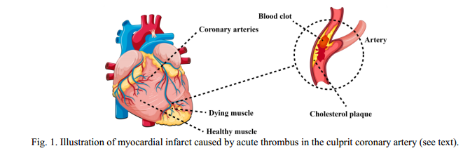

心肌梗死后，左心室扩大，并发生功能变化，以应对损伤。这最终导致充血性心力衰竭，其中削弱的心肌无法有效地泵送血液通过身体，并在晚期，心肌梗死的早期诊断和早期干预对患者的生存至关重要。心电图（ECG）是最常用的诊断方法[7-9]。心电图是电信号通过心腔传导时潜在的心脏动作电位的表面图。它通常会显示覆盖在所涉及的MI区域上的导联位置的异常形态。==开放访问的Physikalisch-Technische Bundesanstalt（PTB）数据库==是心脏病学家注释的各种心脏疾病的心电图的存储库，包括MI，科学家经常使用它进行MI研究。

用于诊断MI的其它方法包括非侵入性成像，例如超声心动图和磁共振成像，以及临床和血清学参数。和临床参数需要专业知识，可能会受到观察者内部和观察者之间的变化。人工智能（AI）支持的自动化计算机辅助诊断系统[10-13]可以提高使用不同生物信号筛选MI的效率并降低观察者偏差。

机器学习（ML）和深度学习（DL）模型都可以部署用于在==信号读出或受试者水平上==区分MI与正常。在ML [14]中，特征提取和分类是单独的顺序操作，可能需要高级手工工程决策。相反，在DL [15]中，特征提取和分类被集成并自动执行[16] DL模型通常包括具有许多隐藏层的某种形式的人工神经网络（ANN），这些隐藏层可以==自动从高分辨率图像中提取突出特征==。维原始数据DL模型的一个示例是深度卷积神经网络（DCNN）[20，22]，其可以具有十到数百个隐藏层[23]，包括几个卷积，池化，和全连接层（图三）。输入信号通过卷积核进行卷积以提取特征。池化层降低了网络的计算复杂度，同时保持一致的特征图分辨率。两种众所周知的池化层类型是最大池化和平均池化。DCNN的最后一层是输出最终分类结果的全连接层。DL模型通常在检测和分类疾病过程中的早期变化方面具有出色的性能[23-31]。

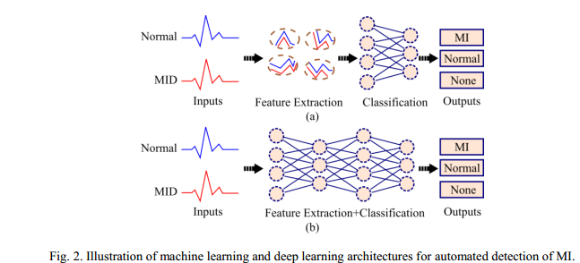

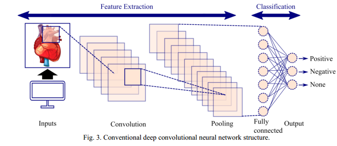

本文对人工智能用于MI诊断的最新研究进行了系统综述，按基于ML或DL的方法分层。本文其余部分的结构如下：第2节介绍了检索方法;第3节介绍了人工智能用于MI诊断的文献综述;第4节介绍了结果和讨论;第5节介绍了未来的工作;第6节介绍了结论。

## 搜索策略

我们在Google Scholar引擎上以“心肌梗死诊断”、“人工智能”、“机器学习”和“深度学习”为关键词，检索了1992年1月1日至2022年1月31日期间发表的论文，共检索到66篇（31和35分别与ML和DL相关），其中大部分由IEEE，Elsevier和Springer出版（图4）。

## 心肌梗死诊断的病理学文献综述

### ML-based methods

==用于MI分类的ML方法包括k-最近邻（KNN）、决策树（DT）、支持向量机（SVM）、朴素贝叶斯（NB），和随机森林（RF）以及受人类神经元功能启发的ANN [32]==。Readdy等人在其==ANN前馈MI分类模型==中使用了V2至V4胸导联ECG QRS测量的15个特征，并获得了79%的准确性和97%的准确性。Hedén等人分别对1，120和10，452例MI和正常ECG应用ANN分类，并实现了95.0%的灵敏度和86.3%的特异性。Lu等人==结合模糊逻辑理论和反向传播神经网络（BPNN）==创建了==神经模糊FL-BPNN分类模型==，对MI和正常受试者的准确率分别达到89.4%和95.0%，Haraldsson等人使用==用Hermite展开系数BANN-HE训练的贝叶斯ANN==来构建基于12导联ECG的MI诊断系统，该系统在急诊科就诊的2，238个ECG信号上显示出MI与正常（C统计量83.4%）的强区分效用。

Zheng等人研究了综合的192导联体表电位图，并使用==SVM、NB和RF分类器==进行心肌梗死（MI）诊断，分别达到了82.8%、81.9%和84.5%的准确率。Arif等人提出了一种==使用主成分分析（PCA）提取特征的BPNN方法==，在心肌梗死诊断中达到了93.7%的分类准确率。Sun等人描述了一种使用12导联心电图（ECG）进行心肌梗死诊断的方法，称为==潜在主题多实例学习（LTMIL）==。信号处理采用==离散余弦变换（DCT）带通滤波器==，利用==五次多项式拟合建立了74维特征空间==。==粒子群优化器==用于变量加权。==SVM、KNN、RF和集成学习用于分类==。==结合LTMIL的KNN集成方法==取得了最高90%的准确率。Arif等人使用==KNN方法==对从PTB数据库获取的20,160个心电图（ECG）波进行心肌梗死诊断。实验阶段使用了10,080个心跳和711个心跳分别==进行非修剪和修剪训练==。==对心电图信号应用双小波变换==，以确定特征向量的36个组成部分。最后，将心肌梗死病例分为11类（10类为不同的梗死部位，1类为正常受试者）。他们的整体分类准确率达到了98.8%，且敏感性和特异性均超过90%。

Chang等人]34[使用4个胸部ECG导联（导联V1、V2、V3、V4）分别采用==隐马尔可夫模型（HMM）、高斯混合模型（GMM）、支持向量机（SVM）和维特比算法==对MI进行诊断。在582次MI和547次正常心跳数据集上，HMM和GMM的组合对MI诊断的准确率最高，达到82.50%。对于MI的检测和定位，Safdarian等人]31[研究了==概率神经网络（PNN）、KNN、多层感知器（MLP）和NB==等分类方法。他们使用NB分类器获得了94.74%的MI检测准确率，使用PNN方法获得了76.67%的MI定位准确率。

Kora等人]34[使用==改进的蝙蝠算法（IBA）==从PTB数据库中提取每个脉搏的主要属性，该数据库包括148个MI和52个正常个体。使用==反向传播Levenberg-Marquardt神经网络（LMNN）分类器==输入最佳特征。==优化特征、IBA和LMNN的组合==实现了MI诊断的98.9%准确率，优于==SVM等方法，标量共轭梯度神经网络、LMNN和KNN==。对于MI诊断，Sharma等人[43]使用了==多尺度能量和特征空间技术==。在将多导联ECG信号的小波分解应用于各个亚组中的临床成分后，利用来自每个ECG导联的具有四次搏动的帧来检测MI。多层ECG帧用于调整72-采用==径向基函数（RBF）核支持向量机、线性支持向量机和KNN==对12导联ECG信号进行分类，MI诊断准确率达到96.0%。

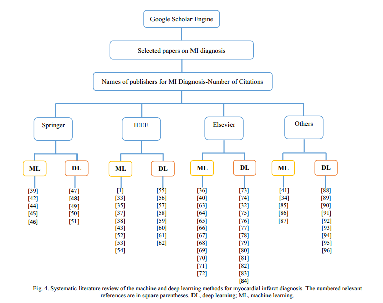

在PTB数据库中，Acharya等人[63]使用==KNN分类器==来区分PTB数据库中的心肌梗死（MI）与正常心电图（ECG）。每个信号经历了四层离散小波变换（DWT）分解，使用Daubechies的六小波基函数，并从DWT系数中提取了12种非线性特性。基于t值、F值和方差分析（ANOVA）的判别特征用于得出正常类和十种类型心肌梗死的特征排名。该方法基于从导联V5获得的47个特征，在MI与正常类别的分类中实现了98.80%的分类准确率。此外，基于导联V3的25个特征，在MI定位的11类分类中实现了98.74%的准确率，而在MI定位分类中，准确率达到了99.97%。在另一项研究中，Acharya等人[64]比较了DWT、经验模态分解（EMD）和DCT方法在冠心病和MI诊断中的效果。心电图信号经过DCT、DWT和EMD处理，得到了相应的系数，这些系数随后通过局部保持投影（LPP）方法进行降维。根据F值对LPP特征进行排名，将排名较高的系数输入KNN分类器。与KNN结合的DCT系数实现了最高98.5%的准确率。

为了使用ECG数据诊断MI，Kumar等人[33]在灵活的分析小波变换（FAWT）框架中使用样本熵。FAWT用于在ECG信号被分成搏动之后将每个ECG搏动分解成子带信号。这些子带信号用于计算样本熵，然后将其输入到几个分类器中。FAWT结合最小二乘SVM（LS-SVM）的分类准确率为99.31%，优于RF，J 48决策树和BPNN技术。Khatun和Morshed ]34[开发了一种可以自动识别P，Q，R，S，Acharya et al ]33[1999].在单导联心电图上提取了15个间期和18个振幅类型的33个特征。该方法能够以99.7%的准确率使用ECG导联V4诊断MI。提出了一种基于KNN分类模型的心肌梗死诊断方法，该方法采用改进的二进制粒子群算法，对ECG信号的20个特征进行了分类，并对分类结果进行了方差分析和Relief方法的排序，将排序最高的特征分别输入DT和KNN分类器，采用KNN方法结合Contourlet和Shearlet变换分别获得了99.55%和99.01%的分类准确率。

Dohare等人]33[采用12导联ECG信号，并将SVM与PCA减少方法相结合来识别MI。在复合导联的帮助下检查每个ECG导联，并使用PCA方法来最小化计算复杂性和特征数量。原始特征集与PCA提取特征的准确率分别为98.33%和96.66%，分别。Diker等人]33[将SVM与遗传算法（GA）结合起来，根据PTB数据库中的心电图诊断MI。从心电图信号中提取了23个形态学、时域和DWT特征，使用降维后的9个特征和原始的23个特征，SVM分类器的准确率分别达到87.8%和86.44%，Han和Shi ]33[探索了用于MI诊断的诸如SVM（具有RBF、线性和多项式核）、BT和BPNN的方法，并且开发了用于ECG信号的混合特征集，该混合特征集由作为全局特征的能量熵和局部形态特征组成。该方法首先对心电信号进行最大重叠离散小波包变换（MODWP），得到心电信号的全局特征，然后对多导联心电信号进行PCA、线性判别分析、采用10倍交叉验证（CV）的SVM-RBF方法，利用18个特征对帧内图像进行分类，取得了99.81%的最高准确率。使用PTB数据库中的ECG进行试验的患者模式。

Zhang等人]33[提出了具有树装袋器（TB）的桩稀疏自动编码器（SAE），用于使用PTB数据库的单导联ECG信号诊断MI。为了避免特征提取网络中的消失梯度问题，SAE采用逐层训练技术。在没有输入标签的情况下，它可以从心跳中学习最佳特征表达。因此，该方法可以从单导联ECG信号中提取出独特的特征。通过合并大量决策树的结果和特征改进，创建了TB分类器，以最好地模拟MI诊断。该模型的准确性，灵敏度和特异性分别为99.90%，99.98%，和99.52%。Zeng等人]33[使用来自PTB数据库的12导联和Frank XYZ导联ECG信号片段来提出用于早期MI诊断的具有RBF的神经网络。为了基于12导联ECG信号和Frank XYZ导联的合成来开发心脏向量，非线性特征提取方法，例如可调品质因子小波变换、变分模式分解、为了对MI和健康人进行建模、诊断和分类，这些特征向量被馈送到包含RBF神经网络的动态估计器中。使用10倍CV，该方法达到了97.98%的最佳准确度。Kayikcioglu等人]33[除了标准SVM和KNN算法之外，还部署了集成分类算法，如提升树、BT和子空间KNN，用于使用来自MIT-BIH心律失常、欧洲ST-T和长期ST数据库的ECG进行MI诊断。数据集分为四类：健康、心律失常、ST段压低和ST段抬高（ST变化可以存在于MI中）。二次时频分布，包括平滑的Wigner-Ville，Choi-Williams，分别采用Bessel和Born-Jordan方法对5导联心电信号进行特征提取，最佳准确率为94.23%的加权KNN算法使用的特征提取的Choi-Williams时间分布。

Liu等人]34[提出了一种基于ECG去噪算法双Q可调Q因子小波变换的单次搏动MI诊断系统实验结果表明，本文提出的双Q TQWT和小波包张量分解（WPTD）去噪方法上级DWT和EMD去噪方法，采用双Q TQWT + WPTD +多线性PCA + TB系统，对于MI与正常的分类，他们在搏动水平上达到99.98%的准确性，在记录水平上达到97.46%的准确性。[ 33 ]使用MODWP分解ECG信号，并提取小波系数的方差、四分位距、Pearson相关系数、Hoeffding's D相关系数和Shannon熵等特征。将这些特征输入KNN分类器，使用PTB数据库中的ECG诊断MI的准确率达到99.57%。

Valizadeh等人[45]提出了一种新的基于参数的特征选择，该特征选择基于左心室的3D球谐形状描述符，以区分MI患者和健康人。该方法基于MI患者和健康人的参数化内径形状的球谐系数不同的假设。该方法首先对电影图像进行预处理，然后，提取基于参数的特征，即球谐系数，并进行归一化处理，对归一化后的特征进行主成分分析（PCA），并将结果用于训练多个分类器，其中支持向量机的性能最好。

### DL-based methods

DL可以学习庞大的数据集，因为它们具有多层复杂的结构。DL模型，如==DCNN，长短期记忆（LSTM），递归神经网络（RNN）和自动编码器网络==，可用于疾病分类，并且在信号处理和分类方面通常优于ML方法[97]。Acharya等人]33[在10，546和40上应用==11层DCNN==，Reasat和Shahnaz ]33[设计了一种DCNN，用于使用ECG导联II、III、III和III从健康ECG信号中识别劣质MI ECG信号，他们用一个病人的数据测试了他们的网络，并用其他病人的数据训练了网络。该模型达到了84.54%的准确度，优于KNN的平稳小波变换（SWT）和SVM的SWT [98]。Lui和Chow ]33[使用==DCNN结合LSTM堆叠解码RNN==来使用导联I ECG信号诊断MI。他们获得了92.4%的灵敏度，97.7%的特异性，97.2%的阳性预测值和94.6%的F1评分，上级具有MLP的纯DCNN的性能。

Gupta等人[47]观察到ECG导联V6、V3、和II对于正确识别MI至关重要，并将此见解应用于==修改ConvNetQuake神经网络==进行MI分类。修改后的模型仅使用10秒的原始ECG记录作为输入即可实现99.43%的MI诊断准确率。Baloglu等人]33[提出了一种==端到端的使用12导联ECG信号进行MI诊断的DCNN模型==。该模型在ECG导联V4上达到99.78%的准确度。Tripathy等人]33[提出了一种新的MI诊断方法，该方法将==深层LS-SVM与使用Fourier-Bessel级数展开==对12导联ECG信号进行时间尺度分解获得的特征相结合-Zhang et al ]33[使用==Gramian角差场（GADF），PCA网络==，该模型==与线性支持向量机相结合==，从PTB数据库中提取II导联心电图的显著特征，对心电图的分类率达到98.44%（心跳类型：无噪声）的准确率与5倍的CV。在受试者的水平，达到93.17%的准确率。

Feng等人]33[提出了一种==多通道分类算法，将16层DCNN与LSTM结合用于MI诊断==。对心电信号进行预处理，提取心跳段，然后将提取的片段馈送到DCNN以获得特征图。最终分类结果由LSTM基于接收到的特征图输出。该系统在不使用手工特征的情况下达到了95.4%的准确率。Liu et al ]33[==将DCNN和RNN结合起来构建一个名为多特征分支卷积双向RNN的混合网络==利用12导联心电图信号建立了心肌梗死诊断的MFB-CBRNN神经网络模型，该模型用于总结12导联心电图的特征，在心电图水平和受试者水平上的准确率分别达到99.90%和93.08%。Strodthoff和Strodthoff ]33[使用全卷积DCNN的集合，使用12-来自PTB数据库的导联心电图，使用10倍CV报告了93.3%的灵敏度和89.7%的特异性。

Han和Shi ]33[使用来自PTB数据库的12导联ECG信号创建多导联残差神经网络采用三残差块和特征融合的ML-ResNet模型对心肌梗死进行诊断，对患者间和患者内心肌梗死的诊断准确率分别达到95.49%和99.92%。Natesan等人]33[使用来自PTB数据库的多导联ECG信号，使用具有数据增强、不具有数据增强和具有噪声的DCNN对MI进行分类，分别达到94.98%、90.34%、和90.93%的准确率。Fu等人]34[开发了一种多导联注意机制使用来自PTB数据库的12导联ECG信号诊断MI的MLA-CNN-BiGRU框架。通过按其贡献比例加权不同导联来增强模型性能。此外，利用导联之间的相关特征，使用二维DCNN模块来提取区分性空间特征。利用BiGRU的记忆能力，该模型能够充分利用心电信号的时间特征，结合时间和空间特征进行分类。该模型实现了99.93%和96.5%的准确率内和患者间的计划，分别。

Tadesse等人[75]提出了一种端到端DL方法来诊断MI并将其发生时间分类为急性，近期或陈旧。能够描述MI发生时间对治疗干预的时间表具有影响，特别是在急性病例中。通过利用基于现有预训练网络的迁移学习降低了模型的计算复杂度。因此，该模型获得了相当好的判别性能，对于正常、急性、近期和陈旧MI类别，C统计分别为96.7%、82.9%、68.6%和73.8%。Jahmunah等人[32]比较了DCNN与Gabor滤波器DCNN模型用于将受试者分类为MI、冠状动脉疾病、在后者中，将DCNN的8个卷积层替换为Gabor滤波器，从而降低了计算复杂度。基于导联II ECG信号，Gabor-filter DCNN和DCNN模型在四类分类任务中的平均准确率分别为99.55%和98.74%。

Kim等人]33[利用U-Net架构结合dropout技术，使用心脏灌注图像进行心肌分割来估计U-Net模型的不确定性。他们的方法获得了更好的Dice相似性（0.806± 0.096（平均值±标准差），与竞争对手的方法相比，如半自动U-Net（0.808±0.084）和自动U-Net（0.729±0.147）。

加兰等人[91]研究了使用CNN区分MI受试者和健康受试者的可能性。（常用于外科/解剖组织病理学）在具有150张图像的数据集上进行了研究（50例正常心肌，50例急性心肌梗死，作者报告说，InceptionResNet v2与95%作为另一项基于非ECG数据的MI诊断研究，Degerli等人[61]收集了用于MI检测的超声心动图数据集（HMC-QU），他们提出了一种早期MI检测的三阶段方法。第一阶段涉及使用DL分割左心室。接下来，分析分割区域以进行特征工程。最后，在第三阶段，执行MI检测。

如前所述，准确和及时的MI识别对于患者的生存至关重要。心肌声学造影（MCE）已用于MI诊断，但耗时，主观且高度依赖于操作员。[79]，提出了一种新的基于ResNet的DL网络--极坐标残差网络（Polar Residual Network，PResNet），作者在PResNet的结构中定义了一个新的极层，将MCE的子部分映射到极图。网络的其余卷积层和残差层用于从极坐标层提取显著特征。

### MI的公共ECG数据集

ECG是心血管疾病诊断的关键非侵入性方法，研究界可以从高质量和公开可用的ECG数据集中受益。一个著名的ECG数据集是Physikalisch-Technische Bundesanstalt（PTB）诊断ECG数据集[73，99]。公开可用超过20年，已用于各种MI诊断研究，包括本综述中的几项。最近，瓦格纳等人[100]发布了一个名为PTB-XL的最大ECG数据集。该数据集的访问以前受到限制，但最近在2020年公开使用。该数据集包括来自18，885名患者的21，837个10秒12导联ECG记录（男性52%，女性48%;在PTB-XL中，148名MI患者和52名健康受试者的12导联ECG可用于训练MI诊断模型。另一个公开可用的ECG数据集是MIT-BIH心律失常数据库，MIT-BIH包括1975年至1979年间47名住院患者的48个半小时的双通道动态心电图记录摘录，（约60%）和波士顿Beth Israel医院的门诊患者（约40%）。从4000个24小时动态ECG记录中随机选择23个记录，以及从同一组中选择的不太常见但具有临床意义的心律失常患者的25个其他记录[63，101]。

## 结果和讨论

表1和表2总结了基于ML和基于DL的方法的结果。从表1中可以看出，在ML模型中，Zhang等人提出的SAE+TB]33[使用PTB数据库获得了99.90%的最佳准确度。从表2中可以看出，DCNN方法使用PTB数据库进行MI诊断的准确度最高，为99.95%。

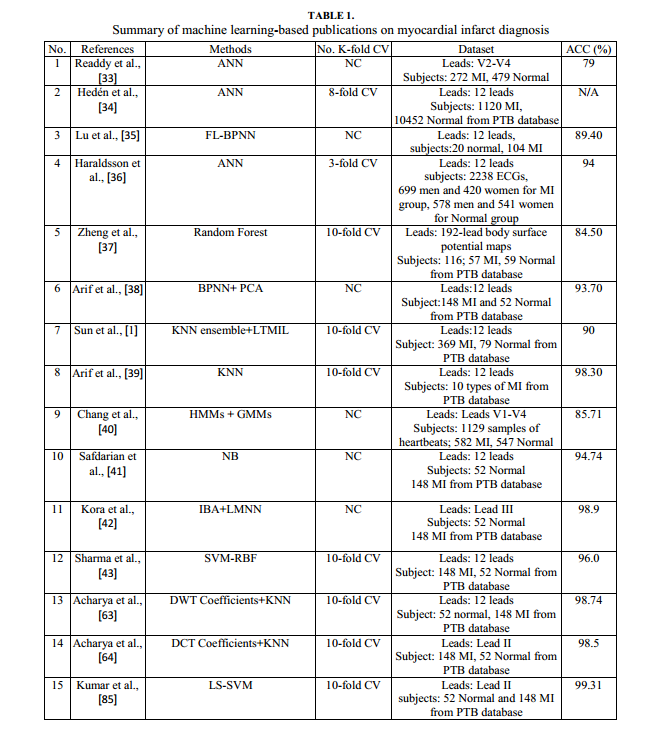

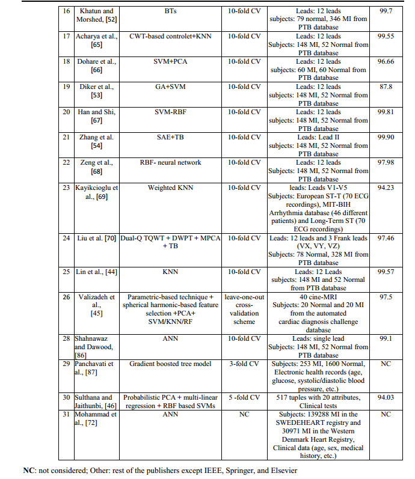

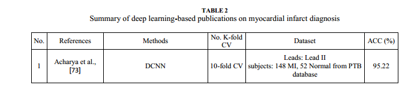

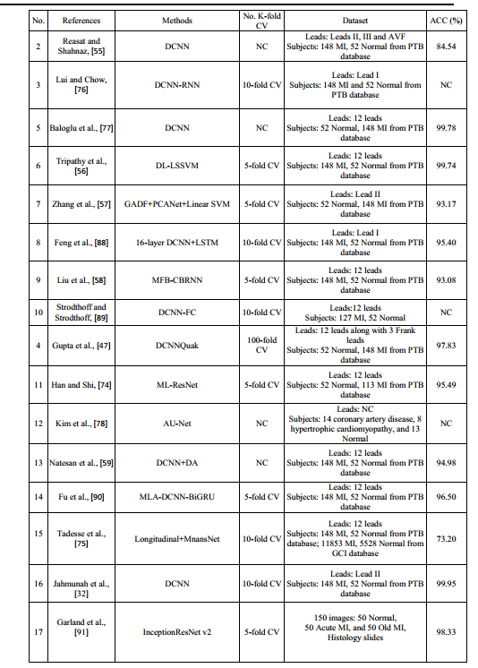

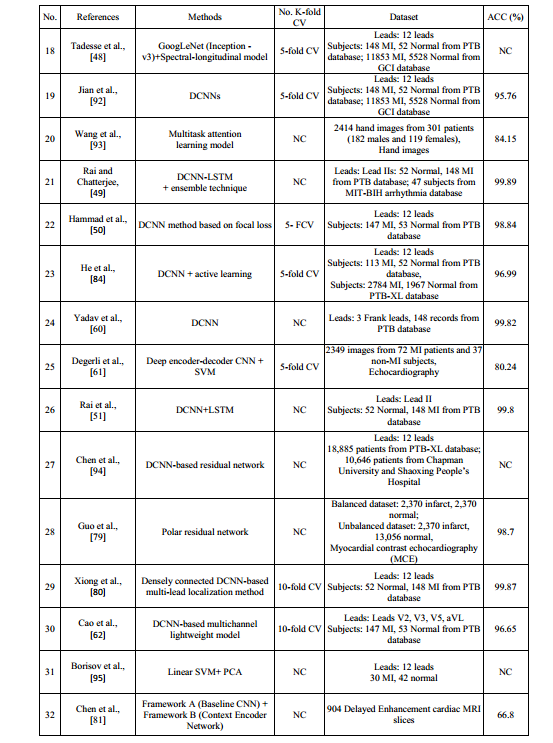

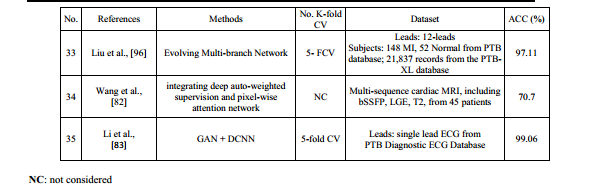

以前发表的ML著作较多，但近年来DL出版物的数量逐渐取代。2021年，关于MI诊断的DL出版物为17篇，ML出版物为4篇。ML和DL出版物的长期趋势分别见图5和图6。因此，近年来，关于使用基于DL的方法的MI诊断的论文数量有所增加。即使基于DL的MI检测比基于ML的检测开始得晚，DL出版物的数量已经赶上ML出版物; DL 35篇，ML 31篇（图7a）然而，ML出版物的模型性能比DL出版物的模型性能更一致。图7 b中的盒须图显示ML-基于DL的MI检测具有较低的标准差，准确度评分福尔斯范围在79.0 - 99.9%之间，而基于DL的MI检测的准确度评分范围为66.8 - 99.95%。

尽管许多研究为医学应用提出了各种ML/DL方法，但ML/DL仍然受到一些限制。首先，医学数据集可能包含具有缺失值的样本。这些样本在ML/DL模型训练期间不容易使用。避免具有缺失值的样本会导致模型的训练/评估有偏差[102]，这是不可取的。DL方法在知识学习和表示方面具有巨大的潜力，但前提是提供足够数量的训练样本。在医学领域，收集和标记大量样本通常具有挑战性[103]。另一方面，有限数量的训练样本导致DL模型在测试阶段表现不佳。此外，DL模型不是无错误的，错误的预测在医学应用中可能是灾难性的。因此，ML/DL模型必须能够确定其输出是否可信。不幸的是，并非所有模型都具备这种能力。ML/DL社区已经走过了很长的路。然而，现有的ML/DL方法还不够健壮，不能充分获得医学专家的信任，因此ML/DL在医学领域的应用还很有限。

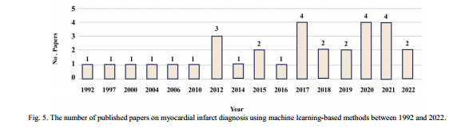

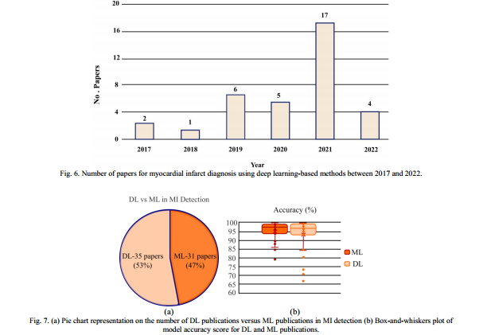

## 前景与展望

近年来，DL的突出代表性使得基于DL的心肌梗死检测研究迅速发展。然而，基于DL的方法需要高计算能力和大容量内存，这可能并非所有医疗中心都能提供。因此，努力使DL方法与云兼容是DL在临床环境中广泛应用的基石。目前，DL的局限性在于其大容量内存消耗，这使得云存储不切实际[104]。因此，作为基于DL的MI检测的未来工作，需要开发能够在医院内外使用的实用临床决策支持工具，如图8所示。如图8所示，在设置中，可穿戴设备充当患者和远程医疗服务之间的接口。

此外，进一步改善和使用DL的MI检测的可靠性也是未来工作的可能方向。此外，希望减少输入信号准备和预处理的时间。从ECG中提取的心率信号可用于MI检测[4，105]。心率信号需要较低的带宽，因此使用这些信号可显著减少内存需求。或者，心率信号可以从使用可穿戴设备（例如手表）获取的光电体积描记信号[105]获得。

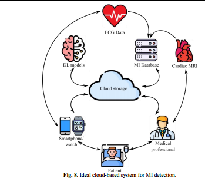

心电图信号常被用来筛查心肌梗死。另一方面，手动心电图耗时且易受偏差影响。为了克服上述心肌梗死诊断中的挑战，可以使用ML和DL方法。ML方法依赖于基于心电图信号的手工特征，而DL能够自动提取特征。我们回顾了基于ML和DL的心肌梗死诊断方法。为此，根据检索关键词收集了几篇文献。31篇文献集中在ML方法上，35篇集中在DL方法上。根据综述的文献，DCNN模型在DL中对MI诊断的准确性最高。因此，近年来许多研究人员使用DL方法。然而，与其他方法一样，深度学习也有其缺点。训练样本数量大和训练过程中计算量大是深度学习方法的两个主要缺点。目前正在进行的研究是降低深度学习模型的计算复杂度，使其具有更多的数据量。高效。例如，知识蒸馏方法可以用于在具有有限计算能力的嵌入式设备上运行DL模型。知识蒸馏过程有两个主要阶段。首先，训练和调整复杂的DL模型。在第二阶段，训练轻量级DL模型以模仿复杂模型的行为，同时接受合理程度的性能降级。关于数据效率，可以使用各种数据增强方法。此外，生成模型（如生成对抗网络）也是一种可行的解决方案。