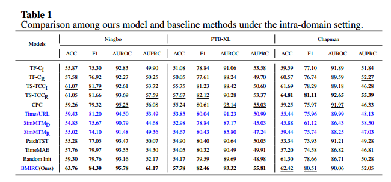
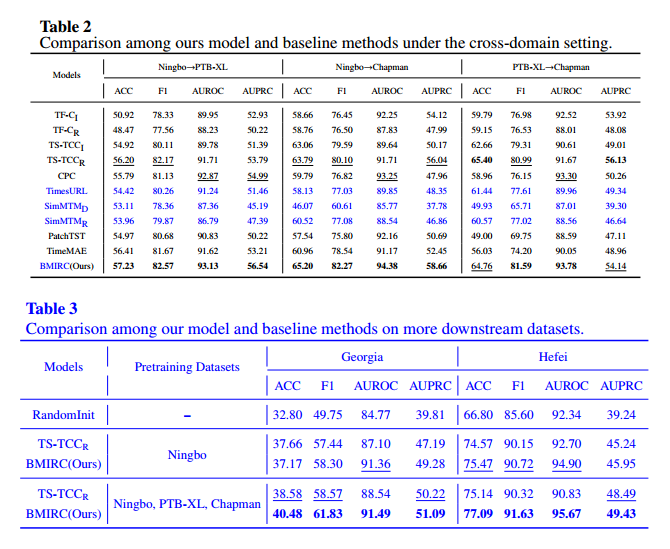

# 用于心电图分类的具有内部表示连接的双峰掩蔽自编码器

## 摘要

时间序列的自监督方法被广泛应用，心电图（ECG）分类任务也从中受益。一个主流的范式是掩码数据建模（masked data modeling），该方法利用可见的数据部分来重建被掩码的部分，从而帮助获得对下游任务有用的表示。然而，传统方法主要关注时间域信息，并对编码器在重建方面提出过高要求，进而削弱了模型的判别能力。本文提出了一种用于心电图分类的**双模态掩码自动编码器与内部表示连接**（BMIRC）。一方面，BMIRC在掩码预训练过程中融合了ECG的频谱信息，增强了模型对心电图的全面理解；另一方面，它从编码器到解码器建立了**内部表示连接**（IRC），为解码器提供了多层次的信息以帮助重建，从而让编码器可以专注于建模判别性表示。我们在三个不同的ECG数据集上进行了全面实验，以验证BMIRC的有效性。实验结果表明，无论是在同域（在同一数据集上进行预训练和微调）还是跨域（在不同数据集上进行预训练和微调）设置中，BMIRC在大多数场景中均超越了竞争性基线方法。代码已公开，地址为：https://github.com/Envy-Clouds/BMIRC。

关键词：心电图；频谱；双模态；掩码自动编码器；内部表示连接

## 概述

作为一种非侵入性诊断程序，ECG是检测心律失常最方便和最有效的工具[1]。最初，ECG分析仅由人类专家执行，这种做法容易受到主观性和不同专业水平的影响，电脑科技的进步，大大提高了心电图的效率和准确性，基于辅助诊断方法，在医学界获得越来越多的关注[2，3]。

近年来，由于采用了深度学习方法，ECG分类任务取得了显着进步。研究人员已经通过利用卷积神经网络（CNN），transformer或其合并展示了令人满意的结果，表明此类方法在该领域的有效性[4，5]。

值得注意的是，这些方法==主要在监督学习的框架内运行，需要大量的标记数据进行训练==。此外，这种训练范式==限制了未标记和外生数据源的利用==。

在与深度学习相关的其他领域，如计算机视觉（CV）和自然语言处理（NLP），研究人员采用==自监督学习==来解决上述挑战[6，7]。这种范式利用辅助任务从未标记的数据中提取监督信息，使网络能够获得有利于后续任务的表示。一个用自我监督预处理增强的模型，训练从未标记的数据中学习额外的知识，从而与仅通过监督训练训练的模型相比，在监督训练之后实现上级性能。值得注意的是，这些额外的知识可以应用于其他数据集以产生进一步的改进。

最近，==用于时间序列分析的自监督方法已经变得流行，ECG分类任务也从这些进步中获益[8-14]==。

掩蔽数据建模是该领域的主流范式。与依赖于预定一致性假设的对比学习不同，掩蔽数据建模关注数据的固有特征。这一特征增强了其适用性，从而促使我们将其应用于ECG分类任务。

然而，这些方法==大多只关注时域信息，忽略了来自其他模态或视角的信息，考虑到多模态数据之间的互补性[15]，仅依赖于单一模态的方法无法捕捉到更全面的信息，从而限制了模型的推理和判断能力==。

在掩蔽数据建模的框架内，当重建目标是原始数据时，最具代表性的范例是掩模自编码器（MAE）。它包括负责编码可见数据的编码器和负责重建掩模数据的解码器。==在ECG分类任务中，许多心律类别与形态特征相关联。例如，心房颤动（AF）的典型特征是P波的缺失。MAE致力于挖掘原始数据的潜在特征，帮助模型学习这些有区别的细节==。这种动力驱使我们利用这种范式来推进我们的研究。

然而，由于自监督重建任务和监督下游任务之间存在差距，MAE的应用面临一些问题。根据信息瓶颈理论[16]，在典型的监督学习范式下，靠近输入的层捕获更多的低级信息，而靠近输出的层包含更多的高级信息。与上述范式不同，==MAE编码器的浅层和MAE解码器的深层都包含丰富的低级信息==。此外，各种级别的信息被保存在网络的中间层中，高级信息通常在编码器的深层中找到[17]。低级信息属于常见的形态细节，它与原始数据密切相关。高级信息属于判别表示，这对于下游分类任务至关重要。解码器将高级表示转换为低级表示依赖于编码器的最终输出。

然而，这样的解码过程迫使编码器过度集中于较低级别的信息，旨在帮助解码器更容易地完成重建。简而言之，==这种配置导致编码器过度关注重建，从而限制了其学习高级区分表示的能力==。

为了解决上述问题，我们提出了一种新的==双峰==掩蔽自编码器框架，表示为==BMIRC==。具体来说，我们采用==离散傅立叶变换（DFT）将ECG转换为频谱==，并将其视为一个==独立的模态==，这有助于补充模型用于学习的数据源。在频域分析已被广泛应用的先前研究中，这些方法通常涉及==直接提取频域特征，随后将其输入到网络中[18]==，或者==采用双编码器在时域和频域中进行对比表示学习[9]==我们利用频谱的方法涉及构建一个==双峰联合编码器==，旨在学习ECG和频谱的联合表示。进行屏蔽数据重构，ECG和频谱相互补充，促进可转移表示的学习。基于MAE范式，我们追求获得更多区分性表示涉及到各级信息的重用。具体来说，==从编码器的中间层提取的表示被集成到解码器的各个层中==，设计了一种==门控表示混合器（GRM）==来促进融合。我们将这个过程称为==内部表示连接（IRC）==。这种方法为解码器提供了各种级别的信息来帮助重建，减轻了解码器的负担，同时鼓励编码器获得更具鉴别力的表示。我们的主要贡献总结如下：

- 我们提出了一种新颖的==用于时频联合建模的双模掩蔽自编码器框架==。该方法将心电图的频谱集成到掩蔽预训练过程中，使双模联合编码器能够学习全面且通用的表示
- 我们在编码器和解码器之间建立==内部表示连接（IRC），并设计了一个门控表示混合器（GRM）来复用不同层次的信息==，从而减轻了解码器的重构负担，同时促进编码器获得更具鉴别力的表示。
- 通过在三个不同的ECG数据集上进行的综合实验，BMIRC在大多数情况下表现出优于竞争基线的上级性能，证明了所提出方法的有效性。

本文的后续部分结构如下：第2节介绍了多模态自监督学习和时间序列自监督学习的相关工作;第3节详细描述了所提出的BMIRC;第4节描述了实验设计;第5节评估了所提出方法的性能;第6节概括了本文的结论并描述了未来工作的方向。

## 相关工作

### 多模态自监督学习

在单模态研究领域，自监督学习方法取得了显著的进步。因此，当代研究越来越多地将注意力转向多模态领域。当然，值得注意的是，在该领域中，==最近的努力的主要部分集中在图像和文本模态的集成上==。现有的方法可以大致分为两类。第一类方法集中于通过基于transformer的==多模态编码器对不同模态之间的交互进行建模==。例如，在视觉和语言Transformer（ViLT）[19]和Align before transformer（ALBEF）[20]中，==来自不同模态的表示用作联合编码器的输入==。通过这种融合过程，联合编码器在不同的预训练任务中进行训练，第二类方法强调为==单个模态训练专用编码器==。例如，对比度图像预训练（CLIP）[21]利用对比度损失对编码器施加约束，促进==跨不同模态的一致表示的获取==。

虽然这些方法改进了图像和文本模态的表示学习，但对于具有独特属性和有限数据的时间序列，它们可能不太有效。

在心电图分析的背景下，从其他模态同时收集的数据的稀缺性对多模态自监督方法的适用性构成了限制。此外，==为图像和文本模态设计的预训练任务==的有效性在应用于心电图和其他相关模态时仍然不确定。

因此，我们致力于从==原始ECG==的不同角度探索数据源，并设计基于屏蔽数据建模的双峰自监督方法，这提供了更强的适用性。

### 时间序列的自监督学习

时间序列自监督学习方法的日益流行主要是由于CV和NLP的实质性进展。

一种范式是基于对比学习，其重点是通过施加不变性约束来进行表征学习。例如，==时频一致性（TF-C）==[9]假定时频域内的一致性，并通过减少相同样本的时频域表示之间的差异来进行预训练。==对比预测编码（CPC）==[12]和时频一致性（T-C）[14]通过时间和上下文对比的系列表示学习框架（TS-TCC）[8]主要强调时间不变性。CPC通过预测后续时间步的表示来实现它，而TS-TCC则致力于最大化跨不同视图的相同时间跨度的表示之间的相似性。通用时间序列表示学习（TimesURL）[22]首先引入了一种基于频率-时间的增强来保持时间属性。值得注意的是，时间重建作为一个联合优化目标与对比学习相结合，以捕获片段级别和实例级别的信息。然而，必须承认，无论是不同的增强策略还是不变性假设都不适用于所有场景。

另一种范式依赖于==屏蔽数据建模，利用自编码器在可见数据的基础上重构屏蔽数据==，其代表作是==Patch Time Series Transformer（PatchTST）[10]==和==时间序列掩蔽自动编码器（TimeMAE）[11]==，共享一个共同的特性，因为它们都==将时间序列划分为非重叠的补丁，PatchTST遵循MAE范式，旨在重建原始时间序列。相比之下，TimeMAE致力于特征级重建==。

此外，有一种方法认为，随机掩蔽某些时间点的标准方法可能会严重破坏时间序列中重要的时间变化。==用于掩蔽时间序列建模的简单预训练框架（SimMTM）[23=]==通过==加权聚合流形外的多个邻居==来恢复被屏蔽的时间点。这些方法==不依赖于人为预定的假设==，因此更适合在新领域应用。

受此鼓舞，我们采用屏蔽数据建模的范式来制定我们的模型。

在ECG表示学习领域，CPC在获取广义表示方面表现出有效性[13]。基于MAE范式的几种变体被提出来在时间和变量的双重维度中执行掩蔽数据建模[14]。然而，这些方法目前仅限于直接应用和对其他领域现有方法的简单改进，在屏蔽数据建模的基础上，引入心电图的频谱特征进行双峰学习，并通过内部表示连接（IRC）鼓励编码器学习更多有区别的表示，以获得更全面、更有区别的表示，从而提高下游分类任务的性能。

## 方法

以下部分详细描述了我们提出的方法。

1，我们的方法包括预训练和微调阶段。由于数据集只提供原始ECG，首先生成ECG和频谱的补丁嵌入，表示为时频补丁嵌入。在预训练阶段，时频补丁嵌入在掩蔽之后被馈送到双峰联合编码器。然后，该算法采用模态相关解码器，在IRC的帮助下重建被屏蔽的数据，该阶段不需要任何标签的参与，在微调阶段，解码器由分类器代替，分类器由全局平均池化层和线性层组成.

剩余的网络使用预训练的模型参数进行初始化。这个阶段需要进行常规的监督训练。更多细节如图2所示。接下来，我们将介绍上述步骤的每个组成部分。

==**图2**== 预训练阶段的整体框架：

首先，原始ECG信号通过离散傅里叶变换（DFT）转换为频谱。随后，时间和频率模态的patch嵌入（称为tokens）通过1D卷积核提取。这些tokens根据预定比例进行掩码处理，部分tokens被丢弃。未掩码的tokens分别输入时间和频率编码器。共享编码器用于融合来自两种模态的表示，而时间和频率解码器依赖于共享编码器的输出进行重构。同时，来自时间、频率和共享编码器的某些中间层表示被送入解码器，从而建立内部表示连接（IRC）。

### 时频贴片嵌入

正如图2所述，一个心电图（ECG）的第i导联，表示为 $ t_i \in \mathbb{R}^L $，通过离散傅里叶变换（DFT）被转换为频谱 $ f_j \in \mathbb{R}^N $：

$$
f_j(k) = \text{DFT}[t_i] = \sum_{n=0}^{N-1} t_i(n) \cdot e^{-j \frac{2\pi}{N}kn}, k = 0, 1, \dots, N-1
$$
其中，==$ n $ 是时间点的索引，$ k $ 表示ECG中存在的不同频率==。根据频域采样定理，DFT变换的区间 $ N $ 必须大于或等于ECG的长度 $ L $，以防止混叠。在这种情况下，我们设定 $ N = L $ 来得到 $ f_j \in \mathbb{R}^L $。这一过程可以通过快速傅里叶变换（FFT）算法有效计算。

由于在变换后的频谱中存在对称性，我们截取了 $ f_j $ 的前半部分 $ f_j^* \in \mathbb{R}^{\frac{L}{2}} $，以减少冗余。频谱揭示了数据中存在的各种频率成分的比例，从而从另一个角度揭示数据的特性。各种类型的ECG在时间域中展现出不同的形态特征。例如，房颤（AF）的典型特征是P波的缺失，而左束支阻滞（LBBB）和右束支阻滞（RBBB）则通过QRS波形的改变来区分。ECG中存在的变化也反映在频谱中。这一事实直观地支持了整合频域信息来增强模型判别能力的合理性。

在大多数方法以逐点方式处理时间序列数据的背景下，==基于patch的建模方法==已被证明是有效的。特别是，推断被掩码的区域比推断被掩码的点更具挑战性。因此，基于patch的重建任务鼓励预训练模型学习更多潜在信息。在我们的方法中，==ECG和频谱被分成不重叠的patch以进行编码==。一个多导联ECG及其对应的频谱表示为 $ T = [t_1, t_2, \dots, t_C] \in \mathbb{R}^{L \times C} $ 和 $ F = [f_1^*, f_2^*, \dots, f_C^*] \in \mathbb{R}^{\frac{L}{2} \times C} $，其中 $ C $ 是导联的数量。我们==使用两个一维卷积层对来自两种模态的patch进行编码==。卷积核的大小设为 $ S \times C $，步长设为 $ S $，以确保patch的独立性。在这种配置下，每个patch的长度为 $ S $，表示心电图的一个片段。按照MAE的思想，patch嵌入被表示为token，每个token对应于特定patch的嵌入。T和F的token表示为：

$$
Z_t = [z_t^1, z_t^2, \dots, z_t^{\frac{L}{S}}] \in \mathbb{R}^{\frac{L}{S} \times D}, Z_f = [z_f^1, z_f^2, \dots, z_f^{\frac{L}{2S}}] \in \mathbb{R}^{\frac{L}{2S} \times D}
$$
其中，$ D $ 表示卷积核的数量，表示每个token的维度。"t"和"f"分别表示ECG和频谱模态。为了便于表述，ECG和频谱也分别被称为时间和频率模态。在接下来的部分中，使用了 $ N_t = \frac{L}{S} $ 和 $ N_f = \frac{L}{2S} $ 来表示时间和频率模态中的token数量。

### 3.2 双模联合编码器

在我们的方法中，Transformer 作为编码器的主要组件。鉴于自注意力机制对输入位置的天然不敏感性，==**可学习的位置嵌入** $ \text{PE} \in \mathbb{R}^{N \times D} $ 被集成到patch嵌入中==，以增强模型的token定位能力。此外，还为每个模态引入了一个额外的可学习全局token $ z_g \in \mathbb{R}^D $，其中 "g" 表示 "全局"，从而促进全局信息的提取。最后，对于模态 $ m \in \{t, f\} $，输入tokens $ I_m \in \mathbb{R}^{N_m \times D} $ 表示为：

$$
\tilde{I}_m = Z_m + \text{PE}_m
$$
$$
I_m = \text{Concat}(z_g^m, \tilde{I}_m)
$$
其中，Concat是连接运算符，“t”和“f”分别代表时间模态和频率模态。

#### **3.2.1. Masking Strategy（遮掩策略）**

在预训练阶段，输入到编码器的tokens需要以预定速率进行遮掩。受MAE启发，我们采用了一种==随机遮掩策略，意味着每个token有相同的概率被遮掩==。由于每次遮掩操作是随机的，在各个批次和训练轮次之间，重构任务的表现具有多样性，从而使预训练任务更加具有挑战性。高遮掩率，例如60%和75%，表示重构难度较高，并已被证明可以提升预训练模型的性能【7,11】。然而，==由于时间模态和频率模态的数据特性不同，在联合建模中采用统一的遮掩率并不理想==。通过实验，我们确定==遮掩率为50%（用于ECG）和75%（用于频率谱）==能帮助模型实现最佳性能。考虑到ECG相比频率谱的复杂性更高，采用相对较低的遮掩率有助于提升模型性能，这凸显了在建模能力和重构难度之间权衡的必要性。

#### **3.2.2. 总体结构**

我们的双模态联合编码器由两部分组成：==模态特定编码器（时间编码器和频率编码器）和共享编码器==。前者专注于在每个模态中建模表示，而后者负责捕捉两个模态之间的交互。两部分都使用**Transformer**模块进行构建。我们将时间和频率模态的输入tokens馈入模态特定编码器 $ E_m $，以获得输出表示 $ O_m $。

$$
O_m = E_m(I_m)
$$
其中 $ m \in \{t, f\} $ 表示时间或频率模态。

在输入共享编码器之前，各个模态的tokens经过初步融合，经过层归一化（LN）处理。具体来说，时间和频率模态的==全局tokens相加，并插入到序列的第一个位置==，其他tokens依次串联。然后，使用共享编码器促进双模态表示的深度融合。形式上，模态特定编码器最终层的输出表示表示为 $ O_m = [o_g^m, o_1^m, o_2^m, \dots, o_n^m] $，我们将其传递到共享编码器 $ \Theta $ 中，按照以下方程式处理：

$$
\tilde{O}_m = LN(O_m) = [\tilde{o}_g^m, \tilde{o}_1^m, \tilde{o}_2^m, \dots, \tilde{o}_n^m]
$$
$$
O_0^s = [o_g^t + \tilde{o}_g^f, \tilde{o}_1^t, \tilde{o}_2^t, \dots, \tilde{o}_n^t, \tilde{o}_1^f, \tilde{o}_2^f, \dots, \tilde{o}_n^f]
$$
$$
O_s = \Theta(O_0)
$$
其中 $ O_s $ 是共享编码器的输出表示。

我们对模型架构进行了消融实验，比较了我们的架构（如图3(b)所示）与仅使用共享编码器建模双模态表示的替代架构（如图3(a)所示）。实验结果表明，我们的架构在整体上优于替代方法，更多细节将在第5.6节提供。

### 3.3 内部表示连接（Internal Representation Connections）

鉴于时间模态和频率模态之间的明显差异，特定于模态的解码器（时间解码器和频率解码器）被设计用于执行重构任务。**它们都是由 transformer 块组成的**。为了减少计算成本，使用了==浅层解码器，它们的维度和层数比编码器少==。**He 等人**【7】已经证明这种设计不会影响模型的性能，而且更深的解码器并不意味着更好的性能。这与仅在MAE范式中，只有来自编码器最终层的表示被输入到解码器中不同，我们==为解码器提供了来自编码器中间层的更多表示==，以帮助解码器逐步完成重构任务。因此，**内部表示连接**（IRC）从编码器到解码器被建立起来。

**IRC** 缓解了解码器的重构压力，从而防止了编码器因优先重构而承受不必要的负担。这样，编码器就能够更好地获得高级别的区分性表示。

共享编码器的输出表示 $O_s$ 被分割为时间模态的 $O_t$ 和频率模态的 $O_f$。**$O_t$ 和 $O_f$** 首先通过层规范化-线性模块转换以减少维度。随后，它们与可学习的掩码标记（masked tokens）连接，并输入到具有可学习位置嵌入的模态特定解码器中。值得注意的是，**IRC** 不存在于解码器的第一层中。

#### **3.3.1 门控表示混合器（GRM）**  
在解码器的深度为 $ H $ 的情况下，我们从编码器中均匀地选择 $ H-1 $ 层表示 $[V_h^m, V_{h+1}^m, \dots, V_H^m]$ 进行融合，其中 $ m $ 代表模态（时间模态或频率模态），小下标代表来自较深层次的表示。为了融合这些编码器的表示，我们设计了一个叫做==**门控表示混合器（GRM）**==的机制。

正如图 4（a）所示，针对模态 $ m $，在解码器的第 $ h $ 层，来自编码器的第 $ h $ 层表示 $ V_h $ 通过门控机制与解码器的第 $ h $ 层表示 $ U_h^m $ 融合。层规范化-线性模块（由 $ P_h $ 表示）用于将 $ V_h $ 转换为 $ \hat{V}_h $，从而促进需要融合的表示之间的对齐。==由于解码器输出 $ U_h^m $ 包含可学习的掩码标记，我们使用零标记填充 $ \hat{V}_h $ 的对应位置，以保持维度的一致性==。

门控单元 $ G_h $ 包含连接和线性变换，用来控制输入表示到输出的贡献。由于只有两个输入，==Sigmoid 激活函数 $ \sigma $== 被用来将贡献转换为相应的权重向量 $ w_h \in \mathbb{R}^N $，这意味着每个 token 都有一个融合权重。在 token 层级，$ \hat{V}_h $ 和 $ U_h^m $ 经过加权后相加，==权重由 $ w_h $ 引导，这意味着可以对每个 token 应用自适应融合策略==。随后，融合后的表示 $ C_h^m $ 被输入到第 $ h + 1 $ 层的 Transformer 块 $ \Lambda_{h+1} $ 以获得 $ U_{h+1}^m $。

特别是，以上描述的融合仅涉及可见 token，旨在补充各种信息的不同层次，促进掩码 token 学习过程的进展。该过程在每个后续层中迭代进行，编码器的浅层表示逐步融合到解码器的更深层，进而逐渐推动重构过程的进展。上述过程通过以下公式表示：

$$
\hat{V}_h = P_h(V_h)
$$

$$
w_h = \sigma(G_h(\hat{V_h}, U_h^m))
$$

$$
C_h^m = w_h * \hat{V}_h + (1 - w_h) * U_h^m
$$

$$
U_{h+1}^m = \Lambda_{h+1}(C_h^m)
$$

我们在第 5.6 节中对各种融合方法进行了消融实验。如图 4(b) 和 (c) 所示，其他两种替代方法如下：1）均值法：通过层归一化-线性模块对齐后，输出平均值；2）拼接法：通过层归一化-线性模块对齐后，首先对输入表示进行拼接，然后使用线性层统一维度。在上述两种融合方法中，应用零填充来对齐掩码标记。实验结果表明，我们的门控表示混合器（GRM）在整体上优于这些替代方法。

#### **3.3.2. 双模态重构损失**

在获得最终解码器层 $U_H^m$ 的输出后，通过层归一化-线性模块 $P_m$ 和重塑操作将其转换为与时间或频率模态的维度匹配（$ \mathbb{R}^{C \times L} $ 或 $ \mathbb{R}^{C \times \frac{L}{2}} $），即：

$$
\tilde{U}_H^m = Reshape(P_m(U_H^m)), \, m \in \{t, f\}
$$
遵循MAE（掩码自动编码器），==重构损失仅在掩码标记上进行计算==：

$$
\mathcal{L}_{time} = MSE(U_H^t, T_{masked}) 
$$

$$
\mathcal{L}_{freq} = MSE(U_H^f, F_{masked})
$$

$$
\mathcal{L}_{recon} = \alpha \mathcal{L}_{time} + \beta \mathcal{L}_{freq}
$$

其中MSE为均方误差，$T_{masked}$ 和 $F_{masked}$ 分别代表时间和频率模态中掩码标记的真实值，$\alpha$ 和 $\beta$ 代表两个模态重构损失的权重。

## 实验设计

### 数据集和指标

为了评估我们模型的有效性，我们在三个公开的数据集上进行了实验：宁波数据集[25]（来自宁波第一医院），PTBXL数据集[26]（来自Physikalisch-Technische Bundesanstalt）和Chapman数据集[27]（来自查普曼大学，绍兴市人民医院）。这些数据集包括12导联ECG，分别包含34，905，21，837和10，247个临床记录，每个跨度为10秒。我们从==心脏病学计算挑战（CinC）2021数据库[28]==中获得上述数据集的原始数据，所有数据都以500 Hz的统一采样率记录。在CinC 2021数据库中，每个ECG记录都有一个或多个标签，表示各种心律类别，并映射到SNOMED-CT代码。这意味着所有后续实验都执行==多标签分类任务==。此外，还使用了另外两个公共心电图多标签数据集：格鲁吉亚[28]和合肥[29]来进一步验证我们的模型对下游任务的泛化能力。这两个数据集包含10，344和20，335个样本，采样率为500 Hz，每个样本的持续时间为10秒。

在后续的实验中，引入了==准确率（ACC）、样本F1得分（F1）、受试者工作特征曲线下面积（AUROC）和精确召回曲线下面积（AUPRC）==作为分类性能的评价指标。

### 数据预处理

所用数据集的预处理包括几个基本步骤：

1. **去噪：**噪声、基线漂移和运动伪影等干扰因素通常会在原始ECG中出现[30]，从而对模型的分类性能产生负面影响，为了减轻上述因素的影响，采用截止频率为0.05和75 Hz的巴特沃思带通滤波器[31]来提取最基本的信息。
2. **下采样：**所有ECG记录都经过降采样至100 Hz以降低计算成本。在该领域的先前研究中记录了类似的降采样程序[14，32]。
3. **规范化：**实例归一化[33]应用于每个ECG记录的每个导联，这可以帮助减轻分布偏移效应[10]。
4. **标签重建：**将分配给每个样本的SNOMED-CT编码转换为离散的类别编码，得到宁波、PTB-XL和Chapman数据集，宁波、PTB-XL和Chapman数据集分别为25、22和19类，格鲁吉亚和合肥数据集分别为23和34类，这些数据集表现出类别不平衡性，其特点是在个别类别中阳性和阴性样本的数量存在显著差异，不同类别的样本数量也存在显著差异。
5. **数据集分区：**我们利用分层采样将20%的数据集划分为测试集，而剩余部分则分配用于预训练和微调阶段的训练。

### 比较方法

我们将我们的方法与几个流行的基线进行了比较。

1. TF-C [9] 在三个不同的域（时间域、频率域和时频域）中执行对比学习，以获得可迁移的表示。
2) TS-TCC [8] 通过跨视图预测学习稳健的时间表示，并在不同视图之间进行对比学习，以增强模型的可辨别性。

3) CPC [13] 通过利用当前时间步的上下文表示来预测后续时间步的表示，专注于时间不变性。

4) TimesURL [22] 引入了一种基于频率-时间的增强方法，旨在保留时间特性，同时将时间重构作为与对比学习的联合优化目标。

5) SimMTM [23] 结合了流形学习用于掩码重构，通过加权聚合流形外的多个邻居来恢复被掩盖的时间点。

6) PatchTST [10] 将时间序列划分为多个片段，并在预训练阶段采用掩码数据重构任务。

7) TimeMAE [11] 采用窗口切片策略处理时间序列，并结合了两种任务：掩码表示回归和掩码码字分类，从而促进表示学习。

对于TF-C和TS-TCC，InceptionTime [34]或ResNet1d_wang [35]被用作编码器，这两种都是时间序列分类中常用的基线，特别是在ECG分类中。对于SimMTM，除了默认编码器外，我们还使用ResNet1d_wang进行比较。对于其他基线，我们使用相应论文建议的编码器，这是根据各自的算法量身定制的。为了评估我们的方法中预训练的有效性，随机初始化被引入作为比较方法。随机初始化是我们模型的一个版本，没有预训练的权重。也就是说，它在微调阶段从头开始进行监督训练。

### 实现细节

在我们的方法中，卷积核大小设置为10 × 12，其中12表示ECG导联的数量，每个补丁通过1D卷积层被编码为192维嵌入。模态特定编码器和共享编码器中的Transformer块的数量被设置为4。特定的解码器包括4个Transformer块，输入维度设置为96。所有Transformer块的注意头的数量统一设置为3。ECG及其频谱的掩蔽率分别设置为50%和75%。重建损失权重α和β，时间和频率模态的设置为1.0。数据采样率设置为100 Hz。有关参数分析的更多详细信息，请参见第5.5节。

预训练阶段包括300个epoch，微调阶段包括30个epoch。两个阶段的批量大小都是128。我们使用AdmW作为优化器，权重衰减为0.05。此外，余弦退火衰减和预热策略用于优化学习过程。在预训练阶段，学习率为0.0001，预热期为40。在微调阶段，学习率为0.001，预热期为5。对于上述基线，大多数训练超参数来自相应的论文。

由于标签内部固有的类别不平衡性，我们在微调阶段采用了类别加权策略，以获得更合理的结果。所有实验均在单个RTX 2080-Ti GPU上进行。

## 实验结果

实验在两个域内进行（在同一数据集上进行预训练和微调）和跨域表中的==TF-C和TS-TCC的下标“I”或“R”分别表示编码器变体InceptionTime或ResNet1d_wang==。表中的==SimMTM的下标“D”或“R”分别表示其默认编码器或ResNet1d_wang==。

最佳结果以粗体突出显示，次佳结果以下划线突出显示。所有度量均以百分比（%）表示。

### 域内评估

在本节中，所有实验都在相同的数据集上进行，以评估模型的域内泛化能力。==首先，模型在不使用标签的情况下进行自监督预训练。随后，在微调阶段引入标签来进一步优化模型==。按照这种两阶段训练协议，最终在测试集上评估模型的性能。表1展示了我们的方法与基线方法的分类结果。总体而言，我们的==BMIRC在宁波和PTB-XL数据集上表现优于所有基线方法，但在Chapman数据集上的表现略微逊色==。==随着数据集规模的扩大，我们的BMIRC相较于基线方法的性能提升也逐渐增加==。例如，在PTB-XL数据集上，BMIRC相比表现次优的模型CPC提升了1.4%。同样，在宁波数据集上，与表现次优的模型CPC相比，AUPRC显著提升了9.1%。==虽然BMIRC在Chapman数据集上的整体表现不及TS-TCCR，我们认为通过迁移学习可以改变这一情况（详细信息在下一节提供）==。==与未使用预训练权重的随机初始化（Random Init）相比，BMIRC表现出显著优势，在所有数据集的大多数指标上提升超过3%==。值得注意的是，虽然基于对比学习的基线方法总体上优于基于掩码的基线方法，但它们仍未超越我们的BMIRC。我们将此现象归因于在我们的方法中引入了频率模态并对传统MAE架构进行了增强。

### 跨域评估

为了评估模型在跨域设置下的性能，在==对较小数据集进行监督学习之前==，使用==在较大数据集上进行预训练得到的权重来初始化模型==。这个过程代表了==迁移学习中遇到的典型场景==，用于==验证预训练权重的可迁移性==。我们在三种场景下进行实验：Ningbo→PTB-XL、Ningbo→Chapman和PTB-XL→Chapman，确保从较大数据集获得的预训练权重应用于较小数据集。表2显示了跨域设置的评估结果。==在大多数场景中，我们的BMIRC超过基线。对于Chapman数据集，采用来自较大数据集的预训练权重显著增强了大多数模型的性能==，如表1中的Chapman结果与表2中的Ningbo→Chapman，PTB-XL→Chapman结果之间的比较所证明的。此外，观察到在我们的方法中，==更大的预训练数据集对应着更显著的改进==。例如，我们的BMIRC的AUPRC在PTB-XL→Chapman场景中增加了4%，在Ningbo→Chapman场景中增加了12.7%，这一发现表明，我们的==BMIRC可以通过在大型数据集上进行广泛的预训练提高其泛化能力==。

## 使用更多下游数据集进行微调

为了进一步验证我们的模型在更多下游任务上的泛化能力（跨域微调），我们的BMIRC在格鲁吉亚和合肥数据集上与Random Init和TS-TCCR进行了比较。除了基于Ningbo数据集的预训练权重外，还使用了Ningbo，PTB-XL和Chapman数据集，以获得更强大的预训练权重。如表3所示，我们的==BMIRC在这些下游任务上的表现优于基线，更大的预训练数据集与更高的性能相关==。

### 不同比例训练集的微调

预训练模型已被证明在==标签稀疏的情况下==表现出增强的泛化能力【36】。在本节中，我们评估了在微调阶段使用==不同比例的训练集（25%、50%、75%、100%）对模型性能的影响==。如表4所示，我们展示了两个不同场景下的分类结果：==宁波（域内）和宁波→Chapman（跨域）==。总体而言，我们的==BMIRC在大多数场景中都优于所有基线，仅在使用宁波数据集的25%时表现不及TS-TCCR==。这一观察结果与Chapman数据集上的评估结果一致。值得注意的是，==随着有标签数据量的增加或在跨域设置下，BMIRC持续优于TS-TCCR==。我们注意到，==随着训练集比例的增加，基线模型的性能逐渐提高，但性能提升的幅度逐渐放缓==。我们的BMIRC在域内微调时表现出类似的趋势。然而，在跨域设置下，仅使用75%的训练集便可达到近似最优性能。此外，在这两个不同场景下，使用仅50%训练集训练的BMIRC，其性能已超过在整个数据集上训练的随机初始化模型（Random Init）。这一特性使得我们的==BMIRC在下游任务标签稀疏时也能取得令人满意的结果==。

### 模型主要参数分析

在这一部分中，我们分析了Ningbo（域内）和Ningbo-Chapman（跨域）两种不同场景下模型的主要参数，包括双峰掩模率、双峰重建损失权重和ECG采样率

#### 双峰掩蔽率分析

时间和频率模态的独特特征，以及它们在双峰联合表示中占据的信息比例的差异，决定了==两种模态的不同掩蔽率组合会影响模型的表示学习==。我们研究了不同掩蔽率组合对模型性能的影响，并报告了ACC和AUPRC。如图5所示，我们注意到一个一致的趋势，==频率模态掩蔽率的增加对应于模型性能的逐渐改善==。这一观察结果由所有子图的每列内从底部到顶部的进展证明。==保持频率模态中的掩蔽率恒定，经常观察到模型性能在时间模态中的50%的掩蔽率处达到其峰值==。最终，==最佳配置被确定为时间模态掩蔽率为50%，频率模态掩蔽率为75%==。我们将这一观察结果归因于时间模态固有的复杂性，因此，==过高的时间模态掩蔽率对模型有效地从时间模态中提取潜在模式提出了挑战==。

考虑到一些基于掩蔽的自监督方法的最佳掩蔽率为60% [11]，我们进一步探索更多样的掩蔽率组合。具体地说，基于最佳组合（50%和75%），我们设置了三个额外的组合：50%的时间模态和60%的频率模态（T M = 50%，FM = 60%）;时间模态为60%，频率模态为75%（T M = 95%，F M = 0.0 5%）;时间和频率模态均为60%如表5所示，引入60%的掩蔽率降低了在先前的最佳配置下模型的总体性能（T M = 50%，FM = 75%），表明60%的掩蔽率不适合我们的任务。

#### 双模态重构损失权分析

在双峰联合建模过程中，重建损失的权重可能会影响模型的性能。使用不同的权重组合进行预训练，最终的分类结果如表6所示。==当α和β都设置为1.0时，模型的性能达到最佳，表明两种模态的重建损失权重同等重要==。

#### 心电图采样率的分析

为了验证不同输入长度对模型性能的影响，我们使用采样率为 50 Hz、100 Hz 和 200 Hz 的心电图（ECG）进行实验，分别对应输入长度为 500、1000 和 2000。正如表 7 所示，==随着输入长度从 500 增加到 1000，模型性能有所提升，但更大的输入长度（2000）并未带来更好的性能==。这表明，==过多的数据冗余对模型学习是有害的==。

### 消融实验

在本节中，我们对 BMIRC 进行了消融实验。首先，我们研究了去除频率模态对模型性能的影响。此模型变体被表示为“w/o frequency”，完整模型则表示为“Full Model”。

其次，我们比较了两种不同的模型结构，如图 3 所示：一种仅使用共享编码器，记作“All Shared”；另一种使用我们的双模态联合编码器，包括特定模态编码器和共享编码器，记作“Specific-Shared”。在“w/o frequency”和“All Shared”情形中，我们增加了时间编码器层数和共享编码器层数，以确保编码器深度的一致性。最后，我们研究了 IRC 和 GRM 的效果。

所有实验均在六种场景下进行，涵盖了域内（intra-domain）和跨域（cross-domain）设置。

#### 额外频率模态的影响

表 8 展示了在缺少主要组件时所有场景下的实验结果。可以看到，==当去除频率模态时，所有场景的性能都出现了显著下降==。我们将这种现象归因于频率模态能够为时间模态提供有价值的补充信息。==去除频率模态会削弱模型提取判别性表示的能力，最终导致性能下降==。

#### 双模联合编码器的效果

如表 9 所示，我们的 ==Specific-Shared 架构在大多数场景中优于 All Shared 架构，仅在 Ningbo→Chapman 场景中略微表现不佳==。我们呈现了两种架构在所有场景下的平均排名，以全面评估它们的整体性能。==Specific-Shared 架构在 ACC、F1 和 AUPRC 指标上显示出优于 All Shared 架构的表现，而在 AUROC 指标上则保持了相当的表现==。与将两种模态视为一个整体的 All Shared 架构相比，Specific-Shared 架构旨在显式捕捉模态内和模态间的交互关系。实验结果强调了该分层结构在我们框架中的重要性。

#### IRC的影响

我们首先研究去除 IRC 对模型性能的影响。==比较表 8 中 w/o IRC 与 Full Model 的分类结果，可以明显看出引入 IRC 全面提升了模型的性能==。

这一观察表明，为解码器提供不同层次的信息以进行重建，能够增强编码器学习高级区分性表示的能力。为了进一步探究 IRC 的影响，我们进行了专门分析，==重点考察 IRC 在单一模态中的应用以及 IRC 层数（定义为连接编码器和解码器的层数）的变化影响==。为便于解释，后续分析中我们采用对类别不平衡下模型性能敏感度更高的 AUPRC 指标。==图 6 (a) 展示了 AUPRC 在四种情况下的结果：1) w/o IRC：无 IRC，2) IRC(Time)：仅在时间模态上使用 IRC，3) IRC(Frequency)：仅在频率模态上使用 IRC，4) IRC(All)：在时间和频率模态上都使用 IRC。==

我们的研究结果表明，==在大多数场景中，IRC 的整合都带来了性能提升，突显了其有效性==。==在域内设置下，IRC(All) 一贯表现优于其他选项。尽管在跨域设置下 IRC(All) 未达到最佳结果，但其性能接近最优==。因此，由于其更均衡的表现，我们选择 IRC(All) 作为默认配置。==在解码器深度为 4 的情况下，我们从解码器的第二层开始逐步增加 IRC 层数，用 F1、F2 和 F3 表示，其中 F3 表示完整模型==。图 6 (b) 展示了这三种情况下的 AUPRC 结果。可以看出，==F3 在大多数场景中取得了最佳性能，仅在 PTB-XL→Chapman 场景中表现较差。F2 的整体性能最差==，我们认为这是因为第二层融合涉及从双模态共享表示转换到单模态独有表示的过程。更多单模态表示的融合（如 F3）帮助模型适应这一过程，从而提升了整体性能。

#### GRM的影响

表10显示了图4所示的三种融合方法在所有场景中的分类结果。在域内设置下，与竞争对手相比，我们的GRM表现出上级的整体性能。然而，在跨域设置下，似乎没有明显的赢家。三种融合方法在所有场景中的平均排名见表10，这表明==GRM独特的自适应选通融合策略可以增强模型的泛化能力==。

### 可视化分析

为了增强对所提出方法的理解，我们进行了可视化分析，主要强调 IRC 对重建任务的影响。使用==居中核对齐（CKA）相似度==【37】来==评估模型各层表示与输入数据之间的相关性==。我们展示了以下三种情况下的 CKA 相似度：1）随机初始化，2）无 IRC 的预训练，3）完整模型。如图 7 所示，==蓝色区域对应编码器表示，绿色区域对应解码器表示==。直观来看，解码阶段中更高的 CKA 相似度代表了模型更优的重建性能，因为这意味着模型捕捉到了更多与输入数据相关的信息。

==随机初始化作为一个参考点，展示了在缺乏重建损失约束的情况下，模型表示与输入数据之间的 CKA 相似度会逐渐减小==。对于时间模态，==我们的完整模型相比无 IRC 情况与输入数据展现出更高的亲和性，这在解码阶段的更高 CKA 相似度中得到了证明==。此外，==在解码器中每一层上都可以观察到相似度逐步增加的趋势==。这一现象表明，引入 IRC 的确增强了重建过程，并减轻了解码器的负担。==对于频率模态，我们并未观察到 IRC 对重建的积极影响==。我们将这种现象归因于频率模态复杂性较低，较易于重建，从而降低了 IRC 在重建中的有效性。此外，频率解码器表示与输入数据之间的 CKA 相似度在三个数据集中保持相对稳定。一种可能的解释是，模型的解码能力存在上限，频率模态的固有低复杂性使得模型较易接近这一上限。虽然 IRC 的引入未能超越这一上限，但它仍然减轻了解码器的负担，防止过度依赖编码器来进行重建。

如图 8 所示，我们展示了 IRC 对实际重建性能的影响。==对于时间模态，集成 IRC 的模型相比无 IRC 的模型展现了更强的细节关注，尤其是在黑色圆圈标出的区域。这证明了 IRC 的引入确实提升了时间模态的重建性能。对于频率模态，两种版本的重建性能相当==。这些结果与之前对 CKA 的分析一致，提供了一个更直观的证明，展示了 IRC 的有效性。

## 结论

本文提出了一种新的用于心电图分类的双峰掩蔽自编码器框架BMIRC。BMIRC的一个特点是==将心电图产生的频谱作为一个独立的模态==纳入掩蔽预训练过程。所提出的双峰联合编码器捕获从模态内到模态间的相互作用，从而获得更全面的表示。此外，我们建立了从编码器到解码器的==内部表示连接（IRC）==，并设计了一个门控表示混合器（GRM）来执行融合过程。这些增强==减轻了解码器的负担==，从而增强编码器学习判别表示的能力。我们在域内和跨域内进行了多组实验，在三个公开的ECG数据集上进行了实验，结果证明了BMIRC的有效性，并进一步证明了预训练的ECG权值的可移植性

然而，我们模型内部特征的可解释性仍然是一个挑战，这也是基于深度学习方法的痛点。在医疗领域的实际应用中，模型决策过程的可解释性对于临床医生来说尤为重要。未来，我们将致力于开发新的方法来提高BMIRC的可解释性，在模型的内部细节方面，我们计划进一步探索和优化跨模态信息融合技术，以减少不同模态之间的不一致性和噪声，从而提高模型的稳定性和鲁棒性。
