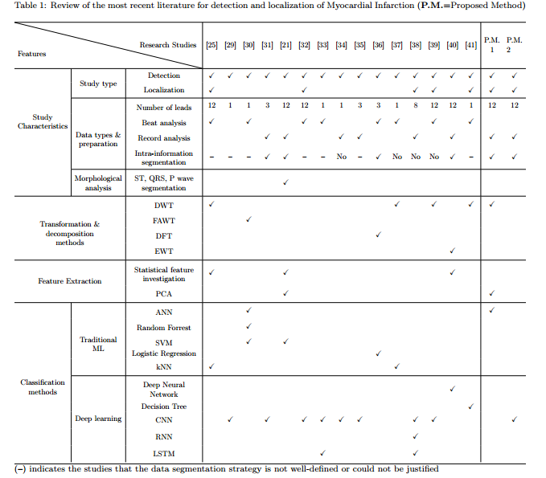
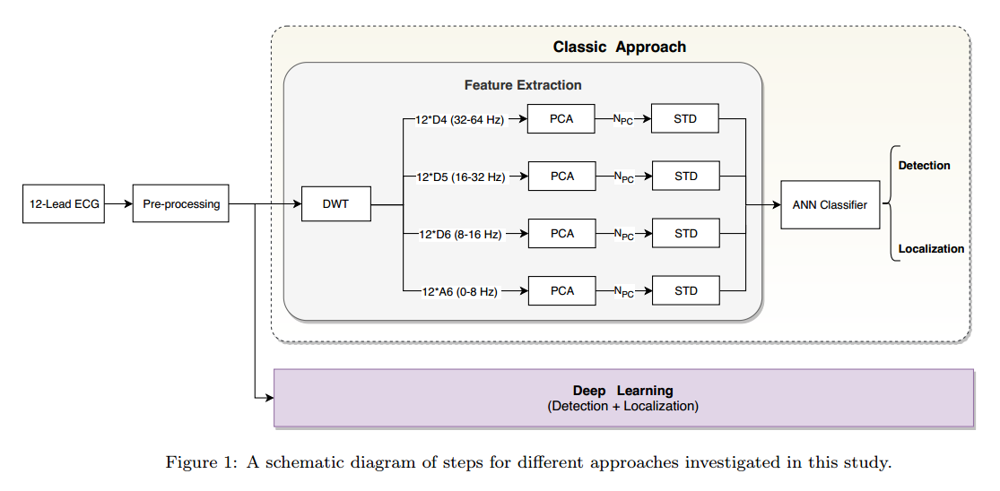
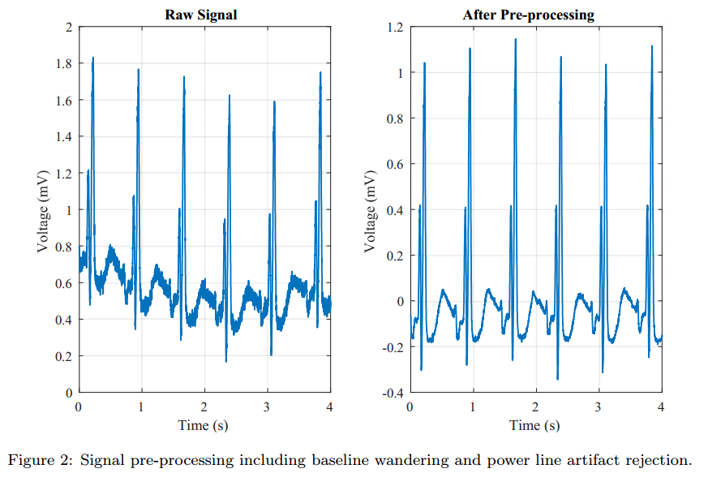
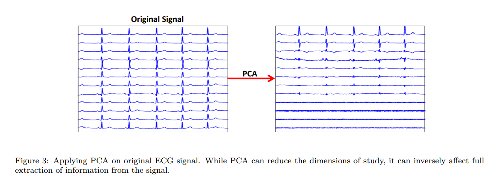
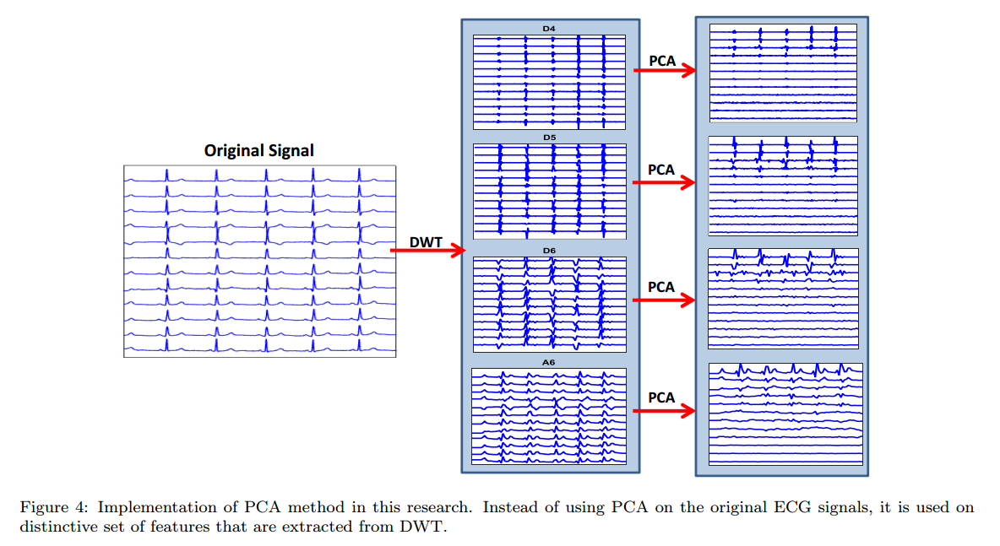
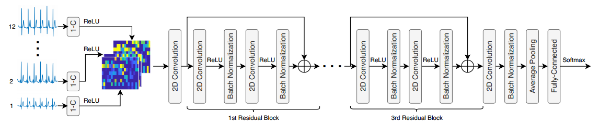
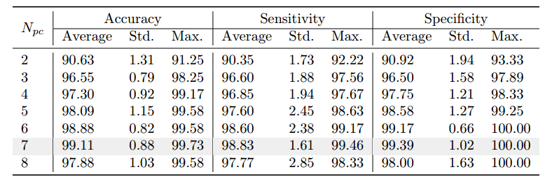

# Automating Detection and Localization of Myocardial Infarction using Shallow and End-to-End Deep Neural Networks

## 摘要

心肌梗死（MI），即心脏病发作，是一种常见的心脏疾病，由持续的心肌缺血引起。对于MI患者，==确定心肌缺血或停止供血的确切位置==至关重要。==自动定位系统==可以帮助医生在紧急情况下做出更好的决策。本文提出了两种基于12导联心电图的==MI检测和定位方法==，采用了通用和端到端的深度机器学习技术。在==特征提取阶段==，通用方法对预处理信号进行==离散小波变换（DWT）和主成分分析（PCA）==，然后通过==浅层神经网络（NN）进行分类==。而在端到端的残差深度学习技术中，直接对预处理输入信号使用==卷积神经网络（CNN）==。为了指定心肌梗死区域，考虑了6个亚诊断类别。所提模型通过物理技术联邦（PTB）数据集进行验证，其中每位患者的数据首先被分组，然后仔细划分为训练、测试和验证数据集。5折交叉验证的结果表明，通用模型在MI检测和定位中以更少的特征集实现了超过98%的准确率。此外，端到端CNN模型表现更为优越，取得了完美的结果。因此，较大的CNN模型可能需要更大的内存，而另一种模型则需要较小的内存，并接受约2%的假阳性和假阴性。

**关键词：**心肌梗死，心电图信号处理，深度残差学习，人工神经网络，离散小波变换，主成分分析

## 引言

根据2016年世界卫生组织（WHO）的报告，冠心病（也称为缺血性心脏病）是全球死亡的主要原因。WHO的研究显示，每年有超过1775万人死于心血管疾病，其中80%是由心脏病发作引起的。心脏病发作，即心肌梗死（MI），是由于冠状动脉部分或完全阻塞，导致心脏供血不足。根据急救指南，MI的检测和定位必须在可疑患者身上迅速进行。立即评估和确定MI的治疗优先级不仅可以降低患者的死亡风险，还能促使再灌注，防止组织坏死。

MI的诊断方法包括心电图（ECG）、超声心动图、磁共振成像（MRI）以及心脏生物标志物的变化，如肌酸激酶MB（CK-MB）、肌钙蛋白和肌红蛋白。在实践中，心电图是急需患者的首选诊断方法。心电图机在救护车和急诊室内常备，可提供快速且高度准确的心脏故障诊断，前提是正确解读。

许多研究已针对通过分析心电图信号自动检测MI，采用不同的机器学习和人工智能方法。文献中提出了多种==ECG信号预处理、特征提取和信号分类的方法==。然而，现有方法在准确性和计算复杂性方面仍面临挑战。Sun等人采用潜在主题多实例学习（LTMIL）分类器检测心肌梗死，使用==多项式系数拟合12导联ECG段中的一个通道==。Chang等人通过==隐马尔可夫、混合高斯和支持向量机（SVM）分类器==对12导联ECG数据进行了MI检测。Waduud等人对12导联ECG的ST幅度进行了实验，并确定了罪魁祸首动脉为左前降支和右冠状动脉。Dohare等人利用==SVM==检测MI，通过分析12导联ECG信号中平均心跳的200多个参数。

虽然检测MI至关重要，但==新研究的重点在于从心电图信号中提取更多信息==。例如，Adam等人使用==k-最近邻（kNN）==将心电图信号分类为MI、扩张型心肌病、肥厚型心肌病和正常四类。Le等人使用==向量心电图（VCG）和随机游走网络==结合三维正交平面，确定复杂的时空模式以检测和定位MI。Arif等人实现了==kNN分类器，并提取了心电图波形的时间域特征==，包括T波幅度、Q波和ST水平偏差。为了全面检测和定位罪魁祸首动脉，构建并评估了一个二分类和一个多分类的十个区域分类器。Acharya等人通过==将12导联ECG信号转化为4级离散小波变换==，研究了MI的解剖位置。从每个导联中==提取了包括熵和最大Lyapunov指数在内的12个非线性特征==，并采用==t检验特征排名方法选择最佳特征==。最终，使用==kNN分类器==在不同场景下评估了模型性能。Sharma等人构建了包括==kNN、线性和基于核的SVM在内的不同分类器==，首先检测梗死患者，然后将MI病变定位到六个不同区域。

近年来，随着深度学习方法的兴起，MI检测的研究大多转向实施这些方法。深度学习模型的一个优点是能够在无需大量信号处理的情况下实现高准确性。因此，信号可以高效分类，通常所需的信号数量较少。例如，Nezamabadi等人利用==多尺度深度卷积神经网络==从胸部HRCT信号中提取特征。为优化分类性能，Wu等人开发了一种==新的深度特征学习方法==，==优化后的特征输入到softmax回归中以构建多分类器==。表1展示了按==研究特征、信号转换、特征提取和分类方法分类==的最新MI检测和定位研究综述。

许多研究采用传统机器学习和深度学习技术来检测和定位心脏疾病（如心肌梗死），但这些研究存在一些主要缺陷，本研究旨在解决这些问题。首先，许多研究忽视了==数据分割==在分类方法中的重要性。如果测试数据集中部分数据在训练集中已经出现，模型性能可能被高估。因此，即使分类器的准确率很高，也可能无法可靠地对未来未见的数据进行分类。通过对现有文献的调查，只有少数研究在将数据划分为测试和验证集之前报告了对每位患者记录的分组策略。大多数研究没有正确隔离数据，或没有明确讨论分割过程。

针对这些缺陷，本研究的主要贡献如下：

1. 首先，研究强调了信号分割在训练和测试数据集中的重要性。==本研究将每位患者的信号分组，以确保它们只分配到一个分区（即训练、验证或测试）==，从而使分类器在训练阶段不会部分检查患者数据，提高模型的鲁棒性。
2. 其次，为了建立一个同时==检测和定位心肌梗死==的综合框架，采用==两种分类==方法，并使用Physikalisch-Technische Bundesanstalt（PTB）数据库进行验证。第一种方法利用经典的心电图处理方法和新颖配置，包括一个==浅层神经网络，用于检测和定位6个特定的梗死区域==。第二种方法则采用==端到端的卷积神经网络==。结合传统神经网络和深度神经网络，使得可以在一个框架内比较两种模型的复杂性、效率和准确性。
3. 在传统神经网络模型中，采用了多种创新技术。尽管已知特征向量大小与分类器获得的准确率之间存在权衡，本研究构建了一个从心电图信号中提取较少特征的高准确率模型。为此，采用了==主成分分析（PCA）和离散小波变换（DWT）的不同组合==，提取心电图信号的独特特征。==使用PCA，将MI检测中的信号数量从12个减少到7个，而在MI定位阶段减少到8个==。结果表明，分类器在检测和定位MI时的准确率分别超过99%和98%。
4. 最后，通过利用端到端深度神经网络，我们能够构建高效的模型，只需少量步骤就能从原始信号中检测和定位MI。这一优势使得这些分类方法可以在大数据集上应用，并简化所需的硬件设计。我们提出的端到端MI检测和定位分类器在MI患者中取得了完美的结果。

本文其余部分组织如下：第二部分专注于我们的方法，全面解释了检测和定位MI的框架；第三部分概述了本研究使用的数据集；第四部分展示了所提模型的结果，随后在第五部分进行评估和性能讨论；最后，第六部分总结了本文并提出未来研究方向。

## 方法

为了检测和定位心肌梗死（MI），实现并比较了两种自动方法（即经典的多导联心电图处理系统和端到端深度神经网络）。每种方法的第一步是信号预处理，如图1所示。接下来的步骤根据技术类型的不同而有所区别。在经典方法中，需要执行多个变换和特征提取层；而在端到端深度学习方法中，预处理后的信号直接输入深度网络，而无需额外处理。以下部分将进一步探讨这些方法的细节。

### 2.1 预处理阶段

心电图（ECG）信号可能受到两种主要伪影的干扰：首先是==高频噪声==，如由肌电图（EMG）引起的噪声、电极上的机械力以及电源线干扰；其次是==基线漂移==（BW），这可能是由于患者移动、呼吸或在心电图记录过程中设备不稳定造成的。分析心电图信号之前，需要去除信号中的噪声，同时保留信号的主要信息。在本研究中，如图2所示，通过应用==60赫兹的陷波滤波器（带宽为3 dB的5 Hz）==，抑制残余的电源线干扰及其谐波，这种滤波器也称为==带阻滤波器==。此外，采用==三阶三次样条插值（CSI）去除基线漂移==，该方法能够恢复去趋势信号中的等电位水平。在该技术中，立方多项式被拟合到原始心电图信号的一组代表性点上。因此，可以考虑参考点来获得信号的低频趋势。拟合的基线随后从心电图信号中减去，以去除该伪影。

### 2.2 经典方法

在预处理阶段之后，进行一系列==离散小波变换（DWT）和主成分分析（PCA）变换==，以提取信号的独特特征。利用提取的特征，浅层神经网络被训练用于检测和定位心肌梗死，具体细节将在以下小节中简要讨论。

#### 2.2.1 特征提取

在对心电图（ECG）信号去噪后，信号被分解为小波系数。==小波变换（WT）是信号与特定小波函数的数学卷积，用来表示信号的时频特性==。信号 $ f(t) $ 的小波变换 $ W_{f(a, \tau)} $ 是通过小波基函数 $ \Psi(t) $ 在尺度 $ a $ 和位置或时间 $ \tau $ 进行的，公式如下所示：

$$
W_{f(a, \tau)} = \frac{1}{\sqrt{a}} \int_{-\infty}^{\infty} f(t) \psi\left(\frac{t - \tau}{a}\right) dt
$$
为了在数字信号上实现小波，使用==预定义离散尺度的离散小波变换（DWT）==。要分解信号，采用了==双二进制小波变换==，该变换表征了基本小波的形状并覆盖了感兴趣的区域。基于母小波的平方伸缩，双二进制小波在尺度 $ 2^j $（或第 $ j $ 级）上的定义如下式：

$$
\Psi_{2^j}(t) = \frac{1}{\sqrt{2^j}} \psi\left(\frac{t}{2^j}\right)
$$
使用双二进制小波在第 $ L $ 级对心电图信号进行多分辨率分解时，可通过 $ L + 1 $ 个子带系数表示，其中一个是近似系数（$ A_L $），其余 $ L $ 个是详细子带系数，分别命名为 $ D_L, D_{L-1}, \dots, D_1 $【47】。在本文中，针对每个心电图导联信号，执行了6级小波分解，采用的是==Daubechies 4母小波函数==。通过使用 $ L = 6 $，可以构建近似子带矩阵 $ A_6 = \{A_6^1, A_6^2, \dots, A_6^m\} $ 和六个详细子带矩阵 $ D_i = \{D_i^1, D_i^2, \dots, D_i^m\} $，其中 $ m = 12 $ 是心电图导联数，$ i = 1, 2, \dots, 6 $ 是系数级别【26】。

从所构建的矩阵 $ \{A_6, D_i; i = 1, 2, \dots, 6\} $ 中可以提取出一组显著特征。正如研究【26】所示，不同的统计和频谱特征集在此过程中被采用（如标准差、信号功率和主导频率）。我们的分析表明，==只有那些具有显著影响的特征集被保留，其他特征集被去除==。根据统计显著性检验，最小p值小于0.01。在最终保留的特征集中，频率较高的特征子带（例如超过62.5 Hz的高频内容）被排除。作为结果，仅使用 $ A_6, D_6, D_5, D_4 $ 进行进一步特征提取。

#### 2.2.2 主成分分析（PCA）

在信号分解后，==PCA 被用于提取 ECG 信号的时间偏差==。PCA 是一种==降维方法==，用于以较少的线性独立特征表示数据的基本变化。通过 PCA，构建的矩阵 $A_6$、$D_6$、$D_5$ 和 $D_4$ 被投影到一个新的互不相关的空间。随着所选主成分数 $N_{PC}$ 的增加，信号的变化减少，但模型所覆盖的累积变化增加。可以从生成的信号中提取多个频率和时域特征。为此，计算每个派生信号的标准差，以量化振幅相对于平均值的离散程度。

测试了不同的 $N_{PC}$ 值用于特征提取，并评估了分类器的性能。因此，$A_6$、$D_6$、$D_5$、$D_4$ 中的每个矩阵生成 $k$ 个标准差，总共提取 $4 \times k$ 个特征用于分类。

虽然其他研究人员已经将 PCA 和 DWT 结合使用，但我们修改了这些方法的组合顺序，以获得更好的结果。==以前，PCA 常用于预处理阶段的降维，然后在减少的信号数量上进行 DWT==。然而，如图 3 所示，==在预处理阶段使用 PCA 可能会损害信号中主要信息的提取==。这是因为 12 导联 ECG 信号的频率分辨率不同。因此，即使低频导联 ECG 信号包含有用的信息，它们也总是被 PCA 抑制。==在本研究中，PCA 应用于从 DWT 提取的独特特征集==，特别是从 $A_6$、$D_6$、$D_5$ 和 $D_4$ 中提取的特征。这些特征集具有相似的频率分辨率，应用 PCA 将找到与该频率分辨率相对应的最大变化，从而保留来自不同频率范围的信号信息。如图 4 所示，在提取特征上应用 PCA 不会忽略信号中的重要信息，因此将提高分类模型的准确性。

#### 2.2.3 使用浅层神经网络进行分类

在第一种方法中，使用浅层神经网络（NN）分类器来检测和定位心肌梗死（MI）。NN 是接收一系列输入并使用传播函数基于其内部状态生成输出的神经元网络。神经元的输出作为下一层神经元的输入，形成一个有向的加权图。训练后的 NN 的属性如下：通过提取的特征构建一个==由 $4 \times N_{PC}$ 个输入节点==组成的三层神经网络。隐藏层的数量是输出层数量的总和，且为输入层大小的 $2/3$，如文献 [51] 推荐。==输出层包含两个节点，用于区分健康个体和心肌梗死患者，六个节点用于 MI 的定位。==

网络中的层是全连接的。此外，网络经过训练后，使得每个输入向量生成一个非零元素，代表预测的分类标签。NN 分类器通过 ==Levenberg-Marquardt 反向传播算法==进行训练 [52, 53]。与其他反向传播算法不同，==Levenberg-Marquardt 算法计算的是损失、梯度和 Hessian 矩阵的近似值，而不是精确值==。然后，为了在每次迭代中最小化损失，调整了阻尼参数。训练过程在 30 次验证失败后终止，或当达到最大迭代次数（即 100 个周期）时终止。

### 2.3 使用扩张卷积的端到端深度残差学习

==深度残差学习==最初是为图像识别应用设计的，由He等人[54]提出，目的是为了克服在卷积神经网络（CNNs）隐藏层数量较大时出现的性能退化问题。简而言之，深度残差学习的核心思想如下：设定第$ l $层的特定神经网络层，令$ x_{l-1} $表示它的输入。文献[54]的作者指出，当网络层数过深时，与其优化层$ l $与$ l+k $（$ k \in \mathbb{N} $）之间的原始映射函数$ F^{l+k}_{l} (x_{l-1}) $，不如优化残差映射函数$H^{l+k}_{l} (x_{l-1}) = F^{l+k}_{l} (x_{l-1}) + x_{l-1}$。这种残差映射可以通过身份映射（identity mapping）实现，具体来说，就是通过使用跨越$ k+1 $层的身份快捷连接。

图5展示了我们使用扩张卷积的端到端深度残差神经网络的结构。提议的深度残差学习架构用于心肌梗死（MI）检测和定位，最初基于文献[55]和[56]中的关键词检测研究。然而，针对本研究，架构进行了重大修改。

在这项研究中，我们考虑了一种基于==一维卷积层（1-C）的前端==，这在我们所知的范围内是首次用于心肌梗死（MI）检测和定位。我们的分析表明，与直接馈送多导联ECG信号到二维（2D）卷积层的深度残差神经网络相比，这种前端方法提供了更好的性能。

我们对提出的模型进行了广泛的分析，调整了不同的滤波器、核大小和步幅，以找到高性能的一维卷积层。所提出的CNN模型的参数包括20个滤波器、零偏置向量、100个样本的核大小和50个样本的步幅。需要注意的是，这种设置提供了ECG信号的伪时间-频率表示，其中滤波器的层数对应于频率箱的数量。此外，核大小和步幅与分析窗口的长度及其步长相匹配。因此，在100 Hz的采样速率下，这相当于使用20个伪频率箱和一个1秒长的分析窗口，50%的重叠。

在应用修正线性单元（ReLU）激活函数后，每个导联被表示为9×20的伪时间-频率矩阵。然后，将12个伪时间-频率矩阵（来自每个导联）沿深度维度堆叠，得到的9×20×12特征体积被馈送到架构的第一个2D卷积层。随后，在最浅的2D卷积层后，有三个具有恒等映射的残差块。在每个残差块中，有两个卷积层，每个卷积层后都有ReLU激活函数，还有一个批归一化层用于正则化目的。残差块的六个卷积层应用扩张卷积以增加网络的感受野。

对于每一层，卷积层的扩张率取决于网络中层的位置。因此，第一和第二残差块中卷积层的扩张率分别为（1，1）和（2，2）。此外，第三残差块的第一和第二卷积层的扩张率分别为（4，4）和（8，8）。一个非残差卷积层有（16,16）的扩张率，随后是另一个批归一化层和一个平均池化层，附加在第三残差块之后。然后，对于MI检测和分类，使用一个带有softmax激活的全连接层。

## 数据集和材料

德国国家计量研究院，也被称为德国物理技术研究院（Physikalisch-Technische Bundesanstalt，PTB），通过PhysioNet数据库提供了免费的数字化ECG数据库，用于研究和教育目的【59, 42】。PTB数据库已被广泛应用于心肌梗死（MI）检测和定位研究【24, 19, 23, 215, 60, 26】。数据库中包含549条常规12导联ECG信号记录，这些导联包括I、II、III、aVR、aVL、aVF、V1-V6。每条信号的采样率为1000 Hz，振幅分辨率为16位，测量范围为±16.384mV。

记录来自290名年龄在17到85岁之间的受试者。其中72%的受试者为男性，平均年龄为57.2岁，28%的受试者为女性，平均年龄为61.6岁。由于22名受试者的临床摘要在数据集中不可用，因此被排除在本研究之外。148名受试者（即368条记录）被标记为心肌梗死（MI）病例，52名受试者（80条记录）被标记为健康病例。其他受试者被标记为与MI无关的心脏疾病，如分支传导阻滞，并因此被排除在本研究之外。

在本研究中，数据从12导联信号中分割为时长为5秒的样本，构成了5968段带有六种不同类别标签的样本。为了平衡数据分布并保持先验概率相等，使用了可调的信号窗口重叠百分比，如表2所示。需要注意的是，这些数据是完全去识别化的并且公开可用，因此本研究不需要伦理声明。

为了正确训练和验证分类方法，数据被分为三个集合：60%的数据用于训练集，10%用于验证集，其余数据用于测试集。正如前文所述，我们采用了患者独立的方法，确保来自同一受试者的样本仅包含在其中一个数据集中。否则，尽管构建的分类方法的名义准确率可能很高，但模型可能会严重过拟合，且不能保证对未见过的病例达到相似的准确率。此外，为了抑制构建网络中的初始化效应，实施了5折交叉验证方法。同时，进行了特征缩放和归一化操作，使特征标准化为零均值和单位标准差。

## 结果

在本节中，对PTB数据集上的经典模型和端到端深度残差网络的分类结果进行分析和比较。分类器的性能用准确率（Acc）、敏感性（Sn）和特异性（Sp）来衡量。分类器的Acc是正确预测与预测总数的比率。Sn，又称为召回率或真正率（TPR），表示正确识别出所有正例的比例。另一方面，Sp，又称为真负率（TNR），表示正确识别出所有负例的比例。Acc、Sn和Sp分别由方程（3）、（4）和（5）定义。在二分类设置中，TP、TN、FN和FP分别表示正例、负例、假正例和假负例的数量。

公式：
$$
Acc = \frac{TP + TN}{TP + FN + TN + FP} \tag{3}
$$
$$
Sn = \frac{TP}{TP + FN} \tag{4}
$$
$$
Sp = \frac{TN}{TN + FP} \tag{5}
$$

这些性能指标可以扩展到多分类问题，其中有多个类别。设n表示给定数据集中样本的数量，k表示类别的数量。因此，$n_k$ 表示第k类样本的比例，而 $n_k^g$ 表示被标记为第k类的样本数量。利用这些信息并构建多分类问题的混淆矩阵，$c_{kg}$ 表示属于类k但被错误标记为类g的样本数量。因此，对角线元素$c_{kk}$ 表示正确分类的类k样本数量，而非对角线元素表示分类错误的样本数量。

根据上述定义，分类器的整体准确率、敏感性和特异性可以按以下方式计算。注意，分类器的总体灵敏度和特异性是各类的平均值。

公式：
$$
Acc = \frac{1}{n}\sum_{k=1}^{K} c_{kk} = \sum_{k=1}^{K} S_k \frac{n_k}{n} \tag{6}
$$
$$
Sn_k = \frac{c_{kk}}{n_k} \tag{7}
$$
$$
Sp_k = \frac{1}{n - n_k} \sum_{g \neq k} (n_g - c_{gk}) \tag{8}
$$

表3：浅层神经网络分类器在不同主成分数（N_pc）下的平均值、标准偏差和最大值。

