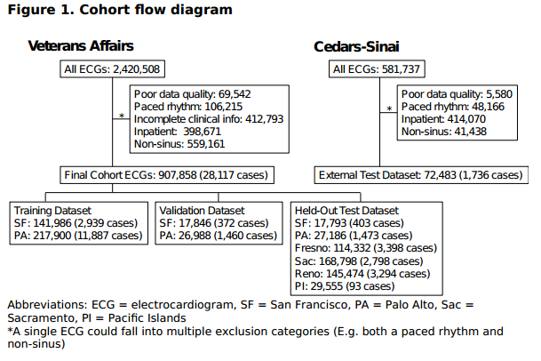
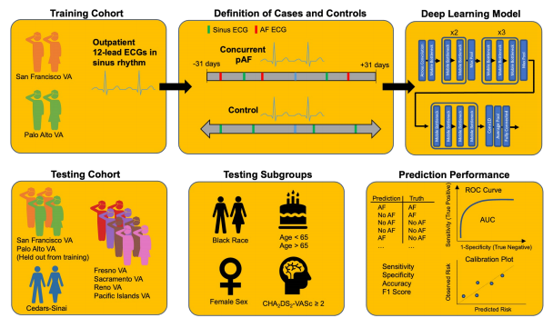

# Deep Learning of Electrocardiograms in Sinus Rhythm From US Veterans to Predict Atrial Fibrillation

## 关键点

**问题：**使用常规获取的门诊12导联ECG的深度学习模型能否预测不同人群在31天内是否存在房颤？

**研究结果：**根据两个大型退伍军人事务部（VA）医院网络的数据训练的模型预测房颤，==在几个独立的患者人群（VA和非VA）以及不同的人口统计学和合并症亚组中==具有较高的准确性。

**意义：**心电图的深度学习有望识别房颤高风险患者，这些患者可以考虑进行强化监测计划，以帮助预防不良心脏事件。

## 摘要

**重要性**：早期检测房颤（AF）可以帮助预防中风等不良心血管事件。深度学习技术已成功应用于心电图（ECG）早期预测多种心血管疾病。

**目标**：确定深度学习是否能==基于大量多样化人群的门诊心电图预测房颤患者==。

**设计**：回顾性队列研究，时间范围为1987年1月1日至2022年12月31日。

**设置**：在6个美国退伍军人事务部（VA）医院网络和1个大型非VA学术医疗中心进行的多中心研究。

**参与者**：所有处于窦性心律的12导联心电图。

**方法与结果**：我们使用来自2个美国VA医院网络的12导联心电图训练==卷积神经网络==，以预测在窦性心律心电图后的31天内房颤的发生。该模型在VA网络和1个大型非VA学术医疗中心的保留心电图上进行测试。

**结果**：我们使用了908,341个心电图，患者平均年龄62.4岁，女性占6.4%，非白人占37.6%，CHA2DS2-VASc评分平均为1.9。在非VA学术医疗中心，平均年龄为59.5岁，女性占52.5%，非白人占25.2%，CHA2DS2-VASc评分平均为1.6。深度学习模型在窦性心电图后的31天内预测房颤的AUC为0.86（95% CI 0.85-0.86）和0.93（0.93-0.94），准确率为0.78（0.77-0.78）和0.87（0.86-0.88），F1分数为0.30（0.30-0.31）和0.46（0.44-0.48），在VA和非VA医院的保留测试心电图上，模型的校准良好，Brier评分为0.02。

在深度学习评估为高风险的个体中，以25%的检测敏感性筛查检测到阳性房颤病例的数量为2.5个个体，以75%敏感性为11.5个个体。模型在黑色人种、女性、65岁以下或CHA2DS2-VASc评分≥2的患者中的表现相似。

**结论：**门诊窦性心律ECG的深度学习在31天内预测了具有不同人口统计学特征和合并症的人群中的AF。

## 缩写

- **AF**：房颤
- **ECG**：心电图
- **VA**：退伍军人事务部
- **ICD**：国际疾病分类
- **CPT**：当前程序术语
- **ROC**：受试者工作特征
- **AUC**：曲线下面积
- **CVA**：中风
- **TIA**：短暂性缺血发作
- **TE**：血栓栓塞
- **MI**：心肌梗死
- **SD**：标准差
- **CI**：置信区间

## 背景

房颤（AF）是最常见的心律失常，影响四分之一的80岁以上患者。1房颤患者发生中风的可能性是其他患者的五倍，并且在中风后30天内死亡的风险高达25%。2，3许多房颤病例未被发现，因为至少三分之一是无症状的。4 -6在发生不明原因急性中风的患者中，五分之一的人会发现有隐匿性房颤。7 -10房颤还会导致心脏结构的长期变化，包括心房扩张和心室功能恶化，这可能导致永久性房颤、瓣膜返流和心力衰竭。11，12

有效的临床管理可以减轻AF的并发症。口服抗凝剂可将中风的相对风险降低三分之二。13早期使用抗心律失常药物或消融术可预防更永久性的AF，并减少症状和中风风险。14 -16因此，早期发现AF有望预防后期不良后遗症。

深度学习是机器学习的一个子集，它可以帮助诊断早期疾病，因为它能够利用信息密集的数据来绘制可能过于复杂而无法由人类临床医生常规识别的关联。心电图（ECG）的深度学习已被用于成功预测死亡率，心力衰竭，心肌病，17 -25最近也被用于预测阵发性和偶发性房颤，通常用于主要为白色的单中心患者人群。26 -28

==到目前为止，很少有深度学习算法用于美国退伍军人事务部（VA）人群==，其中包括来自不同人口背景的近1900万人，与一般成年人群相比，其中许多人患心血管疾病（包括房颤）的风险更高。29- 31因此，VA患者人群代表了一个深度学习指导筛查工作可能最有效的群体。我们调查了VA患者窦性心律ECG的深度学习是否可以预测并发房颤的存在。

## 方法

### ECG数据集选择

我们提取了在VA退伍军人综合服务网络区域（VISN）21内的站点获取的所有12导联心电图，该区域包括6个独立的VA医疗中心网络（旧金山、帕洛阿尔托、弗雷斯诺、弗朗西斯科、萨克拉门托、里诺和太平洋岛屿），每个网络都由多个诊所组成。从1987年1月1日至2022年12月31日进行了ECG检查。ECG描记与心脏病专家的ECG解释、患者人口统计学资料（年龄、性别和人种/种族）和合并症信息（房颤、心力衰竭、高血压、糖尿病、既往中风/短暂性脑缺血发作/血栓栓塞、既往心肌梗死、外周血管疾病，慢性肾脏疾病）。使用国际疾病分类（ICD）和当前程序术语（CPT）代码确定合并症。32使用合并症字段，我们估计了CHA 2DS 2-VASc评分。

我们只包括窦性心律的心电图，排除了数据质量差的心电图，起搏心律，或无法与年龄和性别信息配对（表明患者在VA健康系统中未得到一致随访或ECG患者数据输入不正确且未正确）（图一）我们将我们的数据集限制在门诊ECG，因为AF筛查主要在门诊实施。住院ECG可以引入选择可能不能反映一般AF筛查人群的病情较重患者的偏倚。

来自San弗朗西斯科VA和Palo Alto VA的ECG用于模型训练、验证和测试，来自Fresno VA、萨克拉门托VA、里诺VA和太平洋岛屿VA的ECG用作单独的保留测试数据集。

对于外部测试数据集，我们使用了2005年3月1日至2018年12月31日在CedarsSinai医疗中心（一家大型城市三级医疗中心）采集的所有12导联ECG。采用与VA数据集相同的入选和排除标准。

本研究获得了加州大学旧金山弗朗西斯科IRB和Cedars-Sinai IRB的批准。

### 病例和对照的定义

并发AF病例定义为窦性心律ECG，可在31天内与房颤或房扑中的至少一个ECG配对（基于心脏病专家的ECG解读）（图1）。对照组定义为没有房颤或房扑ECG或ICD诊断为房颤或房扑的患者的窦性ECG。==CPT编码：单个患者可以提供多个病例和对照ECG==，这已被证明可以提高模型性能。26

在一项额外的探索性分析中，我们模拟了在较长的1年时间范围内对患者首次房颤病例的前瞻性预测，我们将病例定义为最接近每例患者首次房颤诊断的窦性心律ECG，ECG必须在房颤诊断前1年内。

### ECG处理和深度学习模型训练

从VA的MUSE心脏病信息系统（GE HealthCare）中提取ECG描记。ECG波形数据以250 Hz采集，并提取为10秒，12 x 2500振幅值矩阵，存储为base64文本。ECG进行基线漂移校正，使用200 ms和600 ms间期的中值滤波和z评分标准化。

我们采用了一种==基于先前用于从ECG预测临床表型的新架构的atrous卷积神经网络==（补充图1）.33模型使用PyTorch进行训练。我们使用随机权重初始化我们的模型，并使用ADAM优化器和初始学习率为1 e-4的二进制交叉熵损失函数训练50个epoch。训练数据集，由来自San弗朗西斯科VA和Palo Alto VA研究中心的ECG组成，以80：10：10的比例在患者水平上进行分割，以创建训练、验证和保留的测试数据集。

### 评估模型性能

所有性能分析均来自保留的VA数据集和未参与模型训练的外部Cedars-Sinai数据集的模型预测。我们使用$CHA_2DS_2VASc$评分和逻辑回归模型（包含所有可用的人口统计学和合并症信息），将深度学习模型的性能与来自VA和Cedars-Sinai的保留测试数据的AF临床预测进行了比较（年龄、性别、心力衰竭史、糖尿病、CVA/TIA/TE、既往MI、外周血管疾病，这些患者特征近似于在AF临床风险预测模型（诸如CHARGE-AF）中使用的那些。由于无法可靠地确定ECG时的血压和降压药物使用情况，因此未明确计算AF风险评分。

通过ROC曲线的曲线下面积（AUC）评估模型区分度。我们报告了灵敏度，特异性，尤登指数的准确性（定义为灵敏度+特异性-1的最大值）以及最大F1评分（精确度（阳性预测值）和召回率的调和平均值35所有指标均报告双侧95%置信区间（CI）使用DeLong检验比较ROC曲线AUC。36我们计算了筛选检测真正的阳性病例所需的数量。深度学习模型认为高风险患者中的AF为1/阳性预测值

对于模型校准，使用在80%的测试数据集上训练的逻辑回归对风险评分进行Platt标度，然后将其应用于20%的测试数据集。37我们通过绘制50个相同大小的预测风险增加组的AF观察与预测风险，来可视化该20%测试数据集的校准图。使用Brier评分量化校准，这是观察结果和预测风险之间的均方误差，0表示完全准确，1表示完全不准确。使用Spiegelhalter z检验在0.05的显著性阈值下进行校准。Spiegelhalter z检验的零假设是模型校准良好;统计学上显著的分数表明校准较差。校准在所有地点进行了可视化和测试，并分别在VA医院和Cedars-Sinai进行了测试。

在R和Python中进行统计分析。

## 结果

在我们的VA医院网络中获得了2，420，508个12导联ECG。排除数据质量差、起搏节律、临床信息不完整以及非窦性或在住院环境中获得的ECG后，（占所有ECG的62.5%），最终VA队列包括277，528例患者的907，858例窦性心律门诊ECG，31天内记录了117例房颤病例的心电图Cedars-Sinai外部测试队列包括来自44，754名患者的72，483例窦性心律门诊ECG，其中31天内有1，736例AF病例。ECG来自平均62.4（SD 13.5）岁，6.4%女性，10.7%黑人，合并症患病率高（11.2%心力衰竭，32.4%糖尿病，8.8%既往中风（CVA）/短暂性脑缺血发作（TIA）/血栓栓塞（TE），11.1%既往心肌梗死（MI）），平均CHA 2DS 2-VASc评分为1.9（1.6）（表1）。在外部测试队列中，患者平均年龄为59.5岁，（SD 15.4），女性占52.5%，黑人占9.4%。与退伍军人管理局人群相比，合并症的患病率较低（8.4%心力衰竭，8.5%糖尿病，4.6%既往CVA/TIA/TE，1.8%既往MI），平均CHA 2DS 2-VASc评分为1.6（1.4）。

在31天内通过ECG检测到窦性ECG伴AF的患病率为3.1%。当将病例与对照组进行比较时，并发AF的患者平均年龄较大（70.4岁与61.9岁），女性较少（3.8%与61.9岁）。10.0%），通常为白色（78.3% vs. 62.9%），合并症的发生率更高（37.3% vs. 10.2%心力衰竭，45.0% vs. 30.2%糖尿病，16.2% vs. 8.3%既往CVA/TIA/TE，25.4% vs. 9.9%既往MI）和CHA 2DS 2 VASc评分（3.1（1.8）vs. 1.9（1.6））（补充表1）。

深度学习模型在来自San弗朗西斯科VA和Palo Alto VA的359，886个ECG上进行了训练。当在这两个VA站点的保持训练数据集上进行测试时，该模型的AUC为0.88（95% CI 0.87-0.90）、0.89（0.89-0.90），准确度分别为0.81（0.79-0.83）、0.82（0.81-0.83），F1评分分别为0.33（0.29-0.37）和0.49（0.47-0.51）（图2A）。然后将该模型应用于未包括在模型训练中的其他四个VA部位，并达到0.86的AUC（0.85-0.87）（弗雷斯诺VA），0.84（0.83-0.85）（萨克拉门托VA），0.84（0.83-0.85）（里诺VA），0.83当在Cedars-Sinai Medical Center的外部测试集上测试时，该模型实现了0.93（0.93-0.94）的AUC。

深度学习模型也得到了很好的校准，所有研究中心、VA医院和Cedars-Sinai医疗中心的Brier评分分别为0.02、0.02和0.02（Brier分数为0表示完美校准，1表示完全误校准）（图2B）通过Spigelhalter z检验的测试也证实了在0.05的显著性阈值下拒绝模型校准的零假设的失败（所有研究中心、VA医院、Cedars-Sinai Medical Center的p = 0.06、0.07、0.39）。

为了确定深度学习模型相对于传统临床预测工具的性能，我们将深度学习模型的预测与使用CHA 2DS 2-VASc评分以及使用所有可用的人口统计学和临床风险因素信息进行回归的AF预测进行了比较。当应用于测试所有VA和Cedars-Sinai研究中心未参与模型训练的患者时，深度学习模型的AUC为0.86（0.86-0.87），风险因素回归模型的AUC为0.73（0.730.74），CHA 2DS 2-VASc评分的AUC为0.70（0.70-0.70）（图3）.选择筛选阈值以将测试灵敏度固定在25%导致使用深度学习模型筛选以找到AF的真正阳性病例所需的人数为2.47人，而回归模型为11.48人，CHA 2DS 2-VASc评分12.01（图3）。

我们在特定的患者队列子集中测试了模型的性能（表2，补充表2）。在不同的研究中心，女性患者的比例存在实质性差异（4.8%-52.5%），黑人（1.5%-17.2%），年龄小于65岁（48.1%-59.9%），且CHA 2DS 2-VASc评分≥ 2（41.4%-64.4%）。在某些地点，该模型显示女性患者的表现略有显着增加，而65岁以上患者的表现略有下降，CHA 2DS 2-VASc评分≥ 2。然而，在所有研究中心中未一致观察到这些差异，并且不同亚组的性能基本不变。

我们进行了一项额外的探索性分析，通过将病例重新定义为最接近每例患者首次已知AF诊断且按时间顺序在首次已知AF诊断之前的窦性心律ECG，模拟在更长的1年时间范围内预测新发未诊断AF（仅限于AF诊断前1年内的ECG）。在本分析中，该模型的AUC范围为0.80（0.790.81）至0.85（0.84-0.86）和精度从0.73（0.72-0.75）至0.77（0.760.78）VA研究中心当在Cedars-Sinai ECG上测试时，AUC为0.79（0.78-0.79），准确度为0.72（0.71-0.72）。

## 讨论

在这项针对大量不同人群的多中心回顾性研究中，我们发现，使用卷积神经网络的深度学习模型以高分辨力和校准预测了窦性心律下12导联ECG在31天内房颤的发生。预测性能在6个不同的VA医院网络以及一个单独的非VA大型城市学术医疗中心。预测结果优于使用传统临床风险因素的预测结果，并且在包括女性和黑人患者在内的多个患者亚组中基本保持不变。我们还表明，该模型可能有助于在较长的1- 10年内预测新发房颤。年时间范围。

房颤的早期检测具有特殊的前景，因为它可以为改变这种疾病的自然进展和并发症特征的管理决策提供信息。抗凝可将中风风险降低三分之二。13抗血栓药物和消融可预防永久性房颤的发展，还可降低中风和心血管死亡的发生率。14 -16虽然指南支持房颤的机会性筛查，理想的人群和最佳筛查方法仍不清楚。38，39多项研究已证明，无论是通过结构化的12导联ECG筛查程序、远程监测还是植入设备进行更密集的监测，都会导致更多隐匿性AF的检测。40 -46然而，大多数这些筛查干预措施都是资源密集型的，有时是侵入性的，并且还没有被采用作为常规临床实践的一部分。最近在瑞典的两个地区对所有75-76岁的个体进行的AF筛查计划的一项大型随机对照试验显示，筛查的主要障碍之一是说服患者参与该计划，即使那些参与研究的患者的中风、出血和死亡率的复合终点显著较低。

在本研究中，我们发现，深度学习的12-作为常规临床实践的一部分获取的导联ECG可能是识别具有未识别AF的最高风险的患者的相对简单的方法。这可以并入现有工作流程，而不需要显著的额外患者参与或临床资源。然后，高风险患者可以被引导到更密集的AF识别程序中在通过深度学习模型确定为高风险的患者中，根据所需的测试灵敏度，筛选检测AF真阳性病例所需的人数是可调的，对于25%的测试灵敏度，可以低至2.5名患者，对于75%的灵敏度，可以高至11.5名患者这大大低于使用基于临床风险因素回归或CHA 2DS 2-VASc评分的风险评估进行筛选所需的数量，其筛选所需的数量分别为11.5和12，测试灵敏度为25%，测试灵敏度为75%，测试灵敏度为25.4和20.8。我们的工作建立在之前的研究基础上，该研究还使用深度学习在不同患者人群中通过模拟和真实的试点部署从窦性ECG中识别AF。48，27

我们的研究结果在将深度学习应用于来自美国退伍军人的多中心心血管数据以及额外的外部站点验证方面是独一无二的。考虑到疾病的高预测试概率，在这个大规模人群中实施筛查计划可能特别有效，这有助于限制假阳性率，以及较高的平均CHA 2DS 2-VASc评分，这可以增加开始抗凝的净效益。29 -31同样的特征使得退伍军人人群特别适合AF筛查，然而，也使它不同于其他的好-这些差异可能对深度学习模型的VA内外的可推广性构成挑战，49最近的一项研究表明，设计用于识别急性肾损伤的深度学习算法在VA和非VA人群中的表现并不相同，这可能是由于人口统计学差异（即女性VA患者的比例明显较低）。50

我们发现，尽管不同VA队列和我们的外部非VA测试站点之间的患者构成存在显著差异，但我们的深度学习模型对并发性AF的预测性能在很大程度上得到了保留。年龄较大且CHA 2DS 2水平较高的患者的表现略有下降，VASc评分。这可能是因为这些患者有更多的合并症，导致ECG发生竞争性变化，使预测AF更加困难。该队列中的女性患者总体上也更年轻（69.7% < 65岁，而男性患者为50.6%），这可以解释该亚组中性能的改善。总体而言，在所有研究中心均未观察到这些差异，鉴于差异幅度较小，可能无临床意义。同样，我们的模型在应用于Cedars-Sinai的外部测试队列时，显示出辨别能力的小幅改善，这可能是因为该队列相对富集了女性、年轻和CHA 2DS 2-VASc评分较低的患者。

## 局限性

有几个限制需要考虑。由于这是一项回顾性研究，12导联ECG的人群可能与前瞻性AF筛查人群不同。虽然我们的VA系统中的ECG是在临床访视期间常规获得的，但==每个患者的平均ECG数量存在研究中心间的差异，我们可能预计本研究中接受心电图检查的患者人群心血管疾病和房颤的患病率更高。这种选择偏差可能会增加模型的阳性预测值与筛查更广泛的患者人群时使用该模型相比，减少了筛查所需的数量==。尽管如此，如果选择更高风险的人群进行前瞻性筛查，前瞻性模型的性能可能相似。==虽然我们使用了ECG数据库和电子健康记录中的所有数据来识别AF病例，在对照组中仍有可能有未确诊的房颤患者。这将使我们的结果偏向于零，并导致低估我们模型的性能。==一些被预测为病例的患者实际上可能是未来的前瞻性研究使用我们的模型对高风险患者进行持续监测，可以证实AF预测，并澄清该方法是否改善了下游结局，如中风和血栓栓塞。

## 结论

使用美国退伍军人窦性心律下的门诊12导联ECG训练的卷积神经网络成功预测了具有多种人口统计学特征和合并症的退伍军人和非退伍军人人群在31天内是否存在AF。这种模型有望用于AF筛查，并可用于未来减少与这种疾病相关的不良并发症。