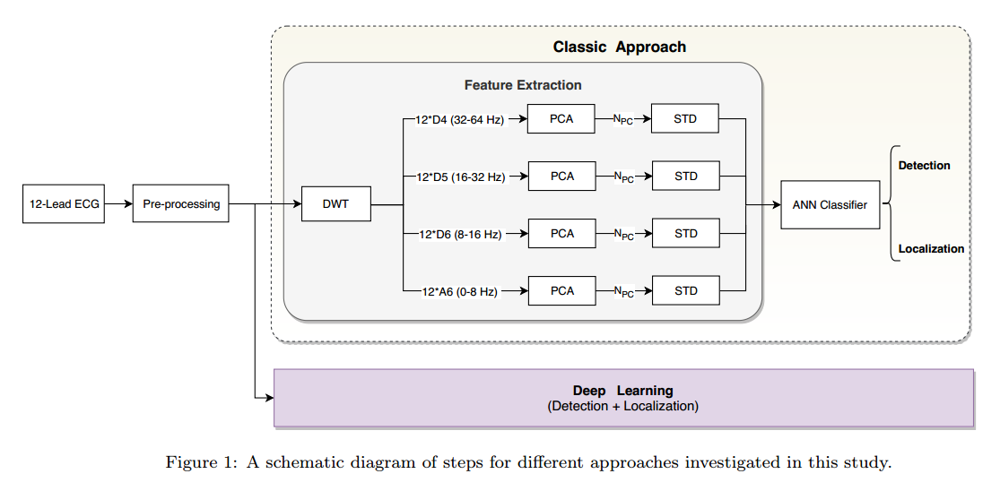
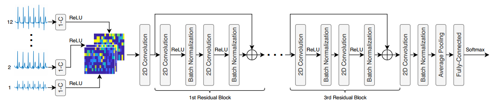
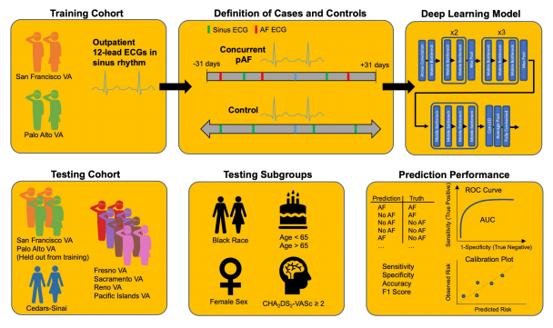

# 组会纪要

## 1. ECG-Based Deep Learning and Clinical Risk Factors to Predict Atrial Fibrillation

- PMID: 34743566
-  
- PMCID: [PMC8748400](http://www.ncbi.nlm.nih.gov/pmc/articles/pmc8748400/)
-  
- DOI: [10.1161/CIRCULATIONAHA.121.057480 ](https://doi.org/10.1161/circulationaha.121.057480)

Circulation，Q1，B1，IF35.5，2022

**方法：**我们训练了一个卷积神经网络（ECG-AI），利用12导联心电图推测在马萨诸塞总医院（MGH）接受长期初级保健的患者5年内新发房颤的风险。

**结论：**基于AI的12导联心电图分析在预测新发房颤风险方面与临床风险因素模型具有相似的实用性，且两种方法具有互补性。

**创新点**

1. 基于人工智能的12导联心电图分析与已建立的房颤（AF）临床风险因素模型具有相似的预测有用性，两者是互补的。
2. AF的ECG人工智能模型在独立研究样本中具有预测有用性，可区分心力衰竭和中风患者的风险，并适用于单导联ECG描记。

**临床意义**

1. 使用12导联ECG的基于人工智能的AF风险预测模型可以有效量化未来的AF风险。
2. AF的预测可以使用临床风险因素或基于人工智能的ECG分析来进行，但两者的组合提供了最大的预测准确性

ECG-AI是一种经过训练的卷积神经网络，用于预测5年无房颤生存率。==ECG-AI的输入是单个12导联ECG（5000 x 12 维的统一输入张量）==

==ECG-AI 采用的不是二元分类法10,11 ，而是编码和损失函数21 ，既考虑了结果（即房颤）发生的时间，也考虑了普查（定义为最早的死亡或随访丢失）带来的遗漏。==为此，==ECG-AI 编码将时间划分为离散的时间段，在这些时间段内，房颤事件或剔除事件均有可能发生，而损失函数优化了每个时间段内预测房颤发生的负对数可能性==。

心电图人工智能的输入是 XML 格式的 12 导联心电图，其中==每个导联表示为 10 秒钟内以 250 或 500Hz 采样的相对电压振幅向量==。采样频率为 250Hz 的心电图被升采样至 500Hz，以实现统一的输入形状。对于在基线窗口内有多个心电图的个体，在每个epoch用于训练的心电图是从该个体的所有心电图中随机选择的。

虽然新发房颤（AF）可以被建模为一个二元分类任务，但==这种方法并未考虑删失（数据不完整性），可能导致样本级别校准不佳==。为了解决这个问题，我们扩展了Gensheimer和Narasimhan提出的方法，==开发并实施了一种编码和损失函数==，该函数同时考虑了由于事件（如AF）和正确的审查所引入的遗漏。==编码将总随访时间划分为n个时间段==，在我们的案例中，n=25，每个时间段跨度约为72天。==每个个体由两个长度为n的二进制向量表示，其中一个表示删除日期的二进制掩码，另一个表示AF事件状态的one-hot编码==。删失向量$V_{\text{censor}}$在个体被删失的时间段中为0，在他们处于风险集中的时间段中为1。事件向量$V_{\text{AF}}$如果在该时间段内发生AF诊断则为1，否则为0。ECG-AI输出长度为n的向量$V_{\text{predict}}$，代表在每个时间段内AF存活的概率。我们的==损失函数最小化了ECG-AI预测的负对数似然==。似然函数分为时间段内幸存个体和发生事件的时间段中的贡献。具体来说，我们最小化以下公式：

$$
L = -\sum \log(L_{\text{survival}} + L_{\text{event}})
$$
其中，

$$
L_{\text{survival}} = 1 - (V_{\text{AF}} * V_{\text{predict}})
$$

$$
L_{\text{event}} = (V_{\text{censor}} * V_{\text{predict}}) + (1 - V_{\text{censor}})
$$

通过这种方式，==删失个体在删失后的时间段中不会对损失做出贡献==（例如，死亡或随访最后时间）。第一个时间段被保留用于记录随访开始前的事件。==该模型为每个时间段预测独立的生存概率（通过sigmoid激活函数）==，因此不假设比例风险，并有助于处理不连续的生存曲线建模。

心电图人工智能==在两个不同的时间尺度（10 秒心电图和 5 年预测生存曲线）之间进行映射==。该映射由==一维卷积神经网络（CNN）==学习，其心电图输入为（5000，12），输出向量为 25 个存活概率，每个时间分段一个。

以下是心电图人工智能的架构概要。简而言之，该模型将 10 秒钟的连续 12 导联心电图波形数据作为第一卷积层的输入。全连接层只接收卷积的心电图波形数据，以生成心房颤动发生时间的估计值（主要）以及年龄、性别和诊断声明中是否存在心房颤动的预测值（次要）。箭头表示各层之间的连接。Conv1D = 一维卷积，MaxPooling1D = 一维最大池化。

## 2. A Novel ECG-Based Deep Learning Algorithm to Predict Cardiomyopathy in Patients With Premature Ventricular Complexes

- PMID: 37480862
-  
- DOI: [10.1016/j.jacep.2023.05.025 ](https://doi.org/10.1016/j.jacep.2023.05.025)

JACC Clin Electrophysiol，Q1，B1，IF8.0，2023

**背景**：早期心室复合搏动（PVCs）是常见的，虽然通常是良性的，但可能导致PVC诱导的心肌病。我们创建了一种深度学习算法，以从12导联心电图（ECG）中预测PVC患者的左心室射血分数（LVEF）下降。

**目标**：本研究旨在评估一种深度学习模型，以预测PVC患者中的心肌病。

**方法**：我们使用了来自5家医院的电子病历，识别出有记录的PVC成人的ECG。内部训练和测试在一家医院进行，外部验证在其他医院进行。主要结果是6个月内首次诊断LVEF降低至40%或以下。数据集中包含383,514个ECG，最终分析了14,241个。我们分析了受试者工作特征曲线下面积（AUC）以及代表性患者的可解释性图，算法预测，PVC负荷和多变量Cox模型中的人口统计学数据，以评估心肌病的独立预测因子。

**结果**：在14,241名患者的队列中（年龄67.6 ± 14.8岁；女性43.8%；白人29.5%，黑人8.6%，西班牙裔6.5%，亚裔2.2%），22.9%的患者在6个月内经历了LVEF降低至40%或以下。模型的预测表现良好，LVEF降低至40%或以下的AUC为0.79（95% CI：0.77-0.81）。梯度加权类别激活图的可解释性框架强调了窦性心律中的QRS波复杂-ST段。在接受成功PVC消融的患者中，绝大多数（89%）患者在消融后LVEF改善，心肌病得到缓解。

**结论**：仅基于12导联ECG的深度学习能够准确预测PVC患者中新发心肌病的发生，与PVC负荷无关。模型预测在性别和种族间表现良好，依赖于窦性心律中的QRS波复杂/ST段，而非PVC的形态。

心电图数据由 XML 文件组成，其中包含 I、II 和 V1-V6 导联的波形数据。其余导联（III、aVF、aVL 和 aVR）被称为 “衍生导联”，因为它们只包含其他导联的信息。应用==巴特沃斯带通滤波器==对心电图波形进行降噪处理，然后再进行==中值滤波==。结果波形数据被绘制成图像，以便使用==二维卷积神经网络==。

我们选择了==最大的可用预训练ResNet模型（ResNet-152）==作为分析的起点。==使用在自然图像上预训练的模型==可以以更少的数据获得更好的性能，同时还需要更少的时间来实现最佳解决方案。

数据基于==组洗牌分割==进行分割，通过确保训练组和测试组中没有患者来==消除数据泄漏的可能性==。我们选择使用Adam优化器，学习率为3e-4，OneCycle学习率计划。模型训练了35个epoch，并在内部测试数据上报告了性能最佳的epoch。所得模型也分别在外部验证数据上进行了评估。==我们使用学习率调度以及持续记录损失和性能指标，以实现模型的最佳拟合。==当模型性能开始恶化时，停止训练（发生过拟合）内部队列是指西奈山医院的患者，而外部队列由外部队列组成。验证数据集从其他4家附属医院的合并患者中获得。

我们使用受试者工作特征曲线下面积（AUROC）和精确召回曲线下面积（AUPRC）指标来评估模型性能，这些指标使用模型输出的未校准概率估计值来生成曲线，这些曲线表示模型区分阳性和阴性的能力。

我们使用梯度加权类激活映射（GradCAM）方法生成类激活映射。这些映射显示了ECG的哪些区域是最负责将模型推向预测的区域。为了进一步评估算法预测，我们提取了模型预测随后LVEF受损的患者，其概率为80%，通过检查急性失血性贫血进行消融术的特异性。然后，由电生理学家进行手动图表审查。我们排除了没有随访的患者-我们通过采集心电图、监护仪和设备询问（包括电描记图），在随访时确定是否存在室性早搏。我们使用配对双尾Student t检验评估接受PVC消融术患者的EF变化。

梯度加权类激活映射（Grad-CAM）是一种用于深度学习模型可解释性的方法，特别适用于卷积神经网络（CNN）。它通过生成热图来帮助理解模型在做出预测时关注的图像区域。

Grad-CAM的工作原理如下：

1. **梯度计算**：对于给定的输入图像和目标类别，计算模型最后一层卷积层的梯度。这些梯度表示了该层特征图对目标类别预测的影响。

2. **加权特征图**：将梯度进行全局平均池化，以获得每个特征图的权重。这些权重表明了特征图在特定类别预测中的重要性。

3. **生成热图**：将权重与相应的特征图相乘并进行加和，得到一个热图。这个热图通常会经过ReLU激活，以突出显示对目标类别有正贡献的区域。

4. **可视化**：将生成的热图叠加在原始图像上，可以直观地观察模型关注的区域，帮助理解模型的决策过程。

Grad-CAM广泛应用于图像分类、物体检测等任务，能够提高深度学习模型的透明度和可解释性。在心电图分析等领域，它同样有助于识别模型关注的ECG特征。

## 3. Automating Detection and Localization of Myocardial Infarction using Shallow and End-to-End Deep Neural Networks

DOI: 10.1016/j.asoc.2020.106383

Applied Soft Computing，Q1，B1，IF7.2，2020

表1展示了按==研究特征、信号转换、特征提取和分类方法分类==的最新MI检测和定位研究综述。

本研究的主要贡献如下：

1. 首先，研究强调了信号分割在训练和测试数据集中的重要性。==本研究将每位患者的信号分组，以确保它们只分配到一个分区（即训练、验证或测试）==，从而使分类器在训练阶段不会部分检查患者数据，提高模型的鲁棒性。
2. 其次，为了建立一个同时==检测和定位心肌梗死==的综合框架，采用==两种分类==方法，并使用Physikalisch-Technische Bundesanstalt（PTB）数据库进行验证。第一种方法利用经典的心电图处理方法和新颖配置，包括一个==浅层神经网络，用于检测和定位6个特定的梗死区域==。第二种方法则采用==端到端的卷积神经网络==。结合传统神经网络和深度神经网络，使得可以在一个框架内比较两种模型的复杂性、效率和准确性。
3. 在传统神经网络模型中，采用了多种创新技术。尽管已知特征向量大小与分类器获得的准确率之间存在权衡，本研究构建了一个从心电图信号中提取较少特征的高准确率模型。为此，采用了==主成分分析（PCA）和离散小波变换（DWT）的不同组合==，提取心电图信号的独特特征。==使用PCA，将MI检测中的信号数量从12个减少到7个，而在MI定位阶段减少到8个==。结果表明，分类器在检测和定位MI时的准确率分别超过99%和98%。
4. 最后，通过利用端到端深度神经网络，我们能够构建高效的模型，只需少量步骤就能从原始信号中检测和定位MI。这一优势使得这些分类方法可以在大数据集上应用，并简化所需的硬件设计。我们提出的端到端MI检测和定位分类器在MI患者中取得了完美的结果。

为了检测和定位心肌梗死（MI），实现并比较了两种自动方法（即经典的多导联心电图处理系统和端到端深度神经网络）。每种方法的第一步是信号预处理，如图1所示。接下来的步骤根据技术类型的不同而有所区别。在经典方法中，需要执行多个变换和特征提取层；而在端到端深度学习方法中，预处理后的信号直接输入深度网络，而无需额外处理。以下部分将进一步探讨这些方法的细节。

心电图（ECG）信号可能受到两种主要伪影的干扰：首先是==高频噪声==，如由肌电图（EMG）引起的噪声、电极上的机械力以及电源线干扰；其次是==基线漂移==（BW），这可能是由于患者移动、呼吸或在心电图记录过程中设备不稳定造成的。分析心电图信号之前，需要去除信号中的噪声，同时保留信号的主要信息。在本研究中，如图2所示，通过应用==60赫兹的陷波滤波器（带宽为3 dB的5 Hz）==，抑制残余的电源线干扰及其谐波，这种滤波器也称为==带阻滤波器==。此外，采用==三阶三次样条插值（CSI）去除基线漂移==，该方法能够恢复去趋势信号中的等电位水平。

在预处理阶段之后，进行一系列==离散小波变换（DWT）和主成分分析（PCA）变换==，以提取信号的独特特征。

在对心电图（ECG）信号去噪后，信号被分解为小波系数。==小波变换（WT）是信号与特定小波函数的数学卷积，用来表示信号的时频特性==。

DWT（离散小波变换，Discrete Wavelet Transform）是一种信号处理技术，用来将信号分解为不同的频率分量，并分析每个分量在不同时间尺度上的特征。与傅里叶变换不同，DWT能够同时提供时间和频率信息，因此特别适合处理非平稳信号，如心电图（ECG）或语音信号。

在信号分解后，==PCA 被用于提取 ECG 信号的时间偏差==。PCA 是一种==降维方法==，用于以较少的线性独立特征表示数据的基本变化。

在第一种方法中，使用浅层神经网络（NN）分类器来检测和定位心肌梗死（MI）。通过提取的特征构建一个==由 $4 \times N_{PC}$ 个输入节点==组成的三层神经网络。==输出层包含两个节点，用于区分健康个体和心肌梗死患者，六个节点用于 MI 的定位。==

图5展示了我们使用扩张卷积的端到端深度残差神经网络的结构

## 4. Deep Learning for Premature Ventricular Contraction-Cardiomyopathy Are We Digging Deep Enough==(评论文章2)==

- PMID: 37611994
-  
- DOI: [10.1016/j.jacep.2023.07.003](https://doi.org/10.1016/j.jacep.2023.07.003)

JACC Clin Electrophysiol,Q1,B1,IF8.0,2023

提出质疑

## 模型输入应该是矩阵还是图像？

针对涉及图像的任务的最流行的深度学习模型使用2维（2D）或3D卷积神经网络来执行分类或分割等任务。ECG被认为是2D图像，因为存在针对时间（x轴）绘制的幅度轴（y轴）。因此，训练用于ECG分析的2D卷积神经网络模型具有直观意义。然而，对于时间序列数据，我们可以通过将ECG数据作为矩阵输入并训练1D卷积神经网络来节省计算资源，而性能没有任何下降，因为存在于2D图像中的所有信息已经存在于1D信号中。对于ECG，一种方法是将每个样本作为输入(number of samples = sampling frequency $\times$ time).9这种技术允许我们在其他地方分配计算资源，并优选地训练更大的数字以构建更鲁棒的模型。Lampert等人10确实==从ECG波形数据开始，但后来将其绘制为图像==。==尽管这种转换有助于人类理解，这是一个无关的步骤，无意中将人工智能限制在类似人类的处理上。将人工智能从这种人类-定向约束可能会导致更优化的结果。该转换以图像分辨率的形式引入了不必要的限制，并在ECG描记图周围生成多余的多余白色像素。因此，可以质疑这是否值得额外的计算量。==

## 5. Deep Learning of Electrocardiograms in Sinus Rhythm From US Veterans to Predict Atrial Fibrillation

- PMID: 37851434
-  
- PMCID: PMC10585587 (available on 2024-10-18)
-  
- DOI: [10.1001/jamacardio.2023.3701 ](https://doi.org/10.1001/jamacardio.2023.3701)

JAMA Cardiol,Q1,B1,IF14.8,2023

**方法与结果**：我们使用来自2个美国VA医院网络的12导联心电图训练==卷积神经网络==，以预测在窦性心律心电图后的31天内房颤的发生。该模型在VA网络和1个大型非VA学术医疗中心的保留心电图上进行测试。

**研究结果：**根据两个大型退伍军人事务部（VA）医院网络的数据训练的模型预测房颤，==在几个独立的患者人群（VA和非VA）以及不同的人口统计学和合并症亚组中==具有较高的准确性。

**目标**：确定深度学习是否能==基于大量多样化人群的门诊心电图预测房颤患者==。

**方法**

从VA的MUSE心脏病信息系统（GE HealthCare）中提取ECG描记。ECG波形数据以250 Hz采集，并提取为10秒，12 x 2500振幅值矩阵，存储为base64文本。ECG进行基线漂移校正，使用200 ms和600 ms间期的中值滤波和z评分标准化。

我们采用了一种==基于先前用于从ECG预测临床表型的新架构的atrous卷积神经网络==（补充图1）.33模型使用PyTorch进行训练。我们使用随机权重初始化我们的模型，并使用ADAM优化器和初始学习率为1 e-4的二进制交叉熵损失函数训练50个epoch。训练数据集，由来自San弗朗西斯科VA和Palo Alto VA研究中心的ECG组成，以80：10：10的比例在患者水平上进行分割，以创建训练、验证和保留的测试数据集。

**局限性**

有几个限制需要考虑。由于这是一项回顾性研究，12导联ECG的人群可能与前瞻性AF筛查人群不同。虽然我们的VA系统中的ECG是在临床访视期间常规获得的，但==每个患者的平均ECG数量存在研究中心间的差异，我们可能预计本研究中接受心电图检查的患者人群心血管疾病和房颤的患病率更高。这种选择偏差可能会增加模型的阳性预测值与筛查更广泛的患者人群时使用该模型相比，减少了筛查所需的数量==。尽管如此，如果选择更高风险的人群进行前瞻性筛查，前瞻性模型的性能可能相似。==虽然我们使用了ECG数据库和电子健康记录中的所有数据来识别AF病例，在对照组中仍有可能有未确诊的房颤患者。这将使我们的结果偏向于零，并导致低估我们模型的性能。==一些被预测为病例的患者实际上可能是未来的前瞻性研究使用我们的模型对高风险患者进行持续监测，可以证实AF预测，并澄清该方法是否改善了下游结局，如中风和血栓栓塞。

## 6. Development and validation of machine learning algorithms based on electrocardiograms for cardiovascular diagnoses at the population level

- PMID: 38762623
-  
- PMCID: [PMC11102430](http://www.ncbi.nlm.nih.gov/pmc/articles/pmc11102430/)
-  
- DOI: [10.1038/s41746-024-01130-8](https://doi.org/10.1038/s41746-024-01130-8)

NPJ Digit Med,Q1,B1,IF12.4,2024

**摘要**

人工智能支持的心电图（ECG）算法在心血管（CV）疾病的早期检测中日益重要，特别是能够检测到传统ECG测量或专家解释无法识别的疾病。该研究开发并验证了这些模型，旨在同时预测15种常见的心血管疾病，研究对象为整个人口群体。我们进行了一项回顾性研究，研究纳入了2007年2月至2020年4月期间在加拿大艾伯塔省84家急诊科或医院接受至少一次12导联心电图的244,077名成人患者的1,605,268份心电图记录，并对15种心血管疾病进行了研究，这些疾病通过国际疾病分类第10版（ICD-10）代码识别：心房颤动（AF）、室上性心动过速（SVT）、室性心动过速（VT）、心脏骤停（CA）、房室传导阻滞（AVB）、不稳定型心绞痛（UA）、ST段抬高型心肌梗死（STEMI）、非ST段抬高型心肌梗死（NSTEMI）、肺栓塞（PE）、肥厚型心肌病（HCM）、主动脉瓣狭窄（AS）、二尖瓣脱垂（MVP）、二尖瓣狭窄（MS）、肺动脉高压（PHTN）和心力衰竭（HF）。==我们采用基于ResNet的深度学习（DL）模型分析心电图波形，并采用极端梯度提升（XGB）模型分析心电图测量数据==。在对97,631名测试患者的首个心电图进行评估时，DL模型对3种心血管疾病（PTE、SVT、UA）的受试者工作特征曲线下面积（AUROC）<80%，对8种心血管疾病（CA、NSTEMI、VT、MVP、PHTN、AS、AF、HF）的AUROC在80-90%之间，对4种心血管疾病（AVB、HCM、MS、STEMI）的AUROC>90%。DL模型的AUROC平均比XGB模型高约5%。总体而言，基于心电图的预测模型在诊断常见心血管疾病时表现出了良好至卓越的预测性能。

==现有研究主要集中在单一标签的预测，尚未有研究开发一个预测系统，能够同时检测这些特定疾病==。由于缺乏大型临床标注的医疗数据集来进行监督机器学习，这是一个公认的问题，而在人口规模上进行大规模验证，对于展示预测模型的可信度至关重要，因为这对于将模型成功应用于临床实践非常重要，在那里，早期识别和治疗可能会影响疾病并发症、医疗使用和成本。

因此，我们使用来自单一支付者的全民健康系统的大规模人口队列，==开发并验证了基于12导联心电图波形的深度学习（DL）模型，以及基于常规采集的心电图测量值的极端梯度提升（XGB）模型，以通过统一的预测框架同时预测15种常见的心血管疾病。==

**预测任务** 
我们开发并评估了基于心电图的模型，==预测患者患有15种特定常见心血管疾病的概率==，包括：房颤（AF）、室上性心动过速（SVT）、室性心动过速（VT）、心脏骤停（CA）、房室传导阻滞（AVB）、不稳定型心绞痛（UA）、非ST段抬高型心肌梗死（NSTEMI）、ST段抬高型心肌梗死（STEMI）、肺栓塞（PTE）、肥厚型心肌病（HCM）、主动脉瓣狭窄（AS）、二尖瓣脱垂（MVP）、二尖瓣狭窄（MS）、肺动脉高压（PHTN）和心力衰竭（HF）。这些疾病是基于与特定ECG记录关联的医疗事件中的国际疾病分类（ICD10）代码识别的【36,37】。如果在急诊或住院期间进行了心电图检查，我们将所有相关的诊断视为该心电图的阳性结果。某些诊断（如AF、SVT、VT、STEMI和AVB）通常通过心电图识别，因此被纳入研究，作为阳性对照以展示模型在检测通过心电图诊断的疾病中的有效性。

==预测模型的目标是输出校准后的概率，针对每种疾病提供预测==。这些学习模型可使用在医疗事件中的任何时间点获取的心电图。在模型训练过程中，我们==**使用了所有心电图数据（tip：感觉这样做不太合适）**==（包括同一医疗事件中获取的多份心电图），以最大化学习效果。然而，在模型评估时，我们仅使用给定医疗事件中的首次心电图，以模拟在急诊或住院期间首次获取的心电图的预测场景（详见“评估”部分）。

我们使用了==基于ResNet的深度学习（DL）模型处理包含丰富信息的电压-时间序列数据==，并使用了==基于梯度提升（XGB）的模型处理心电图测量值==【25】。为了确定人口统计特征（如年龄和性别）是否对仅基于心电图的模型性能有额外的预测价值，==我们开发并报告了以下三类模型：(a) 仅基于心电图（DL: ECG trace）；(b) 基于心电图、年龄和性别（DL: ECG trace, age, sex，这是本文的主要模型）；以及(c) XGB模型：基于心电图测量值、年龄和性别。==

**学习算法** 
我们采用了==多标签分类方法==，对每种疾病的存在与否进行二分类预测，以估计新患者患有这些疾病的概率。

==由于使用心电图测量值的模型输入的是结构化表格数据，我们为每个疾病标签训练了独立的梯度提升树集成模型（XGB）==【38】，而==对于处理心电图电压-时间序列数据的模型，我们使用了深度卷积神经网络模型==。对于XGB和DL模型，我们使用90%的数据进行训练，其余10%作为调优集，以跟踪性能损失并在合适的时间点“早停”，从而减少过拟合的可能性【39】。对于深度学习，我们==使用了单一的ResNet模型，进行多分类多标签任务==，将每份心电图信号映射为15个值，对应于每种疾病的概率。而对于XGB模型，我们为每个标签独立训练了15个二分类模型，分别预测每个疾病的概率。

## 7. Machine Learning for Myocardial Infarction Compared With Guideline-Recommended Diagnostic Pathways.

DOI:10.1161/circulationaha.123.066917

Circulation,Q1,B1,IF35.5,2024

没必要看了

## 8. Machine Learning for the ECG Diagnosis and Risk Stratification of Occlusion Myocardial Infarction at First Medical Contact

看过了

## 9. New ECG Criteria for Acute Myocardial Infarction in Patients With Left Bundle Branch Block

DOI：10.1161/jaha.120.017119

JAHA,Q1,B1,IF5.0,2020

没讲方法

## 10. A deep learning algorithm for detecting acute myocardial

DOI:10.4244/eij-d-20-01155

EuroIntervention,Q1,B1,IF7.6,2021

看过

## 11. Artificial intelligence fully automated myocardial strain quantification for risk stratification following acute myocardial infarction

看过，没什么价值

## 12. Artificial intelligence-enabled electrocardiogram screens low left ventricular ejection fraction with a degree of confidence

看过

## 13. Machine learning for diagnosis of myocardial infarction using cardiac troponin concentrations

GSID: nWVNwATkyUAJ

Nature Medicine,Q1,B1,IF58,7,2023

看过

## 14. Machine learning for ECG diagnosis and risk stratification of occlusion myocardial infarction

DOI:2023,10.1038/s41591-023-02396-3

GSID: dqWsaQy_DA8J

Nature Medicine,Q1,B1,IF58.7,2023

看过

## 15. Bimodal Masked Autoencoders with Internal Representation Connections for Electrocardiogram Classification

看过

## 16. Self-supervised representation learning from 12-lead ECG data(待定，好像质量一般)

