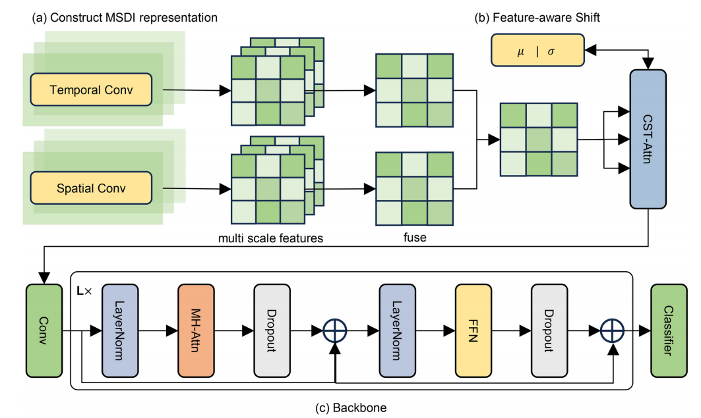
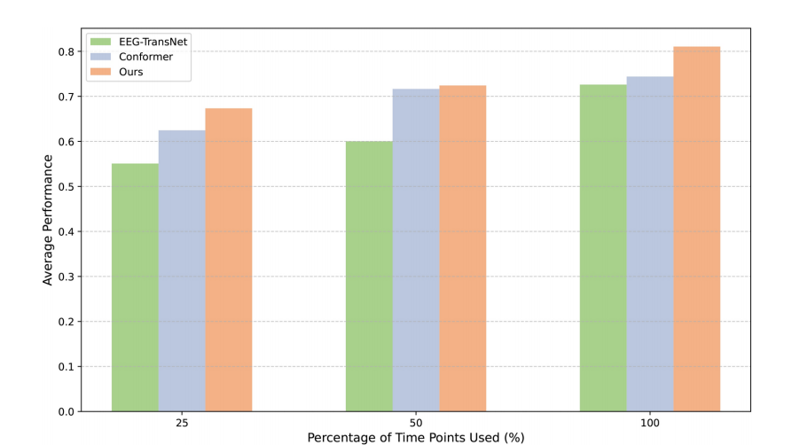
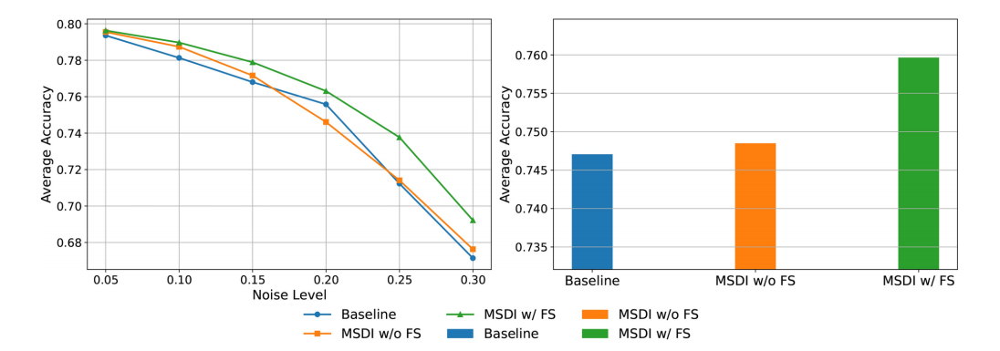
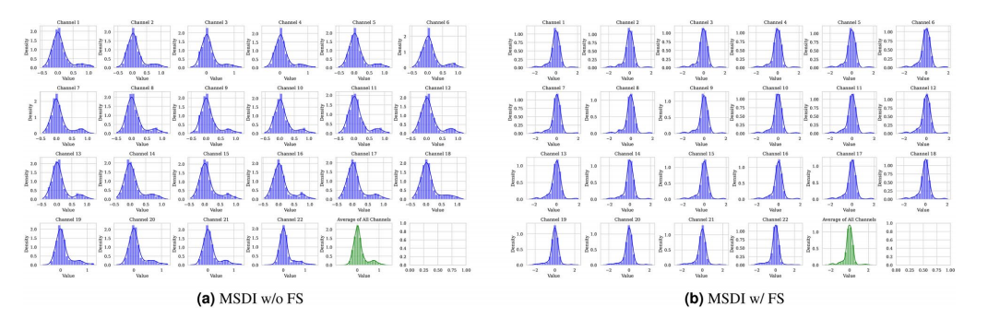
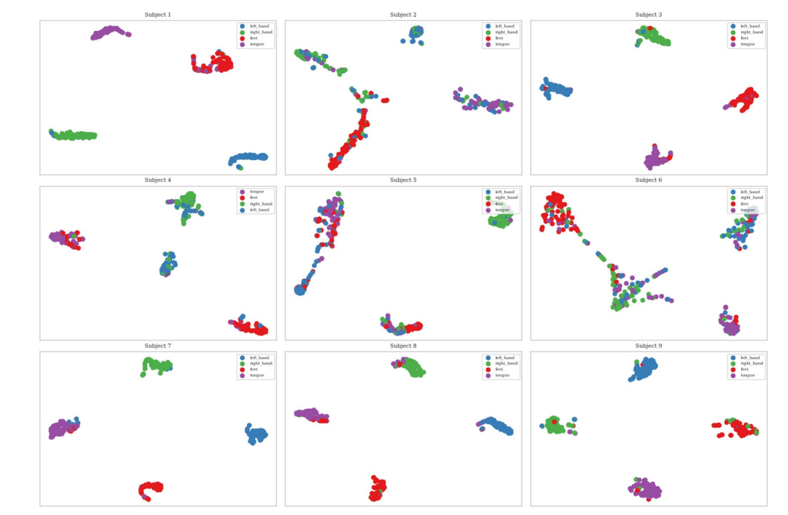
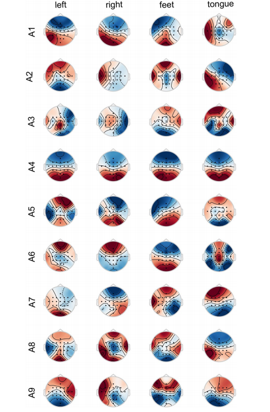

# 特征感知域不变表征学习用于脑电图运动想象信号解码

李建秀，史佳鑫*，于鹏达，闫晓凯，林宇霆

## 摘要

基于脑电图(EEG)的运动想象(MI)被广泛应用于临床康复和基于虚拟现实的运动控制。然而，由于EEG信号本身空间-时间变化大且信噪比(SNR)较低，解码EEG的MI信号面临巨大挑战，难以提取稳定且鲁棒的特征。为此，我们提出了一种多尺度时空域不变表征学习方法(MSDI)。通过将原始信号分解为空间和时间成分，从多个尺度上提取空间与时间的域不变特征。为进一步约束特征到域不变空间，我们引入了一种特征感知偏移操作，根据特征的统计特性重新采样并加入噪声，将特征投影到域不变空间。在两个公开数据集(BNCI2014-001和BNCI2014-004)的实验表明，该方法达到领先的性能。此外，我们的方法还展现出较强的时间效率和抗噪性能。

**关键词：**脑电图，运动想象，域不变，表征学习

## 引言

==脑电图(EEG)==记录的是大脑的自发电活动，即脑电图波。作为非侵入式技术，EEG在脑机接口(BCI)中有着广泛应用，不需要外科手术即可采集脑信号，使其广泛应用于卒中后运动康复、轮椅控制、虚拟现实和元宇宙，以及情绪检测和疲劳检测。然而，==与侵入式BCI相比，EEG信号具有较低的信噪比(SNR)和较大的空间-时间变化性==，制约了基于EEG的运动想象(MI)信号解码的发展。

==过去研究主要集中在特征提取方法的开发上==，以提高EEG运动想象信号的解码性能。例如，EEG Conformer提出了一种融合卷积与Transformer的混合架构，用于捕获局部时空特征和全局时间依赖性。EEG-TransNet首先提取均值、方差等多模态时间特征，再利用共享自注意力模块捕获全局依赖性，从而增强对局部波动的

灵活性。Tensor-CSPNet提出了一种几何深度学习框架，用于提取时空频率模式，而Graph-CSPNet则利用图神经网络(GNNs)在对称正定(SPD)流形空间捕获EEG信号内复杂关系。尽管已有方法取得一定进展，但这些方法往往依赖于原始EEG信号进行特征提取。==深度学习算法近年来在非线性特征提取方面表现优异，但由于模型权重仅基于任务标签进行优化，噪声和时空变化显著影响解码精度==。此外，这些端到端深度学习方法可能错误地将无关信息视为有用，极大限制了模型在解码EEG MI信号中的鲁棒性和性能。

为解决上述问题，我们提出了MSDI方法，即多尺度时空域不变表征学习方法。首先，我们通过==应用不同尺度的时域和通道窗口，将原始信号转化为多个尺度的空间和时间特征==，使模型能够关注时间和通道上的精细及粗粒度特征。其次，我们==对时空信息进行解耦，分别提取时间依赖和空间依赖特征==，以减少时空变化性带来的影响，降低时空特征之间的混叠效应。接着，我们==根据不同尺度特征的相对重要性，自适应融合多尺度空间和时间特征，获得统一表征==。此外，鉴于时空信息之间的相关性，我们==采用跨时空注意力(CST-Attn)机制进一步融合这些特征，并对融合的多尺度信息进行动态加权，生成新的信号表征==。为进一步提高增强表征的鲁棒性，我们引入了==特征感知偏移操作，将表征随机映射到受特征测度限制的高斯噪声空间==，从而实现特征空间的域不变性映射。最后，我们结合==卷积与Transformer结构==设计了一个混合骨干网络，以提取增强后的MSDI特征并进行MI分类预测。

我们在BNCI2014-001和BNCI2014-004两个公开数据集上验证了方法性能，并达到领先结果。实验表明，增强原始EEG信号表征可提升模型解码准确性和鲁棒性，将表征转移到域不变空间则进一步提高模型性能，尤其是对表现较差的被试者而言提升明显。此外，在有限时间点解码条件下，模型表现更为稳定且具备更高的时间效率，且在引入额外噪声干扰时，采用特征感知偏移操作的模型展现了更强的抗噪性能。

我们的贡献如下：

- 提出一种新的MSDI方法，用于增强EEG MI信号表征，减少时空变化的影响。
- 引入特征感知偏移操作，使MSDI特征空间域不变，提升鲁棒性。
- 在BNCI2014-001和BNCI2014-004数据集上，分类准确率分别达到了81.06%和89.42%，表现出良好的时间效率和抗噪能力。

## 相关工作

### 基于脑电图的运动想象信号解码

==以往的运动想象（MI）解码方法主要集中在提升EEG信号特征提取效果上。==常用空间模式（Common Spatial Pattern, CSP）、空间稀疏CSP（Spatially Sparse CSP, SSCSP）和滤波器组CSP（Filter Bank CSP, FBCSP）通过空间滤波器提取空间特征，以最大化两个不同任务之间的信号方差。==然而，这些方法难以捕捉EEG信号的非线性特性，尤其在信噪比较低的条件下表现欠佳。==

近年来，深度学习（DL）技术提升了非线性特征的提取能力，降低了低信噪比条件下的负面影响。例如，EEGNet利用紧凑的卷积神经网络（CNN）用于多种脑机接口（BCI）任务。EEG Conformer设计了一种结合卷积和Transformer的混合架构，以同时捕获局部时空特征和全局时间依赖性。EEG-TransNet首先提取如均值和方差等多模态时间特征，然后结合自注意力机制，以捕获这些特征维度上的全局依赖，从而提升信号分割的灵活性，以应对局部波动。Tensor-CSPNet提出了一种几何深度学习框架来提取时空频率模式，而Graph-CSPNet则利用对称正定（SPD）流形空间中的图神经网络（GNN）捕捉EEG信号中复杂的内在关系。此外，MAMCNet构建频域卷积模块，合并不同频段的优化时空特征图，并将这些特征图转化为黎曼流形。

==虽然上述方法设计了明确的特征提取策略，但未尝试增强原始EEG信号本身的表征。==此外，基于深度学习的方法也存在==过拟合问题==。为解决这些问题，我们提出了特征感知偏移操作（feature-aware shift），通过泛化特征并拓展特征域，将表征转移到域不变空间，从而提升模型鲁棒性。

### 表征学习

表征学习（Representation Learning）是机器学习的一个子领域，致力于自动发掘数据的最优表征，以提高任务性能。在EEG信号解码场景中，表征学习在改善信号质量和提升MI解码准确性方面发挥了重要作用。例如，Xiang等人提出了一种双流模型来分析EEG的时空表征，强调了电极之间的空间和功能连接的重要性。Li等人提出了CASCE模型，用以增强EEG信号的表征并揭示运动想象过程中功能性神经活动的洞察。此外，SCDM模型通过空间跨模态生成和多尺度时间表征模块，自适应学习统一表征空间内的潜在时空特征。

与这些研究不同，我们提出的方法特别关注EEG信号的空间-时间变化性，并==致力于减轻低信噪比对解码性能的负面影响==。我们通过时空解耦策略提升EEG信号表征，并通过将表征转移到域不变空间进一步增强其鲁棒性。

## 方法

在本节中，我们介绍我们提出的多尺度时空域不变（**MSDI**）表征学习方法，如图1a所示。我们首先使用MSDI增强原始信号表征，以减轻空间和时间信息多样性对模型的影响，并提升表征的鲁棒性。随后，我们提出**特征感知偏移操作**，将增强后的特征映射到一个更具泛化能力的域不变空间（见图1b）。最后，如图1c所示，我们采用基于卷积和Transformer结构的混合骨干网络，对构建的MSDI表征进行特征提取并完成EEG运动想象信号的解码。

**图1. 我们所提出方法的整体架构**

（a）首先构建 MSDI 表征：输入 EEG 数据后，分别通过并行的时间卷积和空间卷积路径提取多尺度特征，之后融合成统一的表征。
 （b）接着使用**特征感知偏移机制（Feature-aware Shift）**，该模块从特征测度约束下的噪声中重新采样特征，以进一步增强 MSDI 的域不变性和泛化能力。
 （c）最后，将增强后的表征输入到一个由卷积和 Transformer 组成的解码骨干网络中，进行 EEG 信号的分类。

---

### 多尺度时空域不变表征

#### 多尺度空间与时间特征提取

设脑电数据为 $\mathscr{D} \in \mathbb{R}^{C \times T} $，其中 $ C $ 为通道数，$ T $ 为时间点数。我们首先利用两组卷积操作：**空间卷积组（Convspatial）**和**时间卷积组（Convtemporal）**，分别提取信号$\mathscr{D}$的多尺度空间与时间特征。为实现空间与时间特征的解耦，我们使用仅在单一维度（空间或时间）滑动的卷积操作，利用卷积的平移不变性降低通道和时间域之间的混叠影响。

空间特征提取表示为：

$$
\mathscr{D}'_S = \text{Concat} \left( \text{Conv}^{\text{spatial}}_{\mathscr{S}_i}(\mathscr{D}) \right), \quad i = 1, ..., \mathscr{S}_S
$$
其中，$ \mathscr{D}'_S \in \mathbb{R}^{\mathscr{S}_S \times C \times T} $ 表示不同尺度下的空间特征。

时间特征提取前，我们先将D转置为 $ \mathscr{D}^T \in \mathbb{R}^{T \times C} $，然后进行多尺度时间卷积：

$$
\mathscr{D}'^T_T = \text{Concat} \left( \text{Conv}^{\text{temporal}}_{\mathscr{S}_j}(\mathscr{D}^T) \right), \quad j = 1, ..., \mathscr{S}_T
$$
其中，$ \mathscr{D}'_T \in \mathbb{R}^{\mathscr{S}_T \times T \times C} $ 表示不同尺度下的时间特征。

---

#### 多尺度特征的加权融合与细化

我们使用线性变换和Softmax函数对每个尺度的空间与时间特征动态加权，	

$$
\sigma^\text{spatial}_i = \frac{e^{W_{Si}}}{\sum_{j=1}^{\mathscr{S}_S} e^{W_{Sj}}}, \quad
\sigma^\text{temporal}_i = \frac{e^{W_{Ti}}}{\sum_{j=1}^{\mathscr{S}_T} e^{W_{Tj}}}
$$
然后，根据动态权重对各尺度特征加权求和，并通过单独的卷积提取最终的空间与时间特征：

$$
F_S = \text{Conv}_S \left( \sum_{i=1}^{S_S} \sigma^\text{spatial}_i \cdot \mathscr{D}'_{S_i} \right)
$$

$$
F_T = \text{Conv}_T \left( \sum_{i=1}^{S_T} \sigma^\text{temporal}_i \cdot \mathscr{D}'_{T_i} \right)
$$

---

#### 特征融合

我们将空间特征 $ F_S $ 和时间特征 $ F_T $ 融合为统一表征：

$$
W = W_f (F_S + F_T)
$$
其中 $ W_f $ 是一个线性层。接着，我们利用**跨时空注意力机制（CST-Attn）**，进一步混合空间与时间特征：

$$
\mathscr{D}_\text{Enhance} = \text{CST-Attn}(W, W, W) + \mathscr{D}
$$
其中 $ \mathscr{D}_\text{Enhance} $ 为增强后的特征表征。

### 特征感知偏移操作（Feature-aware Shift Operation）

我们的目标是通过将表征转移到一个更广泛、更加域不变的空间，从而增强其鲁棒性。这包括增加特征统计量的多样性，有效拓展它们的分布范围。

#### 转移到域不变空间

我们将增强后的表征 $ D_{\text{Enhance}} $ 简化建模为一个多元高斯分布：

$$
D_{\text{Enhance}} \sim \mathcal{N}(\mu, \sigma^2)
$$
其中，特征均值和方差分别定义为：

$$
\mu = \frac{1}{C \times T} \sum_{c=1}^{C} \sum_{t=1}^{T} d_{c,t}, \quad
\sigma^2 = \frac{1}{C \times T} \sum_{c=1}^{C} \sum_{t=1}^{T} (d_{c,t} - \mu)^2
$$
对一批数据，我们还计算均值和方差的批内方差：

$$
\sigma^2_\mu = \frac{1}{B} \sum_{b=1}^{B} (\mu_b - \mu')^2, \quad
\sigma^2_\sigma = \frac{1}{B} \sum_{b=1}^{B} (\sigma_b - \sigma')^2
$$
其中 $ \mu' $ 和 $ \sigma' $ 分别是批次中所有样本的均值与方差的平均值。

然后，我们采样两个服从标准正态分布的随机变量 $ \varepsilon_\mu $ 和 $ \varepsilon_\sigma $，并通过特征统计进行正则化，得到新的采样均值和标准差：

$$
\mu_r = \mu + \varepsilon_\mu \cdot \sigma_\mu, \quad
\sigma_r = \sigma + \varepsilon_\sigma \cdot \sigma_\sigma
$$
最后，将原始增强特征重新归一化并偏移，得到处理后的特征：

$$
D_{\text{Enhance}} = \sigma_r \cdot \left( \frac{D_{\text{Enhance}} - \mu}{\sigma} \right) + \mu_r
$$

---

#### 特征自适应噪声注入与偏移

为了使偏移后的表征与原始表征在空间尺度上保持一致，我们使用原始特征的均值来约束随机噪声的采样：

$$
\varepsilon_\mu = \alpha \cdot \text{mean}_\text{Batch}(\mu) \cdot n_1 + \gamma_1
$$

$$
\varepsilon_\sigma = \beta \cdot \text{mean}_\text{Batch}(\sigma) \cdot n_2 + \gamma_2
$$

其中：
- $ \alpha, \beta $ 是控制噪声采样幅度的超参数；
- $ \gamma_1, \gamma_2 $ 是偏移项，用于让模型探索更广泛的特征空间；
- $ n_1, n_2 \sim \mathcal{N}(0,1) $ 是从标准正态分布中采样的噪声。

这一机制显著提升了表征的多样性和泛化能力，使其更具域不变性。

### 解码骨干网络

受 EEG Conformer 模型的启发，我们设计了一种混合结构的神经网络，用于对增强后的 EEG 表征（MSDI）进行解码。该骨干网络结合了**卷积嵌入模块（Convolutional Embedding）**和**Transformer 编码器（Transformer Encoder）**，既能捕捉局部神经活动中的细粒度信息，也能建模脑区之间长距离的同步与交互。

---

#### 卷积嵌入模块（Convolutional Embedding）

卷积嵌入模块的目标是从增强后的 EEG 信号表征 $ D^{\text{Enhance}} $ 中提取局部的时间和空间特征：

$$
\text{Embedding} = \text{AvgPool} \left( C_{\text{spatial}} \left( C_{\text{temporal}}(D^{\text{Enhance}}) \right) \right)
$$
其中：
- $ C_{\text{spatial}}(\cdot) $：空间卷积层，卷积核大小为 $ (C, 1) $
- $ C_{\text{temporal}}(\cdot) $：时间卷积层，卷积核大小为 $ (1, F_t) $
- $ \text{AvgPool}(\cdot) $：平均池化操作，窗口大小为 $ (1, P_t) $，步长为 $ (1, S_t) $

嵌入结果随后通过 $ 1 \times 1 $ 卷积提升维度：

$$
\text{Embedding} = C_{\text{proj}}(\text{Embedding})
$$

---

#### Transformer 模块（Transformer Block）

Transformer 模块用于捕捉序列中的长距离依赖关系。该模块由多个重复的 Transformer 编码器块组成，每个块包括一个**多头自注意力机制（MSA）**和一个**前馈神经网络（FFN）**：

$$
Z^{l+1} = \text{FFN}(\text{MSA}(\text{LN}(Z^l))) + Z^l
$$
其中：
- $ Z^l $：第 $ l $ 层的输入；
- $ \text{LN}(\cdot) $：层归一化；
- 残差连接用于缓解梯度消失问题。

注意力机制通过以下步骤实现：
- 对输入进行线性变换，得到查询 $ Q $、键 $ K $、值 $ V $：
  $$
  Q = ZW^Q,\quad K = ZW^K,\quad V = ZW^V
  $$
- 分头处理，每个头的注意力计算如下：
  $$
  A^h = \text{Softmax}\left( \frac{Q^h (K^h)^T}{\sqrt{d_k}} \right)
  $$
- 应用 Dropout 后输出每个头的结果：
  $$
  O^h = A^h V^h
  $$
- 将所有头拼接并线性变换，形成最终注意力输出：
  $$
  \text{MSA}(Z) = [O^1, ..., O^H]W^O
  $$

前馈神经网络为两层线性变换，并采用 GELU 激活函数：

$$
\text{FFN}(X) = W_2 \cdot \text{GELU}(W_1 X + b_1) + b_2
$$

---

#### 分类器（Classifier）

Transformer 的输出首先被展平为向量 $ z \in \mathbb{R}^{B \times T'F_n} $，接着通过两层全连接网络并使用 Dropout 与激活函数：

$$
\text{FC} = \sigma(L_2(\text{Dropout}(\sigma(L_1(z)))))
$$
最终的分类结果通过一个线性层 $ L_f(\cdot) $ 和 LogSoftmax 函数输出为各类别的对数概率：

$$
\hat{y} = \text{LogSoftmax}(L_f(\text{FC}))
$$

## 实验

### 数据集

我们在两个公开的运动想象（MI）EEG 数据集上评估了我们的方法，如下表1所示。

#### BNCI 2014-001

BNCI 2014-001 数据集包含来自9名受试者的EEG数据，受试者执行四种MI任务：想象左手（类别1）、右手（类别2）、双脚（类别3）和舌头（类别4）的运动。每位受试者参与了两次实验会话，分别在不同日期进行，每次会话包括6次运行，每次运行包含48次试验，总共288次试验。

在每次试验中，受试者首先注视中心“+”标志2秒，然后接收持续1.25秒的提示（箭头或图标）指示所需的MI任务。受试者持续进行该MI任务，直到6秒时“+”标志消失，中途不提供任何反馈。

EEG信号由22个Ag/AgCl电极记录，电极之间间距为3.5厘米，使用单极配置，左耳为参考，右耳为接地。信号采样率为250 Hz，带通滤波器范围为0.5–100 Hz，并在50 Hz处进行陷波处理以去除电源噪声。

#### BNCI 2014-004

BNCI 2014-004 数据集包含来自9名右利手、视力正常或矫正正常的受试者的EEG数据。每位受试者参加了5次会话：前两次为无反馈训练，后三次包含反馈。

EEG信号通过3个双极电极（C3、Cz、C4）以250 Hz采样，使用带通滤波（0.5–100 Hz）和50 Hz陷波滤波进行预处理。地电极位于Fz位置。EOG（眼电）数据通过三个单极电极同时记录。

在筛查阶段，任务为左手和右手的MI（类别1和2）。每位受试者进行两次筛查会话，每次会话包含6次运行，每次运行10次试验，总计120次/会话，即每人共240次试验。

在带反馈的会话中，每会话进行4次运行，每次运行包含两个MI类别各20次试验。每次试验开始时，中央出现一个灰色笑脸图标，2秒后响起提示音，第3秒出现视觉提示并持续至7.5秒，随后进入1.0–2.0秒的空白间隔。

**表1. BNCI 2014-001 与 BNCI 2014-004 数据集对比表**

| 特征       | BNCI 2014-001          | BNCI 2014-004 |
| ---------- | ---------------------- | ------------- |
| 受试者人数 | 9                      | 9             |
| 任务类型   | 左手、右手、双脚、舌头 | 左手、右手    |
| 实验会话数 | 2 会话                 | 5 会话        |
| 采样率     | 250 Hz                 | 250 Hz        |

---

### 实验环境配置

为验证模型的稳定性并确保实验公平性，所有模型均在以下设备上训练与评估：

- **CPU**：Intel 第12代 Core i7-12700H  
- **GPU**：NVIDIA GeForce RTX 4090 24GB  
- **内存**：64GB RAM

我们使用“公共平均参考（Common Average Reference, CAR）”滤波器来消除所有通道间的共模噪声和信号成分，从而提升信噪比。该滤波操作公式如下：

$$
V'_i = V_i - \frac{1}{N} \sum_{j=1}^{N} V_j
$$
其中 $ V_i $ 表示第 $ i $ 个通道的原始信号，$ N $ 为通道总数。

### 分类性能

#### 达到最新的最优性能（State-of-the-art Performance）

我们提出的方法在两个数据集上均表现出色。如表2所示，在 BNCI2014-001 数据集上，我们的方法平均分类准确率为 **81.06%**，明显优于包括 FBCSP、SSCSP、DRDA、DRDW、Conformer、MI-CAT 和 EEG-TransNet 在内的多种经典或先进模型。特别是在受试者 A4 和 A6 上，准确率提升最为显著。

在 BNCI2014-004 数据集上（见表3），我们的方法同样保持了高准确率，达到了 **89.42%** 的平均值。尽管在该数据集上与 Conformer 和 EEG-TransNet 的差距略有缩小，但整体准确率仍为最高，且在多个受试者（如 B1、B2、B5）上的个体表现仍最为优越。这一结果证明了我们方法在不同受试者间的稳健性和泛化能力。

---

#### 时间点效率（Timepoint Efficiency）

表4展示了在 BNCI2014-001 数据集上，不同时间点使用比例下模型性能的对比。我们的方法在仅使用25%时间点的情况下，仍能取得 **67.34%** 的平均准确率，显著优于 Conformer（62.45%）和 EEG-TransNet（55.08%）。

当使用50%的时间点时，我们方法的准确率为 **72.42%**，也高于 Conformer（71.65%）和 EEG-TransNet（60.02%）。此外，我们模型在所有时间比例下的标准差更低，说明其对数据子集的变化更具稳定性与鲁棒性。

综上所述，我们的方法不仅在整体准确率上表现出色，还具备更高的数据利用效率，尤其适合实时脑机接口（BCI）应用场景。

**表2. BNCI 2014-001 数据集上的分类准确率（%）**

| 模型                 | A1        | A2        | A3        | A4        | A5        | A6        | A7        | A8        | A9        | 平均      |
| -------------------- | --------- | --------- | --------- | --------- | --------- | --------- | --------- | --------- | --------- | --------- |
| FBCSP                | 77.80     | 62.13     | 84.69     | 69.82     | 53.46     | 51.39     | 92.69     | 80.90     | 87.19     | 73.34     |
| SSCSP                | 76.74     | 58.68     | 81.25     | 57.64     | 38.54     | 48.26     | 76.39     | 79.17     | 78.82     | 66.17     |
| DRDA                 | 83.19     | 55.14     | 87.43     | 75.28     | 62.29     | 57.15     | 86.18     | 83.61     | 82.00     | 74.70     |
| DRDW                 | 83.29     | 63.97     | 90.30     | 76.94     | 69.34     | 60.08     | 89.31     | 82.35     | 82.81     | 77.60     |
| Conformer            | 87.15     | 57.29     | 88.89     | 74.65     | 59.38     | 47.99     | 86.81     | 81.94     | 85.42     | 74.39     |
| MI-CAT               | 90.62     | 54.51     | 91.32     | 72.57     | 63.19     | 62.85     | 87.15     | 85.07     | 84.03     | 76.74     |
| EEG-TransNet         | 86.46     | 48.26     | 87.15     | 69.79     | 52.78     | 57.29     | 86.81     | 80.56     | 84.38     | 72.61     |
| **本文方法（Ours）** | **90.63** | **64.24** | **92.01** | **79.51** | **66.67** | **64.24** | **93.75** | **89.24** | **89.24** | **81.06** |

## 消融实验

### MSDI 模块的影响

消融实验（详见表5与表6）显示，MSDI模块对分类准确率有显著提升作用。

以 BNCI2014-001 数据集为例：
- 未使用 MSDI 模块时，平均准确率仅为 **73.46%**；
- 当采用空间与时间窗口均为 \([1, 3, 5, 7]\) 的 MSDI 模块时，即使不使用特征感知偏移操作，准确率也提升至 **79.55%**；
- 若再加入特征感知偏移操作，准确率进一步提升至 **81.06%**。

类似的趋势也出现在 BNCI2014-004 数据集中：
- 未使用 MSDI 模块时，准确率为 **85.30%**；
- 加入 MSDI 且使用 \([1, 3]\) 的空间窗口和 \([1, 3, 5, 7]\) 的时间窗口后，准确率提升至 **89.42%**。

这些结果说明：多尺度的空间与时间特征提取对捕捉关键脑活动模式至关重要，可生成更丰富、更具判别力的信号表征。

此外，我们也考察了不同窗口规模对模型性能的影响。以 BNCI2014-001 为例，从 \([1,3,5,7]\) 减少到 \([1,3,5]\)，准确率变化不大（仍为 81.06%），但若进一步减至单尺度 \([3]\)，准确率下降至 **80.75%**。这表明更广泛的尺度设置更有利于本数据集中的特征学习，但需权衡计算开销与性能。

**表3. BNCI 2014-004 数据集上的分类准确率（%）**

| 模型                 | B1        | B2        | B3        | B4        | B5        | B6        | B7        | B8        | B9        | 平均      |
| -------------------- | --------- | --------- | --------- | --------- | --------- | --------- | --------- | --------- | --------- | --------- |
| FBCSP                | 70.00     | 60.36     | 60.94     | 97.50     | 93.12     | 80.63     | 78.13     | 92.50     | 86.88     | 80.01     |
| SSCSP                | 65.00     | 56.79     | 54.06     | 95.63     | 74.69     | 79.06     | 80.00     | 87.81     | 82.81     | 75.09     |
| DRDA                 | 81.37     | 62.86     | 63.63     | 95.94     | 93.56     | 88.19     | 85.00     | 95.25     | 90.00     | 83.98     |
| DRDW                 | 84.66     | 66.57     | 68.04     | 96.78     | 94.32     | 82.61     | 88.47     | 93.96     | 90.10     | 85.06     |
| Conformer            | 77.81     | 70.71     | 85.31     | 98.44     | 97.50     | 87.19     | 92.19     | 94.69     | 91.56     | 88.38     |
| MI-CAT               | 86.11     | 65.97     | 61.46     | 98.26     | 93.75     | 89.24     | 86.11     | 95.69     | 90.97     | 85.26     |
| EEG-TransNet         | 79.06     | 70.71     | 87.81     | 98.44     | 96.88     | 91.56     | 91.88     | 95.63     | 90.00     | 89.11     |
| **本文方法（Ours）** | **81.56** | **71.07** | **85.63** | **97.81** | **98.75** | **89.06** | **93.44** | **94.69** | **92.81** | **89.42** |

---

### 特征感知偏移操作的影响

特征感知偏移操作对模型的分类性能也起到了积极作用。对比未使用和使用该操作的结果：

- 在 BNCI2014-001 中，使用空间与时间窗口 \([1,3,5,7]\) 时，加入该操作后平均准确率从 **79.55%** 提升至 **81.06%**；
- 在 BNCI2014-004 中，使用窗口 \([1,3]\) 和 \([1,3,5,7]\) 时，准确率由 **89.29%** 提升至 **89.42%**。

这些提升说明特征感知偏移操作有助于增强表征的泛化性，使模型在面对未知域（如不同受试者或不同记录条件）时依然具有良好的判别能力。

**表4. 时间点利用效率对比（BNCI2014-001 数据集）**

| 模型                 | 使用时间点比例 | 平均准确率 | 标准差     |
| -------------------- | -------------- | ---------- | ---------- |
| Conformer            | 25%            | 0.6245     | 0.1100     |
|                      | 50%            | 0.7165     | 0.1493     |
| EEG-TransNet         | 25%            | 0.5508     | 0.1101     |
|                      | 50%            | 0.6002     | 0.1465     |
| **本文方法（Ours）** | 25%            | **0.6734** | **0.0858** |
|                      | 50%            | **0.7242** | **0.1291** |

---

### 噪声敏感性分析

为了进一步验证模型鲁棒性，我们在人为加入不同级别噪声的 BNCI2014-001 测试集上进行实验。如图3所示，随着噪声水平升高，加入特征感知偏移操作的模型在准确率上的优势逐渐增大。

这表明该操作有效增强了信号表征的域不变性，提高了模型在干扰条件下的稳健性。

**表5. MSDI 模块消融实验（BNCI2014-001）**

| 空间窗口  | 时间窗口  | 使用偏移 | A1    | A2    | A3    | A4    | A5    | A6    | A7    | A8    | A9    | 平均  |
| --------- | --------- | -------- | ----- | ----- | ----- | ----- | ----- | ----- | ----- | ----- | ----- | ----- |
| -         | -         | ✗        | 85.42 | 60.42 | 87.85 | 72.92 | 59.38 | 57.99 | 68.06 | 82.64 | 86.46 | 73.46 |
| [1,3,5,7] | [1,3,5,7] | ✗        | 90.63 | 62.85 | 92.01 | 76.39 | 62.15 | 62.50 | 93.40 | 88.54 | 87.50 | 79.55 |
| [1,3,5,7] | [1,3,5,7] | ✓        | 90.63 | 64.24 | 92.01 | 79.51 | 66.67 | 64.24 | 93.75 | 89.24 | 89.24 | 81.06 |
| [1,3,5]   | [1,3,5,7] | ✓        | 90.69 | 63.89 | 92.36 | 78.13 | 69.79 | 62.85 | 94.44 | 88.54 | 88.89 | 81.06 |
| [1,3,5]   | [3,7]     | ✓        | 89.93 | 64.24 | 93.06 | 78.47 | 67.36 | 63.54 | 94.44 | 88.54 | 86.81 | 80.71 |
| [3]       | [3]       | ✓        | 90.28 | 65.28 | 92.71 | 77.78 | 66.32 | 65.63 | 93.40 | 87.15 | 88.19 | 80.75 |

**表6. MSDI 模块消融实验（BNCI2014-004）**

| 空间窗口 | 时间窗口  | 使用偏移 | B1    | B2    | B3    | B4    | B5    | B6    | B7    | B8    | B9    | 平均  |
| -------- | --------- | -------- | ----- | ----- | ----- | ----- | ----- | ----- | ----- | ----- | ----- | ----- |
| -        | -         | ✗        | 79.06 | 63.93 | 81.56 | 97.50 | 96.56 | 84.69 | 85.63 | 92.19 | 86.56 | 85.30 |
| [3]      | [3]       | ✓        | 82.50 | 70.00 | 81.88 | 97.81 | 97.81 | 91.25 | 89.69 | 94.69 | 91.25 | 88.54 |
| [1,3]    | [1,3]     | ✓        | 79.69 | 73.93 | 85.94 | 98.44 | 98.75 | 87.19 | 92.81 | 95.00 | 91.88 | 89.29 |
| [1,3]    | [1,3,5,7] | ✓        | 81.56 | 71.07 | 85.63 | 97.81 | 98.75 | 89.06 | 93.44 | 94.69 | 92.81 | 89.42 |

**图2. Conformer、EEG-TransNet 以及我们方法在不同时间点利用比例下的性能比较**

结果基于 BNCI2014-001 数据集，展示了在仅使用部分时间点训练时，各方法的平均准确率。

## 解码可视化（Decoding Visualization）

### 特征分布可视化

为了更直观地理解特征感知偏移操作对 MSDI 特征分布的影响，我们对加入与未加入该操作的增强特征 \( D^{\text{Enhance}} \) 进行可视化，如图4所示。

可以观察到，不论是否加入偏移操作，特征在总体上均近似服从高斯分布。但在加入特征感知偏移操作后，特征分布曲线明显变宽，方差增大。同时，所有通道之间的分布更加均衡。

这些现象表明，偏移操作增加了特征的多样性，并将原始特征映射到一个更加稳定、更加“域不变”的空间，从而增强模型的泛化能力和鲁棒性。

---

### t-SNE 可视化

为了进一步分析模型是否能够学习到良好的判别性特征，我们采用 t-SNE（t-distributed Stochastic Neighbor Embedding）对高维特征进行降维并可视化。

如图5所示，我们对 BNCI2014-001 数据集中所有9位受试者的学习特征进行了 t-SNE 可视化。可以明显看到四个类别（左手、右手、脚、舌头）在大多数受试者中均形成了清晰的聚类。

例如：
- 受试者1、3、7、9的四个类别彼此分离明显；
- 受试者2、4、8中，虽然脚与舌头类别之间存在一定重叠，但左手与右手仍然分布明确；
- 即便是特征分布相对复杂的受试者5和6，也能在部分维度上形成可分聚类。

这些聚类结果说明，模型确实学习到了能够区分不同运动想象任务的判别性特征。这一视觉证据进一步验证了分类性能表格中的定量结果，说明我们提出的方法在特征表征能力上具有显著优势。

**图3. 在不同噪声水平下的平均分类准确率**

“FS”表示启用了**特征感知偏移操作（Feature-aware Shift）**的模型。随着噪声水平的增加，加入该模块后的模型保持更强的鲁棒性和准确率。

**图4. MSDI 特征分布可视化（以 BNCI2014-001 数据集的受试者5为例）**

“FS”表示使用了特征感知偏移操作。
 (a) 未使用偏移操作的 MSDI 特征分布；
 (b) 使用偏移操作后的 MSDI 特征分布。可见 (b) 的横轴范围更广，方差更大，说明特征多样性增强。

---

### Grad-CAM 可视化

为了可视化模型在做出预测时关注的脑区，我们使用了 Grad-CAM（Gradient-weighted Class Activation Mapping）方法，对模型决策过程进行解释。Grad-CAM 通过反向传播梯度至最后一层卷积层，生成每一类预测对应的重要区域热力图。

图6展示了 BNCI2014-001 数据集中各位受试者（A1–A9）在四种运动想象任务（左手、右手、脚、舌头）下的 Grad-CAM 可视化结果。

结果显示：
- 模型在不同任务下激活的脑区域具有显著差异；
- 多数受试者的热点区域集中在与运动任务相关的特定通道上；
- 模型成功聚焦于有意义的脑电区域，验证其判别逻辑的合理性。

这些结果表明，我们的模型不仅具备强大的判别能力，而且具备良好的可解释性，可为神经科学研究和临床应用提供参考。

**图5. 我们提出的 MSDI 方法在 BNCI2014-001 数据集上的 t-SNE 可视化**

展示了9位受试者的四类运动想象（左手、右手、脚、舌头）特征降维后的聚类效果。多数受试者的类别间聚类边界清晰，说明模型能有效学习具有判别性的特征表示。

## 结论

本文提出了一种新颖的多尺度时空域不变表征学习方法（MSDI），用于增强基于脑电图（EEG）的运动想象（MI）信号解码。

通过对空间和时间信息进行解耦与多尺度融合，MSDI能够有效提取鲁棒特征；此外，我们引入的**特征感知偏移操作**，通过将表征转移到一个更具域不变性的特征空间中，进一步提升了模型的泛化能力和抗干扰性能。

我们的方法在两个公开数据集上（BNCI2014-001 和 BNCI2014-004）均取得了最新的最优性能，平均分类准确率分别达到了 **81.06%** 和 **89.42%**。这一结果充分说明：增强原始EEG信号表征对于提升MI解码的准确性和稳定性具有重要意义。

此外，我们的方法在以下方面也表现出显著优势：

- 在**时间效率方面**，即使在可用数据点有限的情况下，仍保持了较高性能；
- 在**抗噪能力方面**，加入特征感知偏移操作后显著增强了模型的鲁棒性；
- 在**可解释性方面**，t-SNE 和 Grad-CAM 可视化结果验证了模型对不同MI类别的辨别能力与神经对应区域的关注一致性。

综上所述，我们的方法为提高基于EEG的BCI系统在复杂环境下的可靠性与实用性提供了有效解决方案，具有广泛的应用前景。

## 数据可用性

所有数据都可以在网站https://www.bbci.de/competition/iv/上访问。代码可根据相应作者的要求提供。

**图6. 我们在BNCI 2014 -001数据集上提出的MSDI的Grad-CAM可视化。**

展示了9位受试者在四种MI任务（左手、右手、脚、舌头）下，模型关注的重要区域。图中高亮区域代表模型用于判别的关键脑区，说明模型学会了具有生物学意义的空间激活模式。