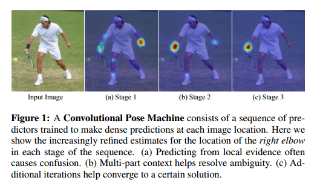
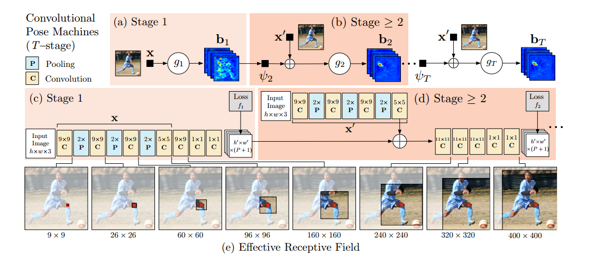
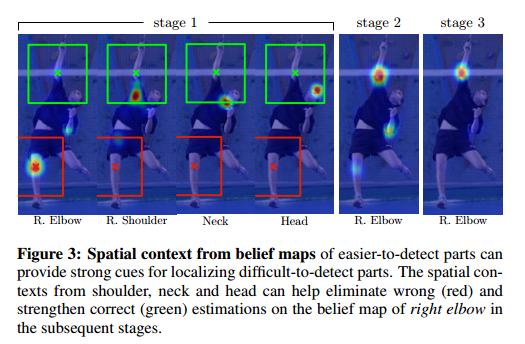
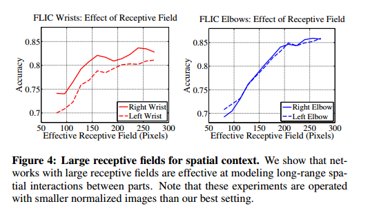
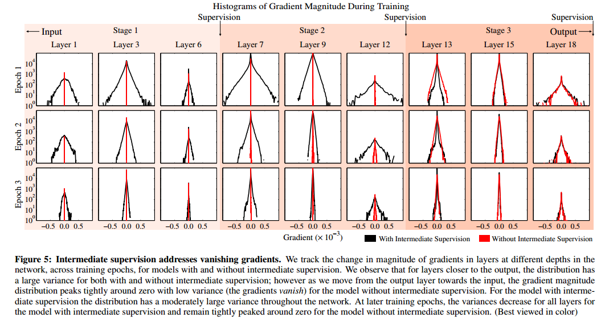
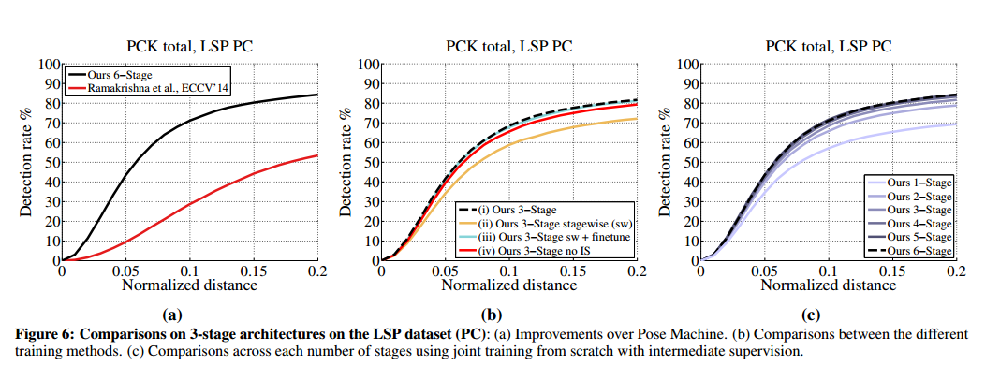
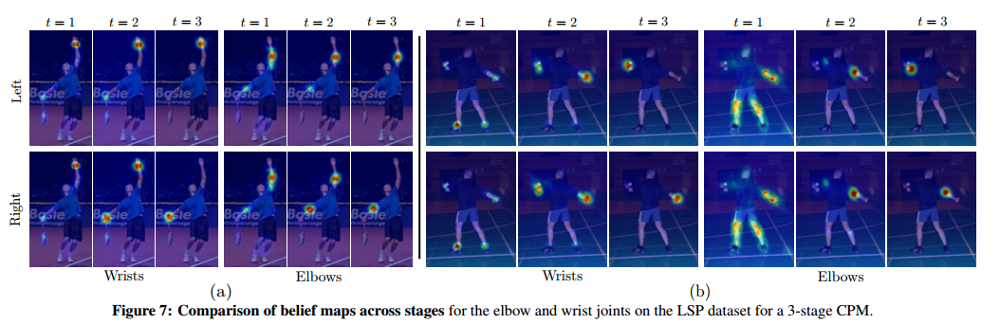
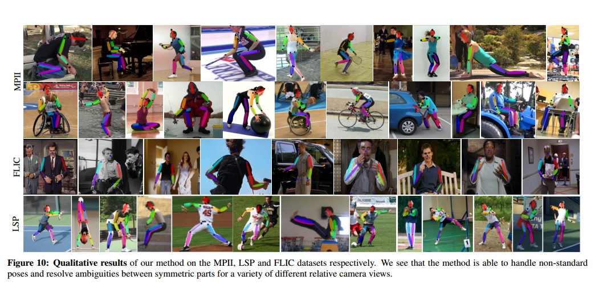

# CPM

### 摘要

姿态机器（Pose Machines）提供了一种用于学习丰富隐式空间模型的序列预测框架。在本文中，我们展示了一种系统设计方法，即如何==将卷积网络（Convolutional Networks）融入姿态机器框架==，用于学习图像特征和与图像相关的空间模型，解决姿态估计任务。本文的贡献在于隐式建模结构化预测任务（如关节姿态估计）中变量间的长距离依赖关系。我们通过设计一个==由卷积网络组成的序列化架构==实现了这一目标。该架构直接操作前一阶段生成的==belief map（belief maps）==，生成逐步优化的关节点位置估计，而无需显式的图形模型推断过程。

我们的方法通过提供一种==自然的学习目标函数来解决训练过程中的梯度消失问题==。该目标函数在网络中间阶段施加监督，从而补充反向传播梯度并引导学习过程。我们在标准基准测试（包括MPII、LSP和FLIC数据集）上实现了最先进的性能，并超越了现有竞争方法。

### 引言

我们为关节姿态估计任务引入了==卷积姿态机器（Convolutional Pose Machines, CPMs）==。CPMs继承了姿态机器（Pose Machine）架构的优点，例如隐式学习图像和多部件线索之间的长距离依赖关系、学习与推断的紧密集成、模块化的序列设计等，同时结合了卷积架构带来的优势，包括：从数据中直接学习图像和空间上下文的特征表示；通过反向传播实现的可微分架构，支持全局联合训练；以及高效处理大规模训练数据的能力。

CPMs由一系列卷积网络组成，这些网络会==重复生成每个关节位置的二维belief map（belief maps）==。在CPM的每个阶段中，==前一阶段生成的belief map与图像特征一起作为输入==。belief map为后续阶段提供了每个关节位置空间不确定性的非参数化编码，使得CPM能够学习丰富的、与图像相关的空间模型。与基于图形模型的显式belief map解析方法或专门的后处理步骤不同，我们设计了卷积网络，这些网络直接作用于中间生成的belief map，学习隐式的、与图像相关的空间模型。整体的多阶段架构是完全可微分的，因此可以通过反向传播以端到端的方式进行训练。

在CPM的特定阶段中，belief map的空间上下文为后续阶段提供了强大的消歧线索。因此，CPM的每个阶段都会生成更精确的belief map，用于估计每个关节的位置（见图1）。为了捕捉关节之间的长距离交互，序列预测框架中每阶段的网络设计目标是在图像和belief map上获得大的感受野。通过实验，我们发现belief map上的大感受野对学习长距离的空间关系至关重要，并能提高准确性。

将多个卷积网络组合成一个CPM，形成了一个包含许多层的整体网络，在学习过程中可能面临梯度消失的问题。这种问题会导致反向传播的梯度强度随着网络层数的增加而减弱。尽管最近的研究表明，在中间层对非常深的网络施加监督有助于学习，这些研究大多局限于分类问题。在本文中，我们展示了对于关节姿态估计这样的结构化预测问题，CPM天然提供了一种系统框架，==通过在网络中周期性地施加中间监督，补充梯度并引导网络生成越来越准确的belief map==。此外，我们还讨论了这种序列预测架构的不同训练方案。

我们的主要贡献是：

1. **通过卷积架构的序列组合学习隐式空间模型**；
2. **设计和训练这种架构的系统方法，用于学习图像特征和与图像相关的空间模型，解决结构化预测任务，而无需显式的图形模型推断**。

我们在包括MPII、LSP和FLIC数据集在内的标准基准测试上实现了最先进的结果，并分析了联合训练多阶段架构以及重复施加中间监督的效果。

### Related Work

关节姿态估计的经典方法是基于图解结构模型（Pictorial Structures Model）的研究【2, 3, 9, 14, 26, 27, 30, 43】。这些方法通过以树形结构的图模型表达身体各部分之间的空间相关性，并结合运动学先验来连接肢体。然而，这些方法在所有肢体都清晰可见的图像中表现较好，但容易因未捕获树形结构模型中变量的相关性而出现特定错误，例如图像证据的重复计数问题。Kiefel等人的工作【17】基于图解结构模型，但在底层图表示上有所不同。

分层模型【35, 37】通过分层树结构表达不同尺度和大小的身体部位之间的关系。这些模型假设较大的部位（例如整肢体而不是单个关节）通常具有判别性图像结构，这些结构更容易检测，从而有助于推断较小且难以检测的部位。非树模型【8, 16, 19, 33, 42】则通过引入循环来增强树结构，从而捕捉对称性、遮挡和长距离关系等特性。然而，这些方法通常需要在学习和测试阶段依赖近似推断，因此必须在空间关系的准确建模和高效推断能力之间进行权衡，通常采用简单的参数化形式以实现快速推断。与之相比，基于序列预测框架的方法【29】通过直接训练推断过程来学习隐式空间模型，这种隐式模型可以捕捉变量之间的复杂交互【22, 25, 31, 41】。

近年来，使用卷积架构进行关节姿态估计的研究显著增多【6, 7, 23, 24, 28, 38, 39】。Toshev等人【40】提出了一种直接使用标准卷积架构【18】回归笛卡尔坐标的方法。最近的研究表明，使用置信图（confidence maps）回归图像，但需依赖图形模型清除置信图中的异常点。这些图形模型通常需要手工设计的能量函数或启发式的空间概率先验初始化。一些方法还使用了专门的网络模块来提高精度【28, 38】。在本文中，我们表明，==回归置信图的结果适合输入进一步的卷积网络，利用大感受野学习隐式空间依赖关系，而无需手工设计的先验，从而在所有精度范围内实现了最先进的性能，而无需复杂的初始化或专门的精度优化模块==。

Pfister等人【24】同样使用了具有大感受野的网络模块来捕捉隐式空间模型。由于卷积操作的可微性，我们的模型可以进行全局训练，而Tompson等人【39】和Steward等人【34】也讨论了联合训练的优势。

Carreira等人【6】训练了一个深度网络，利用误差反馈迭代地改进部位检测，但采用的笛卡尔表示（如【40】）未能保留空间不确定性，从而导致高精度范围内较低的准确率。在本文中，我们展示了如何利用保留不确定性的置信图，在序列预测框架中编码丰富的空间上下文，同时通过施加中间局部监督解决梯度消失问题。

### Method

------

#### 3.1 姿态机器（Pose Machines）

我们用 $Y_p \in Z \subseteq \mathbb{R}^2$ 表示 $P$ 个解剖学标志点（即部位）的像素位置，其中 $Z$ 是图像中的所有 $(u, v)$ 位置的集合。我们的目标是预测所有 $P$ 个部位的位置 $Y = (Y_1, \dots, Y_P)$。

一个姿态机器【29】（见图 2(a) 和 2(b)）由一系列==多类别预测器 $g_t(\cdot)$== 组成，这些预测器被训练用于在层级结构的每一级预测每个部位的位置。在每个阶段 $t \in {1, \dots, T}$ 中，==分类器 $g_t$==用于预测每个部位的信念值，从而为每个部位 $Y_p = z, \forall z \in Z$ 生成belief map：
$$
g_1(x_z) \to \{b_{p1}(Y_p = z)\}_{p \in \{0, \dots, P\}},
$$
其中，==$b_{p1}(Y_p = z)$ 是分类器 $g_1$ 在图像位置 $z$ 为第 $p$ 个部位预测的得分==。我们将所有部位 $p$ 在图像每个位置 $z = (u, v)^T$ 处的信念表示为 $b_{p1} \in \mathbb{R}^{w \times h}$，其中 $w$ 和 $h$ 分别是图像的宽度和高度，即：
$$
b_{pt}[u, v] = b_{pt}(Y_p = z)。
$$
为简化表示，我们将所有部位的belief map集合表示为 $b_t \in \mathbb{R}^{w \times h \times (P+1)}$（==$P$ 个部位加一个背景==）。

在后续阶段中，分类器预测每个部位的信念 $Y_p = z, \forall z \in Z$，此时的输入包括：(1) 图像数据 $x_t^z \in \mathbb{R}^d$ 的特征，以及 (2) 来自上一阶段的分类器的belief map的上下文信息：
$$
g_t(x'_z, \psi_t(z, b_{t-1})) \to \{b_{pt}(Y_p = z)\}_{p \in \{0, \dots, P+1\}}，
$$
其中，$\psi_{t>1}(\cdot)$ 是从 $b_{t-1}$ 到上下文特征的映射。在每个阶段中，计算的belief map会逐步优化每个部位的位置估计。需要注意的是，==后续阶段的图像特征 $x'_z$ 允许不同于第一阶段的图像特征 $x$==。文献【29】中提出的姿态机器使用提升随机森林作为预测器（$g_t$），所有阶段中使用固定的手工设计图像特征（$x' = x$），以及固定的手工设计==上下文特征映射（$\psi_t(\cdot)$）==来捕捉空间上下文。

------

#### 3.2 卷积姿态机器（Convolutional Pose Machines）

我们展示了如何通过深度卷积架构替换姿态机器的预测和图像特征计算模块，从而直接从数据中学习图像和上下文特征表示。卷积架构的另一个优势是完全可微性，因此可以端到端联合训练CPM的所有阶段。以下是CPM设计的具体方法，它结合了深度卷积架构的优点和姿态机器框架的隐式空间建模能力。

##### 3.2.1 使用局部图像特征进行关键点定位

卷积姿态机器的第一阶段仅从局部图像特征中预测部位belief map（belief maps）。图 2(c) 显示了基于深度卷积网络的局部图像特征检测网络结构。由于网络第一阶段的感受野仅限于输出像素位置周围的小区域，因此提取的证据是局部的。我们==采用包含五个卷积层和两个 $1 \times 1$ 卷积层的网络结构==，从而实现了全卷积架构【21】。

为了达到一定的精度，我们将输入裁剪后的图像归一化为 $368 \times 368$ 的大小（详细见第4.2节）。上述网络的感受野为 $160 \times 160$ 像素。该网络可以被视为一个深度网络滑动通过图像，从每个 $160 \times 160$ 图像块的局部图像证据回归出一个大小为 $P+1$ 的输出向量，该向量代表每个部位在该图像位置的得分。

##### 3.2.2 使用学习的空间上下文特征进行序列预测

尽管对于外观一致的标志点（例如头部和肩部）的检测率较高，但对于关节链下游的部位（例如手肘和手腕）来说，由于其配置和外观变化较大，准确率通常较低。然而，belief map（尽管有噪声）中包含的信号仍然非常有用。如图3所示，在检测难以定位的部位（例如右手肘）时，右肩部belief map中清晰的峰值可以作为重要线索。后续阶段的预测器（$g_{t>1}$）可以利用上一阶段belief map的空间上下文（$\psi_{t>1}(\cdot)$），通过利用部位之间的几何一致性来改进预测。

在姿态机器的第二阶段，==分类器 $g_2$ 接受图像特征 $x^2_z$ 和从上一阶段belief map计算的特征 $\psi$ 的输出作为输入==。$\psi$ 函数对位置 $z$ 周围区域的belief map景观进行编码。在卷积姿态机器中，我们并未显式定义一个函数来计算上下文特征，而是通过分类器在belief map上的感受野来隐式定义 $\psi$。

网络设计的指导原则是，通过在第二阶段网络输出层实现足够大的感受野，使网络能够学习部位之间可能的复杂长距离相关性。通过简单地提供上一阶段输出的特征（而不是在图形模型中显式指定势函数），后续阶段的卷积层能够自由组合上下文信息，从而选择最具预测性的特征。

==第一阶段的belief map是由一个小感受野的网络从局部图像信息中生成的。在第二阶段中，我们设计了一个网络，通过极大地增加有效感受野以捕获长距离的空间交互==。==大感受野==可以通过以下方式实现：

1. **池化操作**，但可能会以精度为代价；
2. **增大卷积核大小**，但会增加模型的参数数量；
3. **增加卷积层的数量**，但可能会导致训练过程中出现梯度消失问题。

我们在图 2(d) 中展示了第二阶段及后续阶段（$t \geq 2$）的网络设计和对应的感受野。在belief map上，我们==使用多层卷积来实现大的感受野，而不是依赖步幅较大的池化操作==。这种设计能够==以较少的模型参数实现大的感受野，同时保持较高的精度==。实验表明，即使在高精度范围内，步幅为 8 的网络与步幅为 4 的网络表现相当，但步幅为 8 的设计更容易实现较大的感受野。

我们发现，==网络性能随着感受野大小的增加而提高==。在图4中，我们通过一系列实验改变网络结构（保持参数数量几乎不变）来观察不同感受野对 FLIC 数据集的影响。结果显示，随着感受野的增加，准确率显著提高，并在约 250 像素处趋于饱和，这与标准化对象的大小大致相当。我们的最佳网络设计（见图2）中，裁剪后的输入图像被归一化为 $368 \times 368$ 像素，第一阶段belief map上的第二阶段输出感受野被设置为 $31 \times 31$，对应原始图像中的 $400 \times 400$ 像素，这通常足以覆盖任何两个部位之间的区域。在更多的阶段中，有效感受野会进一步扩大。在接下来的实验部分中，我们展示了最多 6 个阶段的实验结果。

#### 3.3 在卷积姿态机器中的学习

本文提出的姿态机器设计最终形成了一个深度架构，可能包含大量网络层。训练这样一个具有许多层的网络可能会遇到梯度消失问题【4, 5, 10】，如Bradley【5】和Bengio等人【10】所观察到的，反向传播的梯度强度会随着输出层与输入层之间的中间层数增加而减弱。

幸运的是，姿态机器的序列预测框架为训练我们的深度架构提供了一种自然的解决方法。姿态机器的每个阶段都被训练为反复生成各部位位置的belief map（belief maps）。我们通过在网络的每个阶段输出处定义一个损失函数来鼓励网络不断生成这样的表示，==该损失函数最小化预测belief map与理想belief map之间的 $l_2$ 距离==。==对于某个部位 $p$ 的理想belief map记为 $b_p^*(Y_p = z)$，其通过在每个身体部位 $p$ 的真实位置放置高斯峰值生成==。我们在每个阶段 $t$ 的输出处希望最小化的代价函数为：
$$
f_t = \sum_{p=1}^{P+1} \sum_{z \in Z} \| b_p^t(z) - b_p^*(z) \|_2^2。
$$
==完整架构的总体目标是将每个阶段的损失相加==，其表示为：
$$
F = \sum_{t=1}^T f_t。
$$
我们使用标准的随机梯度下降（Stochastic Gradient Descent, SGD）对网络的所有 $T$ 个阶段进行联合训练。为了在所有后续阶段共享图像特征 $x'$，我们在 $t \geq 2$ 的阶段中共享对应卷积层的权重（见图2）。

### 4. Evaluation

------

#### 4.1 分析

**解决梯度消失问题**
 式 (5) 中的目标函数描述了作用于网络不同部分的可分解损失函数（见图2）。具体而言，求和中的每一项都在每个阶段 $t$ 的输出处施加到网络中，从而有效地通过网络的中间阶段引入监督。中间监督的优势在于，即使完整架构包含许多层，也不会因为梯度消失问题而阻碍训练过程，因为中间损失函数在每个阶段补充了梯度。

我们通过观察具有和不具有中间监督的模型在训练过程中不同深度层的梯度幅度直方图，验证了这一点（见图5）。在早期训练阶段，从输出层向输入层移动时，我们观察到在没有中间监督的模型中，梯度分布集中于接近零的区域，表明梯度消失现象的发生。而在具有中间监督的模型中，所有层的梯度分布方差都较大，表明学习过程在所有层中都得以进行。随着训练的进行，具有中间监督的模型中梯度幅度分布的方差逐渐减少，表明模型逐步收敛。

**端到端学习的益处**
 在图6(a)中，我们可以看到，将姿态机器中的模块替换为适当设计的卷积架构可以带来显著性能提升。在高精度范围（PCK@0.1）内，较之前的方法【29】提高了42.4个百分点，在低精度范围（PCK@0.2）内提高了30.9个百分点。

**不同训练方案的比较**
 我们在图6(b)中对LSP数据集上使用person-centric（PC）注释的不同训练方法进行了比较。为了验证具有中间监督的跨阶段联合训练的效果，我们分别以以下四种方式训练模型：(i) 从零开始使用包含中间监督的全局损失函数训练；(ii) 分阶段训练，每个阶段以前馈方式单独训练并堆叠；(iii) 在方案 (ii) 的权重基础上进行联合微调；(iv) 从零开始但不使用中间监督的方式训练。实验表明，方案 (i) 的模型在所有训练方法中表现最佳，显示了中间监督和跨阶段联合训练在提升性能中的关键作用。方案 (ii) 的分阶段训练在次优水平上趋于饱和，联合微调（方案 iii）从次优水平进一步提升到接近方案 (i) 的水平，但需要更长的训练时间。

**跨阶段性能表现**
 在图6(c)中，我们展示了每个阶段在LSP数据集（PC）上的性能比较。可以看到，性能随着阶段数的增加单调提升，表明后续阶段的预测器利用了前一阶段belief map中大感受野的上下文信息来消除部位与背景之间的混淆。在第5阶段之后，性能增益逐渐减小，因此我们在本文中选择6个阶段作为LSP和MPII数据集报告的最佳结果。

------

#### 4.2 数据集与定量分析

在本节中，我们在MPII、LSP和FLIC等标准基准数据集上展示了我们的数值结果。为了在训练中标准化输入样本至 $368 \times 368$ 的大小，我们首先调整图像大小，使其大致处于相同尺度，然后根据数据集中提供的中心位置和大致尺度估计对图像进行裁剪或填充。在LSP等未提供这些信息的数据集中，我们根据关节点位置或图像大小自行估计。在测试阶段，我们执行类似的调整操作，但当必要时仅从图像大小中估计中心位置和尺度。此外，我们将来自不同尺度（在给定尺度附近扰动）的belief map合并用于最终预测，以处理给定尺度估计的不准确性。

我们使用Caffe【13】深度学习库定义并实现了模型。我们公开了源代码以及关于架构、学习参数、设计决策和数据增强的细节，以确保结果的可复现性。

------

**MPII人体姿态数据集**
 我们在MPII人体姿态数据集【1】上的结果如图8所示。该数据集包含超过28000个训练样本。我们选择通过随机数据增强进行训练，包括旋转（角度范围为 $[-40^\circ, 40^\circ]$）、缩放（比例范围为 $[0.7, 1.3]$）和水平翻转。评估基于PCKh指标【1】，其中误差容限相对于目标的头部尺寸进行归一化。

由于感兴趣的人物附近通常有多个其他人物（数据集中提供了大致的中心位置），我们为训练生成了两种理想belief map：一种包括所有在主要对象附近出现的人的信念峰值，另一种仅为主要对象设置信念峰值。在第一阶段的损失层中使用第一种belief map，因为该阶段仅依赖局部图像信息进行预测。在后续阶段的损失层中使用第二种belief map。我们还发现，在所有后续阶段提供一个附加的belief map（在主要对象的中心位置设置一个高斯峰值）是有益的。

我们的总PCKh-0.5得分为87.95%（添加LSP训练数据后为88.52%），达到了当前最先进的水平，比最接近的竞争者高出6.11%。在最具挑战性的部位——脚踝上，我们的PCKh-0.5得分为78.28%（添加LSP训练数据后为79.41%），比最接近的竞争者高出10.76%。这一结果表明，我们的模型能够捕捉长距离上下文信息，因为脚踝是距离头部和其他更易识别的部位最远的部分。

图11表明，我们的方法在【1】中定义的各种视角下的准确率始终显著高于其他方法，尤其是在那些具有挑战性的非正面视角中表现尤为突出。总之，我们的方法在所有部位、所有精度范围以及所有视角下都提高了准确率，并且是第一个在没有使用任何其他数据预训练、没有手工设计的先验或初始化等后推理解析的情况下，在结构化预测任务上实现如此高准确率的方法【28, 39】。此外，我们的方法也无需像【38】中那样专门设计的精度优化模块，仅凭步幅为8的网络即可实现出色的高精度性能。

------

**Leeds Sports Pose (LSP) 数据集**
 我们在扩展的Leeds Sports Pose (LSP) 数据集【15】上对方法进行了评估。该数据集包含11000张用于训练的图像和1000张用于测试的图像。我们在具有person-centric（PC）注释的情况下进行训练，并使用Percentage Correct Keypoints (PCK) 指标【44】进行评估。与MPII数据集相同，我们采用了相同的数据增强方案。在该数据集上，我们的模型再次达到了当前最先进的性能，总PCK得分为84.32%（当添加MPII训练数据后为90.5%）。需要注意的是，添加MPII数据显著提升了性能，因为与LSP相比，MPII数据集的标注质量更高。由于LSP数据集中标注较为嘈杂，Pishchulin等人【28】对数据集进行了重新标注，使用了原始高分辨率图像并提供了更高质量的标注。

------

**FLIC 数据集**
 我们在FLIC数据集【32】上对方法进行了评估，该数据集包含3987张训练图像和1016张测试图像。根据Sapp等人【32】引入的指标，我们报告了肘部和手腕关节的精度结果（见图12）。在PCK@0.2的条件下，我们的方法在肘部和手腕上的得分分别达到了97.59%和95.03%，超越了所有现有方法。在高精度范围内，我们的优势更加显著：在PCK@0.05时，手腕和肘部分别比现有最佳方法高出14.8和12.7个百分点；在PCK@0.1时，手腕和肘部分别高出8.9和9.3个百分点。

------

#### 4.3 定性结果

我们的模型能够在多个复杂姿态和相对摄像机视角下处理非标准化的姿态，同时解决对称部位之间的歧义（见图10）。在MPII、LSP和FLIC数据集上的定性结果表明，该方法可以有效处理部分遮挡、多样化的姿态配置以及背景干扰。

------

#### 4.4 跨视角的性能分析

我们进一步对MPII数据集上的不同视角（viewpoint clusters）进行了分析，结果显示我们的模型在所有视角下的表现均显著优于其他方法（见图11）。尤其在那些挑战性较大的非正面视角中，我们的模型展现了更强的鲁棒性。

### 5. Discussion（讨论）

卷积姿态机器（Convolutional Pose Machines, CPMs）为解决计算机视觉中的结构化预测问题提供了一种端到端架构，而无需依赖图形模型风格的推断。我们展示了一个由卷积网络组成的序列化架构能够通过在阶段间传递保留不确定性的belief map，隐式地学习姿态的空间模型。

在计算机视觉领域中，变量之间存在空间依赖关系的问题（例如语义图像标注、单张图像深度预测和目标检测）具有广泛应用前景。未来的研究方向包括将我们的架构扩展到这些问题中。

我们的方法在所有主要基准测试上都实现了当前最先进的准确率。然而，我们也观察到了一些失败案例，主要出现在多个对象靠得很近的情况下。在单一端到端架构中处理多个对象仍然是一个具有挑战性的问题，也是未来研究的一个有趣方向。