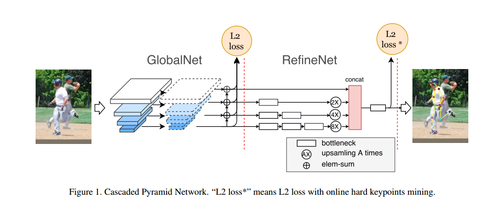
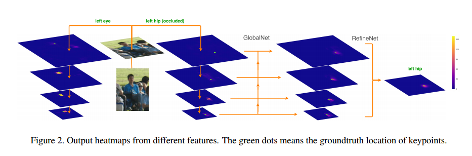

# Cascaded pyramid network for multi-person pose estimation

## 摘要

最近，多人姿态估计的研究得到了显著提升，尤其是在卷积神经网络的发展推动下。然而，仍然存在许多具有挑战性的情况，如==遮挡的关键点、不可见的关键点和复杂背景==，这些问题尚未得到有效解决。在本文中，我们提出了一种名为级联金字塔网络（Cascaded Pyramid Network, CPN）的新型网络结构，旨在缓解这些“难”关键点的问题。

具体而言，我们的算法包括两个阶段：GlobalNet 和 RefineNet。GlobalNet 是一个特征金字塔网络，它能够成功定位“简单”的关键点，如眼睛和手部，但可能无法准确识别被遮挡或不可见的关键点。我们的 RefineNet 通过结合 GlobalNet 所有层次的特征表示，并引入==在线难关键点挖掘损失==，来显式地处理这些“难”关键点。总体而言，针对多人姿态估计问题，我们采用了一个==自上而下的流水线==，首先==基于检测器生成一组人体边界框==，然后使用我们的 CPN 在每个人体边界框内进行关键点定位。

基于我们提出的算法，在 COCO 关键点基准测试中，我们在 COCO test-dev 数据集上取得了 73.0 的平均精度，在 COCO test-challenge 数据集上取得了 72.1 的精度，较 COCO 2016 关键点挑战赛的 60.5 取得了 19% 的相对提升。代码和检测结果已公开，供进一步研究使用。

## 概述

多人姿态估计是识别和定位图像中所有人物关键点的任务，这是许多视觉应用（如人类动作识别和人机交互）的基础研究课题。

最近，随着深度卷积神经网络的引入，多人姿态估计问题得到了极大的改进[22, 16]。例如，在[5]中，使用卷积姿态机器（Convolutional Pose Machine）定位图像中的关键点关节，并提出了部分亲和场（PAFs）来将关节分配到不同的人物。MaskRCNN [15]首先预测人体边界框，然后基于人体边界框扭曲特征图以获取人体关键点。尽管已经取得了很大进展，但仍然存在许多具有挑战性的情况，如遮挡的关键点、不可见的关键点和拥挤的背景，这些问题仍然难以准确定位。其主要原因有两个方面：1）这些“难”关键点不能仅通过外观特征简单识别，例如躯干关键点；2）这些“难”关键点在训练过程中没有得到显式处理。

为了解决这些“难”关键点，本文提出了一种新型网络结构，称为级联金字塔网络（Cascaded Pyramid Network，CPN）。我们的网络架构包括两个阶段：GlobalNet 和 RefineNet。==GlobalNet基于特征金字塔网络[24]学习良好的特征表示==。更重要的是，金字塔特征表示能够提供足够的上下文信息，这是推理遮挡和不可见关节所必需的。基于金字塔特征，==RefineNet通过在线难关键点挖掘损失显式地处理这些“难”关键点==。基于我们提出的级联金字塔网络，我们采用自上而下的流水线解决多人姿态估计问题。==首先，使用人体检测器生成一组人体边界框，然后在每个人体边界框内使用我们的CPN进行关键点定位==。此外，我们还探讨了可能影响多人姿态估计性能的各种因素，包括人体检测器和数据预处理。这些细节对进一步提高我们算法的准确性和鲁棒性具有重要价值。  

总结而言，我们的贡献有三个方面：
 • 我们提出了一种新颖且有效的网络，称为级联金字塔网络（CPN），该网络整合了基于特征金字塔的全局网络（GlobalNet）和基于在线难关键点挖掘的金字塔细化网络（RefineNet）。
 • 我们探讨了影响自上而下流水线中多人姿态估计性能的各种因素。
 • 我们的算法在具有挑战性的 COCO 多人关键点基准测试中取得了最先进的结果，即在 test-dev 数据集上取得了 73.0 的平均精度（AP），在 test-challenge 数据集上取得了 72.1 的平均精度（AP）。

## 相关工作

人体姿态估计是一个活跃的研究课题，已经持续了几十年。传统的方法主要采用图像结构技术[10, 1]或图形模型[7]来解决人体姿态估计问题。具体来说，经典的研究[1, 34, 13, 33, 8, 44, 29, 20]将人体关键点估计问题表述为树形结构或图形模型问题，并基于手工设计的特征预测关键点的位置。近年来的研究[27, 14, 4, 19, 39, 42]大多依赖于卷积神经网络（CNN）[22, 16]的进展，大幅提高了姿态估计的性能。

本文主要关注基于卷积神经网络的方法。该话题可分为单人姿态估计和多人姿态估计两类。单人姿态估计是根据给定的边界框对裁剪后的图像进行关键点预测，而多人姿态估计则需要进一步识别图像中所有人物的完整姿态。

**多人姿态估计**
 由于现实应用的需求，近年来多人姿态估计逐渐受到了越来越多的关注。然而，因遮挡、个体手势的多样性以及不同人物之间不可预测的互动，导致多人姿态估计具有较大的挑战性。多人姿态估计的方法主要分为两大类：自下而上的方法和自上而下的方法。

**自下而上方法**
 自下而上方法[5, 26, 30, 19]首先预测所有关键点，然后将它们组合成所有人物的完整姿势。DeepCut [30] 将图像中区分不同人物的问题解释为一个整数线性规划（ILP）问题，并将部件检测候选项划分为人物簇。最终，通过将人物簇与标记的身体部位结合，得到最终的姿态估计结果。DeeperCut [19] 在DeepCut [30] 的基础上，利用更深的ResNet [16] 网络，并使用图像条件对偶项（pairwise terms）来提高性能。Zhe Cao等[5] 将关键点之间的关系映射到部分亲和场（PAFs），并将检测到的关键点组装成不同人物的姿态。Newell等[26] 同时生成得分图和像素级的嵌入，用以将候选关键点分组到不同的人物中，从而得到最终的多人姿态估计结果。

**自上而下方法**
 自上而下方法[28, 18, 15, 9]将关键点检测过程视为一个两阶段的流水线：首先从图像中定位并裁剪出所有人物，然后在裁剪后的人物图像块中解决单人姿态估计问题。Papandreou等[28]预测热图和热图上点到真实位置的偏移量，然后利用带有偏移量的热图获得关键点的最终预测位置。Mask-RCNN [15] 首先预测人体边界框，然后裁剪出相应的特征图并预测人体关键点。如果在多人姿态估计中采用自上而下方法，那么人体检测器和单人姿态估计器的性能对于最终效果至关重要。本文回顾了一些单人姿态估计的研究工作以及最近的最先进检测方法。

**单人姿态估计**
 Toshev等人首次在DeepPose [38] 的工作中引入卷积神经网络（CNN）来解决姿态估计问题，提出了一种级联CNN姿态回归器来处理姿态估计问题。Tompson等人[37]尝试通过使用CNN和图形模型预测关键点的热图来解决此问题。后续的研究，如Wei等人[40]和Newell等人[27]，通过使用非常深的卷积神经网络生成关键点的得分图，展现了出色的性能。Wei等人[40]提出了一种多阶段架构，即首先生成粗略的结果，并在后续阶段不断细化结果。

Newell等人[27]提出了一个U形网络结构，即时钟模块（hourglass module），并堆叠多个时钟模块来生成预测。Carreira等人[6]使用迭代误差反馈来获取姿态估计，并逐步细化预测。Lifshitz等人[23]通过深度共识投票法投票选择最可能的关键点位置。Gkioxary等人[14]和Zisserman等人[2]采用类似RNN的架构，顺序地细化结果。我们的工作部分受到这些生成和细化得分图方法的启发。

Yang等人[43]在姿态估计过程中将金字塔特征作为网络的输入，这是对金字塔特征在姿态估计中利用的一种很好的探索。然而，姿态估计中需要对金字塔结构进行更多的细化操作。

**人体检测**
 人体检测方法主要由RCNN家族[12, 11, 31]指导，其最新的检测器包括[24, 15]。这些检测方法通常由两阶段组成。首先基于默认锚点生成候选框，然后从特征图中裁剪出这些候选框，并通过R-CNN网络进一步细化候选框以获得最终的检测框。我们方法中使用的检测器大多基于[24, 15]。

## **我们的多人关键点估计方法**
 与[15, 28]类似，我们的算法采用==自上而下的流水线==：首先使用==人体检测器==在图像中生成一组人体边界框，然后通过==单人姿态估计器==预测每个人体的关键点位置。

### **3.1. 人体检测器**

 我们采用==基于FPN [24]的最先进物体检测算法==。在FPN中，使用ROIAlign替代Mask RCNN [15]中的ROIPooling。为了训练物体检测器，训练过程中使用COCO数据集的所有80个类别，但仅使用“人体”类别的边界框进行我们的多人姿态估计任务。

为了与我们的算法进行公平比较，我们将在COCO验证集和COCO测试集上发布检测结果。

### **Cascaded Pyramid Network (CPN)**

为了介绍我们的 CPN 方法，首先简单回顾一下基于每个人体边界框的单人姿态估计的设计结构。例如，常见的 ==**Stacked Hourglass Network（堆叠沙漏网络）**==方法通过==堆叠多个沙漏模块（每个模块包含下采样和上采样单元并具有残差连接）==来增强姿态估计性能。尽管堆叠多个沙漏模块能够一定程度上提高效果，但我们的研究发现，堆叠两层沙漏模块的性能已足以与堆叠八层模块的结果相媲美。此外，另一种方法（如 [28] 提出的）==采用 ResNet 网络==在复杂环境中实现了出色的姿态估计效果。

受到这些工作的启发，我们提出了一种高效的网络架构，称为 **Cascaded Pyramid Network (CPN)**，用来解决姿态估计问题。CPN 的架构由两个子网络组成：==**GlobalNet** 和 **RefineNet**。==

------

#### **3.2.1 GlobalNet**

GlobalNet 是基于 ResNet 架构的全局特征提取网络。我们将 ResNet 的不同卷积层输出（如 $C_2$、$C_3$、$C_4$ 和 $C_5$）分别标记为特定的特征层。为了生成关键点的热力图，在这些特征层（如 $C_2 \sim C_5$）上应用 $3 \times 3$ 卷积核。

##### 特征表示的优缺点：

- 浅层特征（如 $C_2$ 和 $C_3$）具有高空间分辨率，但语义信息较弱。
- 深层特征（如 $C_4$ 和 $C_5$）具有丰富的语义信息，但空间分辨率较低，难以精准定位关键点。

为了同时保留空间分辨率和语义信息，我们在网络中采用了==**U型结构**==。此外，我们参考了 **FPN（Feature Pyramid Network）** 的设计，在上采样过程中加入了深度监督信号以进一步优化特征提取。具体来说，每次元素加法（element-wise addition）之前，先应用一个==$1 \times 1$ 卷积来进行特征整合和通道调整==。

##### GlobalNet 的表现：

GlobalNet 可以有效地定位像眼睛这样的“简单”关键点，但对于像髋部这样的“困难”关键点则难以精准定位。这些困难关键点通常需要更多的上下文信息，而不仅仅是局部的外观特征。因此，仅靠 GlobalNet 难以完全解决这些问题。

------

#### **3.2.2 RefineNet**

RefineNet 基于 GlobalNet 生成的特征金字塔表示，专门针对“困难”关键点进行优化。为了在保证信息传递完整性的同时提高效率，==RefineNet 跨越不同层次传递信息，并通过上采样和特征拼接（类似于 HyperNet）整合不同级别的信息==。

##### 不同于传统方法的特征：

- 与堆叠沙漏网络（Stacked Hourglass Network）中的简单上采样不同，==RefineNet 将所有金字塔特征拼接在一起==。
- 为了更高效地利用特征，RefineNet 在较深层次添加了更多瓶颈块（Bottleneck Blocks），以在空间分辨率较低的层级上实现性能和效率的平衡。

##### 处理“困难”关键点的机制：

在网络训练过程中，模型通常会优先学习大多数“简单”关键点，而对遮挡或困难关键点的关注度较低。为了平衡这一问题，RefineNet 使用了 **在线困难关键点挖掘损失（Online Hard Keypoints Mining Loss）**，即根据训练损失动态选择困难关键点，并仅从这些关键点反向传播梯度。

## **实验**

 我们的方法总体流程遵循自上而下的多人体姿态估计策略。首先，我们应用最先进的边界框检测器生成人体提议。对于每个提议，我们假设在裁剪出的区域内只有一个主要的人物，然后应用姿态估计网络来生成最终的预测。在本节中，我们将根据实验结果详细讨论我们的方法。

### **4.1. 实验设置**

- **数据集和评估指标**
   我们的模型仅在MS COCO[25]的trainval数据集（包含57K张图像和150K个实例）上进行训练，并在MS COCO的minival数据集（包含5000张图像）上进行验证。测试集包括test-dev集（20K张图像）和test-challenge集（20K张图像）。大多数实验都采用基于OKS的mAP评估，其中OKS（物体关键点相似度）定义了不同人体姿态之间的相似性。
- **裁剪策略**
   对于每个人体检测框，我们将其扩展为固定的纵横比，例如高度：宽度 = 256：192，然后裁剪图像而不改变图像的纵横比。最后，默认将裁剪后的图像调整为高度256像素、宽度192像素的固定大小。需要注意的是，所有实验（4.2节）中仅使用了在所有类别前100个框中属于“人体”类别的框。
- **数据增强策略**
   数据增强对于学习尺度不变性和旋转不变性至关重要。在从图像裁剪之后，我们应用了随机翻转、随机旋转（−45° ∼ +45°）和随机缩放（0.7 ∼ 1.35）的增强策略。
- **训练细节**
   所有姿态估计模型均使用Adam优化算法进行训练，初始学习率为5e-4。每训练3600000次迭代后，学习率将衰减为原来的2倍。我们使用1e-5的权重衰减，训练批量大小为32。在我们的网络中使用了批量归一化。通常，基于ResNet-50的模型训练约需1.5天，使用八台NVIDIA Titan X Pascal GPU。所有模型的初始化权重来自公开发布的基于ImageNet [32]预训练的模型。
- **测试细节**
   为了最小化预测的方差，我们在预测的热图上应用了高斯滤波器。跟随[27]中的相同技术，我们还预测了对应翻转图像的姿态，并平均热图以获得最终预测；使用从最高响应点到第二高响应点的方向上的四分之一偏移量来确定关键点的最终位置。我们在实验中还使用了重评分策略。不同于[28]中的重评分策略，我们使用框的得分与所有关键点平均得分的乘积作为最终的姿态得分。

### **4.2. 消融实验**

 在本小节中，我们将从不同角度验证我们网络的有效性。除非另有说明，否则本小节中的所有实验均在MS COCO minival数据集上评估，所有模型的输入大小为256×192，并采用相同的数据增强。

#### **4.2.1. 人体检测器**

 由于检测框对于自上而下方法在多人姿态估计中的重要性，我们在此讨论检测的两个因素：不同的NMS策略和边界框的AP。我们的人体框是基于最先进的检测器FPN生成的，FPN仅在标注的COCO数据上进行训练，没有额外数据，也没有针对人体的特定训练。为了公平比较，我们默认使用相同的检测器，其在COCO minival数据集上的整体AP为41.1，人体AP为55.3，除非另有说明，在消融实验中都采用该检测器。

**Non-Maximum Suppression (NMS)策略**
 如表1所示，我们比较了不同的NMS策略或相同NMS策略在不同阈值下的表现。参考原始的硬NMS，随着阈值的增大，关键点检测的性能有所提高，主要得益于边界框的平均精度（AP）和平均召回率（AR）的提升。

由于姿态估计的最终得分部分依赖于边界框的得分，Soft-NMS [3] 由于能够生成更合适的得分，表现更佳，如表1所示。从表中可以看出，Soft-NMS [3] 在检测和关键点检测的性能上都优于硬NMS方法。

**检测性能**
 表2展示了检测AP与对应关键点AP之间的关系，旨在揭示边界框检测的准确性对关键点检测的影响。从表中可以看出，随着检测框精度的提高，关键点检测的AP增幅逐渐减小。特别地，当检测AP从44.3增加到49.3且人体检测AP提高3.0点时，关键点检测的准确性并没有任何提升，且检测的AR仅微幅上升。因此，我们有充分理由认为，给定的框已经覆盖了大多数中等大小和大型的人物实例，并且具有较高的检测AP。因此，对于姿态估计来说，更重要的问题是提高“难”关键点的准确性，而不是增加更多的框。

#### **4.2.2 Cascaded Pyramid Network**

在本实验中，我们采用了8阶段的小时玻璃网络（Hourglass Network）[27]和具有膨胀卷积的ResNet-50 [28]作为基线模型。从表3中可以看出，尽管在浅层使用膨胀卷积时，结果有显著提高，但值得注意的是，FLOPs（浮点运算量）大幅增加。从测试阶段的FLOPs统计和关键点的准确度来看，我们发现Cascaded Pyramid Network（CPN）在速度和精度的权衡上表现得比小时玻璃网络和带膨胀卷积的ResNet-50要好得多。需要注意的是，GlobalNet比同样FLOPs的单阶段小时玻璃网络表现要好得多，可能是由于其更大的参数空间。在RefineNet的精细调整后，CPN的AP提高了2.0，达到了68.6 AP。此外，当RefineNet中应用在线硬关键点挖掘时，我们的网络最终达到了69.4 AP。

**RefineNet设计选择**

在本节中，我们比较了RefineNet的不同设计策略，如表4所示。我们基于GlobalNet的金字塔输出进行比较，比较了以下几种实现方式：

1. 像HyperNet [21]一样直接附加拼接（Concatenate）操作；
2. 在每个层（C2 ∼ C5）中首先附加一个瓶颈块，然后再附加拼接操作；
3. 对不同层应用不同数量的瓶颈块，然后再附加拼接操作，如图1所示。

最后，附加一个卷积层来生成每个关键点的得分图。

我们发现，与仅使用GlobalNet相比，RefineNet结构能有效地实现超过2个点的提升，特别是在关键点的精细调整上，它也优于其他基于GlobalNet的设计实现。

**金字塔输出层次的性能验证**

在此，我们还验证了从不同层次利用金字塔输出的性能。在我们的RefineNet中，我们使用了四个输出特征图C2 ∼ C5，其中Ci表示GlobalNet输出的第i个特征图。此外，我们还评估了仅使用C2的特征图、C2 ∼ C3的特征图以及C2 ∼ C4的特征图，如表5所示。我们发现，随着利用更多层次的特征，性能得到了改善。

#### **4.2.3 在线硬关键点挖掘（Online Hard Keypoints Mining）**

在本节中，我们讨论了网络中使用的损失函数。具体来说，GlobalNet的损失函数是所有标注关键点的L2损失，而第二阶段则专注于学习“硬”关键点，即我们只对前M个关键点（M < N，N为一个人的标注关键点数量，例如COCO数据集中的17个关键点）施加惩罚。表6展示了M的影响。当M = 8时，第二阶段的表现达到了最佳结果，能够平衡“硬”关键点和“简单”关键点的训练。受到OHEM [35]的启发，尽管在线硬关键点挖掘损失方法与OHEM有本质不同，我们的方法更关注于更高层次的信息，而OHEM则集中在例子（如热图L2损失的像素级损失）上。因此，我们的方法更加稳定，且在准确性上超越了OHEM策略。

如表7所示，当在RefineNet中应用在线硬关键点挖掘时，整个网络的表现提升了0.8 AP，最终达到了69.4 AP，相比于普通的L2损失。作为参考，去除CPN中的中间监督会导致性能下降0.9 AP，可能是因为缺乏GlobalNet提供的关键点的先验知识和充分的上下文信息。此外，将在线硬关键点挖掘应用于GlobalNet时，结果下降了0.3 AP。

#### **4.2.4 数据预处理（Data Pre-processing）**

裁剪图像的尺寸是影响关键点检测性能的重要因素。如表8所示，值得注意的是，输入尺寸256×192的效果与256×256相当，后者由于采用相同的裁剪策略计算量几乎增加了2G FLOPs。随着裁剪图像输入尺寸的增大，网络接收到更多人体关键点的位置细节，从而显著提高了性能。此外，当裁剪图像的输入尺寸增大时，在线硬关键点挖掘的效果得到了进一步提升，在384×288的输入尺寸下提升了1个点。

### **4.3. MS COCO关键点挑战结果**

我们在MS COCO test-dev和test-challenge数据集上评估了我们的方法。表10展示了我们的方法在COCO test-dev数据集上的结果。

在没有额外数据参与训练的情况下，我们使用单个CPN模型在test-dev数据集上取得了72.1 AP，使用不同真实热图的CPN集成模型取得了73.0 AP。表9显示了我们的方法与其他方法在COCO test-challenge2017数据集上的结果比较。我们在COCO test-challenge2017数据集上获得了72.1 AP，达到了最先进的性能。表11展示了CPN和CPN+（集成模型）在COCO minival数据集上的表现，这为COCO minival数据集和COCO标准test-dev或test-challenge数据集之间的差距提供了参考。图3展示了使用我们方法生成的一些结果。

## **结论**

在本文中，我们遵循了自上而下的管道，并提出了一种新颖的Cascaded Pyramid Network（CPN）来解决“硬”关键点的问题。具体来说，我们的CPN包括基于特征金字塔结构的GlobalNet和将所有金字塔特征拼接作为上下文信息的RefineNet。此外，在线硬关键点挖掘被集成到RefineNet中，专门解决“硬”关键点问题。我们的算法在COCO关键点基准测试中达到了最先进的结果，在COCO test-dev数据集上平均精度为73.0，在COCO test-challenge数据集上为72.1，相较于COCO 2016关键点挑战的冠军提高了19%的相对性能。