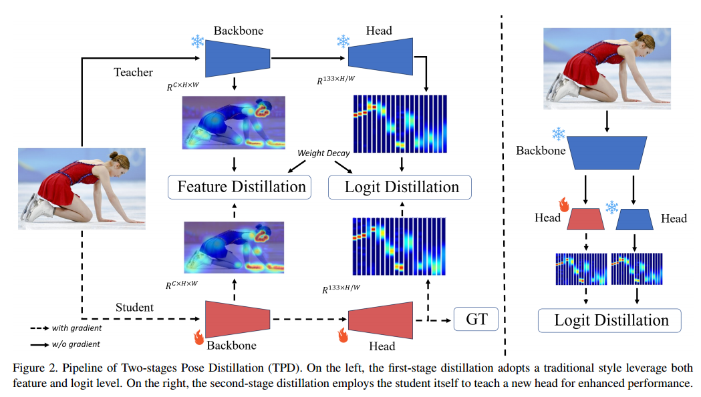
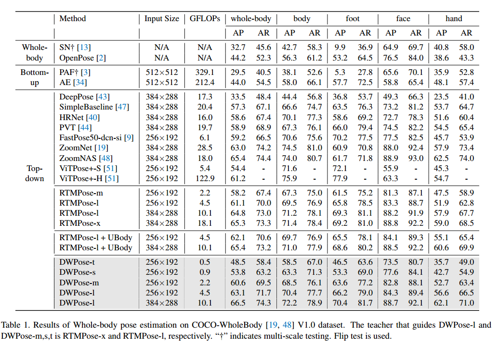
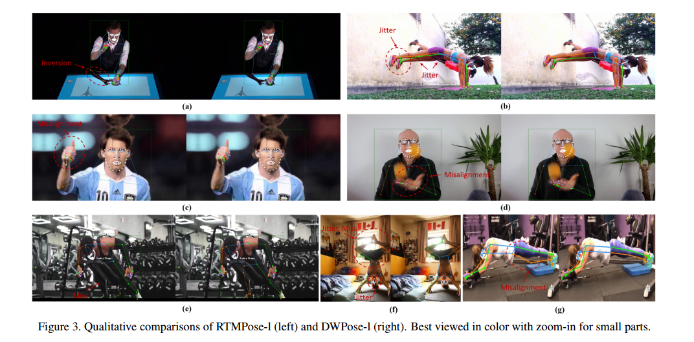
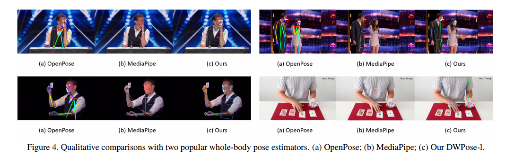

# DWPose

### 摘要

全身姿态估计旨在定位图像中的人体、手部、面部和足部关键点。这项任务具有挑战性，因为它需要处理多尺度的身体部位、低分辨率区域的精细定位以及数据稀缺问题。同时，开发一种高效且准确的姿态估计器用于以人为中心的理解和生成任务也是迫切需求。在本文中，我们提出了一种两阶段的全身姿态估计蒸馏方法，称为**DWPose**，以提高其有效性和效率。

第一阶段蒸馏设计了一种权重衰减策略，并利用教师模型的中间特征和包含可见与不可见关键点的最终输出对学生模型进行从头监督。第二阶段蒸馏通过自蒸馏进一步提升学生模型的性能。与以往的自知识蒸馏方法不同，该阶段仅微调学生模型的头部，所需训练时间仅为20%，是一种即插即用的训练策略。

针对数据的限制，我们探索了**UBody**数据集，该数据集包含了多样化的面部表情和手势，适用于真实场景应用。全面的实验表明，我们提出的方法简单而高效。在COCO-WholeBody数据集上，我们的方法显著提升了性能，将RTMPose-l的全身AP从64.8%提高到66.5%，甚至超越了RTMPose-x教师模型的65.3%。我们发布了一系列从小型到大型的模型，以满足各种下游任务的需求。我们的代码和模型已开放获取：https://github.com/IDEA-Research/DWPose。

### 引言

全身姿态估计在许多人类中心的感知、理解和生成任务中发挥着重要作用，包括3D全身网格恢复【1, 25, 31, 65】，人机交互【7, 42】，以及基于姿态的人体图像和动作生成【10, 24, 27, 59】。此外，捕获人类姿态在虚拟内容创作和虚拟现实/增强现实（VR/AR）领域也变得越来越流行，这需要像OpenPose【2】和MediaPipe【29, 62】这样的用户友好算法。尽管这些工具在使用上较为便利，但它们的性能仍然不够理想，限制了它们的潜力。因此，在人类姿态估计技术上的进一步进展至关重要，以充分释放用户驱动内容创作的潜力。

与仅检测人体关键点的姿态估计相比，全身姿态估计面临更多挑战，包括：

1. 身体的层次结构导致关键点定位的精细化需求；
2. 手部和面部的分辨率较低；
3. 多人图像中复杂的身体部件匹配，特别是在遮挡和复杂手部姿态的情况下；
4. 数据的限制，尤其是多样的手势和头部姿态在全身图像中的数据稀缺。

此外，在模型部署前，必须将其压缩成轻量化网络。常用的压缩工具包括蒸馏【14】、剪枝【8】和量化【60】。知识蒸馏（Knowledge Distillation, KD）是一种在推理过程中无需增加额外成本即可提升紧凑模型效率的技术。这种技术允许学生模型继承大型教师模型的知识，并被广泛应用于各种任务，如分类【69】、检测【49】和分割【28】。

在本文中，我们探索了针对全身姿态估计的知识蒸馏方法，以造福于众多下游应用，从而实现一系列高性能、高效率的实时姿态估计模型。具体而言，我们提出了一种新颖的两阶段姿态蒸馏框架**DWPose**，如图1所示，其实现了当前最先进的性能。我们采用了最新的姿态估计器RTMPose【18】作为基础模型，该模型在COCO-WholeBody【19, 26】数据集上进行了训练。

在**第一阶段蒸馏**中，我们利用教师模型（如RTMPose-x）的中间层和最终输出来指导学生模型（如RTMPose-l）。以往的姿态训练通过可见性区分关键点，并仅使用可见关键点进行监督。与此不同，我们使用教师模型的完整输出，包括可见和不可见关键点的最终结果，以赋予合理且全面的值，从而促进学生模型的学习过程。同时，我们采用了一种权重衰减策略，通过在整个训练过程中逐步减少蒸馏的权重来增强效果。由于更好的头部设计可以实现更精确的定位，**第二阶段蒸馏**提出了一种基于头部的自蒸馏方法，进一步增强头部的能力。我们构建了两个相同的模型，一个作为教师模型，另一个作为学生模型进行更新。学生模型的主干网络被冻结，只有其头部通过基于logit的蒸馏进行更新。值得注意的是，这种即插即用的方法可以使学生模型在20%的训练时间内获得更好的结果，无论是从头训练还是基于已有的蒸馏训练。

数据量和不同尺度人体部件的多样性将影响模型性能。由于现有数据集中缺乏整体标注的关键点，现有估计器难以在手指和面部细节定位上表现良好。因此，我们通过引入**UBody**数据集研究了数据对模型的影响，该数据集主要包含多样化的手势和面部关键点，采集自各种真实生活场景。

因此，我们的主要贡献可以总结为：

- 我们引入了一种两阶段的姿态知识蒸馏方法，以实现高效而精准的全身姿态估计。
- 为了打破全身数据的限制，我们探索了更全面的训练数据，尤其是多样且富有表现力的手势和面部表情，使其在真实场景中更具实用性。
- 基于最新的RTMPose作为基础模型，我们提出的蒸馏和数据策略显著将RTMPose-l的性能从64.8%提升到66.5%的全身AP，甚至超过了RTMPose-x教师模型的65.3%全身AP。我们还验证了DWPose在生成任务中的强大效果与高效性。

### 相关工作

#### 2D全身姿态估计

全身姿态估计的目标是同时定位图像中所有人物的身体、手部、足部和面部关键点【2, 13, 19】。由于缺乏全身关键点的标注，大多数早期模型专注于仅针对身体【22, 40, 47, 53】、手部【6, 32, 62, 68】或面部【21, 46, 67】的姿态估计。OpenPose【3】通过结合不同数据集来分别处理这些身体部件。MediaPipe【29, 62】构建了一种便于使用的感知管道，特别是用于全身关键点检测。随着全身数据集的出现【9, 19】，全身姿态估计模型取得了显著进展【13, 18, 48】。

具体而言，ZoomNet【19】提出了第一个基于自上而下方法的单一网络，利用分层结构解决不同身体部件的尺度差异问题。ZoomNAS【48】进一步探索了一种神经网络架构搜索框架，通过联合搜索模型架构及其各子模块的连接方式，同时提升模型的准确性和效率。TCFormer【61】在多个阶段中引入了渐进的视觉标记聚类与合并，以更好地保留不同尺度的信息。最近，RTMPose【18】探讨了姿态估计的关键因素并构建了一个实时模型，在COCO-WholeBody数据集上实现了最先进的结果。然而，该方法仍然面临冗余模型设计和数据不足的问题，特别是在多样化的手部和面部姿态上。

#### 知识蒸馏

知识蒸馏是一种压缩模型的技术。Hinton等人【14】首次提出通过教师模型的输出软标签来监督学生模型训练，这种方法最初用于分类任务，因此也被称为基于logit的蒸馏。一些后续研究【15, 52, 54】利用教师的logit信息，以不同方式传递更多的知识，包括目标和非目标logits【16, 58, 64, 66】。从基于logit的蒸馏到基于特征的蒸馏，知识的转移扩展到了中间层【17, 55, 57】，并应用于各种任务，包括检测【4, 56】、分割【38】和生成【30】。

在人体姿态估计中，知识蒸馏的研究较少【23, 35, 45, 50】。现有工作要么通过蒸馏沉重的热图提升仅针对身体的姿态估计性能【23, 35】，要么专注于整合单个身体部件专家的知识到一个单一深度网络中，用于全身2D-3D姿态检测【45】。2D全身姿态估计是3D姿态估计的基础任务，比仅针对身体的姿态估计更加全面。本文提出的DWPose是首个探索高效知识蒸馏策略用于全身姿态估计的工作。

### 方法

在本节中，我们详细介绍两阶段姿态蒸馏（Two-stage Pose Distillation, TPD）的具体方法。如图2所示，TPD包括两个不同的阶段：第一阶段蒸馏和第二阶段蒸馏。

- **第一阶段蒸馏**：利用预训练的教师模型在特征和logit层面指导从头训练的学生模型。
- **第二阶段蒸馏**：可视为一种自蒸馏方法，通过模型自身的logits对其头部进行训练，无需标注数据，在较短的训练时间内显著提高性能。

#### 3.1 第一阶段蒸馏

我们用教师模型的特征 $F^t$ 和学生模型的特征 $F^s$ 表示来自主干网络的特征；用教师模型和学生模型的最终logit分别表示为 $T^i$ 和 $S^i$。第一阶段蒸馏旨在强制学生学习教师的特征 $F^t$ 和logit $T^i$。

##### 3.1.1 基于特征的蒸馏

在基于特征的蒸馏中，我们强制学生模型直接模仿教师主干网络中的特征层。使用均方误差（MSE）损失来计算学生特征 $F^s$ 和教师特征 $F^t$ 之间的距离：

$$
L_{\text{fea}} = \frac{1}{CHW} \sum_{c=1}^{C} \sum_{h=1}^{H} \sum_{w=1}^{W} \left( F^t_{c,h,w} - f(F^s_{c,h,w}) \right)^2
$$
其中，$f$ 是一个 $1 \times 1$ 的卷积层，用于将 $F^s$ 转换为与 $F^t$ 相同的维度；$H, W, C$ 分别表示特征的高度、宽度和通道数。

##### 3.1.2 基于logit的蒸馏

RTMPose【18】通过SimCC算法将关键点定位任务视为水平和垂直坐标的分类任务。遵循这一设计，我们也可以将基于logit的知识蒸馏方法应用于此。

RTMPose的原始分类损失定义为：

$$
L_{\text{ori}} = - \sum_{n=1}^{N} \sum_{k=1}^{K} \sum_{i=1}^{L} \frac{1}{L} V_i \log(S_i)
$$

其中：
- $N$ 表示批次中的样本数量；
- $K$ 表示关键点的数量（如COCO-WholeBody中为133个）；
- $L$ 是 $x$ 或 $y$ 坐标定位的分类区间长度；
- $V_i$ 是标签值。

对于基于logit的蒸馏，我们遵循上述损失形式，并将教师的输出用作目标值：

$$
L_{\text{logit}} = - \frac{1}{N} \sum_{n=1}^{N} \sum_{k=1}^{K} \sum_{i=1}^{L} T_i \log(S_i)
$$

##### 3.1.3 蒸馏的权重衰减策略

通过特征蒸馏损失 $L_{\text{fea}}$ 和logit蒸馏损失 $L_{\text{logit}}$，我们可以用以下总损失训练学生模型：

$$
L = L_{\text{ori}} + \alpha L_{\text{fea}} + \beta L_{\text{logit}}
$$

其中，$\alpha$ 和 $\beta$ 是用于平衡损失的超参数。

受到检测蒸馏方法TADF【41】的启发，我们提出了一种权重衰减策略，在整个训练阶段逐步减少蒸馏惩罚。这一策略可以帮助学生更专注于目标标签，从而获得更好的性能。权重衰减函数定义为：

$$
r(t) = 1 - \frac{t - 1}{t_{\text{max}}}
$$

其中，$t \in (1, ..., t_{\text{max}})$ 是当前训练的轮次，$t_{\text{max}}$ 是总训练轮次。最终的第一阶段蒸馏损失为：

$$
L_{\text{s1}} = L_{\text{ori}} + r(t) \cdot \alpha L_{\text{fea}} + r(t) \cdot \beta L_{\text{logit}}
$$

#### 3.2 第二阶段蒸馏

在第二阶段蒸馏中，我们尝试利用训练好的学生模型进行自蒸馏，以进一步提升性能。这种方法适用于无论是否从头使用蒸馏训练的学生模型。

姿态估计器由编码器（主干网络）和解码器（头部）组成。在训练时，我们构建一个学生模型，其主干网络使用已训练的权重，而头部为未训练状态。同时，教师模型的主干网络和头部均使用已训练权重。在训练过程中，学生的主干网络被冻结，仅更新头部。由于教师模型和学生模型具有相同的架构，因此只需提取一次主干网络的特征，然后分别输入教师模型的头部和学生模型的头部以获得logit输出 $T_i$ 和 $S_i$。第二阶段蒸馏的损失为：

$$
L_{\text{s2}} = \gamma L_{\text{logit}}
$$

其中，$\gamma$ 是用于平衡损失的超参数。

与以往的自蒸馏方法不同，我们提出的基于头部的蒸馏仅需20%的训练时间即可有效提升性能。这种方法能够进一步增强模型的定位能力，同时节省大量训练时间。

### 实验

#### 4.1 数据集与实验细节

##### 数据集

我们在**COCO**【19, 26】和**UBody**【25】数据集上进行了实验。

- 对于COCO数据集，我们采用了标准的train2017和val2017划分，分别使用118K张训练图像和5K张验证图像。除非特别说明，我们使用SimpleBaseline【47】提供的行人检测器，其在COCO验证集上的检测AP为56.4%。
- **UBody**数据集由15种真实场景中的超过100万帧组成，提供了133个2D关键点和SMPL-X参数。需要注意的是，原始数据集主要用于3D全身姿态估计，并未验证其2D标注的有效性。我们从视频中每隔10帧选取一帧用于训练和测试。

##### 实现细节

- 在第一阶段蒸馏中，我们在公式 (6) 中使用两个超参数 α\alpha 和 β\beta 来平衡损失。对于所有实验，我们在COCO和UBody数据集上设置 α=0.00005\alpha = 0.00005 和 β=0.1\beta = 0.1。
- 第二阶段蒸馏的超参数 γ\gamma 在公式 (7) 中用于平衡损失。我们将其统一设置为 γ=1\gamma = 1。
- 第一阶段蒸馏的优化器、学习率和训练轮数设置与学生模型无蒸馏训练时的设置相同【18】。
- 第二阶段蒸馏仅需约总训练轮数的1/5，其余训练设置保持不变。该提前停止方法显著节省了训练时间。
- 我们使用8块GPU进行实验，基于PyTorch【36】和MMPose【5】框架。作为一个自上而下的姿态估计器，我们使用COCO val2017数据集上AP为56.4的行人检测框，以及UBody提供的真实标注框。

------

#### 4.2 主要结果

为了公平比较，我们在COCO-WholeBody数据集上评估了我们的模型。表1展示了实验结果：

- 我们分别使用较大的RTMPose-x和RTMPose-l作为教师模型，对DWPose-l以及其他学生模型进行指导。
- 在我们提出的两阶段蒸馏（TPD）方法下，不同大小和输入分辨率的模型均取得了显著提升。例如，DWPose-m在2.2 GFLOPs下获得了60.6%的全身AP，比基线模型高出4.1%，而推理计算开销保持不变，部署非常友好。
- DWPose-l在两种输入分辨率下分别达到63.1%和66.5%的全身AP，均超过教师模型RTMPose-x，并成为全身姿态估计的新状态-of-the-art（SOTA）模型。

图3显示了RTMPose-l（左）和DWPose-l（右）的定性比较。TPD方法帮助学生模型更精确地预测，减少了错误的姿态检测，同时增加了正确的姿态检测，尤其是在手指关键点定位的改进上。我们还将我们最先进的模型与两个广泛使用的模型OpenPose [2]和MediaPipe [29，62]进行了比较，如图4所示。我们的DWPose也明显优于其他两种方法，特别是对于截断的鲁棒性，这使得我们的方法能够取代这些流行的方法，从而有效地造福于相应的下游应用

------

#### 4.3 消融研究

##### **TPD方法与UBody数据集的影响**

我们在表2中探索了TPD方法和UBody数据集对全身姿态估计性能提升的影响。通过额外的UBody数据集，模型在手部姿态检测上取得了显著的AP提升。例如，RTMPose-l在全身AP上提高了1.0个百分点（从61.1%到62.1%），在手部AP上提高了3.2个百分点（从51.9%到55.1%）。TPD方法进一步提升了模型性能，将全身AP提高到63.1%。结果表明TPD方法和UBody数据集对性能提升具有重要作用。

##### **第一阶段与第二阶段蒸馏的效果**

表4展示了使用RTMPose-x作为教师模型对RTMPose-l进行混合数据集训练时，不同蒸馏阶段的效果：

- 第一阶段蒸馏和第二阶段蒸馏均对学生模型有显著提升；
- 两阶段结合进一步提高了性能，全身AP达到63.1%，超过了单独使用任一蒸馏阶段的结果。

值得注意的是，第二阶段蒸馏仅需微调头部，从而显著节省了训练时间。令人有趣的是，即便使用第二阶段蒸馏，学生模型的性能也能超过教师模型RTMPose-x的63.0%全身AP。

------

#### 4.4 推理速度与可控图像生成

表8对比了DWPose和OpenPose在不同人数场景下的推理速度。由于DWPose基于RTMPose的高效架构，其推理时间仅为OpenPose的约1%，且人数增加时推理时间增长幅度较小。此外，图5展示了更精确的骨架信息如何在可控图像生成中提高生成图像质量。

### 分析

#### 5.1 TPD方法和UBody数据的效果

我们在表2中探讨了蒸馏方法TPD和UBody数据集对全身姿态估计性能的提升效果。额外的UBody数据集显著提高了模型的AP值，特别是在手部姿态检测方面。例如，RTMPose-l通过使用UBody数据集，全身AP提升了1.0个百分点（从61.1%到62.1%），手部AP提升了3.2个百分点（从51.9%到55.1%）。TPD方法进一步优化了性能，使全身AP提升至63.1%。实验结果表明，TPD方法和UBody数据集在提升模型性能方面都起到了关键作用。

------

#### 5.2 在UBody数据集上的性能

除了在COCO-WholeBody数据集上评估外，我们还在UBody数据集上评估了模型的性能，如表3所示。我们比较了不同输入分辨率下的模型，并报告了各人体部件的AP值。额外的UBody数据集和TPD方法均能显著提升学生模型的性能，不论输入分辨率如何。与COCO数据集不同的是，TPD方法在UBody数据集上的提升主要集中于面部和手部，而在COCO数据集上，改进主要体现在身体、足部和手部。实验结果进一步证明了TPD方法在不同数据集上的有效性。

------

#### 5.3 第一阶段和第二阶段蒸馏的效果

我们提出的两阶段蒸馏（TPD）包括第一阶段和第二阶段蒸馏。为了评估每个阶段的影响，我们在混合数据集上使用RTMPose-x蒸馏RTMPose-l，并在表4中展示了结果。两种蒸馏阶段均能为学生模型带来性能提升，而两者结合时性能提升更为显著，全身AP达到63.1%，超过了单独使用任何一种蒸馏阶段时的性能。

值得注意的是，第二阶段蒸馏仅需微调头部网络，从而大大节省了训练时间。同时，即使没有使用第一阶段蒸馏，第二阶段蒸馏依然能够提升模型性能，显示出其通用性和高效性。

------

#### 5.4 第二阶段蒸馏对已训练模型的影响

我们的第二阶段蒸馏不仅适用于使用第一阶段蒸馏训练的模型，还可以直接应用于没有经过蒸馏训练的模型。因此，当缺乏更优的教师模型时，我们可以利用模型本身作为教师，通过短时间训练来进一步提升模型性能。表5展示了三种不同模型在COCO和混合数据集上的性能变化。无论训练设置如何，第二阶段蒸馏均显著提升了模型性能，特别是在足部和手部的关键点检测方面。与传统蒸馏和自知识蒸馏方法相比，第二阶段蒸馏节省了大量从零开始训练模型的时间和成本。

------

#### 5.5 第一阶段蒸馏的消融研究

在公式(6)中，第一阶段蒸馏通过使用真实标签（GT）、教师的特征（Fea）和logit（Logit）计算损失，并引入权重衰减（Decay）策略以进一步提升性能。表6展示了每个组成部分对蒸馏效果的影响：

- 使用教师特征的蒸馏可以带来1.4%的全身AP提升；
- 结合logit蒸馏后，性能进一步提升1.6%；
- 权重衰减策略增加了额外的0.3%全身AP提升。

此外，我们尝试仅使用教师的logit进行训练，而不使用真实标签（GT），学生模型的全身AP达到60.9%，甚至比仅使用真实标签的模型高0.5%。这表明可以通过教师模型对新数据进行自动标注，而无需人工标注，从而节省大量时间和成本。然而，当结合特征蒸馏时，仅使用教师logit的性能低于同时使用真实标签的性能。因此，我们采用真实标签、教师特征和logit的联合蒸馏策略。

------

#### 5.6 Logit蒸馏中的目标权重掩码

在logit蒸馏中，我们特意省略了目标权重掩码 WW（用于区分可见和不可见关键点），如公式(3)所示。表7显示了目标权重掩码对蒸馏过程的影响。实验表明，使用目标权重掩码会显著降低蒸馏性能，使学生模型的性能下降了1.1%。这表明教师模型对不可见关键点的输入对学生模型的学习过程具有积极作用。

------

#### 5.7 更优的姿态提升图像生成质量

最近，可控图像生成技术【12, 37, 39, 63, 33, 20】取得了显著进展。在人体图像生成中，精确的骨架信息对于指导姿态尤为重要，尤其是全身骨架。主流方法如ControlNet【63】，通常依赖于OpenPose【2】生成骨架信息。然而，OpenPose的性能较低（如表1所示，全身AP仅为44.2%），仍有较大改进空间。因此，我们利用DWPose替代OpenPose，以提高ControlNet的图像生成效果，且无需额外训练。

我们在图5中展示了使用OpenPose和DWPose生成图像的可视化比较。DWPose生成的骨架信息更为精确和细致，从而提升了生成图像的质量。此外，表8对比了DWPose和OpenPose的推理速度。DWPose基于RTMPose的高效架构，其推理时间仅为OpenPose的约1%，且随着图像中人物数量的增加，其推理时间增长幅度较小。例如，对于单人场景，OpenPose的推理时间为5.78秒，而DWPose仅为0.068秒。当人物数量达到9时，OpenPose的推理时间增长至三倍，而DWPose的增长幅度仅为1.5倍。

### 结论

本文旨在开发一种高效且精准的全身姿态估计模型。为此，我们基于最新的高效姿态估计器RTMPose提出了一种两阶段姿态蒸馏方法（TPD），以提升轻量化模型的性能。此外，当缺乏更大的教师模型时，第二阶段蒸馏方法能够通过较短的训练时间进一步优化模型性能。为了进一步提升模型表现，我们还研究了**UBody**数据集，最终提出了**DWPose**。通过大量实验，我们证明了该方法的简单性与有效性。最后，我们还探索了更优姿态估计器对可控图像生成任务的影响，验证了其在下游应用中的重要性。

------

**致谢**
 本研究得到了中国国家重点研发计划（2022YFB4701400/4701402）、深圳市科技计划（JCYJ20190809172201639，WDZC20200820200655001），以及深圳市重点实验室（ZDSYS20210623092001004）的资助支持。