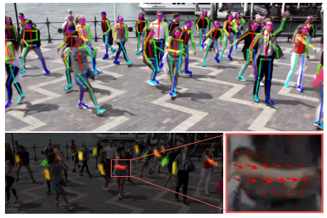
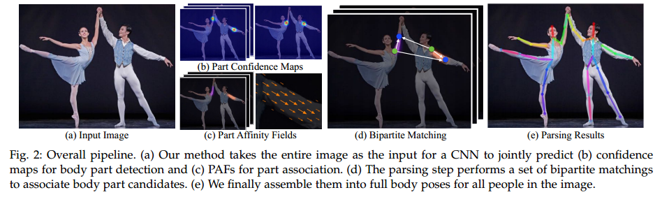
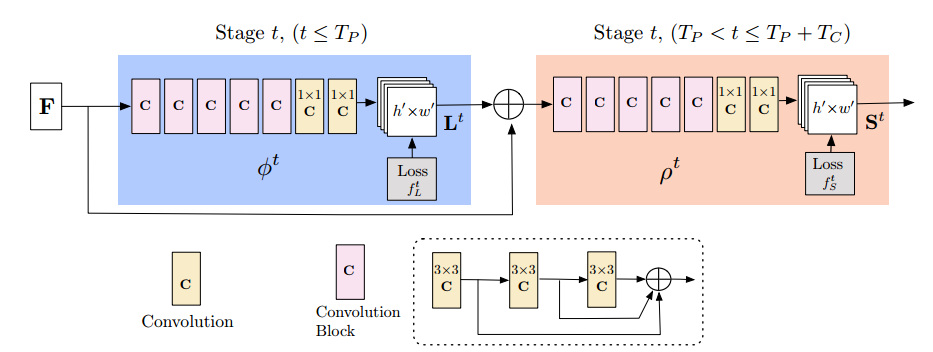
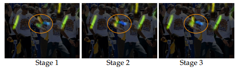
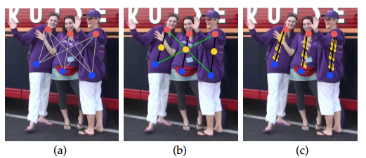
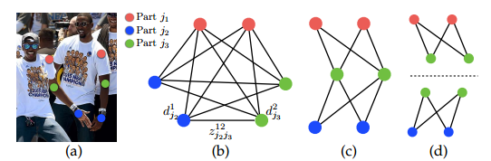

# OpenPose

### 摘要（Abstract）

==实时多人二维姿态估计==是使机器能够理解图像和视频中人类活动的关键组成部分。在本文中，我们提出了一种==实时方法==，用于检测图像中多人的二维姿态。所提出的方法使用一种非参数化表示，即==部分亲和域（Part Affinity Fields，简称PAFs）==，以学习将身体部位与图像中的个体关联起来。该==自底向上==的系统==无论图像中的人数多少，都能实现高精度和实时性能==。在以往的工作中，PAFs和身体部位位置的估计会在训练阶段同时进行优化。我们证明，仅优化PAF而非PAF与身体部位位置的联合优化，可以显著提升运行时性能和准确性。此外，我们还首次提出了一个结合身体和脚部关键点检测的模型，该模型基于一个我们内部标注的脚部数据集进行训练，并已将该数据集公开。我们证明，该组合检测器不仅可以减少与依次运行单独检测器相比的推理时间，还能保持每个组件的独立精度。最终，我们开发并发布了OpenPose，这是首个开源的实时系统，用于多人二维姿态检测，包括身体、脚部、手部和面部关键点。

**关键词**: 二维人体姿态估计、二维脚部关键点估计、实时、多人体、部分亲和域

### 引言（Introduction）

在本文中，我们研究了从图像和视频中获取对人类的详细理解的一个核心组成部分：**二维人体姿态估计**——或定位人体解剖关键点或“部位”的问题。人体姿态估计的研究主要集中在识别单个人的身体部位。而在图像中推断多人的姿态则带来了一系列独特的挑战。首先，每幅图像中可能包含未知数量的人，这些人可能出现在任何位置或尺度上。其次，由于人与人之间的交互，包括接触、遮挡或肢体的复杂运动，导致了空间上的干扰，使得身体部位的关联变得困难。第三，运行时的复杂性通常会随着图像中人数的增加而显著提升，这使得实时性能变得更加具有挑战性。

一种常见的方法是使用一个**人体检测器**，对每个人的检测结果分别执行单人姿态估计。这些自顶向下的方法直接利用现有的单人姿态估计技术，但==存在“过早决策”问题：如果人体检测器失败（例如，当人们靠得很近时），则没有补救措施==。此外，其==运行时间与图像中的人数成正比==，因为每检测到一个人，就需要运行一次单人姿态估计器。相比之下，自底向上的方法更具吸引力，因为它们对“过早决策”更为鲁棒，并且有可能将运行时复杂性与图像中的人数解耦。然而，自底向上的方法并没有直接利用其他身体部位和其他人的全局上下文线索。早期的自底向上方法（如 [1], [2]）未能保持效率的提升，因为其最终解析需要昂贵的全局推理，处理每张图像需要数分钟的时间。

在本文中，我们提出了一种高效的多人体姿态估计方法，并在多个公共基准上达到了具有竞争力的性能。我们首次提出了一种==用于表示关联分数的自底向上的表示方法——**部分亲和域（PAFs）**==。==PAF是一组二维矢量场，用于在图像域中编码肢体的位置和方向==。我们证明，同时推断这些自底向上的检测和关联表示，可以编码足够的全局上下文，使得基于贪婪算法的解析能够在极低的计算成本下实现高质量的结果。

本文的一个早期版本已发表在 [3] 中。本版本作出了以下几个新贡献：

1. 我们证明了PAF优化对于最大化准确性至关重要，而身体部位预测的优化则并不那么重要。我们通过增加网络深度而移除了身体部位优化阶段（见第3.1节和3.2节）。这种优化后的网络在速度和准确性上分别提高了约200%和7%（见第5.2节和5.3节）。
2. 我们发布了一个包含15,000个脚部实例标注的公开数据集（见第4.2节），并展示了结合身体和脚部关键点检测的模型可以在保持身体检测模型速度的同时保持精度（见第5.5节）。
3. 我们证明了该方法的通用性，将其应用于车辆关键点估计任务（见第5.6节）。
4. 本文记录了OpenPose的发布情况。OpenPose是首个可用于实时多人体二维姿态检测的开源库，包括身体、脚部、手部和面部关键点（见第4节）。我们还包括了与Mask R-CNN [5] 和Alpha-Pose [6] 的运行时间对比，展示了我们自底向上方法的计算优势（见第5.3节）。

### 相关工作（Related Work）

#### 单人姿态估计

对关节人体姿态估计的传统方法是结合局部观测的身体部位信息和它们之间的空间依赖性进行推理。用于关节姿态的空间模型通常基于以下两种类型：

1. **树状结构图模型**（Tree-structured Graphical Models）：如[7]–[13]，通过运动链编码相邻部位的空间关系。
2. **非树状模型**（Non-tree Models）：如[14]–[18]，通过附加边来捕获遮挡、对称性以及远距离关系。

为了获得可靠的身体部位局部观测，卷积神经网络（CNN）已被广泛应用，并显著提高了人体姿态估计的准确性[19]–[32]。例如：

- Tompson等人[23]使用深度网络结构结合图模型，联合学习其参数；
- Pfister等人[33]通过设计具有大感受野的网络，隐式地捕获了全局空间依赖关系；
- Wei等人[20]提出了**卷积姿态机器**（Convolutional Pose Machines），使用多阶段结构在序列预测框架中逐步引入全局上下文，来精炼部位置信度图，同时在每个阶段末尾强制中间监督，以解决训练过程中的梯度消失问题[35]–[37]。

这些方法假设输入图像中只有单个人体，且目标人物的位置和尺度已知。

#### 多人姿态估计

在多人姿态估计中，==大多数方法[5], [6], [38]–[44]采用**自顶向下策略**，==即先检测每个人体，再独立估计每个检测区域中的姿态。虽然这种策略使得单人姿态估计技术可以直接应用，但其缺点在于：

1. 依赖于对人体的“早期决策”，如果人体检测器失败，则后续的姿态估计也会失败。
2. 无法捕获不同人之间的空间依赖性，需要全局推理。

一些方法开始考虑人与人之间的依赖性：

- Eichner等人[45]扩展了图形结构，考虑多人的交互和深度顺序，但仍需通过人体检测器初始化检测假设。
- Pishchulin等人[1]提出了一种自底向上的方法，联合标注部位检测候选点并将其关联到个体。该方法通过身体部位的空间偏移回归配对分数。然而，由于求解完全连接图上的整数线性规划问题是NP难问题，处理每张图像平均需数小时。
- Insafutdinov等人[2]在[1]的基础上，结合ResNet[46]作为更强的部位检测器，显著提升了运行速度，但处理单张图像仍需数分钟。

与这些方法不同，本文的早期版本[3]提出了**部分亲和域（PAFs）**，它是由一组流场组成的表示方法，用于编码多个个体的身体部位之间的非结构化两两关系。PAFs能够高效地从检测中获得配对分数，无需额外的训练步骤。这些分数足以通过贪婪解析实现高质量的实时多人姿态估计。

与此同时，其他研究也对这类问题进行了探索：

- Insafutdinov等人[47]进一步简化了人体部位关系图以加速推理，并将姿态跟踪表述为部位提案的时空分组问题；
- Newell等人[48]提出了**关联嵌入**（Associative Embeddings），通过将标签分配给关键点，将同组关键点分组到同一个个体；
- Papandreou等人[49]检测个体关键点并预测其相对位移，通过贪婪解码将关键点分组为个体；
- Kocabas等人[50]提出了一个姿态残差网络（Pose Residual Network），接收关键点和个体检测，并将关键点分配给检测到的个体；
- Nie等人[51]基于密集回归将关键点候选点分割到图像中个体的质心。

本文在早期工作[3]的基础上进行了以下扩展：

1. 我们证明PAF优化对提高准确性至关重要，而无需结合置信度图优化。通过增加网络深度，移除身体部位置信度图优化阶段，显著提升了速度和准确性。
2. 提出了首个结合身体和脚部关键点检测的模型，并发布了公开的脚部数据集。
3. 证明了我们的方法具有通用性，能够扩展到车辆关键点检测等任务。
4. 发布了OpenPose，这是首个开源的实时多人二维姿态检测库，用于检测身体、脚部、手部和面部关键点。

### 方法（Method）

图 2 说明了我们方法的整体流程。系统以一张尺寸为 $w \times h$ 的彩色图像作为输入（图 2a），输出每个人的解剖关键点的二维位置（图 2e）。首先，前馈网络预测一组用于检测==身体部位位置的二维置信度图 $S$==（图 2b），以及一组用于==编码身体部位之间关联程度的二维矢量场 $L$，即部分亲和域（Part Affinity Fields, PAFs）==（图 2c）。集合 $S = (S_1, S_2, \dots, S_J)$ 包含 $J$ 个置信度图，每个部位对应一个置信度图，其中：
$$
S_j \in \mathbb{R}^{w \times h}, \quad j \in {1, \dots, J}.
$$
集合 $L = (L_1, L_2, \dots, L_C)$ 包含 $C$ 个矢量场，每个肢体对应一个矢量场，其中：
$$
L_c \in \mathbb{R}^{w \times h \times 2}, \quad c \in {1, \dots, C}.
$$
每张图片中 ==$L_c$ 的每个位置编码了一个二维矢量==（图 1）。最后，通过贪婪推理算法解析置信度图和 PAFs，输出图中每个人的二维关键点。

------

#### 3.1 网络架构（Network Architecture）

如图 3 所示，我们的网络架构逐步预测编码身体部位关联的亲和域（蓝色部分）和检测置信度图（米色部分）。这种逐步预测架构遵循 [20] 的设计，通过多个阶段 $t \in {1, \dots, T}$ 对预测结果进行细化，并在每个阶段末端添加中间监督。

相较于 [3] 中的原始方法，我们增加了网络深度。原始架构使用多个 $7 \times 7$ 的卷积核，而我们将其替换为连续的三个 $3 \times 3$ 卷积核，保持相同的感受野，同时减少了计算成本。对于原来的 $7 \times 7$ 卷积核，其计算量为：
$$
2 \times 7^2 - 1 = 97
$$
而三个 $3 \times 3$ 卷积核的计算量仅为：
$$
51.
$$
此外，我们==采用了类似 DenseNet [52] 的方法，将每一个 $3 \times 3$ 卷积核的输出进行连接。通过增加非线性层的数量，网络能够同时保留低级和高级特征==。第 5.2 节和 5.3 节分析了精度和运行速度的改进。

------

#### 3.2 同时检测与关联（Simultaneous Detection and Association）

图像首先通过 CNN（由 VGG-19 [53] 的前 10 层初始化并微调）生成一组特征图 $F$，作为第一个阶段的输入。在第一个阶段，网络生成一组部分亲和域（PAFs），即：
$$
L^1 = \phi_1(F),
$$
其中 $\phi_1$ 表示第 1 阶段的 CNN 推理。之后的每个阶段中，将前一阶段的预测结果与原始图像特征 $F$ 进行连接，并用于生成更精确的预测：
$$
L^t = \phi_t(F, L^{t-1}), \forall 2 \leq t \leq T_P,
$$
其中 $\phi_t$ 表示第 $t$ 阶段的 CNN 推理，$T_P$ 为 PAF 阶段的总数。在 $T_P$ 次迭代后，==置信度图检测的过程基于最新的 PAF 预测结果开始==：
$$
S^{T_P} = \rho_t(F, L^{T_P}), \forall t = T_P, \\
S^t = \rho_t(F, L^{T_P}, S^{t-1}), \forall T_P < t \leq T_P + T_C,
$$
其中 $\rho_t$ 表示第 $t$ 阶段的 CNN 推理，$T_C$ 为置信度图阶段的总数。

这种方法不同于 [3]，==在 [3] 中，PAF 和置信度图（confidence map）的分支都在每个阶段进行了细化。因此，每个阶段的计算量减少了一半。==我们在 5.2 节中实证观察到，==细化的亲和域预测会提升置信度图的结果，而反之则不会==。==从直觉上讲，如果观察 PAF 通道的输出，可以推测身体部位的位置。然而，如果仅看到一堆身体部位而没有其他信息，我们无法将它们解析为不同的个体。==

图 4 展示了跨阶段的亲和域的细化过程。置信度图的结果是在最新和最精细化的 PAF 预测基础上进行预测的，从而在置信度图阶段之间几乎没有明显差异。

为了指导网络在第一个分支中迭代预测身体部位的 PAF，并在第二个分支中预测置信度图，我们在每个阶段的末尾应用损失函数。我们使用 $L_2$ 损失在估计的预测与ground truth映射和字段之间进行比较。在这里，我们==对损失函数进行空间加权，以应对一个实际问题，即某些数据集并未完全标注所有人==。具体来说，第 $t_i$ 阶段的 PAF 分支的损失函数和第 $t_k$ 阶段的置信度图分支的损失函数为：
$$
f_L^{t_i} = \sum_p \sum_{c=1}^C W(p) \cdot \| L_c^{t_i}(p) - L_c^*(p) \|_2^2, \tag{4}
$$

$$
f_S^{t_k} = \sum_p \sum_{j=1}^J W(p) \cdot \| S_j^{t_k}(p) - S_j^*(p) \|_2^2, \tag{5}
$$

其中 $L_c^*$ 是地面真值 PAF，$S_j^*$ 是地面真值部位置信度图，$W$ 是一个二进制掩码，当==像素 $p$ 处==的注释缺失时，$W(p) = 0$。==掩码用于避免在训练中惩罚真实正例的预测结果==。

每个阶段的中间监督通过定期补充梯度，解决了梯度消失问题 [20]。总体目标是：
$$
f = \sum_{t=1}^{T_P} f_L^{t} + \sum_{t=T_P+1}^{T_P+T_C} f_S^{t}. \tag{6}
$$

------

#### 3.3 部位检测的置信度图（Confidence Maps for Part Detection）

在训练过程中，为了计算式（6）中的 $f_S$，我们从标注的二维关键点生成置信度图 $S^*$。每个置信度图是一种二维表示，描述某一特定身体部位可能出现在任意像素的概率分布。对于每个标注的人物 $k$ 和身体部位 $j$，置信度图 $S^*_{j,k}$ 的值在位置 $p \in \mathbb{R}^2$ 处定义为：
$$
S^*_{j,k}(p) = \exp \left( -\frac{|p - x_{j,k}|^2_2}{\sigma^2} \right),
$$
其中 $x_{j,k}$ 是人物 $k$ 的身体部位 $j$ 的标注位置，$\sigma$ 控制分布的扩散范围。最终的置信度图通过对单个人置信度图的最大值运算得到：
$$
S^*_j(p) = \max_k S^*_{j,k}(p).
$$
在测试时，通过置信度图生成身体部位候选点，并通过非极大值抑制进行优化。

---

### 3.4 部分亲和域（Part Affinity Fields, PAFs）用于部位关联

给定一组检测到的身体部位（如图 5a 中的红点和蓝点所示），我们需要将这些部位组合起来，形成一个未知人数的完整身体姿态。为此，我们需要每对身体部位检测的关联置信度，即它们是否属于同一个人。

一种可能的关联度量方法是，在每对部位之间检测一个额外的中点，并检查其与候选部位检测之间的关联性，如图 5b 所示。然而，当人群密集时——这很常见——这些中点可能支持错误的关联（图 5b 中的绿色线表示这种错误关联）。这种错误关联主要由两种表示局限性引起：
1. 它仅编码了每个肢体的位置，而未编码其方向。
2. 它将肢体的支持区域减少为一个点。

**部分亲和域（PAFs）** 解决了这些局限性。它们==在肢体的支持区域内保留了位置和方向信息（如图 5c 所示）==。==每个 PAF 是对应肢体的一个二维矢量场==（如图 1d 所示）。对于属于特定肢体区域的每个像素，一个二维矢量编码从肢体的一端指向另一端的方向。==每种类型的肢体都有一个相应的 PAF，用于连接其两个关联的身体部位。==

考虑图中展示的一个单一肢体。设 $x_{j1,k}$ 和 $x_{j2,k}$ 为图像中肢体 $c$ 的部位 $j1$ 和 $j2$ 的真实位置。==如果点 $p$ 位于该肢体上，则 $L^*_{c,k}(p)$ 的值是一个指向 $j1$ 和 $j2$ 的单位向量；对于其他点，该向量的值为零。==

训练过程中，为了计算公式 (6) 中的 $f_L$，我们定义了图像点 $p$ 处的真实 PAF $L^*_{c,k}$ 为：

$$
L^*_{c,k}(p) =
\begin{cases} 
v & \text{如果 } p \text{ 在肢体 } c,k \text{ 上}, \\
0 & \text{否则},
\end{cases}
$$

其中 ==$v = \frac{x_{j2,k} - x_{j1,k}}{\|x_{j2,k} - x_{j1,k}\|_2}$ 是指向肢体方向的单位向量==。肢体上的点集定义为那些距离线段在一定阈值范围内的点，即满足以下条件的点 $p$：
1. $0 \leq v \cdot (p - x_{j1,k}) \leq l_{c,k}$，且
2. $|v^\perp \cdot (p - x_{j1,k})| \leq \sigma_l$，

其中==肢体宽度 $\sigma_l$== 以像素为单位，==肢体长度为 $l_{c,k} = \|x_{j2,k} - x_{j1,k}\|_2$==，$v^\perp$ 是垂直于 $v$ 的向量。

对于图像中的所有人，真实的部分亲和域通过所有人的亲和域取平均值计算：

$$
L^*_c(p) = \frac{1}{n_c(p)} \sum_k L^*_{c,k}(p),
$$

其中 $n_c(p)$ 是点 $p$ 处所有 $k$ 个非零向量的数量。

在测试时，我们通过计算==沿连接候选部位位置的线段的线积分来测量候选部位检测之间的关联性==。在这种方法中，PAF 的预测值与由检测的身体部位形成的候选肢体进行对齐，从而计算其关联置信度。具体而言，对于两个候选部位位置 $d_{j1}$ 和 $d_{j2}$，我们沿着线段采样预测的部分亲和域 $L_c$，以测量它们的关联置信度：

$$
E = \int_{u=0}^{u=1} L_c(p(u)) \cdot \frac{d_{j2} - d_{j1}}{\|d_{j2} - d_{j1}\|_2} du, \tag{11}
$$

其中 $p(u)$ 是两身体部位 $d_{j1}$ 和 $d_{j2}$ 位置的插值：

$$
p(u) = (1 - u) d_{j1} + u d_{j2}.
$$

在实际操作中，我们通过对 $u$ 进行均匀间隔采样和求和来近似积分。

------

#### 3.5 使用 PAF 的多人体解析（Multi-Person Parsing using PAFs）

我们在检测置信度图上进行==非极大值抑制（Non-Maximum Suppression, NMS）==，以获得一组离散的部位候选位置。对于每个部位，由于图像中包含多个个体或存在假阳性（见图 6b），可能会存在多个候选点。这些部位候选点定义了一个可能的肢体集合。我们使用式（11）中定义的线积分计算对 PAF 上的每个候选肢体进行评分。==找到最优解析的问题对应于一个 $K$ 维匹配问题，该问题已知是 NP 难的（NP-Hard）（见图 6c）==。在本文中，我们提出了一种贪婪松弛算法，它能够一致地产生高质量的匹配结果。我们推测原因在于成对关联的分数隐式地包含了全局上下文信息，这是由于 PAF 网络的大感受野所致。

我们首先为多个个体获取一组身体部位检测候选点，记为 $D_j = {d_m^j : m \in {1, \dots, N_j}}$，其中 $j \in {1, \dots, J}$ 是部位索引，$N_j$ 是第 $j$ 个部位的候选点数量，而 ==$d_m^j \in \mathbb{R}^2$ 表示第 $j$ 个身体部位的第 $m$ 个候选点的位置==。这些部位候选点仍需要与同一个人的其他部位关联，也就是说，我们需要找到属于同一人的身体部位检测点并将其连接成树结构。我们定义一个变量 $z_{j1j2}^{mn} \in {0, 1}$，表示两个候选检测点 $d_m^{j1}$ 和 $d_n^{j2}$ 是否连接。目标是为所有可能的连接集 $Z = {z_{j1j2}^{mn} : j1, j2 \in {1, \dots, J}, m \in {1, \dots, N_{j1}}, n \in {1, \dots, N_{j2}}}$ 找到最优分配。

如果我们仅考虑一对部位 $j1$ 和 $j2$（例如，脖子和右臀部）对应的 $c$ 型肢体，那么找到最优关联可以简化为一个==加权最大匹配的二分图问题（见图 5b）==。在此图匹配问题中，图的节点是身体部位检测候选点 $D_{j1}$ 和 $D_{j2}$，边表示所有候选部位对之间的可能连接。此外，每条边由式（11）加权，即 PAF 的聚合。二分图中的匹配是边的一个子集，这些边以一种方式选择，使得没有两个边共享节点。我们的目标是找到具有最大权重的匹配：
$$
\max_{Z_c} E_c = \max_{Z_c} \sum_{m \in D_{j1}} \sum_{n \in D_{j2}} E_{mn} \cdot z_{j1j2}^{mn} \tag{13}
$$

$$
s.t. \quad \forall m \in D_{j1}, \quad \sum_{n \in D_{j2}} z_{j1j2}^{mn} \leq 1 \tag{14}
$$

$$
\quad \quad \forall n \in D_{j2}, \quad \sum_{m \in D_{j1}} z_{j1j2}^{mn} \leq 1 \tag{15}
$$

其中 $E_c$ 是从类型 $c$ 的肢体匹配中获得的总权重，$Z_c$ 是类型 $c$ 的肢体子集，$E_{mn}$ 是通过式（11）定义的部位 $d_m^{j1}$ 和 $d_n^{j2}$ 的 PAF 权重。

==式（14）和式（15）要求没有两个边共享一个节点==，例如，没有两条同类型的肢体（例如，左前臂）共享一个部位。我们可以使用匈牙利算法（Hungarian Algorithm）[55] 来获得最优匹配。

==在处理多个个体的全身姿态时，确定 $Z$ 是一个 $K$ 维匹配问题==。这个问题是 NP 难的 [54]，并且存在许多松弛解。在这项工作中，我们对该问题进行==两种特定于领域的松弛优化==。首先，我们==选择最小数量的边来获得一个连接骨架（spanning tree），而不是使用完整图==，如图 6c 所示。其次，我们==将匹配问题进一步分解为一组二分图匹配子问题，并独立确定相邻树节点之间的匹配==，如图 6d 所示。

第 5.1 节的详细比较结果表明，最小贪婪推理能够以远低于计算成本的代价很好地近似全局解。原因在于，虽然相邻树节点之间的关系由 PAF 明确建模，但非相邻树节点之间的关系被 CNN 隐式建模。这一属性的出现是由于 CNN 在具有大感受野的训练过程中对非相邻节点之间的关系进行了学习，并且非相邻树节点的 PAF 也会影响预测的 PAF。

通过这两个松弛优化，优化目标被简单表述为：
$$
\max_Z E = \sum_{c=1}^C \max_{Z_c} E_c. \tag{16}
$$
因此，我们可以使用式（13）到式（15）分别独立获取每种肢体类型的肢体连接候选点。通过所有肢体连接候选点，可以将共享同一部位的肢体连接组装成多人的全身姿态。我们的树结构优化方案的速度比完整图的优化快几个数量级 [1,2]。

我们的当前模型还结合了冗余 PAF 连接（例如，肩部和肘部之间，手腕和肩部之间等）。这种冗余特别提高了在拥挤图像中的表现，如图 7 所示。为处理这些冗余连接，我们对多人解析算法进行了轻微修改。原始算法从强制组件开始，而我们的方法根据 PAF 得分对所有成对连接进行排序。如果连接的两个身体部位已经被分配给不同的人，算法会识别出这与 PAF 得分较高的其他连接相冲突，并忽略当前连接。

### 4. OPENPOSE

越来越多的计算机视觉和机器学习应用需要 2D 人体姿态估计作为输入 [56]-[62]。为了帮助研究社区推动相关工作，我们公开发布了 **OpenPose** [4]，这是第一个实时多人系统，可以联合检测人体、脚部、手部和面部的关键点（总计 135 个关键点），如图 8 所示，展示了整个系统的示例。

------

#### 4.1 系统

现有的 2D 人体姿态估计库（如 Mask R-CNN [5] 或 Alpha-Pose [6]）要求用户实现大部分处理管道，例如：实现自己的帧读取器（例如视频、图像或摄像头流）、可视化结果的显示模块、生成包含结果的输出文件（例如 JSON 或 XML 文件）等。此外，现有的人脸和人体关键点检测器并未结合在一起，通常需要不同的库来完成这些功能。**OpenPose** 解决了所有这些问题。

它可以运行在多个平台上，包括 Ubuntu、Windows、Mac OSX 和嵌入式系统（例如 NVIDIA Tegra TX2）。此外，它支持多种硬件，例如 CUDA GPU、OpenCL GPU 和仅限 CPU 的设备。用户可以选择输入来源（图像、视频、摄像头或 IP 摄像头流），并控制是否显示或保存结果，启用或禁用特定检测器（如身体、脚部、面部或手部），启用像素坐标归一化，设置 GPU 数量以优化性能，以及跳过帧以实现更快的处理。

**OpenPose** 包含以下三大模块：

1. **身体+脚部检测**（核心模块，详见 4.2 节）。
2. **手部检测**（基于 [63] 中的算法）。
3. **面部检测**（采用与手部检测类似的训练方式）。

此外，该库还支持 3D 姿态关键点检测，通过对多同步摄像头视图的结果进行非线性 Levenberg-Marquardt 优化 [64] 完成 3D 三角测量。

**OpenPose** 的推理时间优于所有现有的先进方法，同时保持了高质量的结果。在配备 NVIDIA GTX 1080 Ti 的机器上，它能够以约 22 FPS 的速度运行，并保持较高的准确性（详见 5.3 节）。OpenPose 已被研究社区广泛应用于许多视觉和机器人领域，如行人重识别 [56]、基于生成对抗网络（GAN）的动作重定向 [57]-[58]、人机交互 [59]、3D 姿态估计 [60] 和 3D 人体网格模型生成 [61]。此外，OpenCV 库 [65] 已将 OpenPose 和我们的基于 PAF 的网络架构纳入其深度神经网络模块。

------

#### 4.2 脚部关键点检测的扩展

现有的人体姿态数据集（如 MPII [66] 和 COCO [67]）包含的身体部位种类有限。例如，MPII 数据集仅标注了脚踝，而 COCO 数据集的脚部注释也仅限于脚踝。然而，许多图形学应用（如虚拟角色重定向或 3D 人体形状重建 [61][68]）需要脚部的具体关键点（如大脚趾和脚后跟）。缺乏脚部信息会导致如 "糖果纸效应"、穿透地面和脚部滑移等问题。

为了解决这些问题，我们使用 Clickworker 平台 [69] 手动标注了 COCO 数据集中的一个子集，包括 14K 个训练集注释和 545 个验证集注释，总计 6 个脚部关键点（见图 9a）。我们将脚部关键点的 3D 坐标定义为脚趾与皮肤连接处的中心位置，并考虑深度。

基于该数据集，我们训练了一个脚部关键点检测算法，而不是通过身体关键点检测器生成脚部候选框。我们发现，将脚部关键点检测融入身体关键点检测模型，可以显著提升身体某些部位（如脚踝）的检测精度（见图 9b 和 9c）。我们在 5.5 节中对该方法的准确性进行了定量分析。

------

### 5 数据集和评估（DATASETS AND EVALUATIONS）

我们在以下三个基准数据集上评估了我们的方法，这些数据集用于多人姿态估计：

1. **MPII 多人姿态数据集** [66]：包含 3844 组训练数据和 1758 组测试数据，这些数据展示了多个交互个体的高复杂度姿态，包括 14 个身体部位。
2. **COCO 关键点挑战数据集** [67]：要求同时检测人群并在每个人的身体上定位 17 个关键点（包括 12 个身体部位和 5 个面部关键点）。
3. **我们的脚部数据集**：这是从 COCO 关键点数据集中提取的 15K 注释子集。

这些数据集包含了在真实世界场景中收集的多样化图像，涵盖了许多挑战，例如拥挤、比例变化、遮挡和接触问题。

我们的方法在首届 COCO 2016 关键点挑战中获得了第一名，并显著超越了 MPII 多人基准上的现有最新结果。此外，我们还提供了与 Mask R-CNN 和 Alpha-Pose 的运行时分析比较，以量化系统的效率并分析主要失败案例   。

#### 5.1 在 MPII 多人数据集上的结果

在 MPII 数据集上的比较中，我们使用工具包 [1] 测量所有身体部位的平均精度（mean Average Precision, mAP），依据 [66] 的 “PCKh” 指标。表 1 比较了我们的方法与其他方法在官方 MPII 测试集上的 mAP 性能。我们还比较了每张图像的平均推理/优化时间（以秒为单位）。

对于包含 288 张图像的子集，我们的方法的 mAP 超越了之前最先进的自底向上方法 [2]，提升了 8.5%。值得注意的是，我们的推理时间减少了 6 个数量级。第 5.3 节详细报告了运行时间分析。

在整个 MPII 测试集上，即使不进行尺度搜索，我们的方法已经显著超越了之前的最先进方法（mAP 绝对提升了 13%）。通过使用三种尺度（$0.7 \times$, $1 \times$, $1.3 \times$）进行搜索，性能进一步提升至 75.6% 的 mAP。

mAP 与之前自底向上方法的比较表明，我们新颖的特征表示（PAFs）在身体部位关联中具有显著效果。基于树结构的贪婪解析方法在精度上优于基于完全图结构的图割优化公式 [1,2]。

表 2 展示了针对不同骨架结构的比较结果，这些结构如图 6 所示。我们创建了一个自定义验证集，包含来自原始 MPII 训练集的 343 张图像。我们基于完全连接图训练模型，并分别对以下方案进行比较：

- 选择所有边（图 6b，近似通过整数线性规划解决）；
- 最小树边（图 6c，近似通过整数线性规划解决）；
- 贪婪解析解决方案（图 6d）。

------

### 6. 结论（CONCLUSION）

实时的多人二维姿态估计是实现机器视觉理解和解释人类及其交互的一个重要组成部分。在本文中，我们提出了一种显式的非参数表示方法，用于关键点关联，能够编码人体肢体的空间位置和方向。以下是我们的主要贡献：

1. **关键点检测与关联的联合学习**：我们设计了一种架构，可以同时学习部分检测和关联任务。
2. **高效的贪婪解析算法**：我们证明了一个简单的贪婪解析算法足以生成高质量的多人姿态解析结果，并且其效率与图像中人物的数量无关。
3. **PAF 优化的重要性**：我们证明了对部分亲和域（PAFs）的优化比同时优化 PAF 和身体部位位置更为重要，这显著提高了运行效率和精度。
4. **联合检测身体与脚部关键点的模型**：我们展示了将身体和脚部关键点检测结合到单个模型中，可以分别提升各自的精度，并减少顺序运行这两种检测器所需的推理时间。
5. **脚部关键点数据集**：我们创建了一个包含 15K 脚部关键点实例的数据集，并向公众开放。
6. **开源工具**：我们将该工作开源为 OpenPose，这是第一个支持实时检测身体、脚部、手部和面部关键点的开源系统。

OpenPose 库目前已广泛应用于涉及人类分析的多个研究领域，例如人体重识别（Re-Identification）、动作重定向（Retargeting）和人机交互（Human-Computer Interaction）。此外，OpenPose 已被纳入 OpenCV 库，进一步扩大了其影响力  。

